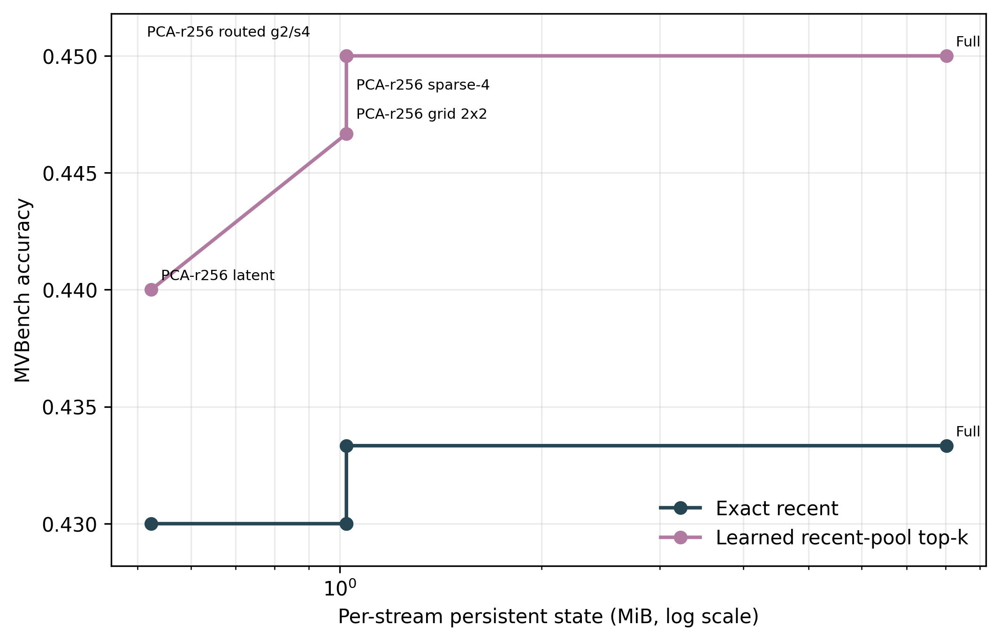
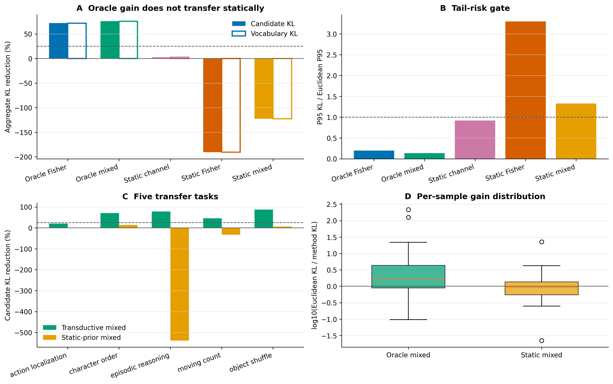
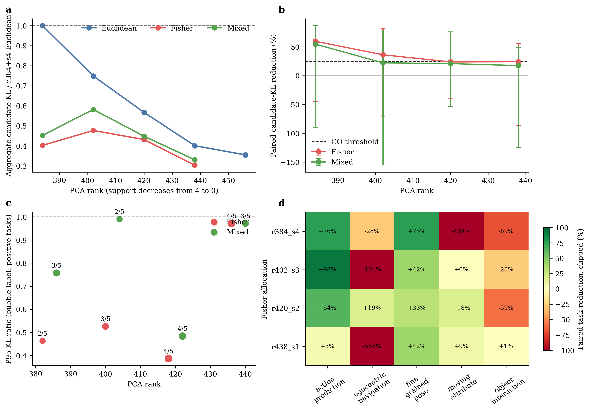
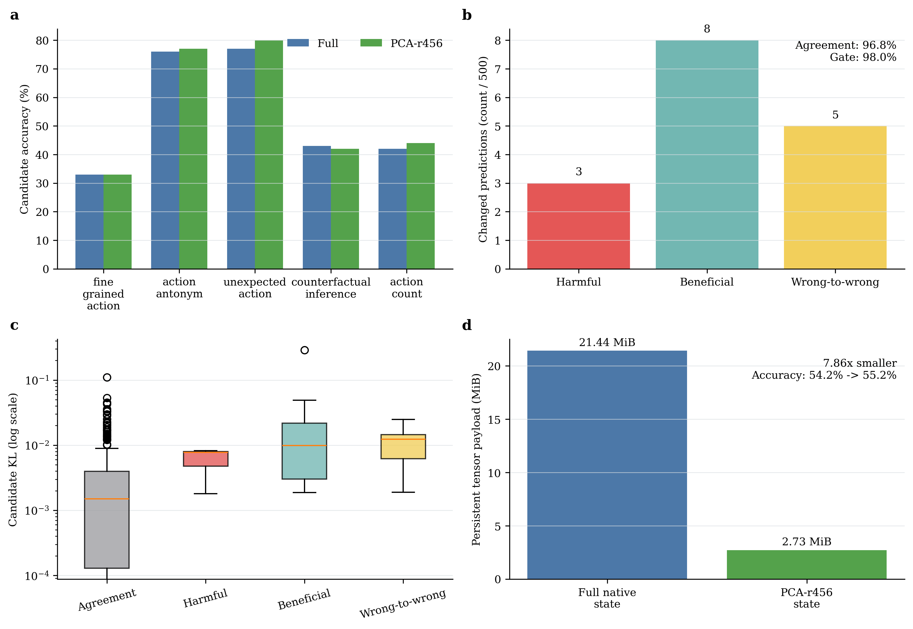
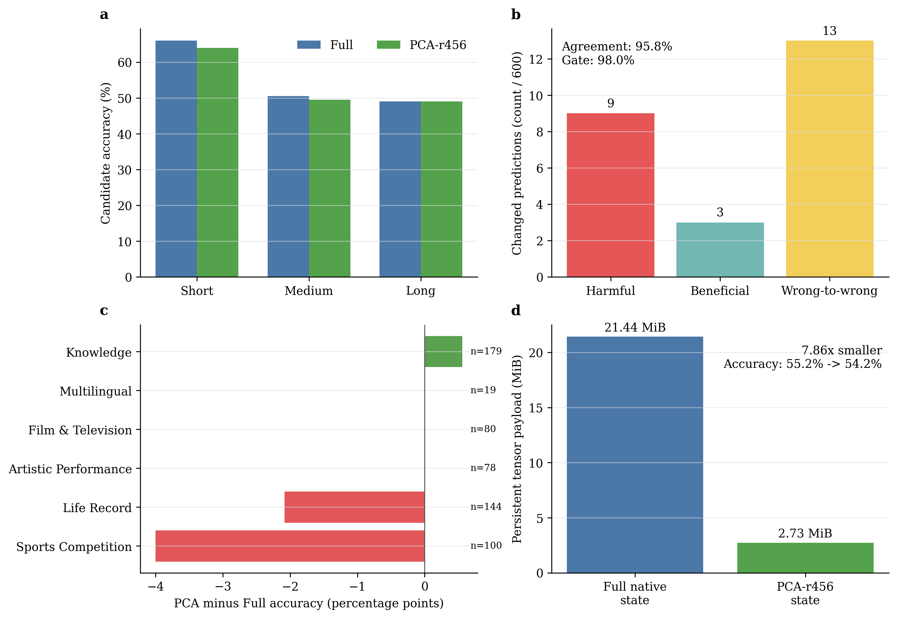
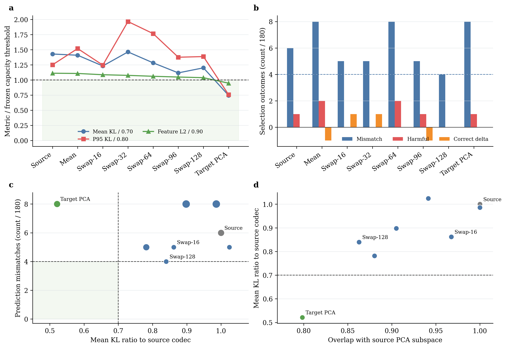
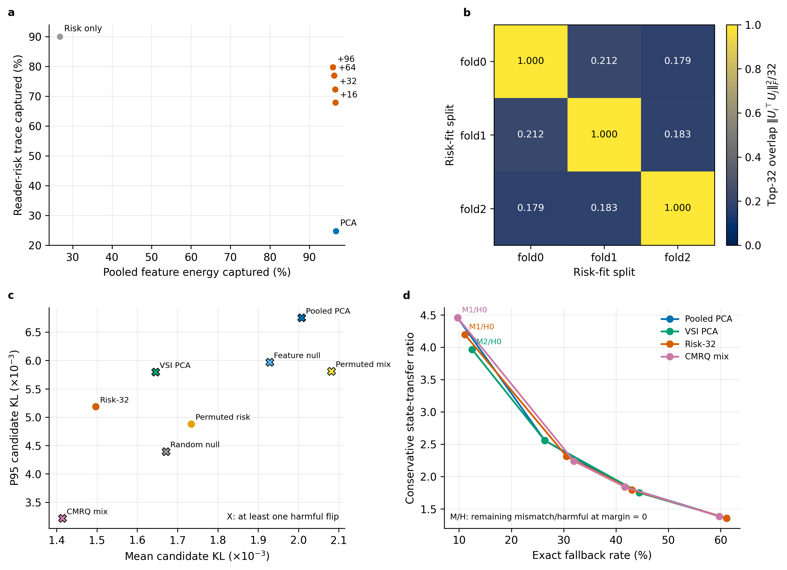

# Online Video State Decomposition

Probe-first research code and audited evidence for bounded online-video
understanding. The project tests whether exact recent evidence,
query-conditioned bounded history, compressed native visual state, and sparse
event residuals can form a useful algorithm-system trade-off.

The current evidence does **not** support replacing video attention with a
global BCCB operator. Block-circulant and low-rank modules remain optional
components for a later writer, router, or projection accelerator.

## Current Result

The strongest current evidence is a frozen independent replication on the
final untouched 300-sample MVBench reserve. With LLaVA-1.5-7B and a
calibration-only rank-256 PCA codec, the learned reader's routed state matches
full-state accuracy and passes the preregistered 2% preservation gate:

| Result | Full cache | Routed compressed |
|---|---:|---:|
| Steady per-stream tensor payload | 8.024 MiB | 1.024 MiB |
| Cold start including shared codec | 8.024 MiB | 3.031 MiB |
| Learned-reader accuracy | 45.0% | 45.0% |
| Exact prediction agreement | - | 99.33% |
| Full-correct/compressed-wrong | - | 1 / 300 |
| One-sided upper 95% loss bound | - | 1.571% |

The steady-state ratio is 7.84x and the cold-start ratio is 2.65x. At matched
routed state, the frozen learned reader scores 45.0% versus 43.0% for exact
recent: +2.0 points, eight better and two worse samples, bootstrap interval
[0.0, 4.0] points, exact McNemar `p=0.1094`. The direction independently
replicates, but superiority is not statistically conclusive.

The error-oracle route selects the spatial-grid path for 75.7% of source
frames and sparse-4 for 24.3%, with strong task variation. It evaluates both
candidates and is therefore a state-preservation mechanism, not a deployable
low-cost router or latency result. See the
[independent replication analysis](paper/results/probe_mvp/mvbench_independent_replication_300_20260722/INDEPENDENT_REPLICATION_ANALYSIS.md)
and its committed CSV/JSON/PNG/PDF evidence.

### Reader-Quotient Update (2026-08-25)

The later transfer study strengthens the writer/codec result and narrows the
remaining bottleneck. The frozen `exact recent + PCA-r256 + 4 exact spatial
innovations` state was evaluated on two zero-overlap old-task splits and one
new five-task transfer set, for 800 native LLaVA samples in total:

| Scope | Full | Compressed | Paired delta | Interpretation |
|---|---:|---:|---:|---|
| Old five tasks, N=400 | 47.75% | 47.50% | -0.25 points | PASS |
| New five tasks, N=400 | 32.75% | 33.00% | +0.25 points | BOUNDARY: full reader below the 35% quality floor |

Both cohorts have a 1.5655% one-sided upper 95% harmful-event bound, below
the registered 2% margin. This supports a bounded structured-state codec; it
does not establish reader or system speedup.

At the same byte budget, query/content-visible native Fisher support exposes
real capacity: on the weak reader it reduces candidate KL by 72.07%, and the
mixed Euclidean/Fisher support reduces it by 75.93%. The deployable static
approximation fails, however: a calibration-only Fisher prior increases
candidate KL by 190.65%, and its P95 error is 3.297x the Euclidean support.
The useful support therefore rotates with query and content rather than being
a stable positional mask.

LLaVA-OneVision reproduces the capacity signal but not strict per-sample
equivalence. The best same-byte Fisher allocation (`r438+s1`) improves paired
KL by 24.19%, just below the frozen 25% gate. The simpler `PCA-r456+s0` state
was subsequently frozen and evaluated on five untouched tasks and 500 samples:
accuracy changed from 54.2% to 55.2%, the one-sided harmful-event upper 95%
bound was 1.543%, and tensor payload fell from 21.44 MiB to 2.73 MiB (7.86x).
Prediction agreement was 96.8%, below the preregistered 98% gate, so the result
is `BOUNDARY`, not a PASS.

The unchanged codec was then evaluated on an independently frozen Video-MME
split with 600 unique videos, 200 per duration. Full/PCA accuracy was
55.17%/54.17% (`-1.00` point, paired 95% interval `[-2.17,+0.17]`), while the
state remained 7.86x smaller. The loss was bounded across duration groups, but
agreement fell to 95.83% and the harmful-event upper 95% bound rose to 2.603%.
This cross-domain result is therefore also `BOUNDARY`: the shared semantic bulk
partly transfers, but the MVBench-calibrated reader-null space is not universal.

A subsequent same-rank domain-residual selection gate separates capacity from
reader stability more sharply. On 180 disjoint Video-MME selection videos,
target-domain PCA-r456 reduced mean KL, P95 KL, and feature L2 to
`0.521x/0.605x/0.852x` of the source codec at identical 2.73 MiB payload, but
prediction mismatches increased from 6 to 8. Residual-swap-r128 instead reduced
mismatches to 4 with no harmful flips, while failing the continuous-risk gates.
The decision is `CAPACITY_ONLY`, so the frozen 255-video formal reserve was not
run. This supports shared low-dimensional capacity plus domain residuals, but
does not support the current feature-only same-rank PCA/swap family as a
deployable fix. A future
continuation must optimize a multi-domain reader-risk objective on fresh data,
not tune another swap rank on this observed endpoint.

The current status is therefore asymmetric: **writer/codec preservation and
diffuse-bulk capacity are positive; strict strong-reader interchangeability
and low-cost dynamic support remain unresolved, including after a video-domain
shift**. Do not restart BCM/BCCB or a Fisher scorer from these data, relax the
agreement gate, or claim compute speedup. The codec reconstructs the original
visual-token count, so the present result directly supports state/storage
reduction rather than lower LLM prefill FLOPs. Any continuation should use a
different reader or a separately frozen multi-domain codec hypothesis, not tune
rank on either observed endpoint. See the
[2026-08-29 confirmation report](paper/results/probe_mvp/reader_quotient_support_20260825/reports/ONEVISION_PCA_R456_CONFIRMATION_20260829.zh-CN.md),
the
[Video-MME cross-domain report](paper/results/probe_mvp/reader_quotient_support_20260825/reports/VIDEOMME_ONEVISION_PCA_CROSS_DOMAIN_REPLICATION_20260829.zh-CN.md),
the
[same-rank domain-residual report](paper/results/probe_mvp/reader_quotient_support_20260825/reports/VIDEOMME_ONEVISION_DOMAIN_RESIDUAL_RANK456_20260829.zh-CN.md),
and the
[complete evidence synthesis](paper/results/probe_mvp/reader_quotient_support_20260825/reports/UNDERSTANDING_STRUCTURED_STATE_TRANSFER_SYNTHESIS_20260825.zh-CN.md).

A fresh equal-budget VSI calibration audit now separates feature energy,
reader-risk, and decision-margin effects. At fixed rank 456, a 32-atom
reader-risk boundary lowered cross-fit mean KL by 25.45% versus pooled PCA;
a coupled boundary mix lowered it by 29.56% but retained one harmful static
flip. Using the compressed reader's own zero top-1 margin as an exact-state
trigger removed that harmful event with 7/72 fallbacks and a conservative
4.46x state-transfer ratio. This is a calibration-only conditional result:
the frozen selection/formal sets remain untouched, and there is still no
reader-compute or latency claim. See the
[CMRQ audit](paper/results/probe_mvp/reader_quotient_support_20260825/reports/ONEVISION_READER_QUOTIENT_CMRQ_20260830.zh-CN.md).















The audited official baseline reproductions are also complete. CausalMem
scores 206/250 (82.4%) and OASIS 209/250 (83.6%) on the same StreamingBench
question IDs, with exact paired McNemar `p=0.755`; they use different VLM
backbones and are system comparisons, not memory-module ablations. In the
official STC stage benchmark, ReKV+STC reduces median ViT-plus-prefill time by
27.65% and reported peak memory by 10.61% versus ReKV over 20 samples.
StreamingTOM official-core CUDA P50 is 396.50 ms for CTR over 64 frames, 37.47
ms for OQM write over 64 frames, and 70.19 ms for OQM select over 256 frames.
These core/stage scopes are not additive and are not request TTFT or SLO
latency. See the
[formal baseline aggregate](paper/results/probe_mvp/official_streaming_formal_20260722/aggregation_summary.json)
and
[evidence matrix](paper/results/probe_mvp/streaming_evidence_matrix_20260722/EVIDENCE_MATRIX_ANALYSIS.md).

## Repository Layout

- `configs/`: frozen MVBench split and experiment configuration.
- `experiments/memory/`: fixed-capacity and query-conditioned memory modules.
- `experiments/probes/`: extraction, evaluation, aggregation, and validation.
- `experiments/scripts/`: resumable GPU runners with GPU locks and safety
  checks.
- `experiments/tests/`: unit and accounting regression tests.
- `figures/`: reproducible plotting code.
- `streaming_hybrid_state_v0/`: parallel representation-level probe for
  causal predictors, residual product quantization, and low-cost controllers.
- `paper/notes/innovation/`: literature matrix, decision log, and claim
  boundaries.
- `paper/results/probe_mvp/`: selected aggregate CSV, JSON, reports, and plots.

## Environment

The confirmed remote run used Python from the existing `Qwen3` conda
environment on server 210:

```bash
unset PREFIX
source /home/wangmeiqi/anaconda3/etc/profile.d/conda.sh
conda activate Qwen3
pip install -r experiments/requirements.txt
```

The code was verified with PyTorch 2.6.0, Transformers 4.51.0, NumPy 2.2.6,
and Matplotlib 3.10.9. Missing Python packages may be installed into the
selected environment; create a new conda environment only when dependency
conflicts make reuse unsafe.

## Reproduction

Run the complete unit suite:

```bash
python -m unittest discover -s experiments/tests -v
```

Run the audited official CausalMem quality evaluator or one STC ReKV latency
mode. Both launchers enforce pinned sources, complete local models, output
fingerprints, a per-GPU lock, and an idle-GPU gate.

```bash
bash experiments/scripts/run_causalmem_streamingbench.sh \
  causal_mem RUN_NAME 0

bash experiments/scripts/run_stc_rekv_official.sh \
  rekv RUN_NAME 0
bash experiments/scripts/run_stc_rekv_official.sh \
  rekv_stc RUN_NAME 0
```

Prepare OASIS assets and launch its audited evaluator through the idle-GPU
runner:

```bash
bash experiments/scripts/prepare_oasis_streamingbench.sh
bash experiments/scripts/run_oasis_when_idle.sh \
  oasis_smoke_1video_v1 smoke 3
```

The completed CausalMem, OASIS, STC, and StreamingTOM runs are retained under
`paper/results/probe_mvp/official_streaming_formal_20260722/`. Queue helpers
remain available for exact reruns; queue state itself is never treated as a
result:

```bash
bash experiments/scripts/run_stc_rekv_pair_when_idle.sh RUN_NAME 0
bash experiments/scripts/run_causalmem_when_idle.sh RUN_NAME 0
bash experiments/scripts/run_streamingtom_kernels_when_idle.sh RUN_NAME 0
```

Extract calibration features, fit codecs, and run the rank gate:

```bash
bash experiments/scripts/run_llava_feature_pca_extract_shard.sh ...
bash experiments/scripts/run_llava_feature_pca_fit.sh ...
bash experiments/scripts/run_compressed_feature_rank_sweep.sh ...
```

Run compressed native-memory confirmation or an independently frozen split:

```bash
bash experiments/scripts/run_mvbench_compressed_feature_memory_shard.sh \
  1 0 1 \
  remote_results/mvbench_compressed_feature_confirmation \
  remote_results/mvbench_query_confirmation/aggregate/llava_selection_manifest.json \
  remote_results/llava_feature_pca_calibration/codec_rank256/llava_feature_pca_rank256.pt \
  40 \
  exact_recent,learned_recent_query_topk \
  0,4
```

Run the equal-value-budget spatial/sparse router by setting environment
variables on the same shard runner. The reported state sizes are logical
tensor payload bytes; a serialized archive additionally contains format and
layout metadata.

```bash
ROUTED_RESIDUAL_GRIDS=2 \
ROUTED_GRID_ERROR_RATIO=1.0 \
bash experiments/scripts/run_mvbench_compressed_feature_memory_shard.sh \
  1 0 1 \
  remote_results/mvbench_routed_feature_memory \
  remote_results/mvbench_query_confirmation/aggregate/llava_selection_manifest.json \
  remote_results/llava_feature_pca_calibration/codec_rank256/llava_feature_pca_rank256.pt \
  40 \
  learned_recent_query_topk \
  4
```

The router computes both a 2x2 coarse spatial candidate and a top-4 sparse
candidate from the current frame, quantizes both to the configured storage
dtype, and stores the lower-error candidate. It is causal but not yet a
low-cost learned router; matched-value-vector comparisons do not imply
matched writer FLOPs.

Aggregate and validate:

```bash
python experiments/probes/aggregate_compressed_feature_memory.py \
  --run-dir remote_results/mvbench_compressed_feature_confirmation

python experiments/probes/validate_compressed_feature_memory.py \
  --run-dir remote_results/mvbench_compressed_feature_confirmation \
  --selection-manifest remote_results/mvbench_query_confirmation/aggregate/llava_selection_manifest.json \
  --split-manifest configs/mvbench/query_memory_split_20260717.json \
  --fit-summary remote_results/llava_feature_pca_calibration/codec_rank256/fit_summary.json \
  --expected-samples 200 \
  --expected-variants full,pca_r256_s0,pca_r256_s4
```

`--reference-run` is optional. Supply it only when a separate full-state run
must agree with the current run; independent all-in-one runs validate their
own full reference without a prior result directory.

Full operational details are in
[experiments/README.md](experiments/README.md).

## Data and Model Assets

Model weights, MVBench videos, raw checkpoints, projected-feature tensors, and
development dumps are intentionally excluded. The scripts expect local assets
on the execution server; paths are configurable in the runners. Selected
aggregate evidence is committed so the reported claims can be audited without
redistributing third-party models or datasets.

## Claim Boundary

- PCA, low-rank coding, sparse residuals, BCCB, and their combinations are
  established tools; this repository does not claim these primitives as new.
- The current evidence supports query-conditioned access to bounded history,
  not the optimality of the frozen four-feature ridge selector.
- The frozen routed codec passes independent representation preservation on
  300 LLaVA MVBench samples. The +2-point learned-reader gain remains
  inconclusive (`p=0.1094`), and the route is still an error oracle.
- Latency measurements are unfused Python/CUDA measurements, not production
  serving or hardware-kernel claims.
- The next mechanism gate is a cheap causal router trained on disjoint data,
  followed by frozen paired replication on a second model or benchmark and
  end-to-end TTFT/SLO measurement.

The parallel `streaming_hybrid_state_v0` probe reaches a similarly bounded
verdict: simple EMA predictors beat its Fourier predictors; residual product
quantization is useful at selected rate-quality points; hardened logic and
conditional-compute controllers fail their promotion gates. It is
representation-level evidence only and does not establish Video-LLM accuracy,
encoder skipping, latency, or hardware PPA.
