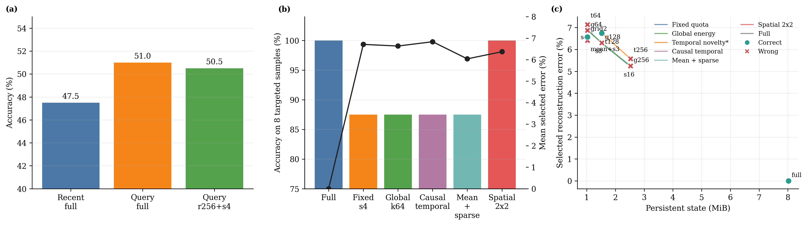
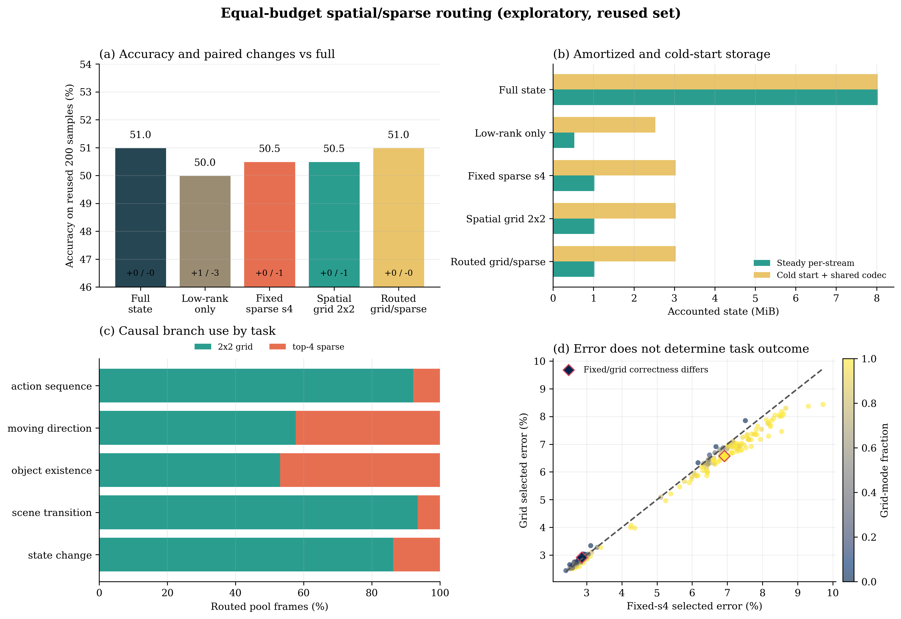

# Competitiveness, Loss Localization, and Redesign Analysis

## Executive verdict

The current result is competitive as a mechanism probe, but it is not an
independent confirmation result or a complete streaming-video system.

On the reused 200-sample set, the option-aware learned reader scores 102/200
with full visual state, compared with 95/200 for exact recent access. At the
rank-256 plus four-residual state, the learned reader scores 101/200 while
exact recent scores 93/200. The paired learned-versus-recent outcome at the
compressed state is 9 better / 1 worse (exact McNemar p=0.0215), but this is
an exploratory signal: the selector is option-aware, the same set was used
for several design decisions, and the ten discordant pairs make the result
fragile. A simple correction over the three synchronized full/s0/s4
comparisons would already move the p-value above 0.05.

The new causal grid/sparse error-oracle route matches the full-state
correctness count on this reused set: 102/200, with no full-correct/routed-
wrong sample in the audited v2 scan. This is useful post-hoc mechanism
evidence, not a generalization claim. The route was designed after examining
failures on the same 200 samples and computes both candidates before choosing
one.

The state is 7.84x smaller only in the amortized per-stream accounting. The
steady routed tensor payload is 1.024 MiB versus 8.024 MiB for full state;
including the 2.008 MiB shared codec, cold-start storage is 3.031 MiB and the
ratio is 2.65x. These are logical tensor payload bytes, not a complete wire
format or peak-memory measurement.

It is not a state-of-the-art claim. The experiment is a bounded MVBench
multiple-choice probe with one LLaVA backbone, no open-ended control, no
OVO-Bench or StreamingBench comparison, and no optimized streaming runtime.
A fresh, frozen paired reserve set is required before promotion.

## Where the loss is

| Stage | Correct | Accuracy | Net change |
|---|---:|---:|---:|
| Recent-only, full feature state | 95 / 200 | 47.5% | reference |
| Query selector, full feature state | 102 / 200 | 51.0% | +7 samples |
| Query selector, rank-256 only | 100 / 200 | 50.0% | -2 vs full |
| Query selector, rank-256 + fixed-s4 | 101 / 200 | 50.5% | -1 sample |
| Query selector, rank-256 + grid-2x2 | 101 / 200 | 50.5% | -1 sample |
| Query selector, routed grid/sparse | 102 / 200 | 51.0% | 0 vs full |

The largest descriptive error pool is upstream of compression: even the
best full-state query policy leaves 98/200 samples wrong. This does not prove
that the writer or reader is the causal bottleneck; backbone capability,
the 512-token reader limit, option priors, and task ambiguity remain possible
causes. It does show that reducing average feature reconstruction error alone
cannot solve most observed failures.

Compression errors are small but structurally informative. Low-rank-only has
one gain and three losses relative to full. Fixed-s4 and grid-2x2 each have
one loss, but on different samples. The error-oracle route recovers both in
the reused-set scan. This complementarity is the strongest rationale for a
hybrid structured/event state, while also showing why the next router must be
learned from disjoint data rather than chosen by the full-residual
reconstruction oracle.

The task pattern is also specific, but each task has only 40 examples.
Query-conditioned access appears to help scene transition, action sequence,
and state change, while moving direction remains difficult. Treat this as a
hypothesis for follow-up rather than a task-level conclusion:

- long-range semantic/event access for transitions and state changes;
- spatial trajectory fidelity for moving direction.

## What the new probes show

### Equal-budget allocation on eight targeted cases

All methods below use the learned query selector. The compressed variants use
the same 64 residual-value vectors over a 16-frame pool. This matches the
value-vector budget, not exact bytes or writer compute.

| Memory | Correct | Mean selected error | Total state |
|---|---:|---:|---:|
| Full | 8 / 8 | 0.00% | 8.024 MiB |
| Fixed four per frame | 7 / 8 | 6.71% | 1.024 MiB |
| Global residual energy | 7 / 8 | 6.63% | 1.024 MiB |
| Causal temporal novelty | 7 / 8 | 6.84% | 1.024 MiB |
| One frame mean + three sparse details | 7 / 8 | **6.04%** | 1.024 MiB |
| **2x2 coarse spatial residual grid** | **8 / 8** | 6.37% | **1.024 MiB** |

The 2x2 grid matches full state on all eight targeted cases without a new
loss. Mean-plus-sparse has the lowest average reconstruction error among the
compressed variants but still misses `state_change_0157`. Residual norm and
average reconstruction error are therefore not sufficient task-importance
scores. Seven of the eight cases do not distinguish the competing compressed
methods, so the effective discriminating sample size is one; 8/8 must not be
reported as broad confirmation.

### Dose response on the remaining loss event

The remaining event is `state_change_0157`: whether a lighting device is on
at any point. Fixed per-frame and global-energy residuals remain wrong after
the residual budget is increased from 64 to 128 and 256 vectors. A historical
temporal-novelty diagnostic flips to the correct answer at 128 vectors but
flips back at 256. This non-monotonicity shows that the answer lies near a
nonlinear decision boundary and that lower reconstruction error cannot be
treated as monotonic evidence of task preservation.

The historical temporal sweep used whole-pool normalization and must be
treated as an offline diagnostic. The implementation now freezes each
frame's novelty scale causally using only transitions observed so far.

### Same-budget structural redesign

On `state_change_0157`, all variants below use rank 256 and four residual
value vectors per frame.

| Residual organization | Correct | Selected error | Total state |
|---|---:|---:|---:|
| Fixed sparse s4 | no | 6.92% | 1,073,424 B |
| Global-energy k64 | no | 6.87% | 1,073,424 B |
| Causal temporal k64 | no | 7.14% | 1,073,424 B |
| One frame mean + three sparse details | no | 6.41% | 1,073,392 B |
| **2x2 coarse spatial residual grid** | **yes** | 6.57% | **1,073,296 B** |
| Full state | yes | 0.00% | 8,413,328 B |

The 2x2 grid is the first same-budget compressed variant to recover the
remaining answer. It uses four index-free vectors per frame, so it is 128
bytes smaller than fixed-s4 over 16 frames. Importantly, it succeeds with a
higher error than the failing mean-plus-sparse variant. The useful factor is
coarse spatial organization, not a lower global error.

The recovery passes the eight-case targeted set, but that set was chosen
because it contains selector gains and the known compression loss. It is not
a new population accuracy estimate. The subsequent 200-sample regression
shows that grid-2x2 and fixed-s4 each score 101/200 but fail on complementary
samples: grid loses `object_existence_0020`, while fixed-s4 loses
`state_change_0157`.

### Post-hoc routed residual regression

The routed state chooses, independently for each current frame, between four
index-free 2x2 grid vectors and four top-error sparse vectors. It never reads
future frames. The v2 implementation quantizes both candidate values to the
storage dtype before comparing errors, persists an explicit layout/version,
and has archive round-trip and prefix-invariance tests.

| Memory | Correct | Better / worse vs full | Agreement | Steady | Cold start |
|---|---:|---:|---:|---:|---:|
| Full state | 102 / 200 | 0 / 0 | 100.0% | 8.024 MiB | 8.024 MiB |
| Low-rank only | 100 / 200 | 1 / 3 | 97.0% | 0.524 MiB | 2.531 MiB |
| Fixed sparse s4 | 101 / 200 | 0 / 1 | 99.0% | 1.024 MiB | 3.032 MiB |
| Spatial grid 2x2 | 101 / 200 | 0 / 1 | 98.0% | 1.024 MiB | 3.031 MiB |
| Routed grid/sparse | **102 / 200** | **0 / 0** | 98.5% | **1.024 MiB** | 3.031 MiB |

The audited v2 routed scan selects grid mode on 76.5% of frames and sparse
mode on 23.5%. Grid use is highest for scene transition (93.4%) and action
sequence (92.2%), while moving direction and object existence use sparse mode
more often (42.3% and 46.9%). These frequencies are diagnostic, not learned
policy statistics.

The v2 route compares candidates after FP16 storage. Relative to the earlier
FP32-selection scan, exactly one of 3,200 pool-frame decisions changes
(`moving_direction_0066`), while all 200 predictions, all correctness labels,
and the aggregate accuracy remain unchanged.

Mechanically, zero preservation losses in 200 pairs gives a one-sided 95%
Clopper-Pearson upper bound of 1.49%. It must not be used to claim that the
2% gate passed, because the route was selected after inspecting this same
set. The bound is reported only to define what a fresh frozen replication
would need to reproduce.

The route is an error oracle: it computes both writers and their stored-state
errors, so its 1,073,376-byte payload does not imply lower writer FLOPs or
latency. Its contribution is to establish that the two equal-value-budget
representations contain complementary evidence. The deployable follow-up is
a cheap causal router based on low-dimensional residual concentration,
spatial autocorrelation, motion, and uncertainty, trained only on a disjoint
calibration split.

## More elegant retained mechanism

The evidence supports moving from a static attention decomposition to an
online latent-dynamics hypothesis:

\[
H_t = \mathcal{C}_{\theta_t} H_{t-1} + U_t Z_t + S_t.
\]

- `\mathcal{C}_{\theta_t} H_{t-1}` is a low-cost local BTTB/BCCB-like
  transport path for predictable spatial evolution. The current 2x2 grid is
  only a coarse, Haar-like proxy; it does not validate BCCB itself.
- `U_t Z_t` is a fixed-capacity low-dimensional semantic state for persistent
  objects, stages, and relations.
- `S_t` is a bounded block-sparse archive for unpredictable events, OCR,
  anomalies, and details that may become useful much later.

The deployable form should compute three outputs and fuse them with a causal
budgeted gate, rather than first constructing and decomposing dense attention:

\[
O_t = g_t^C O_t^C + g_t^M O_t^M + g_t^E O_t^E,
\qquad g_t^C + g_t^M + g_t^E = 1.
\]

This keeps the original motivation while assigning distinct roles and costs.
Block-circulant structure remains a component of the local writer, transport,
or projection path, not a wholesale replacement for video attention. The
weight-level DRE-BCM adapter is also conceptually separate: it may later
compress the router or memory projections, but it does not by itself prove
that temporal memory state is low rank.

## Current literature position

Recent work raises the bar beyond memory compression alone. SimpleStream
shows that a strong recent-frame baseline can match or beat complex streaming
systems, so every added state mechanism must beat a matched recent-only
control. SAVEMem couples semantic-aware online memory generation with
query-adaptive retrieval. Event-VStream explicitly detects event boundaries.
StateKV uses fixed-capacity recurrent state for linear-scaling video prefill.
StreamingTOM jointly bounds visual tokens and quantized online memory while
reporting TTFT and memory measurements.

The current work is most defensible as a mechanism-level bridge between these
directions: a bounded query-conditioned memory whose write path explicitly
separates persistent low-rank state, coarse spatial structure, and event
innovation. It is not competitive with those complete systems until the same
benchmark, recent-only baseline, and latency protocol are run.

Relevant current references:

- [SimpleStream](https://arxiv.org/abs/2604.02317)
- [SAVEMem](https://arxiv.org/abs/2605.07897)
- [Event-VStream](https://arxiv.org/abs/2601.15655)
- [StateKV](https://arxiv.org/abs/2605.31598)
- [StreamingTOM](https://arxiv.org/abs/2510.18269)
- [VideoStreaming](https://arxiv.org/abs/2405.16009)
- [StreamBridge](https://arxiv.org/abs/2505.05467)

## Required gates before a paper claim

1. Freeze the codec, route rule, reader, code hashes, metrics, and hypotheses,
   then run at least 400 previously unseen paired samples. For a 2% one-sided
   preservation gate at n=400, no more than three full-correct/routed-wrong
   samples may be observed.
2. Compare against an optimized recent-only baseline at matched total state,
   cold-start bytes, and latency. Do not reserve the full compressed budget
   only for the proposed method.
3. Separate question-only from option-aware readers, add option shuffling and
   open-ended controls, and use Holm correction for secondary comparisons.
4. Fit a cheap causal router only on a disjoint calibration split. Compare it
   with fixed-s4, grid-only, the error oracle, and a random/matched-rate route.
5. Repeat on OVO-Bench or StreamingBench and a second VLM backbone; include
   rare-event recall and retention-versus-delay, not only average accuracy.
6. Measure writer/read P50, P95, and P99 latency, TTFT, throughput, peak
   memory, bytes/hour, route overhead, and growth with video duration in a
   real streaming loop. Current Python timings are not serving claims.
7. Test temporal hidden-state effective rank, innovation sparsity, and
   `H_t <- H_{t-1}` transport directly. Compare identity, flow warp, BTTB,
   BCCB, mixture-of-BCCB, low-rank, sparse, and hybrid paths.
8. Keep BCCB as an ablated spatial parameterization and require an accuracy or
   hardware benefit over a dense/coarse-grid writer at matched state and
   latency before making a circulant-specific claim.

## Artifacts

- Loss report: `compressed_memory_loss_probe_20260718_v2/`
- Equal-budget spatial probe:
  `mvbench_spatial_residual_targeted_8_20260718_v2/`
- Hard-case dose response:
  `mvbench_adaptive_residual_budget_sweep_state_change_0157_20260718_v1/`
- Same-budget spatial probe:
  `mvbench_spatial_residual_state_change_0157_20260718_v1/`
- Full reused-set grid/fixed regression:
  `mvbench_spatial_residual_confirmation_200_20260718_v2/`
- Routed grid/sparse analysis:
  `spatial_routing_analysis_20260718/`
- Audited routed run aggregate:
  `mvbench_routed_residual_exploratory_200_20260718_v2/`
- Reproducible figure and source CSVs:
  `competitiveness_loss_redesign_20260718/`

