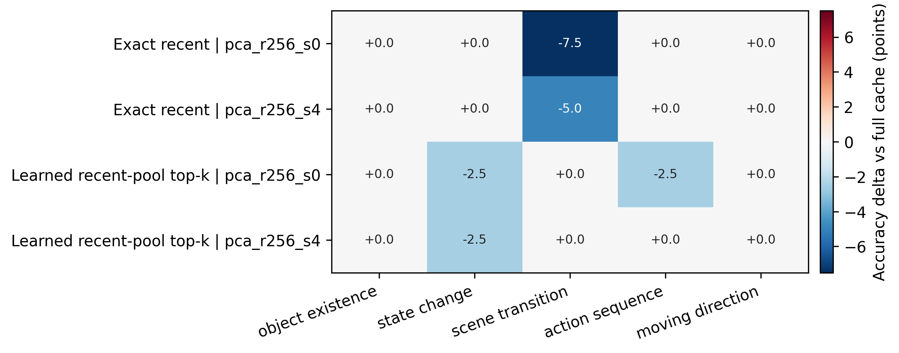
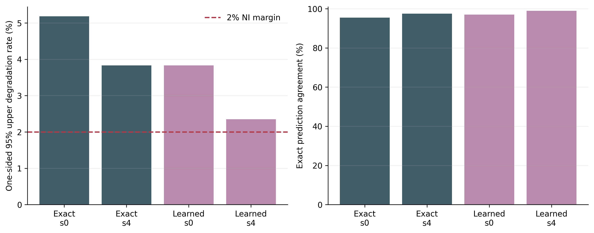

# Native Feature-Memory Compression Analysis

## Executive Decision

The compression probe is promising but does not pass the preregistered
2-point non-inferiority gate.

A rank-256 PCA state with four sparse residual tokens per frame reduces
per-stream persistent state from 8.024 MiB to 1.024 MiB, a 7.84x reduction.
For the learned recent-pool selector, accuracy changes from 51.0% to 50.5%,
with 99.0% exact prediction agreement and one full-correct/compressed-wrong
case among 200 pairs. The one-sided 95% exact upper bound on that loss-event
rate is 2.35%, just above the 2% margin.

The query-conditioned access result does survive compression. At the same
1.024 MiB state, the learned selector reaches 50.5% versus 46.5% for exact
recent, a paired gain of +4.0 points with interval [+1.0, +7.0], 9 better /
1 worse outcomes, and exact McNemar p=0.0215. This supports continuing the
bounded query-memory direction, but it does not establish the current PCA
codec as lossless or novel.

## Protocol Audit

- Codec calibration uses 100 videos, 20 per task, from the frozen calibration
  split only.
- The fit uses 12,800 sampled projected visual tokens with hidden size 4096.
  Token payloads contain no question, options, answer, or label fields.
- Confirmation uses 200 different videos, 40 per task, sampled from the
  frozen reserve pool.
- Confirmation IDs have zero intersection with calibration, original
  evaluation, and prior-formal IDs; all 200 IDs are inside the reserve pool.
- Rank 64, 128, 256, and 512 were compared only in a five-sample smoke gate.
  Rank 256 was the lowest rank matching all full-cache smoke predictions.
- The formal run freezes rank 256 and evaluates `full`, `pca_r256_s0`, and
  `pca_r256_s4` for exact recent and learned recent-pool top-k.
- The run contains 200 checkpoints and 1,200 predictions, one configuration
  fingerprint, 100% answer parsing, and no recorded failures.
- All selected frames match the frozen selection manifest. The formal full
  branches match the prior native run on all 400 paired predictions and
  correctness outcomes.

## Calibration Rank Gate

| Rank | Retained energy | Calibration error | Shared codec |
|---:|---:|---:|---:|
| 64 | 97.65% | 0.1024 | 0.508 MiB |
| 128 | 98.75% | 0.0748 | 1.008 MiB |
| 256 | 99.44% | 0.0499 | 2.008 MiB |
| 512 | 99.80% | 0.0299 | 4.008 MiB |

The smoke gate is a configuration-selection check, not inferential evidence.
Ranks 64 and 128 changed the same scene-transition prediction. Ranks 256 and
512 matched the full cache on all smoke samples, so rank 256 was selected as
the lower-state candidate.

## Formal Accuracy and State

| Selector | Memory | Accuracy | Steady state | Cold start | Ratio | Selected error |
|---|---|---:|---:|---:|---:|---:|
| Exact recent | full | 47.5% | 8.024 MiB | 8.024 MiB | 1.00x | 0.0000 |
| Exact recent | rank-256 latent | 46.0% | 0.524 MiB | 2.531 MiB | 15.32x | 0.0602 |
| Exact recent | rank-256 + 4 residuals | 46.5% | 1.024 MiB | 3.032 MiB | 7.84x | 0.0537 |
| Learned recent-pool | full | 51.0% | 8.024 MiB | 8.024 MiB | 1.00x | 0.0000 |
| Learned recent-pool | rank-256 latent | 50.0% | 0.524 MiB | 2.531 MiB | 15.32x | 0.0600 |
| Learned recent-pool | rank-256 + 4 residuals | 50.5% | 1.024 MiB | 3.032 MiB | 7.84x | 0.0534 |

Steady-state state excludes the shared 2,105,344-byte codec after it is
loaded. Cold-start state includes it once. The full cache has no additional
codec allocation.

## Paired Preservation Gate

The non-inferiority decision uses the one-sided 95% Clopper-Pearson upper
bound on full-correct/compressed-wrong events. Improvements are not allowed to
offset losses.

| Selector | Memory | Accuracy delta | Prediction agreement | Better / worse | Loss upper 95% | Pass |
|---|---|---:|---:|---:|---:|---|
| Exact recent | rank-256 latent | -1.5 points | 95.5% | 2 / 5 | 5.18% | no |
| Exact recent | rank-256 + 4 residuals | -1.0 points | 97.5% | 1 / 3 | 3.83% | no |
| Learned recent-pool | rank-256 latent | -1.0 points | 97.0% | 1 / 3 | 3.83% | no |
| Learned recent-pool | rank-256 + 4 residuals | -0.5 points | 99.0% | 0 / 1 | 2.35% | no |

If the learned `s4` loss count remained one, at least 236 paired samples would
be required for this exact upper bound to fall below 2%. More samples alone
are not the preferred fix; adaptive residual allocation should first target
the remaining task-sensitive errors.

## Query-Memory Gain at Matched State

| Memory | Learned minus exact recent | 95% interval | Better / worse | McNemar p |
|---|---:|---:|---:|---:|
| Full cache | +3.5 points | [0.0, +7.0] | 10 / 3 | 0.0923 |
| Rank-256 latent | +4.0 points | [+1.0, +7.5] | 10 / 2 | 0.0386 |
| Rank-256 + 4 residuals | +4.0 points | [+1.0, +7.0] | 9 / 1 | 0.0215 |

Compression therefore does not erase the query-conditioned selection signal.
This result supports the memory-access mechanism, not the optimality of the
four-feature ridge selector.

## Failure Localization

- Exact recent loses three scene-transition answers with latent-only state;
  four residual tokens recover one of them.
- Learned latent-only loses one action-sequence and one state-change answer
  relative to its full cache.
- Learned `s4` recovers the action-sequence loss and retains only one
  state-change loss.
- Object existence and moving direction are unchanged for every compressed
  configuration.
- Reconstruction error decreases with sparse residuals, but task recovery is
  category-dependent. Global reconstruction error is therefore not a
  sufficient selection metric.

Measured codec overhead is small relative to the unoptimized visual writer:
latent-only compression averages 0.78 ms and reconstruction 0.33-0.40 ms;
`s4` compression averages 1.56 ms and reconstruction about 0.41 ms. Cached
read plus generation remains approximately 82 ms. These are Python/CUDA
measurements, not fused-kernel or serving-latency claims.

## Research Implication

The strongest supported direction is a bounded query-conditioned visual
memory with task-aware sparse event preservation. The next experiment should:

1. allocate residual tokens adaptively across frames instead of fixing four
   per frame;
2. train the writer or residual score on disjoint calibration data with
   question-only, option-shuffled, and open-ended controls;
3. target scene transitions and state changes explicitly;
4. repeat the confirmation on a second video encoder or benchmark;
5. measure a fused writer and cache path before making latency claims.

Block-circulant and low-rank parameterizations remain optional compression
components for the learned writer, router, or projection layers after this
mechanism is validated. The current PCA plus sparse residual experiment is
not evidence that BCCB should replace video attention.

## Artifacts

- Formal aggregate:
  `mvbench_compressed_feature_confirmation_rank256_20260718_v1/aggregate/`
- Rank-selection gate:
  `mvbench_compressed_feature_rank_sweep_analysis_20260718_v1/`
- Calibration summaries:
  `llava_feature_pca_calibration_20260718_v1/codec_rank*/fit_summary.json`

