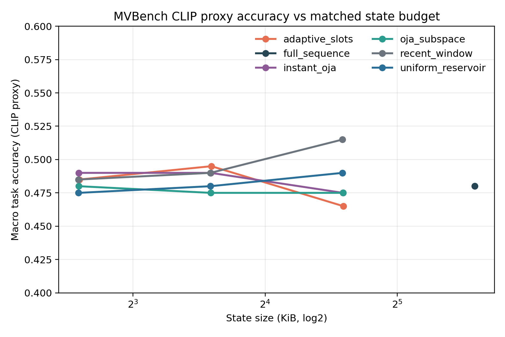
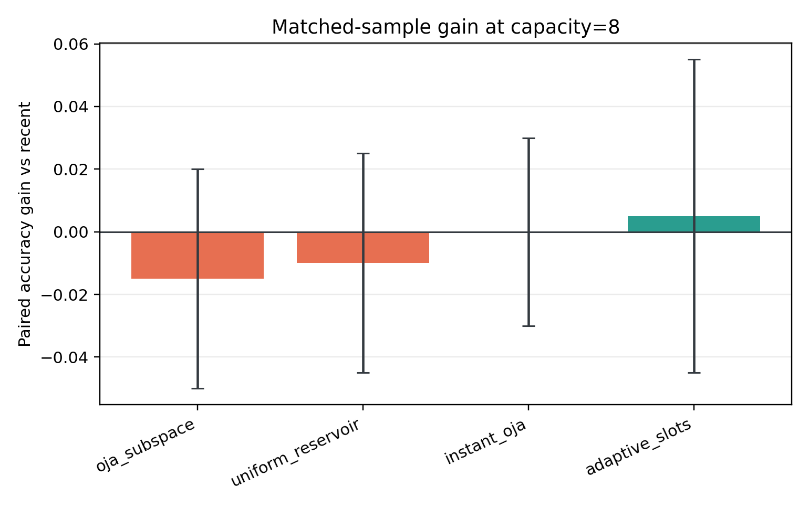
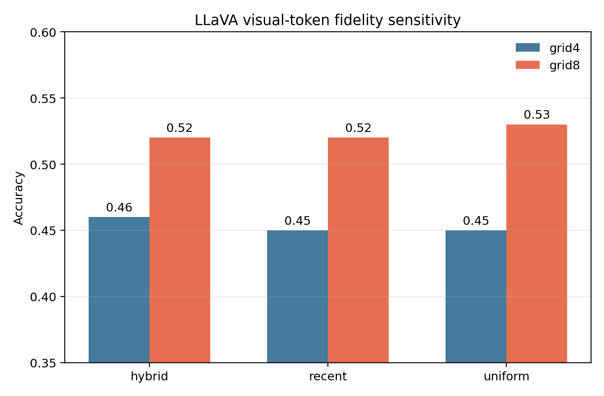
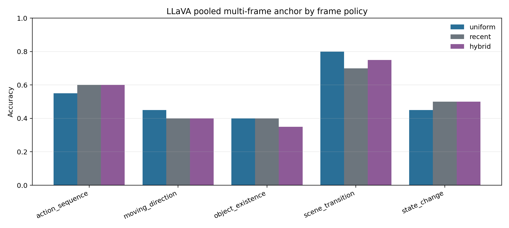

# MVBench Task-Level MVP Analysis

## Executive Decision

The task-level promotion gate is not met.

1. The matched-byte CLIP proxy does not show a reliable benefit from
   unsupervised Oja memory or the recent-plus-Oja composition.
2. The pooled multi-frame LLaVA anchor does not show a reliable benefit from
   the fixed `uniform-history + exact-recent` frame allocation.
3. Increasing spatial visual-token fidelity from 128 to 512 tokens produces a
   positive accuracy point estimate for every frame policy, but the paired
   confidence intervals still include zero at 100 examples.

The representation-level reconstruction result therefore does not transfer to
the tested language-conditioned decisions. The next method should retain an
exact recent cache but replace unsupervised subspace consolidation with a
query-conditioned, learned semantic or episodic memory. BCCB/BTTB transport and
sparse event routing remain diagnostic controls, not current method
components.

## Scope and Reproducibility

The formal task MVP uses a deterministic subset of MVBench:

- tasks: `object_existence`, `state_change`, `scene_transition`,
  `action_sequence`, and `moving_direction`;
- CLIP track: 40 examples per task, 200 examples total, 32 decoded frames;
- LLaVA track: 20 examples per task, 100 examples total, 8 decoded frames;
- CLIP model: normal-precision CLIP ViT-L/14-336;
- LLaVA model: normal-precision LLaVA-1.5-7B;
- all formal checkpoints completed with zero recorded errors;
- answer parsing rate for both LLaVA runs is 1.00.

The exact protocol and promotion gates are documented in
`MVBENCH_TASK_MVP_PROTOCOL.md`.

## Track A: Matched-Byte CLIP Memory

### Overall results

| Method | Capacity | State bytes | Accuracy | Gain vs recent |
|---|---:|---:|---:|---:|
| recent window | 4 | 6,160 | 0.485 | 0.000 |
| instant + Oja | 4 | 6,168 | 0.490 | +0.005 |
| Oja subspace | 4 | 6,164 | 0.480 | -0.005 |
| adaptive slots | 4 | 6,184 | 0.485 | 0.000 |
| uniform reservoir | 4 | 6,160 | 0.475 | -0.010 |
| recent window | 8 | 12,304 | 0.490 | 0.000 |
| instant + Oja | 8 | 12,328 | 0.490 | 0.000 |
| Oja subspace | 8 | 12,324 | 0.475 | -0.015 |
| adaptive slots | 8 | 12,360 | 0.495 | +0.005 |
| uniform reservoir | 8 | 12,304 | 0.480 | -0.010 |
| recent window | 16 | 24,592 | **0.515** | 0.000 |
| instant + Oja | 16 | 24,648 | 0.475 | -0.040 |
| Oja subspace | 16 | 24,644 | 0.475 | -0.040 |
| adaptive slots | 16 | 24,712 | 0.465 | -0.050 |
| uniform reservoir | 16 | 24,592 | 0.490 | -0.025 |
| full sequence | 32 | 49,168 | 0.480 | N/A |

The best point estimate is the 16-frame exact recent window. Retaining all 32
frames is worse by 0.035, which is consistent with stale or irrelevant visual
evidence diluting the simple CLIP readout.

At capacity 8, the paired gains versus the exact recent baseline are:

| Method | Gain | Bootstrap 95% CI | Better / worse / tied | McNemar p |
|---|---:|---:|---:|---:|
| adaptive slots | +0.005 | [-0.045, 0.055] | 13 / 12 / 175 | 1.000 |
| instant + Oja | 0.000 | [-0.030, 0.030] | 5 / 5 / 190 | 1.000 |
| Oja subspace | -0.015 | [-0.050, 0.020] | 5 / 8 / 187 | 0.581 |
| uniform reservoir | -0.010 | [-0.045, 0.025] | 5 / 7 / 188 | 0.774 |

No tested long-term memory method has a statistically reliable paired gain.
At capacity 16, both Oja variants are 0.040 below recent and their paired
confidence intervals exclude zero on the negative side.

### Promotion-gate decision

The preregistered gate required `instant_oja` to improve macro accuracy over
recent by at least 0.03 at one capacity, remain stable at two capacities, and
avoid broad task regressions. Its gains are `+0.005`, `0.000`, and `-0.040`.
The gate fails.

## Track B: Pooled Multi-Frame LLaVA Anchor

### Grid-4 pooling: 128 visual tokens

| Policy | Accuracy | Paired gain vs uniform | Bootstrap 95% CI |
|---|---:|---:|---:|
| uniform | 0.450 | 0.000 | N/A |
| recent | 0.450 | 0.000 | [-0.040, 0.040] |
| hybrid | 0.460 | +0.010 | [-0.030, 0.060] |

Only 6 of 100 examples change predicted option across frame policies. The
hybrid policy falls short of the required +0.02 improvement over both uniform
and recent.

### Grid-8 pooling: 512 visual tokens

| Policy | Accuracy | Paired gain vs uniform | Bootstrap 95% CI |
|---|---:|---:|---:|
| uniform | **0.530** | 0.000 | N/A |
| recent | 0.520 | -0.010 | [-0.080, 0.060] |
| hybrid | 0.520 | -0.010 | [-0.060, 0.030] |

Fourteen of 100 examples change predicted option across frame policies. More
visual tokens make the model more sensitive to the selected frames, but the
fixed hybrid allocation still does not improve accuracy.

### Spatial-token fidelity sensitivity

Grid-8 increases the LLM visual-token payload from 1 MiB to 4 MiB while
keeping the frame-selection state proxy fixed at 12,288 bytes.

| Policy | Grid-4 | Grid-8 | Paired gain | Bootstrap 95% CI |
|---|---:|---:|---:|---:|
| uniform | 0.450 | 0.530 | +0.080 | [-0.020, 0.180] |
| recent | 0.450 | 0.520 | +0.070 | [-0.040, 0.180] |
| hybrid | 0.460 | 0.520 | +0.060 | [-0.050, 0.170] |

All point estimates favor higher spatial fidelity, although none is
significant at this sample size. The separate runs are not a controlled
latency comparison, so their wall-clock differences must not be interpreted
as evidence that 512 tokens are faster.

## Why Reconstruction Did Not Transfer

The earlier representation probe showed that an exact recent cache plus a
rank-16 Oja state improved delayed cosine reconstruction under a matched byte
budget. That result and the task-level result answer different questions:

1. Oja minimizes a stream-level variance or reconstruction objective, not
   query relevance or answer discrimination.
2. Rare details can have low global energy but high task value.
3. The CLIP proxy has no learned memory readout and cannot reinterpret virtual
   Oja prototypes for a particular question.
4. The LLaVA anchor evaluates frame allocation with real images, not direct
   injection of Oja state into the model.
5. Aggressive 4-by-4 spatial pooling removes task-relevant evidence before
   temporal memory policy can help.

The result is therefore a task-transfer failure of the implemented memory
mechanism, not proof that every learned low-dimensional memory must fail.

## Research Consequences

### Rejected or demoted

- Unsupervised Oja memory is rejected as the primary task mechanism.
- The fixed five-history plus three-recent LLaVA policy is rejected as a
  promoted two-timescale allocation.
- BCCB is rejected as a primary online-video path under current evidence.
- The current residual-energy event heuristic remains rejected after passing
  zero of 25 formal joint gates.

### Retained

- Exact recent evidence is the strongest robust baseline and remains mandatory.
- Spatial visual-token fidelity is a first-order constraint.
- A bounded long-term state remains scientifically plausible only if its
  write, eviction, and read operations are learned or query-conditioned.
- Sparse episodic evidence can be reconsidered only with semantic labels or a
  task-trained router, not residual magnitude alone.

### Next falsifiable method

The next MVP should test:

`exact recent cache + query-conditioned learned episodic/semantic slots`.

The memory objective should combine answer loss with explicit retention
targets for entities, state changes, temporal order, OCR, and rare events.
Comparisons must include recent-only, uniform reservoir, adaptive slots,
query-free learned slots, and a semantic retrieval baseline. Structured
spatial transport should be an optional ablation; it should enter the method
only after beating convolution/BTTB controls on task quality and measured
latency.

## Claim Boundary

Supported:

- the implemented unsupervised low-rank memory does not improve the tested
  matched-byte language-conditioned proxy;
- the tested fixed hybrid frame policy does not improve the pooled LLaVA
  anchor;
- exact recent evidence is a strong baseline;
- higher spatial visual-token fidelity has a consistent positive point
  estimate.

Not supported:

- low-dimensional semantic memory is universally ineffective;
- full-history processing is always worse;
- any hardware speedup;
- MVBench state-of-the-art performance;
- a validated BCCB-memory-event three-path architecture.

## Artifacts

- CLIP predictions and statistics:
  `mvbench_clip_formal_20260717_v1/`
- LLaVA 128-token anchor:
  `mvbench_llava_formal_20260717_v1/`
- LLaVA 512-token anchor:
  `mvbench_llava_grid8_formal_20260717_v1/`
- pooling comparison:
  `mvbench_llava_pooling_compare_20260717_v1/`
