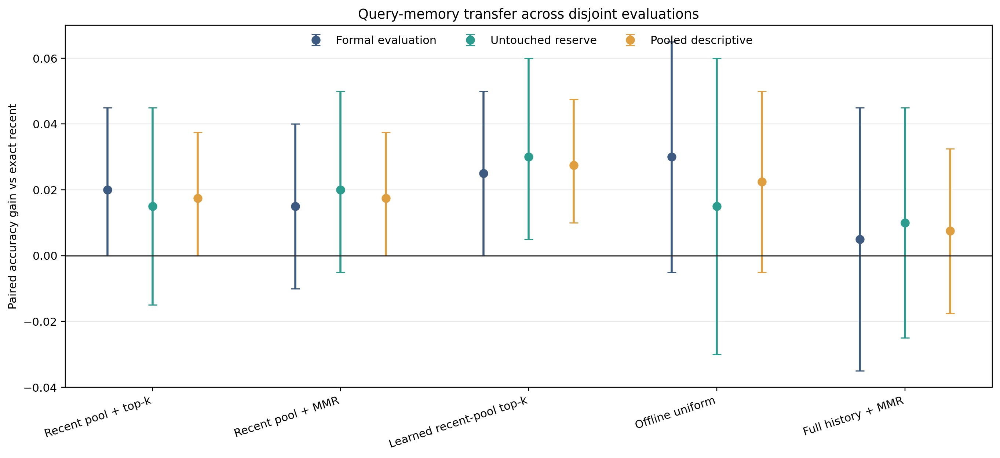
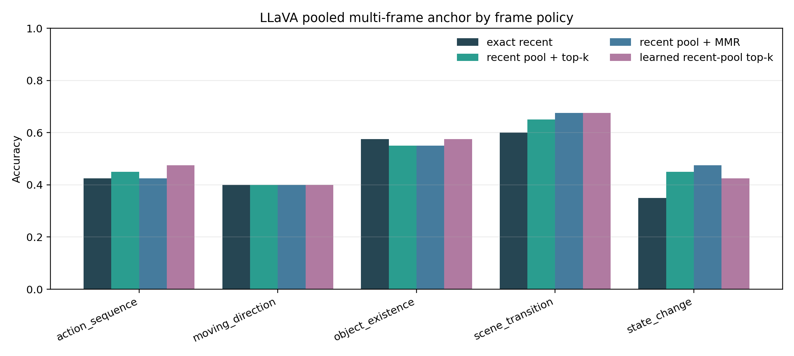
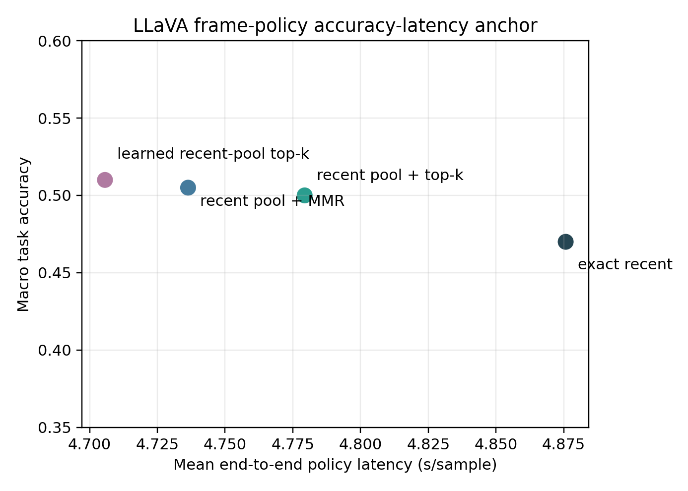
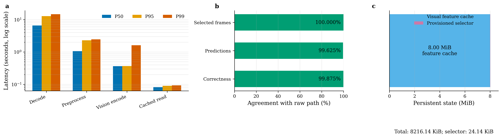
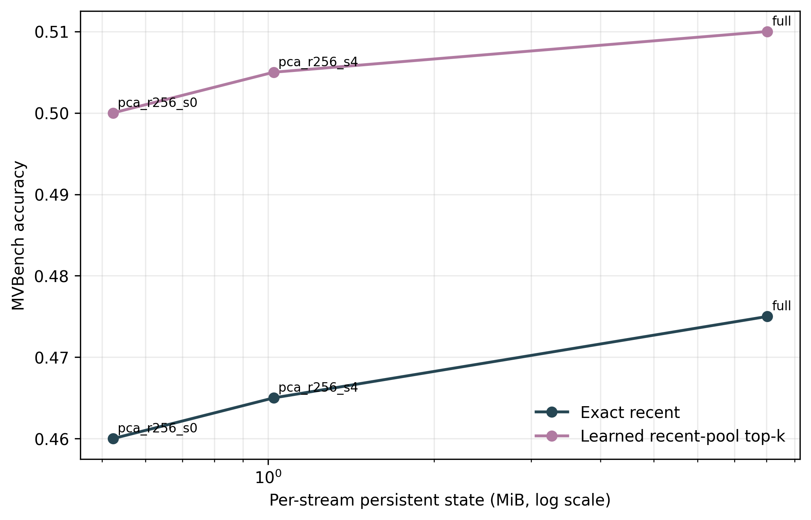

# Query-Conditioned Memory Stage Analysis

## Executive Decision

The evidence is strong enough to continue the query-conditioned memory
direction, but not strong enough to claim a completed or learned online-memory
method.

Query-conditioned access to a 16-frame recent history retains a positive LLaVA
point gain after moving from raw-frame replay to a matched 8.413 MB native
feature cache. The cache is counted, query-time video replay is eliminated, and
all policies receive the same provisioned state. The frozen four-feature
readout is still not significantly better than exact recent or the query-only
top-k/MMR controls. The next contribution must therefore learn and compress the
native state, not promote the CLIP ranker itself.

## Evidence Chain

| Stage | Reference | Candidate | Paired gain | 95% interval | Decision |
|---|---:|---:|---:|---:|---|
| Formal CLIP primary, 200 evaluation records | 47.5% | 47.0% diverse + recent + MMR | -0.5 points | [-4.0, +3.0] | preregistered primary fails |
| Formal CLIP exploratory learned readout | 47.5% | 50.0% | +2.5 points | [0.0, +5.0] | freeze before reserve |
| Untouched-reserve CLIP top-k primary, 200 records | 50.0% | 51.5% | +1.5 points | [-1.5, +4.5] | weak trend only |
| Untouched-reserve CLIP learned readout | 50.0% | 53.0% | +3.0 points | [+0.5, +6.0] | positive transfer |
| Paired LLaVA top-k, 200 records | 47.0% | 50.0% | +3.0 points | [-1.0, +7.0] | positive but uncertain |
| Paired LLaVA MMR | 47.0% | 50.5% | +3.5 points | [0.0, +7.0] | positive boundary |
| Paired LLaVA learned readout | 47.0% | 51.0% | +4.0 points | [+1.0, +7.5] | transfer gate passes |
| Native matched-state top-k, 200 records | 47.5% | 50.0% | +2.5 points | [-1.0, +6.5] | positive but uncertain |
| Native matched-state MMR | 47.5% | 50.5% | +3.0 points | [0.0, +6.5] | positive boundary |
| Native matched-state learned readout | 47.5% | 51.0% | +3.5 points | [0.0, +7.0] | trend passes, p=0.0923 |
| Rank-256 + sparse residual, learned versus its full cache | 51.0% | 50.5% | -0.5 points | [-1.5, 0.0] | 99% agreement, but 2% non-inferiority gate fails |
| Rank-256 + sparse residual, learned versus compressed exact recent | 46.5% | 50.5% | +4.0 points | [+1.0, +7.0] | query-memory gain survives, p=0.0215 |

The raw-frame learned comparison has 10 better, 2 worse, and 188 tied examples,
with exact McNemar p=0.0386. The native comparison has 10 better, 3 worse, and
187 tied examples, with p=0.0923. Both paths place gains on action sequence,
scene transition, and state change. Moving direction remains unchanged, and
the learned policy avoids the object-existence regression seen in top-k and
MMR.

## Mechanism Interpretation

The current result supports a larger query-accessible bounded history, not the
optimality of the ridge readout:

- learned versus recent-pool top-k is +1.0 point with interval [-2.0, +4.0];
- learned versus recent-pool MMR is +0.5 point with interval [-3.0, +4.0];
- all three recent-pool policies change relatively few final answers;
- matching persistent state and removing query-time replay preserve the same
  qualitative ranking;
- full-history CLIP MMR is weak, so merely retaining every frame embedding is
  not sufficient;
- the learned standardized coefficient on option contrast is the largest, so
  multiple-choice option information may be helping. This must be separated
  from question-only and open-ended retrieval in the next stage.

## Budget and Systems Boundary

The native anchor closes two previous accounting gaps but remains unoptimized:

- every policy receives exactly 8,413,328 persistent bytes;
- 8,388,608 bytes are the 16-frame projected feature cache and 24,720 bytes are
  the provisioned selector state;
- every policy consumes 512 visual tokens, with a 4 MiB activation proxy;
- query-time source-video replay is zero;
- mean write time is 8.68 seconds, with decode P95/P99 of 12.88/14.74 seconds;
- mean cached read is 0.083 seconds, with P95/P99 of 0.090/0.093 seconds.

No latency advantage should be claimed between selectors. The useful systems
result is that bounded cached read is fast after one expensive unoptimized
write. The current code is still an evidence-selection and state-accounting
anchor, not an online serving implementation.

The rank-256 sparse-residual confirmation reduces steady-state memory from
8.024 MiB to 1.024 MiB per stream. Its 2.008 MiB shared codec makes cold-start
state 3.032 MiB. Learned accuracy is 50.5% versus 51.0% with the full cache,
but one loss event in 200 pairs gives a one-sided exact upper bound of 2.35%,
so the 2% non-inferiority gate is not passed.

## Compression Result and Next Experiment Contract

1. Treat rank-256 plus four residual tokens as a promising configuration, not
   a promoted lossless codec. It has 99% prediction agreement but fails the
   conservative 2% finite-sample non-inferiority gate.
2. Replace a fixed residual count per frame with task-aware or adaptive event
   allocation, targeting scene transitions and state changes.
3. Train a genuinely query-conditioned writer/readout with disjoint train,
   validation, and test videos. Keep the current 48-byte ridge model as a
   frozen baseline.
4. Add question-only, symmetric option-aware, option-shuffled, and preferably
   open-ended controls.
5. Target moving direction, object existence, delayed rare events, OCR/numeric
   evidence, and current-scene preservation.
6. Replicate the selected mechanism on a second encoder or benchmark before
   introducing BTTB/BCCB or hardware-specific parameter compression.

Block-circulant and low-rank modules remain deferred compression components for
the learned memory projections, router, or kernel generator. They are not
evidence for the memory mechanism itself.

## Artifacts

- Formal CLIP:
  `mvbench_query_formal_20260717_v1/aggregate/`
- Untouched-reserve CLIP:
  `mvbench_query_confirmation_20260718_v1/aggregate/`
- Cross-split analysis:
  `mvbench_query_cross_split_20260718_v1/`
- Paired LLaVA:
  `mvbench_query_llava_confirmation_20260718_v1/aggregate/`
- Matched-state native feature memory:
  `mvbench_feature_memory_confirmation_20260718_v1/aggregate/`
- Feature-codec rank sweep:
  `mvbench_compressed_feature_rank_sweep_analysis_20260718_v1/`
- Rank-256 compressed confirmation:
  `mvbench_compressed_feature_confirmation_rank256_20260718_v1/aggregate/`
- Compression analysis:
  `FEATURE_MEMORY_COMPRESSION_ANALYSIS_20260718.md`

