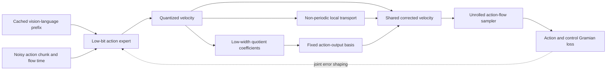

# Action-DiT、pi 类 VLA 与 WAM 的结构化压缩分析

日期：2026-08-26

## 1. 结论先行

本轮第一次在本研究计划中对真正的 action-generating Diffusion
Transformer 做了冻结模型实验。此前 Wan 是视频 DiT，LeWM/PushT 是动作条件的视觉
latent world model，二者都不是动作扩散策略。

当前结论分为四层：

1. **Action DiT 确实比视频 DiT 更适合利用动作时间轴结构。** 在三个独立训练的
   PushT Transformer checkpoint 上，半径 2 的非周期 Toeplitz 修正平均移除了
   `37.49%` 的 held-out W4 denoiser defect；同预算 circular 修正为 `36.64%`。
   两者在三个 checkpoint 的完整 100-step sampling 上都改善了均值误差，而此前固定
   BCM/BCCB 在 Wan attention 和 LeWM latent 上没有这种一致性。
2. **简单 post-hoc `Toeplitz + low-rank` 仍不能作为通用方法。** 三个 checkpoint 上
   hybrid 的完整采样改善分别为 `+7.31% / +29.44% / -11.73%`。只有 train-1
   单独通过注册门槛，train-0 和 train-2 均为 `BOUNDARY`。
3. **失败点不是 basis 容量，而是系数可观测性和迭代稳定性。** calibration-fixed
   rank-8 basis 用 held-out oracle coefficients 可解释 `74.71%-82.34%` defect
   energy，但 deployable rank-4 regression 只移除 `10.80%-28.25%`，并在 train-2
   的闭环 sampler 中放大误差。
4. **最有潜力的主线不是 action attention 的 BCM/BCCB，而是 Action-Flow
   Quotient Error Shaping。** Action attention token 很少，本轮模型的 attention-score
   计算仅占估算 denoiser MAC 的 `0.68%`；DiT FFN 占 `55.31%`。应以低比特 FFN 和
   减少 NFE 获得速度，以动作轨迹 quotient 上的结构化修正维持精度。

因此，视频生成方向的失败没有让全部结构化思想失效。真正应保留的是：

> 结构不再放在无语义的 hidden-channel 顺序或完整视频 attention 上，而放在具有物理
> 顺序的 action horizon，以及从 denoiser defect 到最终动作轨迹的 functional quotient
> 上。

## 2. 研究对象必须重新区分

| 维度 | 视频 DiT | Action DiT / pi 类模型 | World Action Model |
|---|---|---|---|
| 生成变量 | 大规模 `T x H x W` latent | 短 action chunk `H_a x d_a` | future video latent 与 action |
| 典型 token 规模 | 数千至数万 | 约 10 至 50 个 action tokens，加视觉语言 prefix | 视频 token 很大，action token 很小 |
| 重复轴 | denoising step | denoising/flow step 与 control cycle | 视频 rollout、action sampling、test-time ranking |
| 常见主瓶颈 | self-attention、FFN、NFE | VLM prefix、action expert FFN/projection、NFE | 视频 backbone、长 rollout、world-action interface |
| 误差终点 | 感知质量或 dense-relative trajectory | closed-loop task success | foresight quality与action utility同时成立 |
| 合理结构 | 动态 sparse attention、cache、FP8、distillation | selective PTQ、NFE reduction、action-axis local structure | 视频支路专用加速 + action quotient + representation alignment |

Action DiT 不是理论猜想，已有多条成熟路线：

- [pi0](https://arxiv.org/abs/2410.24164) 使用 flow matching 生成连续动作；官方
  [OpenPI PyTorch 实现](https://github.com/Physical-Intelligence/openpi/blob/main/src/openpi/models_pytorch/pi0_pytorch.py)
  默认用 10 个 Euler flow steps，并先计算视觉语言 prefix KV cache，再反复执行 action
  suffix。
- [CogACT](https://arxiv.org/abs/2411.19650) 系统比较了 diffusion action module，报告
  Transformer action module 比同规模 MLP 更有扩展性。
- [RDT-1B](https://arxiv.org/abs/2410.07864) 将 diffusion Transformer 扩展到 1.2B
  bimanual policy，并强调多模态动作和高频机器人数据。
- [Dita](https://openaccess.thecvf.com/content/ICCV2025/html/Hou_Dita_Scaling_Diffusion_Transformer_for_Generalist_Vision-Language-Action_Policy_ICCV_2025_paper.html)
  直接把视觉、语言和 noisy action token 送入 causal Transformer 做 in-context denoising。

这类模型与 Wan 的关键差异不是都使用 DiT，而是 **action quotient 很小且有物理坐标**。

## 3. QuantVLA、QVLA、LightDP 给出的共同边界

### 3.1 QuantVLA

[QuantVLA](https://arxiv.org/html/2602.20309v4) 是 training-free VLA PTQ。它量化
language backbone 的 linear layers 和 DiT MLP，同时保持 DiT `Q/K/V/O` attention
projection 为浮点；通过 per-head Attention Temperature Matching 和 per-layer Output
Head Balancing 修复 logits temperature 与 residual energy drift，并把标量折叠进已有
dequantization scale。

它对本项目有两个直接启示：

- action DiT 的首要低比特目标是 MLP/FFN，而不是强行结构化 action attention；
- 一个真正部署友好的 correction 应尽量折叠或融合，不能额外引入大 GEMM 和 kernel
  launch。

### 3.2 QVLA

[QVLA](https://arxiv.org/html/2602.03782v1) 以最终 action sensitivity 而非 hidden
reconstruction error 分配 `{0,2,4,8,16}` bits，0 bit 同时表示 pruning。论文报告
OpenVLA-OFT 使用原模型 `29.2%` VRAM、保持 `98.9%` 原性能并获得 `1.49x` 加速。

但其最终压缩布局明确保留 projector 和 action head 为 BF16。这意味着 QVLA 证明的是
action-space metric 对 VLA backbone 压缩有效，并没有闭合“如何安全压缩 diffusion action
head”这个问题。

### 3.3 LightDP

[LightDP](https://openaccess.thecvf.com/content/ICCV2025/html/Wu_On-Device_Diffusion_Transformer_Policy_for_Efficient_Robot_Manipulation_ICCV_2025_paper.html)
先定位 denoising network 的延迟，再用结构化 pruning/retraining 压模型，并用 consistency
distillation 减少 sampling steps。其核心收益来自更少网络计算和更少 NFE，不是低成本
post-hoc residual。

### 3.4 三者共同说明什么

三项工作形成一个清晰的效率分解：

\[
T_{\mathrm{policy}}
=T_{\mathrm{prefix}}
+N_{\mathrm{flow}}\left(T_{\mathrm{action\ expert}}+T_{\mathrm{overhead}}\right).
\]

- QVLA 主要压缩大 backbone，并使用 action sensitivity 保护控制结果；
- QuantVLA 直接触及 action DiT 的数值精度，但保护 attention projection；
- LightDP 直接降低 `T_action expert` 和 `N_flow`。

所以本项目若只提出一个 action-axis BCM，既碰不到主要延迟，也没有独立创新性。合理
组合必须让低比特和 NFE reduction 提供速度，让结构化 quotient correction 提供保真。

## 4. 形式化问题

### 4.1 Action flow 与 sampler 传播

pi 类 flow policy 可写为

\[
\frac{d a_s}{d s}=v_\theta(a_s,o,g,s), \qquad a_1\sim\mathcal N(0,I).
\]

量化后速度场为 `v_q=v+e_q`。一阶终点误差为

\[
\delta a_0
\simeq
\int_0^1 \Phi(0,s)e_q(s)\,ds,
\]

其中 `Phi` 是 flow Jacobian 的 state-transition operator。相同的 local denoiser MSE
在不同 step 上可产生完全不同的终点风险。

离散 Euler/DDPM sampler 可写为

\[
a_{n+1}=\Psi_n(a_n,v_n),
\]

\[
\delta a_N
\simeq
\sum_{n=0}^{N-1}
\left(\prod_{j=n+1}^{N-1}J^a_j\right)
J^v_n e_n.
\]

因此 teacher-forced error 改善不保证 sampling endpoint 改善。本轮 train-2 正是反例：
rank-4 修正改善 local denoiser error，却把完整 sampling 均值误差扩大 `12.93%`。

### 4.2 物理闭环传播

执行动作后还有环境动力学：

\[
x_{k+1}=F_k(x_k,a_k),
\]

\[
\delta x_T
\simeq
\sum_{k=0}^{T-1}
\Phi^x_{T,k+1}B_k\delta a_k,
\qquad B_k=\frac{\partial F_k}{\partial a_k}.
\]

定义任务代价矩阵 `Q_T` 后，动作误差的 control Gramian 为

\[
G_k=
B_k^\top(\Phi^x_{T,k+1})^\top
Q_T\Phi^x_{T,k+1}B_k.
\]

这就是 action domain 中更合适的 Hessian/GGN。它不是 `H=I` 的 weight MSE，也不是
视频 SSIM 的替代名称。

### 4.3 Functional quotient

设内部扰动为 `delta h`，最终动作轨迹 Jacobian 为 `J_a`。所有属于 `ker(J_a)` 的
扰动在当前任务终点不可见。真正要压缩的是 quotient space

\[
\mathcal H / \ker(J_a),
\]

而不是完整 hidden space。对应风险为

\[
D_{\mathrm{action}}(\delta h)
=\delta h^\top J_a^\top GJ_a\delta h.
\]

这把此前 LLM 中的 functional fiber/gauge 视角迁移到了动作生成，但任务度量变为
sampler 与环境共同诱导的 quotient metric。

## 5. 本轮冻结实验

### 5.1 设置

- 模型：PushT low-dimensional Diffusion Transformer，三个独立训练 checkpoint；
- 架构：action horizon 10，action dim 2，width 256，8 decoder layers；
- 扰动：condition MLP 与所有 decoder FFN `linear1/linear2` 做 per-output-channel W4
  fake quantization；attention、bias、normalization、embedding、output head 保持 FP；
- calibration：128 个 train-split 样本；
- evaluation：64 个 validation-split 样本；
- sampler：100 个实际 DDPM steps，paired initial noise 与 scheduler randomness；
- 所有 correction 只能使用当前 noisy action、W4 output、condition 和 step bucket；
- 没有 environment rollout，没有 integer kernel，不声明控制成功或实测加速。

候选包括 bucket mean、channel affine、circular r2、nonperiodic Toeplitz r2、rank-4、
Toeplitz+rank-4 和 dense ridge ceiling。train-1/2 在看到 train-0 结果后只做固定复制，未
改变任何超参数。

### 5.2 工作量画像

| 指标 | 数值 |
|---|---:|
| 参数量 | 8.964M |
| 被 W4 的 FFN 权重 | 4.719M，52.64% |
| 被选 FFN 的估算 MAC 占比 | 55.31% |
| attention score 的估算 MAC 占比 | 0.68% |
| selective W4 参数存储压缩 | 1.65x |
| 若选中 FFN 局部 2x，理想 denoiser 上限 | 1.38x |
| 若选中 FFN 局部 4x，理想 denoiser 上限 | 1.71x |
| A800 batch-1 FP forward | 约 4.38 ms |

这只是一项小型 PushT 模型画像，不能直接外推 pi0 的占比；但它足以否定“先优化 action
attention score matrix”作为该模型主线。

### 5.3 Teacher-forced 机制结果

| 方法 | 三 checkpoint 平均 defect energy removed | 最小 | 最大 |
|---|---:|---:|---:|
| bucket mean | 16.32% | 10.10% | 24.01% |
| channel affine | 25.53% | 16.86% | 31.70% |
| circular r2 | 36.64% | 25.04% | 47.30% |
| nonperiodic Toeplitz r2 | **37.49%** | 26.59% | 47.69% |
| rank-4 | 22.15% | 10.80% | 28.25% |
| Toeplitz + rank-4 | 34.38% | 17.52% | 48.93% |

Toeplitz 在三个 checkpoint 的 teacher-forced error 上都略优于 circular，说明物理
action horizon 的边界不是完全可忽略的。它的优势很小，因此不能把结果解释为严格的
Toeplitz 定律。

结构化可预测性随 denoising 进程下降：三模型平均的 local correction 改善由 early
bucket 约 `45%` 降到 late bucket 约 `12%`。这支持 step-conditioned precision 或
correction strength，而不支持统一 correction gain。

### 5.4 完整 sampling 结果

下表为相对 plain W4 的 action relative-L2 改善，正值越大越好：

| 方法 | train-0 | train-1 | train-2 |
|---|---:|---:|---:|
| bucket mean | +5.45% | +14.69% | +0.28% |
| channel affine | +5.32% | +15.71% | +5.30% |
| circular r2 | +4.48% | +17.18% | +6.04% |
| Toeplitz r2 | +4.78% | +17.09% | +4.42% |
| rank-4 | +7.23% | +28.99% | **-12.93%** |
| Toeplitz + rank-4 | +7.31% | **+29.44%** | **-11.73%** |
| dense ridge | +6.34% | +28.97% | **-12.67%** |

P95 给出更严格的风险判断：

- local circular/Toeplitz 在三个 checkpoint 上 P95 都没有变差；
- rank-4 与 hybrid 在 train-0 的 P95 分别恶化 `8.35%` 与 `5.14%`；
- train-2 上 rank-4 虽改善 P95，却明显恶化均值，说明 correction 改变了误差分布，而
  不是一致收缩。

注册判决：train-0 `BOUNDARY`、train-1 `GO`、train-2 `BOUNDARY`。固定复制协议要求
跨 checkpoint 成立，因此总体不能判为 GO，也不授权环境 rollout。

### 5.5 为什么 low-rank 不是完全无效

使用 calibration-fixed basis、held-out oracle coefficients 的 rank-8 ceiling 可捕获：

| checkpoint | rank-4 energy | rank-8 energy |
|---|---:|---:|
| train-0 | 70.55% | 82.34% |
| train-1 | 59.35% | 74.71% |
| train-2 | 70.65% | 82.01% |

因此 action-output defect 的低维 basis 比此前 Wan 中跨样本 rotating hidden basis 稳定。
当前失败可分解为：

\[
E_{\mathrm{final}}
=E_{\mathrm{basis}}
+E_{\mathrm{coefficient}}
+E_{\mathrm{rollout\ shift}}
+E_{\mathrm{control}}.
\]

- `E_basis` 已较小；
- 当前线性 feature-to-coefficient predictor 不能稳定恢复 oracle coefficients；
- teacher trajectory 拟合后进入 quantized sampler 会产生 state-distribution shift；
- 环境闭环尚未测量。

这与视频 DiT 的结论不同。视频侧主要先失败在固定 basis；action DiT 这里主要失败在
coefficient observability 和 iterative stability。

## 6. 提议方法：Action-Flow Quotient Error Shaping

### 6.1 单一创新主张

不提出“量化 + Toeplitz + low-rank + Hessian + rotation”的组件叠加。统一主张是：

> 在动作 sampler 与物理动力学诱导的 functional quotient 中优化量化；主动把
> action-visible quantization defect 塑造成可由非周期局部 transport 和低维全局 tail
> 修复的子空间，并通过完整 unrolled action-flow loss 约束稳定性。

简称 **FlowQuotient**。

### 6.2 模型

设第 `b` 个 flow-step bucket 的 W4 velocity defect 为

\[
e_b(x,o)=v(x,o)-v_q(x,o).
\]

便宜修正族为

\[
\hat e_b
=T_b\phi(x,v_q)
+U_b c_\psi(z_b),
\]

其中：

- `T_b` 是 action-horizon 上的非周期 banded transport/finite-difference operator；
- `U_b` 是 calibration-fixed action-output basis；
- `c_psi` 只从当前 noisy action、quantized velocity、proprioception、flow time 和可缓存
  condition sketch 预测少量 coefficients；
- action attention 不做 BCM 主路径，attention projection 默认 FP8/BF16；
- circular kernel 只保留为等预算对照，不赋予物理周期语义。

### 6.3 联合 error shaping

量化器不再单独最小化 weight MSE，而与可修正子空间共同优化：

\[
\min_{q,T,U,\psi}
\mathbb E
\sum_n
\left\|
G_n^{1/2}
\Phi_{N,n}
\left[e_{q,n}-T_{b(n)}\phi_n-U_{b(n)}c_\psi(z_n)\right]
\right\|_2^2
+\lambda C_{\mathrm{device}}.
\]

这里：

- `G_n` 是 action/environment quotient metric；
- `Phi_N,n` 传播 sampler 误差；
- `C_device` 使用真实设备 latency、memory、NFE，而不是 parameter count；
- bit-width `0` 可统一表示 QVLA 式 channel pruning，无需另加一个 sparse residual branch。

可以定义 quotient-shaping ratio：

\[
\eta_{\mathcal S}
=1-
\frac{
\|(I-P_{\mathcal S})G^{1/2}e_q\|_2^2
}{
\|G^{1/2}e_q\|_2^2
},
\qquad
\mathcal S=\mathrm{range}(T)+\mathrm{span}(U).
\]

成功不是让未加权 quantization MSE 变小，而是让 action-visible defect 进入廉价可修正的
`S`，同时最终 residual 变小。必须同时报告 shaped-base error，避免重演“增大分母让
captured energy 好看”的问题。

### 6.4 稳定性约束

对离散 sampler，修正后的局部 Jacobian 满足

\[
J_n^{\mathrm{corr}}
=\frac{\partial \Psi_n(a,v_q+\hat e)}{\partial a}.
\]

训练加入开放环 `1/2/4/all-step` loss 和稳定性惩罚：

\[
\mathcal L_{\mathrm{stab}}
=\sum_n
\left[\sigma_{\max}(J_n^{\mathrm{corr}})-\tau_n\right]_+^2.
\]

部署时只允许一个预注册的 bounded gain：

\[
\hat e\leftarrow
\gamma_b\hat e,
\qquad 0\le\gamma_b\le1,
\]

并由 calibration/selection split 固定。不能在 held-out rollout 上调 gain。

### 6.5 Hessian 与合法 rotation 的位置

Hessian/GGN 不是附加模块，而是 `G_n` 的估计器。rotation 也不是额外 correction，而是
保持原函数不变的 quantizer coordinate：

\[
W x=(WR^\top)(Rx).
\]

可把 block-orthogonal `R`、bit assignment 和 structured quotient correction 放进同一
目标，但必须满足模型中的合法等价变换，且实际 kernel 能吸收 `R`。如果 rotation 需要
在线 dense transform，它不再是免费 symmetry，应计入 `C_device`。

## 7. 与已有工作的创新边界

| 工作 | 已覆盖 | FlowQuotient 仍可能独立的部分 |
|---|---|---|
| QVLA | action-sensitive channel bits/pruning | 直接压缩 action DiT；sampler/environment quotient；可修正 defect shaping |
| QuantVLA | selective DiT PTQ；ATM/OHB scale calibration | 非标量 action-horizon correction；unrolled quotient objective |
| LightDP | pruning/retraining + consistency distillation | 与低 NFE student 正交的 low-bit stability；不以网络剪枝为主张 |
| SVDQuant 类 | hidden/weight low-rank residual | action-output quotient basis；physical horizon transport；closed-loop metric |
| BCM/BCCB | 固定循环结构 | 只保留 circular comparator；主结构为非周期、action-coordinate-aware |

若只是把 QuantVLA 后面再接 LoRA/Toeplitz，不足以形成创新。必须实验证明：在相同 bit、
NFE 和实测 latency 下，**joint quotient shaping** 显著优于：

1. QuantVLA-style scale calibration only；
2. action-sensitive bit allocation only；
3. fixed quantizer + post-hoc structured correction；
4. support/bit only 与 tail only；
5. independent Q + correction，而非联合优化。

## 8. WAM 中应放在哪里

WAM 不能因为 future video 合理就假设 action representation 合理。
[AGRA](https://arxiv.org/abs/2606.12217) 的 causal intervention 发现，视觉重建优化出的
hidden state 可能不关注 task-relevant interaction region，存在 foresight-to-action 的
representation mismatch。这与此前 LeWM action Jacobian cosine 仅 `0.0476`、rel-L2
`1.0288` 的负结果一致。

权威 WAM 路线进一步说明系统应异构处理：

- [DreamZero](https://arxiv.org/abs/2602.15922) 联合视频与动作，并通过系统优化让 14B
  autoregressive video diffusion 达到 7 Hz closed-loop control；
- [DreamDojo](https://dreamdojo-world.github.io/) 依靠 autoregressive few-step
  distillation 达到 10 FPS、超过 1 分钟 rollout，说明 WAM 速度主杠杆仍是视频支路的
  distillation/runtime；
- [tau0-WM](https://arxiv.org/abs/2606.01027) 同时生成 future visual latents 和 action
  chunks，并用 candidate sampling、re-denoising consistency 与 simulator rectification
  增加 test-time computation。

因此 WAM 的合理部署分解是

\[
\text{WAM}
=\text{distilled/FP8 video backbone}
+\text{FlowQuotient action interface}
+\text{action-grounded alignment/ranking}.
\]

BCM/BCCB 最多作为 world-video branch 的 localized geometry expert，不能作为 action
interface 或全局 WAM attention 的统一主路径。

## 9. 下一步实验顺序

### Gate A：pi0/OpenPI frozen replication

1. 保留官方 prefix KV cache 和 10-step Euler sampler；
2. 先 profile prefix、action suffix FFN、attention projection、attention score、action I/O；
3. baseline：BF16、W8、naive W4、QuantVLA-style selective W4 + ATM/OHB；
4. train-free：local Toeplitz、fixed low-rank basis、hybrid；
5. 完整 10-step paired action endpoint，至少三个 checkpoint/data seeds；
6. attention projection 保持 FP，除非独立 sensitivity gate 允许量化；
7. 只有跨 seed 均达到 mean improvement `>=20%`、P95 不恶化，才进入机器人 benchmark。

当前 inventory 中的 OpenPI checkpoint 位于 238，但该主机出现 pinned SSH host-key mismatch。
本轮没有绕过 host verification，因此只完成 210 上真实 PushT action-DiT 实验。

### Gate B：1k-step 小适配

若 frozen rank-8 oracle energy 仍 `>=70%`，但 train-free coefficients 失败，则只训练：

- step-bucket local operator；
- width 16/32 coefficient predictor；
- bounded correction gain；
- optional legal block rotation/scale。

冻结 VLM、QKV、action Transformer 主体。必须采用完整 unrolled sampler loss，并比较：

- scale only；
- local only；
- tail only；
- independent local + tail；
- joint FlowQuotient。

只有 joint 在相同 latency 下显著胜出，才能支持“怎样组合”的创新主张。

### Gate C：控制与速度

- PushT/LIBERO paired environment rollout，多 task、多 seed；
- success rate 与 BF16 差异不超过 1 个百分点；
- P95 action deviation 和 contact-phase endpoint 不恶化；
- 完整 action suffix 实测 `>=1.25x`，VLA 端到端 `>=1.15x`；
- correction + routing 小于被节省 action-expert latency 的 10%；
- 再与 LightDP 式低 NFE student 组合，目标 action path `>=2x`。

若低 NFE student 已使 action head 不再是主瓶颈，应停止结构化 correction，转向 VLM
backbone quantization/cache 和异步控制。

## 10. 最终判断

1. **有空间，但不是视频 DiT attention 空间。** action DiT 的主要机会在 FFN/large
   action expert、flow steps 和 VLM prefix；action score matrix 太小。
2. **此前结构化动机保留了一部分。** action horizon 有天然一维邻接，local
   Toeplitz/circular correction 在三个 checkpoint 上均有小幅完整采样收益。
3. **BCM/BCCB 不应回归主线。** circular 与 Toeplitz 接近，说明当前结果尚不能证明
   周期频谱优势；BCM 只应作为 comparator 或极小 expert。
4. **低秩在 action output 上比视频 hidden space 更有希望。** 固定 rank-8 basis 的
   held-out oracle energy 超过 74%，但系数和 sampler 稳定性仍未解决。
5. **最优雅且有差异的方向是 FlowQuotient。** 它把 QVLA 的 action sensitivity、
   QuantVLA 的 selective PTQ、此前 functional-fiber/Hessian 分析和 action-axis
   structured correction 统一为一个 trajectory-risk objective，而不是组件叠加。
6. **当前证据仍不足以宣称方法成功。** 三 checkpoint 中仅一项 GO，没有环境 success，
   W4 是 fake quantization，也没有 integer kernel timing。下一步应先完成 OpenPI/pi0
   replication，再决定是否投入小适配训练。

## 11. 可复现实验材料

- 冻结主协议：`protocols/action_dit_structured_correction_20260826.md`
- 固定复制协议：`protocols/action_dit_structured_correction_replication_20260826.md`
- 实验 runner：`scripts/probe_action_dit_structured_correction.py`
- 核心实现：`src/action_dit_correction.py`
- 单元测试：`tests/test_action_dit_correction.py`
- 三 checkpoint 原始 CSV/JSON：`results/action_dit_structured_correction_20260826/`
- 结果图：`figures/action_dit_structured_correction.{png,pdf,svg}`
- 工作量图：`figures/action_dit_workload_profile.{png,pdf,svg}`
- 绑定数据：`figures/action_dit_*_improvement.csv` 与
  `figures/action_dit_workload_profile.csv`
