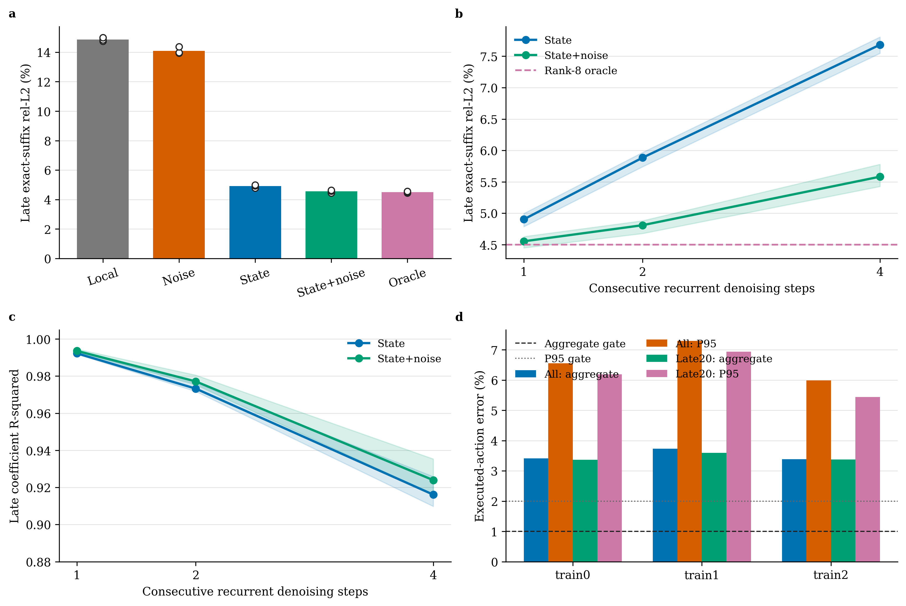
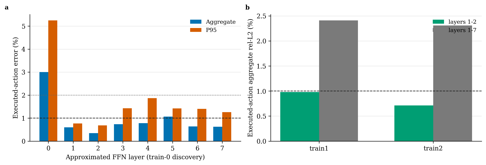

# Transported Quotient Cache: noise bridge、递归状态与真实 sampler 验证

日期：2026-08-26
对象：3 个冻结 PushT Transformer Diffusion Policy checkpoint
状态：B0/B0.5 完成，multi-skip 完成，B1a independent sampler 完成

## 1. 总判决

本轮把此前的 Transported Quotient Cache (TQC) 从 teacher-forced 几何分析推进到了真实 100-step DDPM sampler。最终判决不是简单的成功或失败，而是三个层级：

| 层级 | 结果 | 判决 |
|---|---:|---|
| 物理 horizon transport 后的 conditional innovation | shift/local/state 均有稳定收益 | **机制 PASS** |
| rank-8 coefficient state 连续回灌 1/2/4 步 | 四步仍恢复平均 `93.91%` oracle gap | **递归状态 PASS** |
| 8 层统一 TQC 接入真实 independent-noise DDPM sampler | executed rel-L2 `3.51%`，P95 `6.61%` | **B1a NO-GO** |
| train-0 发现的静态层 `{1,2}` 迁移到 train-1/2 | aggregate 接近门槛，但首动作 P95 `2.92%/2.95%` | **边界，不进闭环** |

最准确的结论是：

> **receding-horizon correspondence 确实把跨控制周期 FFN 差异变成了低维、近马尔可夫的 conditional innovation；但 post-hoc rank-8 状态在单层 exact-suffix 与 teacher-forced latent 上的稳定性，不能直接迁移为多层、闭环 DDPM sampler 的 action fidelity。**

因此当前不能进入 PushT closed-loop non-inferiority，更不能声明加速。TQC 的物理 transport 动机仍成立，但“冻结模型、统一 8 层、免训练 interval-5”这一具体部署方法已被否定。

## 2. 从历史失败到本轮假设

### 2.1 过去失败的是 marginal structure

此前 Wan/视频 DiT 与动作 DiT 上的固定 BCM、BCCB、Butterfly 和 frozen low-rank 主要假设：

\[
h_x\approx Uc_x,
\qquad
A_x\approx \mathcal B(\theta_x).
\]

它们要求不同 prompt、seed、layer、step 或 observation 共享固定 hidden eigenvectors、Fourier basis 或 block topology。已有实验表明这些方向会随内容旋转，因而静态 basis transfer 明显恶化。

TQC 不再压缩 marginal state，而先使用动作控制本身给出的对应关系：

\[
h_{k,n}=P_mh_{k-1,n}+e_{k,n},
\]

其中 `m=8` 是实际 executed action chunk，`P_m` 将上一 control tick 的未来 action token 对齐到当前 tick。真正被建模的是 conditional innovation：

\[
e_{k,n}\approx U_{\ell,b}c_{k,n}.
\]

这对应一个更合理的信息论命题：

\[
H(h_k\mid P_mh_{k-1},o_k,\xi_k)\ll H(h_k),
\]

而不是声称 `h` 本身低秩或循环平稳。

### 2.2 low-rank 的角色发生了变化

本轮 low-rank 不再作为静态权重或 activation 压缩，而作为动态状态：

\[
c_n=A_bc_{n-1}+B_b\Delta\xi+d_b.
\]

这里 `b` 是 layer x timestep bucket，`Delta xi` 是两个 control tick 的已知独立噪声差。该形式与过去的“predictor + innovation + fallback”一致，但节省目标由 bits 变为 conditional compute。

## 3. 实验公平性与边界

### 3.1 固定设置

- 三个独立训练的 PushT Transformer Diffusion Policy EMA checkpoint。
- 模型 action horizon `H=10`，实际 control offset `m=8`，只有 `2/10=20%` token 可 transport。
- 所有 8 个 decoder FFN，rank `8`，5 个 timestep bucket。
- calibration 使用训练 dataset 的 96 个 transition；evaluation 使用独立 validation dataset 的 48 个 transition。
- validation 不参与 basis、ridge map、bucket、schedule、skip 或门槛选择。
- independent-noise full 与 TQC sampler 使用相同 current initial latent 和相同 DDPM scheduler RNG。

`split_indices.json` 中 train/validation 的数值 index 可能相同，但它们属于两个不同 dataset split，不是样本重叠。

### 3.2 三种不同证据不能混用

1. **Exact-suffix**：每次只替换一个 FFN，后续网络精确执行，不更新 sampler latent。
2. **Multi-skip**：coefficient state 连续递归，但每个 target latent 和旧 control cache 仍为 exact teacher path。
3. **B1a sampler**：8 层同时近似，误差经过后续层和 DDPM step 回灌到下一 latent。

前两项是机制测试；只有第三项接近可部署数值语义。

## 4. B0/B0.5: independent-noise bridge

### 4.1 B0 的 late-step 结果

在 independent noise 下，单纯 horizon shift 不能解决噪声错配；但 calibration-only radius-2 local correction 在 final-three flow points 上相对 raw reuse 稳定改善，并通过预注册 `LATE_SHIFT` 边界。

### 4.2 B0.5 消融

三 checkpoint 的 final-three exact-suffix 平均结果：

| 方法 | velocity rel-L2 |
|---|---:|
| shift + local | `14.86%` |
| shift + noise only | `14.10%` |
| shift + previous coefficient state | `4.90%` |
| shift + state + noise | **`4.55%`** |
| calibration-fixed rank-8 oracle | `4.50%` |

noise-only 只恢复 `45.06%-46.53%` 的 shift-to-oracle gap，未达到预注册 `50%`。state+noise 则恢复 `99.55%-99.92%`，三个 checkpoint 均为 `STATE_BRIDGE_BOUNDARY`。

这说明：

- `Delta xi` 不是足够状态，不能从零识别旋转的 coefficient；
- 上一 flow 的 coefficient 才是主状态；
- noise response 的作用主要是修正状态转移，而不是单独预测 innovation。

## 5. Multi-skip: state 是否能开放环递归

### 5.1 预注册测试

从 exact coefficient anchor 出发，held-out evaluation 只允许使用预测 coefficient、已知 `Delta xi` 和 timestep，连续回灌 `1/2/4` 个相邻 scheduler step。bucket 变化只使用 calibration-fixed rank-8 仿射坐标变换。

### 5.2 结果

| 方法 | skip-1 | skip-2 | skip-4 |
|---|---:|---:|---:|
| state exact-suffix rel-L2 | `4.90%` | `5.88%` | `7.68%` |
| state+noise rel-L2 | **`4.55%`** | **`4.81%`** | **`5.58%`** |
| state+noise P95 | `13.20%` | `14.20%` | `17.15%` |
| state+noise late coefficient R2 | `0.994` | `0.977` | `0.924` |
| state+noise oracle-gap recovery | `99.70%` | `98.25%` | `93.91%` |

三个 checkpoint 全部通过 `MULTISKIP_4_STABLE`。四步时 noise 将 total rel-L2 从 `7.68%` 降到 `5.58%`，相对改善约 `27.3%`。

### 5.3 如何正确解释误差累积

直接计算

\[
\gamma_s=\frac{D^{(s)}}{sD^{(1)}}
\]

会得到小于 1 的数值，但这主要因为 `D` 含有约 `4.50%` 的 rank-8 oracle floor。若分析 excess error：

\[
\tilde D^{(s)}=D^{(s)}-D_{oracle},
\]

则递归误差仍会增长。因而本轮证明的是“4 步内没有灾难性发散”，不是严格 contractivity，也不能从 `R2=0.924` 推出 sampler 稳定。

## 6. B1a: 真实 independent-noise DDPM sampler

### 6.1 固定 schedule

- `all_interval5`：全 100 steps 使用 1 次 exact refresh + 最多 4 次 TQC。
- `late20_interval5`：前 80% steps exact，仅最后 20% 使用同一周期。
- 每个 TQC step 同时作用于 8 层 FFN 的 2 个 overlap tokens；其余 8 个 tail tokens exact。
- basis/state map 重新在训练 split 的 full sampler trajectories 上拟合，避免 forward-noising proxy distribution mismatch。

### 6.2 正式结果

三个 checkpoint 平均：

| Schedule | Horizon rel-L2 / P95 | Executed chunk rel-L2 / P95 | First-action P95 |
|---|---:|---:|---:|
| all interval-5 | `4.01% / 7.16%` | `3.51% / 6.61%` | `17.86%` |
| late20 interval-5 | `3.89% / 6.83%` | `3.44% / 6.19%` | `16.94%` |
| 注册门槛 | `<=1% / <=2%` | `<=1% / <=2%` | `<=2%` |

三个 checkpoint 和两个 schedule 全部 `NO_GO`。late20 没有实质性救回 endpoint，说明“noise scale 在晚期下降”不足以抵消最终 step 的高 action leverage 与多层误差反馈。

## 7. 为什么机制测试与 sampler 结果相反

### 7.1 Exact-suffix 没有动力学反馈

单层 probe 近似的是：

\[
\delta y\approx J_{suffix,\ell,n}\delta h_{\ell,n}.
\]

真实 sampler 则满足递推：

\[
\delta x_{n-1}
\approx
D_xS_n\delta x_n
+D_vS_nJ_n\delta h_n,
\]

并在 8 层和多个 timestep 上反复相乘。小的 coefficient error 会改变下一层输入、scheduler state 和下一 timestep 的 coefficient feature，形成 distribution shift。

### 7.2 rank-8 capacity floor 已经太高

即使 oracle，late exact-suffix rel-L2 仍约 `4.50%`。one-step predictor 几乎闭合 oracle，只说明 predictor 不是主要瓶颈；它不能消除 rank-8 basis 外的 residual。多个 layer 同时近似时，这个 floor 会组合。

### 7.3 第一个执行动作具有更高杠杆

完整 action chunk 的平均误差会稀释控制相关风险。B1a 中 executed aggregate 约 `3.5%`，但 first-action P95 达 `17%-20%`。这验证了此前 functional quotient 的核心提醒：真正目标应偏重 executed prefix，特别是第一个动作，而不是 uniform hidden MSE。

### 7.4 单层安全不具有可加性

train-0 attribution：

- layer 0 单独近似即产生 executed rel-L2 `3.00%`、P95 `5.25%`、first-action P95 `14.37%`；
- layer 1 和 2 单独满足 `1%/2%`；
- 其他层大多 aggregate 较低，但 first-action tail 更重。

冻结 train-0 发现的 `{1,2}` 后，在 train-1/2 上：

| Static set | train-1 executed rel-L2 / P95 | train-2 executed rel-L2 / P95 | First-action P95 |
|---|---:|---:|---:|
| layers 1-2 | `0.98% / 1.26%` | `0.71% / 1.31%` | `2.92% / 2.95%` |
| layers 1-7 | `2.41% / 5.07%` | `2.31% / 4.27%` | `13.83% / 11.56%` |

`{1,2}` aggregate 接近通过，但首动作仍失败；`{1,...,7}` 说明 layer 0 是主要瓶颈却不是唯一瓶颈。不能把逐层安全证书简单取并集。

## 8. 与相关工作的边界

| 工作 | 主要机制 | 与 TQC 的关系 |
|---|---|---|
| [Diffusion Policy](https://arxiv.org/abs/2303.04137) | receding-horizon action diffusion | 提供真实 action correspondence `P_m` |
| [RTI-DP](https://arxiv.org/abs/2508.05396) | 上一控制解 warm start，给出局部 contractivity 条件 | 已覆盖 previous-solution reuse；TQC 不能主张首次利用时序连续性 |
| [Falcon](https://arxiv.org/abs/2503.00339) | 复用部分去噪历史动作，training-free，报告 2-7x | 复用 sampler latent；TQC 复用内部 layer state |
| [Action-to-Action Flow Matching](https://arxiv.org/abs/2602.07322) | 将 previous proprioceptive action 作为 flow source，可单步生成 | 训练原生 transport source，比 post-hoc cache 更强 |
| [SAG](https://arxiv.org/abs/2601.12894) / [Test-time Sparsity](https://arxiv.org/abs/2605.13316) / [EVO](https://arxiv.org/abs/2607.20293) | layer-step reuse、动态来源选择、schedule 搜索 | cache schedule 与 past-rollout reuse 已拥挤，不是 TQC 创新点 |

TQC 尚有辨识度的核心只有：

\[
\boxed{
\text{internal state}
\xrightarrow{\text{action-semantic }P_m}
\text{conditional innovation}
\xrightarrow{\text{low-dimensional state}}
\text{selective recomputation}
}
\]

本轮证明了前两段的机制，但没有证明最后能在 PushT sampler 中保持 action fidelity。

## 9. 系统价值与停止条件

PushT 中 overlap 只有 `20%`。即使 8 层都在 80% denoising steps 免费复用，系统空间仍很小；当前 correction 算术约为被替换 `linear2` 的 `0.84%`，但 gather、state、hook/fusion 和 exact tail 会继续降低收益。

静态 `{1,2}` 即使质量通过，也只覆盖四分之一层，理想 denoiser 收益约为百分之几，没有 kernel 投资价值。

因此本轮停止：

- 不运行 PushT closed-loop 200-seed non-inferiority；
- 不实现 PushT fused kernel；
- 不把 aligned noise 的边际 Gaussian 性误写为闭环 policy 不变；
- 不继续增加固定 BCM/BCCB/Butterfly basis；
- 不用 validation layer sweep 训练或选择后再回报同一 endpoint。

## 10. 仍有潜力的下一路线

### 10.1 若坚持免训练

最合理的结论是 distribution-preserving、统一 post-hoc TQC 已失败。只剩非常窄的候选：

- layer 0 永远 exact；
- 仅对 calibration-certified layer-step 使用 TQC；
- certificate 直接优化 first executed action risk；
- 只在长 horizon、短 execution chunk 的模型上验证。

但 PushT 的 Amdahl 上限太低，不建议继续。

### 10.2 若允许低成本训练

训练目标必须从 teacher-forced coefficient MSE 改为 approximate sampler rollout：

\[
\min_\theta
\sum_n
\left\|
G_{prefix}^{1/2}
\left(a^{full}_{0:m}-a^{TQC}_{0:m}\right)
\right\|^2
+\lambda C.
\]

建议只训练：

1. state transition `A/B` 与 layer-step gate；
2. first-action-weighted basis；
3. shared exact-refresh ratio；
4. scheduled-sampling 下的 1/2/4-step state dynamics。

原 QKV/FFN 权重保持冻结。必须与 RTI-DP、Falcon、A2A 和普通 learned cache 做同成本比较，否则“怎样叠加”没有独立贡献。

### 10.3 真正值得转移的系统对象

[OpenPI](https://github.com/Physical-Intelligence/openpi) 的 pi0 默认 action horizon 更长，官方实现使用 10 个 flow steps，且部署 chunk 可明显小于 horizon。对 `H=50,m=10`，nominal overlap 可达 80%，更适合检验：

\[
S_{max}\simeq
\frac{1}{1-f\alpha\beta(1-r)}.
\]

下一项高价值实验应是：在 pi0 action suffix/expert 上先 profile `alpha x beta`，再复现本轮 B0.5 -> multi-skip -> common-random-number sampler gate。若 sampler endpoint 仍失败，则终止 post-hoc TQC；若通过，才进入实际机器人任务和 kernel。

## 11. 可视化

## 12. 可复现材料

- 冻结协议：`protocols/action_dit_noise_response_bridge_20260826.md`
- B0.5 实现：`scripts/probe_action_dit_noise_response_bridge.py`
- multi-skip 实现：`scripts/probe_action_dit_multiskip_state.py`
- B1a sampler 实现：`scripts/probe_action_dit_independent_sampler.py`
- 核心模块：`src/action_dit_transport_cache.py`
- 测试：`tests/test_action_dit_noise_response_bridge.py`
- B0.5 原始结果：`results/action_dit_noise_response_bridge_20260826/`
- multi-skip 原始结果：`results/action_dit_multiskip_state_20260826/`
- sampler 正式结果：`results/action_dit_independent_sampler_20260826/`
- layer attribution：`results/action_dit_independent_sampler_layer_sweep_20260826/`
- subset transfer：`results/action_dit_independent_sampler_subset_transfer_20260826/`
- 绘图脚本：`figures/action_dit_tqc_gates_plot.py`
- 绑定数据：`figures/action_dit_tqc_gate_summary.csv`、`figures/action_dit_tqc_layer_attribution.csv`
- 图：`figures/action_dit_tqc_gates.{png,pdf,svg}`、`figures/action_dit_tqc_layer_attribution.{png,pdf,svg}`
