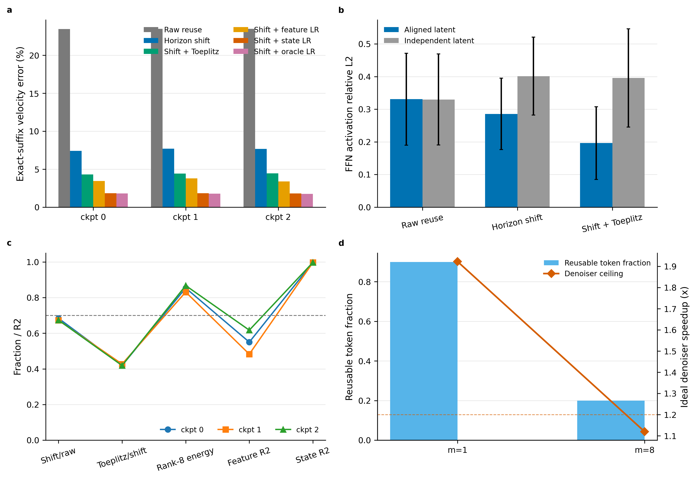
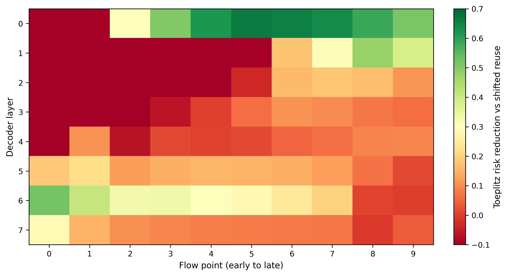

# Transported Quotient Cache：机制验证、边界与下一阶段方案

日期：2026-08-26
实验对象：3 个冻结 PushT Transformer Diffusion Policy checkpoint
状态：**机制部分成立，系统结论为 BOUNDARY**

## 1. 总判决

附件提出的核心修正是合理的：此前不应继续寻找一个跨样本共享的静态 BCM/BCCB 或低秩结构去近似完整状态，而应利用控制轨迹的条件结构，近似跨控制周期和去噪步的 **innovation**：

\[
H(h_k)\ \text{可以很高},\qquad
H(h_k\mid h_{k-1},o_k,a_{k-1})\ \text{可以很低}.
\]

本轮结果同时给出强正证据和一个决定性的必要条件：

| 问题 | 三 checkpoint 的结果 | 判决 |
|---|---:|---|
| horizon shift 是否优于等预算 raw reuse | velocity risk 平均降低 **67.66%** | PASS |
| shift 后的局部 correction 是否有增益 | radius-2 correction 再降低 **42.16%** | PASS |
| innovation 是否存在低维容量 | rank-8 held-out energy 平均 **85.07%** | PASS |
| cheap feature 能否稳定产生低秩系数 | 平均 \(R^2=0.550\)，个别 layer-step 为负 | BOUNDARY |
| 前一 flow-step 系数是否有状态连续性 | 一步 coefficient-state \(R^2=0.9971\) | 强正信号，但仍是 ceiling |
| 实际 PushT 执行偏移 \(m=8\) 是否有足够重叠 | 只复用 2/10 tokens，理想 denoiser 上限 **1.119x** | 系统 NO-GO/BOUNDARY |
| 独立当前噪声下 shift 是否仍成立 | shift/Toeplitz 明显恶化 | 必要条件 FAIL |

因此，当前最准确的结论是：

> **Receding-horizon transport 能显著降低跨控制周期 cache error；innovation 也具有很强的低维状态连续性。但该机制只在跨周期 latent/noise 对应被保留时成立，且 PushT 的实际执行偏移只留下 20% overlap，尚不足以支持部署或明显加速。**

这不是一个无效结果。它将下一步从宽泛的五状态调度器收紧为两个可验证问题：

1. 实际 sampler 能否安全地保持 overlapping action tokens 的 latent correspondence，并在连续跳过时维持稳定；
2. 在具有更长 action horizon 或更短执行 chunk 的策略上，transport overlap 是否足以兑现系统收益。

## 2. 为什么这一方向不同于此前失败方案

### 2.1 过去失败的是无条件静态结构

此前 Wan、Action-DiT 和矩阵拟合实验反复否定了以下强假设：

\[
h_x\approx Uc_x,
\qquad
A_x\approx F^H\operatorname{diag}(\lambda_x)F,
\]

其中 basis、Fourier eigenvectors 或 block topology 跨 prompt、seed、step 和内容固定。主要失败原因包括：

- BCM/BCCB 的固定 Fourier 特征向量与内容相关 attention/defect 的动态特征向量不匹配；
- hidden channel 没有天然循环邻接，固定 block/FFT 只提供参数结构，不提供正确语义；
- post-hoc low-rank 的容量可以较高，但 held-out coefficient observability 与 sampler stability 不稳定；
- 局部 hidden-state MSE 与最终 action/video endpoint 风险不一致；
- 增加 BCM block、rank 或后验动态 payload 容易提高 oracle，却不能形成低成本可部署算子。

### 2.2 本轮拟合的是 transport 后的条件 innovation

令 \(k\) 为控制周期，\(n\) 为 diffusion/flow step，\(j\) 为 action horizon 位置。执行前 \(m\) 个动作后，物理对应关系是：

\[
a_{k+1,j}\approx a_{k,j+m},
\qquad j=0,\ldots,H-m-1.
\]

定义非周期 shift \(P_m\)，本轮测试：

\[
r_{\ell,n,k}
=P_m r_{\ell,\nu(n),k-1}+e_{\ell,n,k}.
\]

结构化算子不再承担完整状态，而只修复 innovation：

\[
\hat e_{\ell,n,k}
=T_{\ell,b}\Delta x_{\ell,n,k}
+U_{\ell,b}c_{\ell,n,k}.
\]

因此固定状态高秩与条件 innovation 低维并不矛盾。这个建模对象的改变，是本轮成功而此前静态 BCM/low-rank 经常失败的主要原因。

## 3. 理论模型

### 3.1 三个时间轴

Action DiT 的可复用结构不是视频 \(T\times H\times W\) 网格，而是：

\[
(\tau_{\mathrm{flow}},k_{\mathrm{control}},j_{\mathrm{horizon}}).
\]

- flow time 决定相邻 denoising state 的连续性；
- control time 决定 observation 更新、闭环分布漂移和历史 cache；
- horizon position 决定 receding-horizon shift 和新 tail。

一个最小的 Transported Quotient Cache 可写为：

\[
\hat h_{\ell,n,k}
=P_{m_k}h^{\mathrm{cache}}_{\ell,\nu(n),k-1}
+T_{\ell,b}\phi_{\ell,n,k}
+U_{\ell,b}c_{\ell,n,k}.
\]

这里 \(P_m\) 是物理索引对齐，\(T\) 是局部 depthwise transport，\(U c\) 是全局低维 tail。BCM/BCCB 若保留，也只能作为 \(T\) 中少量局部专家，而不是主路径。

### 3.2 Action-visible 风险

隐藏层 Frobenius error 不是最终目标。局部误差 \(e\) 对动作 endpoint 的二阶代理为：

\[
D_{\ell,n}(e)
=e^\top M_{\ell,n}e,
\]

\[
M_{\ell,n}
=J_{\ell\rightarrow v}^\top
\Phi_{N,n}^\top G\Phi_{N,n}
J_{\ell\rightarrow v}.
\]

本轮没有显式构造 Hessian/GGN；采用“单模块近似、完整下游 suffix 精确执行后的 velocity-output error”作为有限扰动代理。它比 hidden MSE 更接近 action quotient，同时不应被误写成严格闭环 control risk。

一个有意义的完整优化目标应是：

\[
\min_\pi\ \mathbb E\sum_{\ell,n,k}
\left[D_{\ell,n,k}(u_{\ell,n,k})
+\lambda C_{\mathrm{device}}(u_{\ell,n,k})\right],
\]

其中动作集合以后才可能扩展为 reuse、reuse+transport、W4/W8/BF16 refresh。当前实验只验证 reuse 与 correction 的必要机制，尚未授权联合 scheduler。

### 3.3 latent correspondence 是必要条件

本轮 aligned 设置令物理重叠 token 共享其 latent noise：

\[
\xi_{k+1,0:H-m}=\xi_{k,m:H}.
\]

每个 token 的边际噪声仍是标准 Gaussian，但跨控制周期的 coupling 被改变。这样做对 teacher-forced capacity probe 合法，却不等价于现有 sampler 的默认行为。若新周期重新采独立噪声，cache innovation 同时包含：

\[
e=e_{\mathrm{physical}}+e_{\mathrm{observation}}+e_{\mathrm{noise}},
\]

其中 \(e_{\mathrm{noise}}\) 足以淹没 transport 结构。本轮 negative control 正好验证了这一点。

### 3.4 算力上限

若被测试 decoder FFN 占 denoiser MAC 比例约 \(f_{\mathrm{FFN}}=0.5331\)，只复用 \((H-m)/H\)，则忽略 correction、routing 和 kernel overhead 的上限为：

\[
S_{\max}
=\frac{1}
{1-f_{\mathrm{FFN}}(H-m)/H}.
\]

- \(m=8,H=10\)：\(S_{\max}=1.119\times\)；
- \(m=1,H=10\)：\(S_{\max}=1.922\times\)。

这解释了为何统计机制在 \(m=8\) 很强，系统判决仍只能是 BOUNDARY。真实小序列 gather/scatter 和额外 correction kernel 只会进一步降低收益。

## 4. 实验协议

完整冻结协议见 `protocols/action_dit_transport_cache_geometry_20260826.md`。

| 项目 | 设置 |
|---|---|
| 模型 | 3 个独立训练的 PushT Transformer Diffusion Policy checkpoint |
| 目标模块 | 8 个 decoder FFN 的 `linear2` residual |
| 数据 | train episodes 拟合，validation episodes 评估 |
| 样本 | calibration 96 transitions，evaluation 48 transitions |
| flow | 100-step schedule 中固定 10 个位置，另取前一相邻 flow step |
| 控制偏移 | \(m=8\) 为实际设置；\(m=1\) 仅作频繁重规划诊断 |
| 干预 | 每次只替换一个 FFN；上下游和完整 suffix 精确计算 |
| 新 tail | 始终保留当前周期的精确 FFN 输出 |
| 主指标 | exact-suffix velocity aggregate relative L2、mean、P95 |
| 负对照 | 当前周期使用独立 latent noise |

对比方法包括 raw reuse、horizon-shift reuse、shift+radius-2 temporal correction、circular control、rank-8 feature predictor、rank-8 prior-flow state、rank-8 held-out oracle，以及同控制周期的 flow-cache 基线。

## 5. 主要结果

### 5.1 实际 PushT 控制偏移 \(m=8\)

以下为三个 checkpoint 的均值：

| 方法 | exact-suffix velocity rel-L2 | P95 |
|---|---:|---:|
| raw cross-tick reuse | 23.48% | 68.85% |
| horizon-shift reuse | 7.59% | 19.21% |
| shift + radius-2 correction | 4.39% | 14.03% |
| shift + rank-8 feature | 3.53% | 11.38% |
| shift + rank-8 prior-flow state | 1.82% | 6.44% |
| shift + rank-8 held-out oracle | 1.78% | 6.21% |
| same-tick flow reuse | 2.96% | 6.99% |
| same-tick flow + radius-2 correction | 1.80% | 4.26% |
| same-tick flow rank-8 hidden oracle | 2.41% | 5.58% |

三 checkpoint 的机制统计：

| checkpoint | shift/raw 改善 | correction/shift 改善 | rank-8 energy | feature \(R^2\) | prior-flow \(R^2\) |
|---:|---:|---:|---:|---:|---:|
| train-0 | 68.38% | 41.92% | 85.35% | 0.550 | 0.9970 |
| train-1 | 67.24% | 42.70% | 83.09% | 0.483 | 0.9967 |
| train-2 | 67.36% | 41.87% | 86.75% | 0.617 | 0.9975 |

结论有三点：

1. shift 的价值不是小幅正则，而是将 raw risk 降低约三分之二；
2. 结构化 innovation correction 在 shift 之后仍有稳定增益；
3. 低秩主要瓶颈已经从 basis capacity 转成 coefficient observability。

### 5.2 \(m=1\) 频繁重规划诊断

| 方法 | exact-suffix velocity rel-L2 | P95 |
|---|---:|---:|
| raw reuse | 46.69% | 135.41% |
| shift reuse | 2.83% | 7.42% |
| shift + radius-2 correction | 1.94% | 6.04% |
| shift + rank-8 feature | 1.71% | 5.54% |
| shift + rank-8 prior-flow state | 1.13% | 3.91% |
| shift + rank-8 oracle | 1.12% | 3.88% |

频繁重规划显著增加 overlap，并把理想 denoiser ceiling 提升到 1.922x，但 rank-8 平均 energy 降到 70.20%，train-1 仅 67.81%。因此它说明 transport 可能有系统价值，却不能替代实际 \(m=8\) 的判决。

### 5.3 决定性的独立噪声负对照

以下是跨 checkpoint、layer 和 flow cell 的 activation mean relative L2：

| \(m\) | 噪声对应 | raw reuse | shift reuse | shift+correction | shift+feature LR |
|---:|---|---:|---:|---:|---:|
| 8 | aligned | 33.05% | 28.56% | 19.61% | 15.82% |
| 8 | independent | 32.96% | 40.13% | 39.57% | 76.21% |
| 1 | aligned | 60.27% | 10.20% | 8.48% | 7.05% |
| 1 | independent | 59.70% | 60.98% | 67.08% | 122.73% |

这说明 shift 并不是一个可直接插入默认 stochastic sampler 的通用技巧。它依赖 overlapping token 的 latent correspondence、warm start 或等价的耦合采样设计。任何后续工作若忽略这一点，会把 teacher-forced 几何容量误写成真实 rollout 收益。

### 5.4 layer-step 异质性

平均 rank-8 energy 很高，但单个 cell 的最低值在 \(m=8\) 只有约 0.48，feature coefficient \(R^2\) 还会降到负值；prior-flow state 的 cell 最低 \(R^2\) 仍约 0.95。由此可得：

- 统一 all-layer cache 不安全；
- calibration-only layer×step certificate 是必要的；
- cheap current feature 还不足以做通用 coefficient predictor；
- coefficient temporal state 比从零回归更有希望；
- 后续必须测试连续 skip 的开放环漂移，而非只测试一步 oracle state。

### 5.5 Toeplitz 结论必须收窄

在 \(m=8\) 下只复用 2 个 token，新 tail 又保持精确，所以 periodic circular 与 non-periodic Toeplitz 数值完全相同；该设置无法支持“非周期边界显著更优”的论文结论。\(m=1\) 下 circular 还略优于 Toeplitz，但差异极小。

当前真正被支持的是：

> **局部 depthwise temporal transport 能修复一部分 innovation；尚未证明 Toeplitz 边界条件本身具有独特优势。**

## 6. 与相关工作的边界

| 工作 | 已覆盖内容 | 本方向必须新增的内容 |
|---|---|---|
| [Diffusion Policy](https://arxiv.org/abs/2303.04137) | receding-horizon action diffusion | 内部计算状态的 horizon-aligned transport |
| [Sparse ActionGen](https://arxiv.org/abs/2601.12894) | observation-conditioned prune-then-reuse，跨 step/block cache | 明确保持 token 物理对应的 shift 与 innovation correction |
| [Test-time Sparsity](https://arxiv.org/abs/2605.13316) | current forward、denoising history、past rollout 的动态 reuse，报告 5x | equal-cost raw-vs-shift、latent alignment、quotient-risk invalidation |
| [EVO](https://arxiv.org/abs/2607.20293) | training-free block×timestep cache schedule 搜索，最高 8.05x | transport 后的 cache state，而不是只优化 refresh schedule |
| [Omega-QVLA](https://arxiv.org/abs/2605.28803) | 整个 action head 的 training-free W4A4 | cache lifetime-conditioned precision 必须胜过 uniform W4A4 |
| [6Bit-Diffusion](https://arxiv.org/abs/2603.18742) | mixed NVFP4/INT8 与 temporal delta cache，1.92x 端到端 | control-visible reuse amplification 和 precision-on-refresh |
| [RIFT](https://arxiv.org/abs/2608.11521) | 一次产生 WAM future K/V，LIBERO 98.8%，显著降 latency | 若转 WAM，应压缩 action-visible future cache，而非 action head |

官方 Test-time Sparsity 实现中的 past-rollout path 直接把 cached rollout residual 加回当前状态，没有 horizon-token shift：<https://github.com/ky-ji/Test-time-Sparsity/blob/main/TTSInfer/acceleration/rollout/pruner_warpper_test_stream.py>。因此“跨 rollout cache”本身不新，但 **latent-correspondence-preserving horizon shift** 是一个可继续审计的窄差异。

不能主张的内容：

- 首次把 cache 用于 Action DiT；
- 首次联合 cache 与 quantization；
- 首次使用 receding horizon；
- 已经优于 SAG/TTS/EVO；
- 已经获得真实 GPU 或闭环加速。

当前可以主张的实验事实只有：在该冻结 PushT teacher-forced 机制测试中，equal-budget horizon shift 显著降低跨控制周期 FFN cache risk；该效果依赖 latent correspondence，且 innovation coefficient 具有很强的一步 flow-state连续性。

## 7. 为什么 hidden oracle 不等于 endpoint 最优

同控制周期下，flow Toeplitz 的 suffix risk 为 1.80%，低于 hidden-space rank-8 oracle 的 2.41%。这并不违反 SVD 最优性，因为 SVD 优化的是 hidden Frobenius norm：

\[
\min_{\operatorname{rank}(L)\le r}\|e-L\|_F^2,
\]

而 endpoint 关心的是：

\[
\min_L(e-L)^\top M(e-L).
\]

两者只有在 \(M\propto I\) 时等价。该结果进一步支持 FlowQuotient 的作用：不是再叠加一个模块，而是用 action-visible metric 决定 basis、refresh 和 precision。

## 8. 下一阶段详细方案

### Gate B1：sampler correspondence 与开放环稳定性

目标：先确认 aligned teacher-forced 机制能否进入真实 sampler，不改变 cache schedule。

固定比较：

| 方法 | 说明 |
|---|---|
| exact BF16 | reference |
| raw past-rollout cache | TTS-style baseline |
| horizon-shift cache | 仅对齐，不 correction |
| shift + radius-2 correction | 最小结构化候选 |
| shift + coefficient-state rank-8 | 只在可因果构造 prior coefficient 时运行 |

必须同时测试：

- 默认独立初始 noise；
- overlap-aligned noise，但新 tail 独立采样；
- previous-solution warm start；
- 连续跳过长度 1/2/4；
- 每次 refresh 后重新建立 cache 和 coefficient state；
- \(m=8\) 主设置与 \(m=1\) 诊断分开报告。

停止条件：若 aligned/warm-start sampler 相对 exact policy 在完整 rollout 中不能维持 paired non-inferiority，或者连续 skip 使 state 方法超过 oracle gap 的 20%，停止 TQC，不训练 scheduler。

### Gate B2：calibration-only certificate

只允许在 train episodes 上选择 layer×flow step：

\[
\mathcal C_{\ell,n}=1
\iff
\widehat D_{\ell,n}^{P95}\le\tau.
\]

validation/test 不允许调整阈值、basis、step 或 layer。建议首先使用静态 certificate，而不是动态 router，以便区分 transport 机制和调度收益。局部进入门槛建议为 aggregate velocity rel-L2 \(\le1\%\)、P95 \(\le2\%\)。

### Gate B3：闭环环境与 action endpoint

在 PushT 环境对相同 episode seed 做 paired rollout，报告：

- mean/max task score 与 success；
- action-chunk relative L2 和首个执行动作误差；
- trajectory endpoint displacement；
- cache fallback 率与连续 reuse length；
- 每个 layer×step 的使用频率；
- failure case 与独立噪声对照。

只有闭环 non-inferiority 成立，才允许进入 quantization 或 latency 实验。

### Gate C：precision-on-refresh

固定完全相同的 cache schedule，依次比较 BF16、W8、W4 refresh 和 cache storage precision。不能同时更改 scheduler。风险模型应显式包含 anchor 的预计 reuse lifetime：

\[
D_p^Q=(e_p^Q)^\top K_p^\top G K_p e_p^Q,
\qquad
K_p=\sum_{n\in\mathcal R(p)}\Phi_{N,n}J_nA_{n,p}.
\]

只有 joint frontier 在相同 schedule 和真实设备成本下严格支配 uniform W4A4 与 BF16 cache，才支持 cache-lifetime-conditioned precision 的创新主张。

### Gate D：系统兑现与模型扩展

- 在 A800/H200 分别测完整 predictor，包括 shift、state update、gather/scatter 和 fallback；
- 先要求 whole-block 至少 1.5x，再看 denoiser 和闭环 wall-clock；
- PushT \(m=8\) 的理论上限已经过低，不应投入复杂 fused kernel；
- 优先复制到 action horizon 更长、执行 chunk 更短的策略；OpenPI 的默认 `action_horizon=50`，但实际执行 chunk 由 client/broker 配置决定，不能假设固定 overlap：<https://github.com/Physical-Intelligence/openpi/blob/main/src/openpi/models/pi0_config.py>；
- 对 pi0/flow model 必须复现实际 10-step sampler、noise injection 和 deployment broker，而不是沿用 PushT 的 100-step假设：<https://github.com/Physical-Intelligence/openpi/blob/main/src/openpi/models/pi0.py>。

## 9. 论文定位与创新性判断

当前结果不足以支撑“Control-Quotient Adaptive Compute”完整系统。这个名称覆盖 cache、quantization、NFE 和调度，若没有完整 rollout 与 device frontier，会显得过宽且增量拼接。

更稳妥的当前方法定位是：

> **Transported Quotient Cache：对 receding-horizon action diffusion 的跨控制周期缓存先做物理 token transport，再仅修复 action-visible conditional innovation；缓存是否刷新以及 refresh precision 由未来复用放大的 control risk 决定。**

其中已经有证据的创新核只有第一半：physical transport + innovation geometry。Quotient-risk invalidation、lifetime precision 和统一 scheduler 仍是待验证假设。

论文潜力取决于三个条件同时成立：

1. 在真实 sampler 和闭环环境中，aligned/warm-start transport 保持任务质量；
2. 在更长 horizon 策略中，实际 overlap 足以使 whole-block 和端到端收益明显；
3. 相同 schedule/cost 下，transport+quotient certificate 严格优于 raw rollout cache，并能与 SAG/TTS/EVO 做公平比较。

若 Gate B1 失败，应保留本轮为高质量负结果：teacher-forced conditional innovation 可压缩，但默认 sampler 的随机耦合破坏可部署性。若 Gate B1 通过而 PushT speed ceiling 仍低，应停止在 PushT 做 kernel，直接转向长 horizon action DiT。若 action-DiT 系统上限仍低，WAM 更值得测试的是 RIFT 类 future-KV 的 action-visible quotient compression，而不是继续压缩 action head。

## 10. 可视化与复现

关键文件：

- 协议：`protocols/action_dit_transport_cache_geometry_20260826.md`
- 核心实现：`src/action_dit_transport_cache.py`
- 执行脚本：`scripts/probe_action_dit_transport_cache.py`
- 远端启动：`scripts/run_action_dit_transport_cache_remote.sh`
- 测试：`tests/test_action_dit_transport_cache.py`
- 原始结果：`results/action_dit_transport_cache_20260826/`
- 绘图脚本：`figures/action_dit_transport_cache_plot.py`
- 绑定数据：`figures/action_dit_transport_cache_*.csv`
- PNG/PDF/SVG：`figures/action_dit_transport_cache_summary.*`、`figures/action_dit_transport_cache_layer_step.*`

运行环境：Python 3.9.23、NumPy 1.23.3、PyTorch 2.5.1.post303、NVIDIA A800 80GB PCIe。三 checkpoint 的 \(m=1/m=8\) 共六个任务全部完成，无 traceback。单元测试覆盖 shift、equal-budget reuse、Toeplitz/circular、低秩拟合和 coefficient state；结果仅声明冻结机制，不声明环境质量或 GPU speedup。
