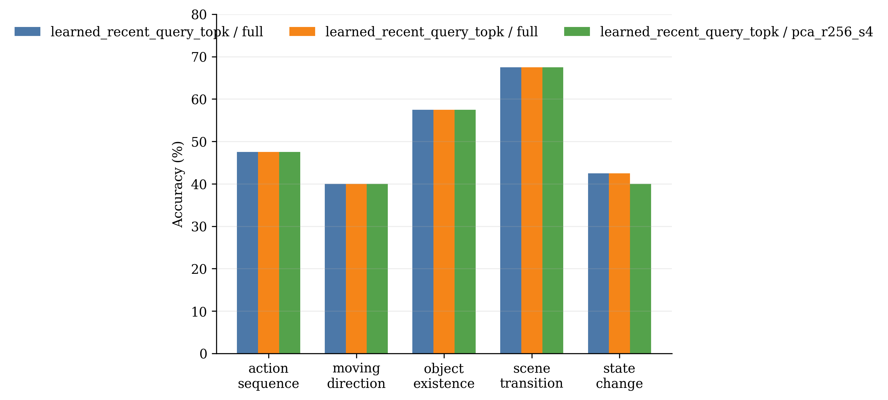
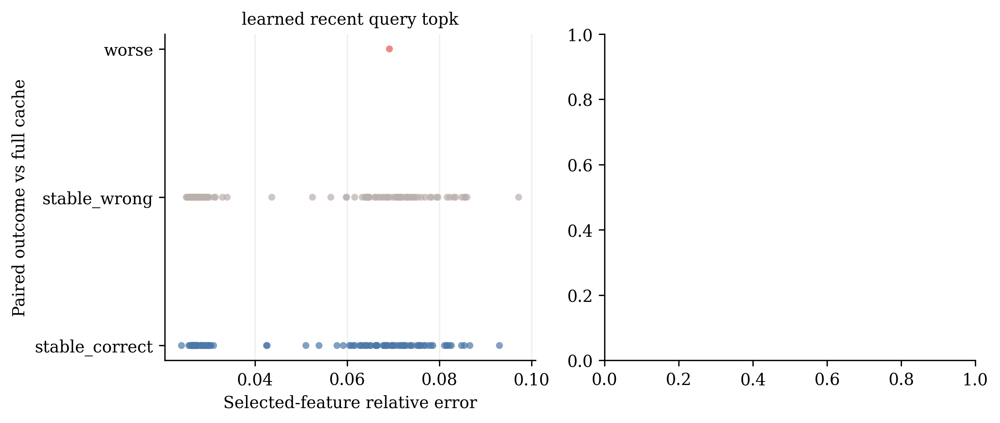

# Compressed Memory Loss Probe

## Stage Attribution

- `learned_recent_query_topk` with `full`: 102/200 (51.0%).
- `learned_recent_query_topk` with `full`: 102/200 (51.0%), net +0 samples.
- `learned_recent_query_topk` with `pca_r256_s4`: 101/200 (50.5%), net -1 sample versus `full`.

The candidate selector changes net correctness by +0 samples at the reference variant. Changing memory from `full` to `pca_r256_s4` changes it by -1 samples. These are descriptive stage deltas, not causal attribution.

## Compression Loss Events

- `state_change_0157` (state_change): yes -> no; answer `yes`, selected error 0.0692.

## Reconstruction Error Diagnostic

- AUC for predicting any answer change: 0.808.
- AUC for predicting a correctness loss: 0.663.

These AUCs are descriptive because answer changes and losses are rare. They test whether global reconstruction error is a useful allocation score; they do not establish causality.

