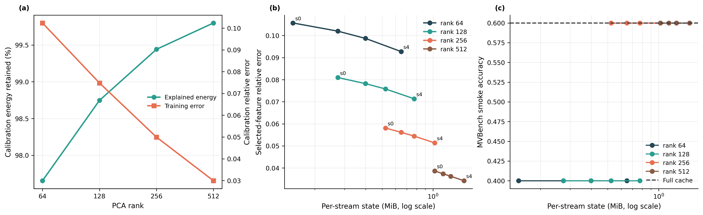

# Feature Codec Rank-Sweep Gate

- This is a five-sample-per-policy execution and configuration gate, not an inferential experiment.
- Full-cache smoke accuracy: 60.0%.

## Calibration Fit

| Rank | Energy retained | Training error | Codec MiB |
|---:|---:|---:|---:|
| 64 | 97.65% | 0.1024 | 0.508 |
| 128 | 98.75% | 0.0748 | 1.008 |
| 256 | 99.44% | 0.0499 | 2.008 |
| 512 | 99.80% | 0.0299 | 4.008 |

## Selection Decision

- Lowest steady-state configuration matching full-cache smoke accuracy: `pca_r256_s0` at 0.524 MiB per stream.
- Rank 64 and 128 changed the same scene-transition answer; rank 256 and 512 matched the full cache in this gate.
- Formal confirmation must use the frozen evaluation split and paired prediction statistics.

