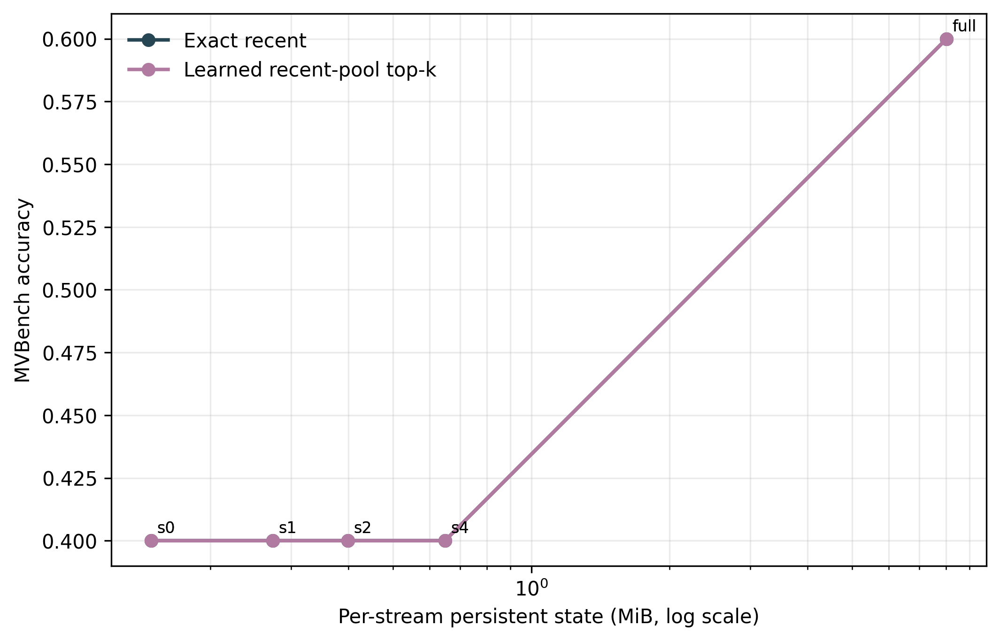
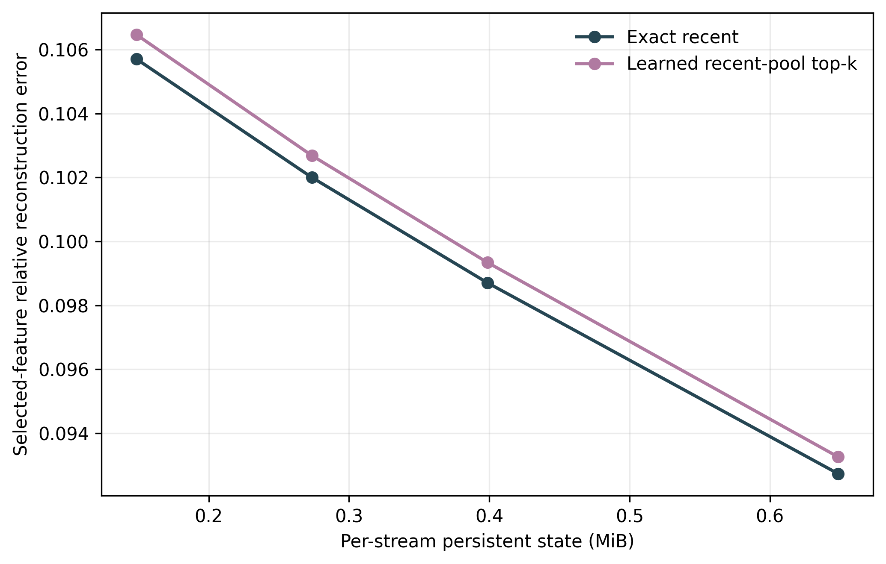

# Compressed Native Feature-Memory Analysis

- Completed checkpoints: 5.
- Configuration fingerprints: 1.

## Variant Summary

| Selector | Memory | Accuracy | Steady-state MiB | Cold-start MiB | Compression | Selected error |
|---|---|---:|---:|---:|---:|---:|
| Exact recent | full | 60.00% | 8.024 | 8.024 | 1.00x | 0.0000 |
| Exact recent | pca_r64_s0 | 40.00% | 0.149 | 0.656 | 54.00x | 0.1057 |
| Exact recent | pca_r64_s1 | 40.00% | 0.274 | 0.781 | 29.33x | 0.1020 |
| Exact recent | pca_r64_s2 | 40.00% | 0.399 | 0.906 | 20.13x | 0.0987 |
| Exact recent | pca_r64_s4 | 40.00% | 0.649 | 1.157 | 12.37x | 0.0927 |
| Learned recent-pool top-k | full | 60.00% | 8.024 | 8.024 | 1.00x | 0.0000 |
| Learned recent-pool top-k | pca_r64_s0 | 40.00% | 0.149 | 0.656 | 54.00x | 0.1065 |
| Learned recent-pool top-k | pca_r64_s1 | 40.00% | 0.274 | 0.781 | 29.33x | 0.1027 |
| Learned recent-pool top-k | pca_r64_s2 | 40.00% | 0.399 | 0.906 | 20.13x | 0.0993 |
| Learned recent-pool top-k | pca_r64_s4 | 40.00% | 0.649 | 1.157 | 12.37x | 0.0933 |

## Paired Accuracy Versus Full Cache

| Selector | Memory | Gain | 95% CI | Better / worse |
|---|---|---:|---:|---:|
| Exact recent | pca_r64_s0 | -20.00% | [-60.00%, +0.00%] | 0 / 1 |
| Exact recent | pca_r64_s1 | -20.00% | [-60.00%, +0.00%] | 0 / 1 |
| Exact recent | pca_r64_s2 | -20.00% | [-60.00%, +0.00%] | 0 / 1 |
| Exact recent | pca_r64_s4 | -20.00% | [-60.00%, +0.00%] | 0 / 1 |
| Learned recent-pool top-k | pca_r64_s0 | -20.00% | [-60.00%, +0.00%] | 0 / 1 |
| Learned recent-pool top-k | pca_r64_s1 | -20.00% | [-60.00%, +0.00%] | 0 / 1 |
| Learned recent-pool top-k | pca_r64_s2 | -20.00% | [-60.00%, +0.00%] | 0 / 1 |
| Learned recent-pool top-k | pca_r64_s4 | -20.00% | [-60.00%, +0.00%] | 0 / 1 |

## Claim Boundary

- PCA and sparse residual coding are established compression tools. This experiment tests task preservation and systems trade-offs, not mathematical novelty.
- Shared codec parameters and per-stream state are reported separately. Cold-start state includes the shared codec for compressed variants; steady-state state does not amortize it into every stream.
- A lower reconstruction error is not sufficient; promotion requires preserving full-cache LLaVA accuracy.

## Figures

