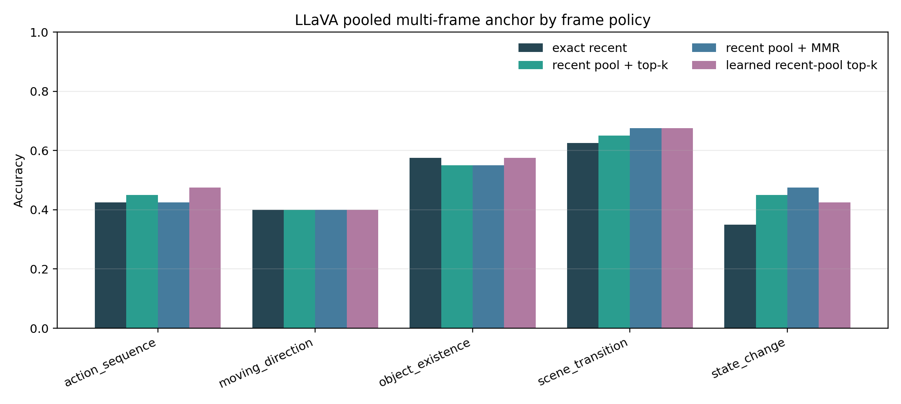
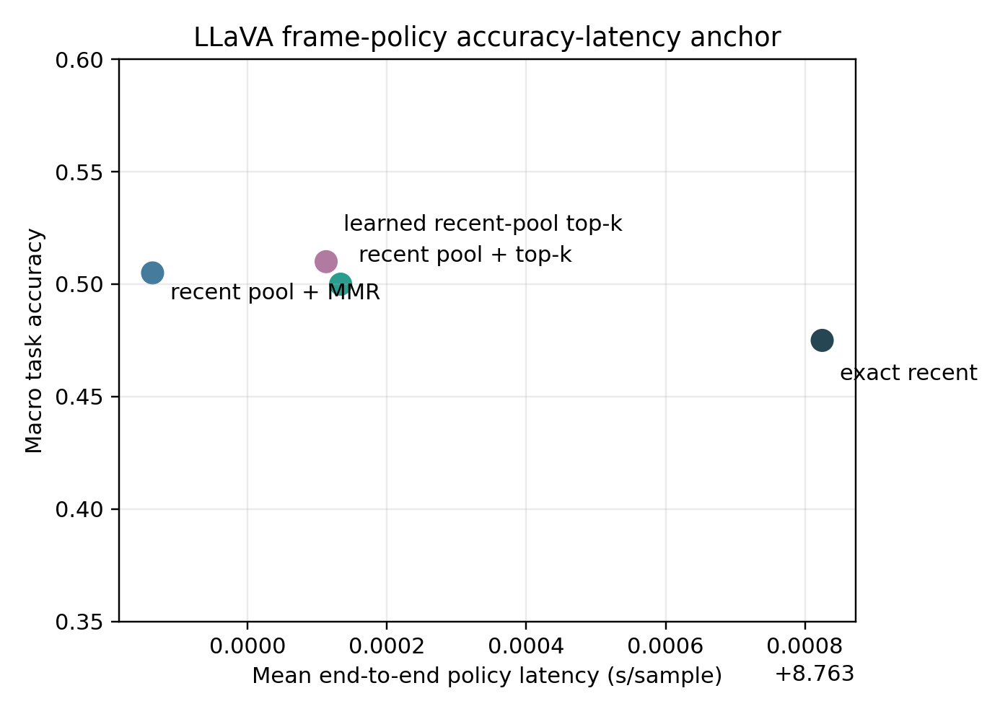
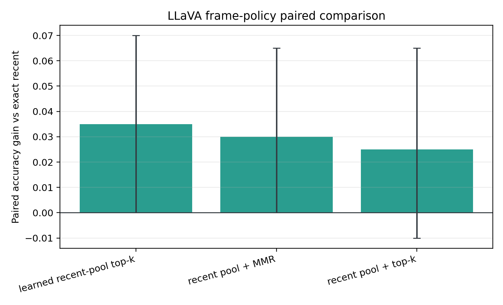

# MVBench Query-Memory LLaVA Anchor

## Validity

- Completed checkpoints: 200.
- Prediction rows: 800.
- Configuration fingerprints: 1.
- Selection-manifest SHA256: `dbc763008af72a9e335039bc0ab61e08e4fc5375b3996b72a304c2ea9789945c`.
- All policies are evaluated on the same examples with the same cached-feature and visual-token budgets.

## Overall Results

| Policy | Accuracy | Gain vs recent | Paired 95% CI | Better / worse | McNemar p | Parse rate | End-to-end | Model only |
|---|---:|---:|---:|---:|---:|---:|---:|---:|
| Exact recent | 47.50% | reference | reference | reference | reference | 100.00% | 8.76 s | 0.08 s |
| Recent pool + top-k | 50.00% | +2.50% | [-1.00%, +6.50%] | 10 / 5 | 0.3018 | 100.00% | 8.76 s | 0.08 s |
| Recent pool + MMR | 50.50% | +3.00% | [+0.00%, +6.50%] | 9 / 3 | 0.1460 | 100.00% | 8.76 s | 0.08 s |
| Learned recent-pool top-k | 51.00% | +3.50% | [+0.00%, +7.00%] | 10 / 3 | 0.0923 | 100.00% | 8.76 s | 0.08 s |

## Direct Selector Comparisons

- Learned versus recent-pool top-k: +1.00%, 95% CI [-2.00%, +4.00%], 5 better / 3 worse.
- Learned versus recent-pool MMR: +0.50%, 95% CI [-3.00%, +4.00%], 7 better / 6 worse.
- The learned readout is not statistically significant versus exact recent or either query-only recent-pool control.

## Native/Raw Path Consistency

- Selected-frame agreement with the raw-frame anchor: 800/800.
- Prediction agreement: 797/800.
- Correctness agreement: 799/800.
- The native path is task-equivalent at this scale but not bit-exact; FP16 visual encoding and different batch shapes can change borderline generations.

## Task Breakdown

| Task | Exact recent | Top-k gain | MMR gain | Learned gain |
|---|---:|---:|---:|---:|
| action_sequence | 42.50% | +2.50% | +0.00% | +5.00% |
| moving_direction | 40.00% | +0.00% | +0.00% | +0.00% |
| object_existence | 57.50% | -2.50% | -2.50% | +0.00% |
| scene_transition | 62.50% | +2.50% | +5.00% | +5.00% |
| state_change | 35.00% | +10.00% | +12.50% | +7.50% |

## Budget

- Visual tokens per example: 512.
- LLM visual-token activation proxy: 4096.00 KiB.
- End-to-end policy latency includes selection bookkeeping, video decoding, image preprocessing, and model generation. The model-only column measures `model.generate`.
- Matched provisioned persistent state: 8216.14 KiB per policy.
- The 16-frame projected visual-feature cache is included in persistent-state bytes.
- Query-time answers read cached visual tokens directly; there is no source-video replay at read time.
- Mean native write: 8.68 s (decode 7.06 s, preprocess 1.23 s, vision encode 0.39 s).
- Mean cached read and generation: 0.08 s.

## Decision

- Frozen top-k primary transfer gate: PASS.
- Frozen learned-readout transfer gate: PASS.
- The matched-state native-feature anchor may proceed to a trainable writer/readout experiment and second-encoder replication.
- The current selections still come from a frozen CLIP ranker, so this result does not yet establish a native learned memory.

## Figures

