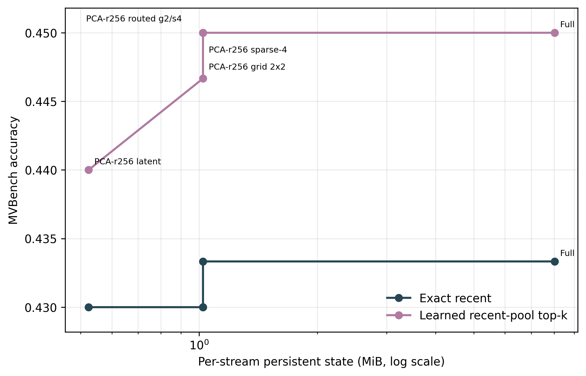
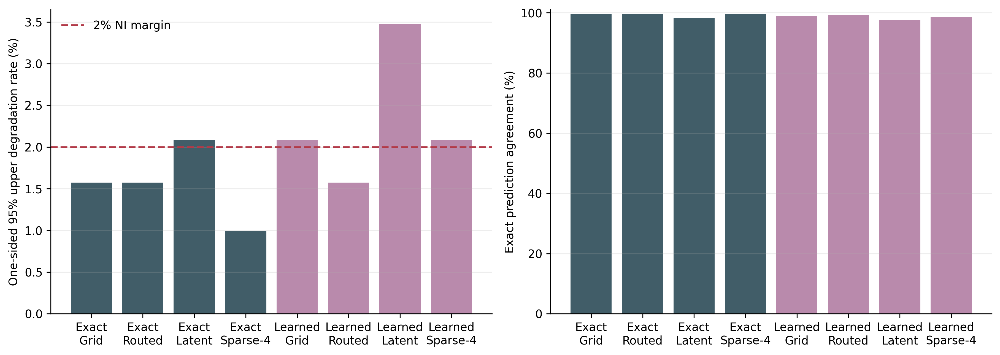
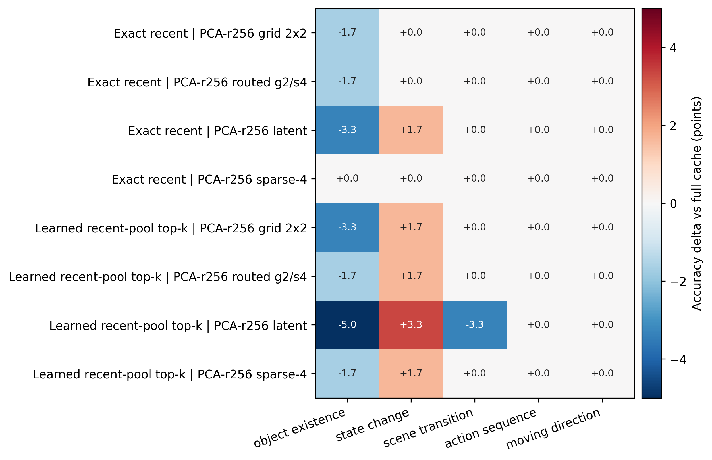
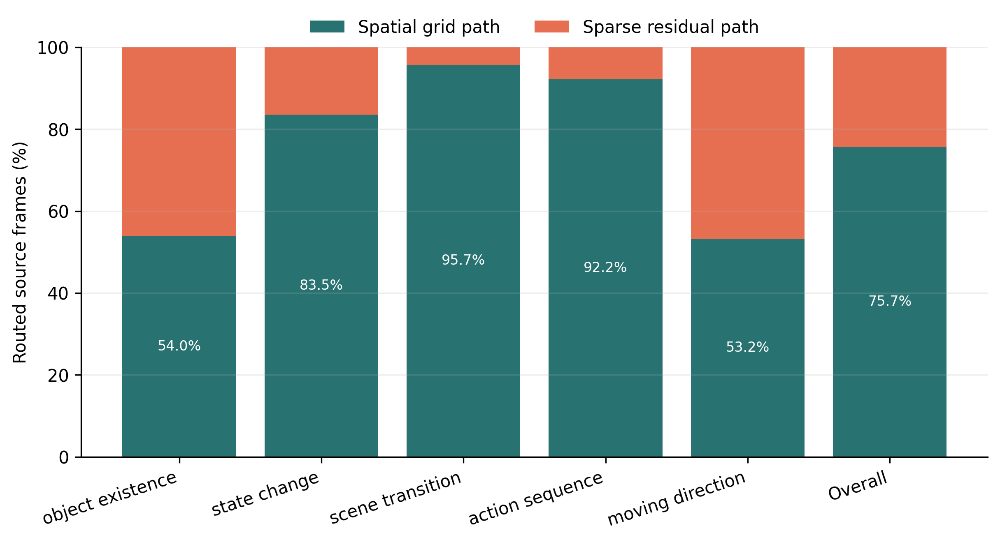

# Frozen 300-Sample MVBench Independent Replication

## Verdict

The frozen routed rank-256 feature state passes the preregistered 2%
preservation gate on the final untouched MVBench reserve. Under the learned
reader, routed and full state both score 135/300 (45.0%). There is one
full-correct/routed-wrong event, so the one-sided 95% Clopper-Pearson upper
bound is 1.571%, below the 2% margin.

The query-conditioned reader is directionally better than exact recent at the
same routed state: 135/300 versus 129/300, a +2.0-point paired gain with eight
better and two worse samples. The paired bootstrap interval is [0.0, 4.0]
points and exact McNemar `p=0.1094`. This is an independent positive point
estimate, not statistically conclusive superiority.

## Integrity Audit

- All 300 checkpoints completed; all three shards exited with code 0 and
  recorded zero failures.
- The aggregate contains exactly 3,000 rows: 300 samples, two frozen readers,
  and five memory variants.
- All rows parsed, all numeric metrics are finite, and one configuration
  fingerprint covers the run.
- Each of five tasks contributes 60 samples.
- Evaluation overlap with calibration, original evaluation, and prior formal
  samples is zero.
- Split SHA256:
  `720423b308f97aecdacd1bb9c70b13ae08920a38e3abb75147e63e71486821f2`.
- Codec SHA256:
  `39f7623b3ae95db93403ef00c63589d901a2d9011dd4a23b8fc185d76d20012f`.
- Strict validation reports `passed: true` with no failed checks in
  [full_validation.json](aggregate/full_validation.json).

The protocol was frozen before native-model results were read. No selector,
codec, route, prompt, threshold, or metric was changed after launch.

## Primary Results

| Endpoint | Exact recent | Learned reader | Paired interpretation |
|---|---:|---:|---|
| Full state accuracy | 43.33% | 45.00% | Learned: +1.67 points, `p=0.2266` |
| Routed state accuracy | 43.00% | 45.00% | Learned: +2.00 points, `p=0.1094` |
| Routed versus matching full | -0.33 points | +0.00 points | Both pass the 2% loss-bound gate |
| Routed prediction agreement with full | 99.67% | 99.33% | One and two prediction changes |
| Full-correct/routed-wrong | 1/300 | 1/300 | Upper 95% bound 1.571% |

The learned routed state therefore supports a narrow positive claim:
representation preservation under this frozen LLaVA-1.5 reader. It does not
yet support a claim that the learned selector is reliably better than exact
recent, because the confidence interval touches zero and the paired test is
not significant.

## State Trade-Off

| Learned-reader variant | Accuracy | Steady state | Cold start | Compression | NI gate |
|---|---:|---:|---:|---:|---:|
| Full | 45.00% | 8.024 MiB | 8.024 MiB | 1.00x | reference |
| Routed grid2/s4 | 45.00% | 1.024 MiB | 3.031 MiB | 7.84x | pass |
| Fixed sparse-4 | 45.00% | 1.024 MiB | 3.032 MiB | 7.84x | fail |
| Grid 2x2 | 44.67% | 1.024 MiB | 3.031 MiB | 7.84x | fail |
| Rank-256 latent | 44.00% | 0.524 MiB | 2.531 MiB | 15.32x | fail |

Equal aggregate accuracy is not enough for the conservative preservation
gate. Fixed sparse-4 has two full-correct/compressed-wrong events, whose upper
bound is 2.084%; its two compressed-correct/full-wrong events do not offset
those losses. The frozen route reduces the harmful count to one and passes.

The steady-state figure excludes the shared 2,105,344-byte codec from every
stream. Cold-start accounting includes it. The route still computes and
compares both stored candidates, so 7.84x is a state result, not a compute or
latency speedup.

## Task Localization

At routed state, learned versus exact recent has the following paired outcome:

| Task | Better | Worse | Tied | Accuracy gain |
|---|---:|---:|---:|---:|
| Object existence | 1 | 0 | 59 | +1.67 points |
| State change | 2 | 0 | 58 | +3.33 points |
| Scene transition | 3 | 0 | 57 | +5.00 points |
| Action sequence | 2 | 2 | 56 | +0.00 points |
| Moving direction | 0 | 0 | 60 | +0.00 points |

The +2-point aggregate signal is spread across object existence, state change,
and scene transition rather than coming from one sample. Task rows are still
descriptive: the experiment did not preregister task-wise tests or correct
them for multiple comparisons.

For routed versus full under the learned reader, object existence contributes
the single harmful event and state change contributes one beneficial event;
the remaining tasks have no correctness changes.

## Route Behavior

The frozen error route chooses a 2x2 spatial-grid residual for 12.12 of 16
source frames on average (75.7%) and the sparse-4 residual for 3.88 frames
(24.3%). The behavior is strongly task dependent:

| Task | Grid share | Sparse share |
|---|---:|---:|
| Object existence | 54.0% | 46.0% |
| State change | 83.5% | 16.5% |
| Scene transition | 95.7% | 4.3% |
| Action sequence | 92.2% | 7.8% |
| Moving direction | 53.2% | 46.8% |
| Overall | 75.7% | 24.3% |

This supports the architectural role of a dominant structured spatial path
plus a selective high-detail residual path. It does not prove that sparse
choices are semantic events: the current decision uses stored-state
reconstruction error and is an oracle that evaluates both candidates.

## Timing Scope

The mean routed-state compression and reconstruction measurements are 1.29 ms
and 0.59 ms; cached LLaVA answer inference averages 82.84 ms. Upstream feature
cache writing averages 1.986 s with a sampled P95 of 5.199 s. These are
instrumented Python/PyTorch stage timings from this experiment, not request
TTFT, decode latency, end-to-end streaming latency, or an SLO measurement.

## Baseline Boundary

The same-backbone causal comparison is exact recent versus the frozen learned
reader above. CausalMem and OASIS formal StreamingBench runs use different VLM
backbones; STC reports ViT-plus-prefill stages; StreamingTOM reports CTR/OQM
CUDA cores. Their results remain useful system references but cannot be put in
one accuracy or latency ranking with this MVBench experiment.

The independent result advances the broader online-video hypothesis only for
bounded low-dimensional visual state and a mixed spatial/sparse residual
representation. It does not validate global BCCB attention replacement,
semantic event routing, cheap route computation, cross-backbone superiority,
or end-to-end streaming SLO gains.

## Next Gate

The most important next experiment is to replace the reconstruction-error
oracle with a causal low-cost router trained only on calibration data, then
test it on a new benchmark or model domain. The router should be evaluated on
preservation loss, rare-event recall, writer/read P50/P95/P99, total retained
state, and end-to-end TTFT. A local BTTB/BCCB writer path should be added only
after this deployable routing gate, not used as a universal attention
replacement.

## Figures

