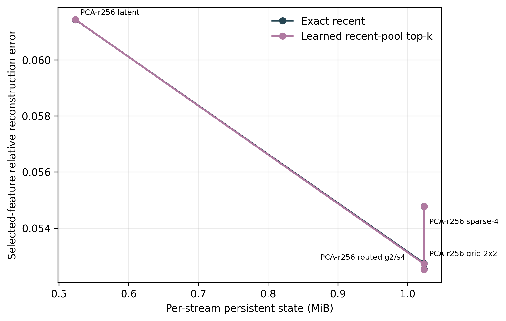

# Compressed Native Feature-Memory Analysis

- Completed checkpoints: 300.
- Configuration fingerprints: 1.

## Variant Summary

| Selector | Memory | Accuracy | Steady-state MiB | Cold-start MiB | Compression | Selected error |
|---|---|---:|---:|---:|---:|---:|
| Exact recent | full | 43.33% | 8.024 | 8.024 | 1.00x | 0.0000 |
| Exact recent | pca_r256_grid2x2 | 43.00% | 1.024 | 3.031 | 7.84x | 0.0527 |
| Exact recent | pca_r256_route_grid2_s4 | 43.00% | 1.024 | 3.031 | 7.84x | 0.0525 |
| Exact recent | pca_r256_s0 | 43.00% | 0.524 | 2.531 | 15.32x | 0.0614 |
| Exact recent | pca_r256_s4 | 43.33% | 1.024 | 3.032 | 7.84x | 0.0548 |
| Learned recent-pool top-k | full | 45.00% | 8.024 | 8.024 | 1.00x | 0.0000 |
| Learned recent-pool top-k | pca_r256_grid2x2 | 44.67% | 1.024 | 3.031 | 7.84x | 0.0527 |
| Learned recent-pool top-k | pca_r256_route_grid2_s4 | 45.00% | 1.024 | 3.031 | 7.84x | 0.0525 |
| Learned recent-pool top-k | pca_r256_s0 | 44.00% | 0.524 | 2.531 | 15.32x | 0.0614 |
| Learned recent-pool top-k | pca_r256_s4 | 45.00% | 1.024 | 3.032 | 7.84x | 0.0548 |

## Paired Accuracy Versus Full Cache

Non-inferiority margin: 2.0%. The decision uses the one-sided 95% Clopper-Pearson upper bound on full-correct/compressed-wrong outcomes.

| Selector | Memory | Gain | 95% CI | Prediction agreement | Better / worse | Worse upper 95% | Non-inferior |
|---|---|---:|---:|---:|---:|---:|---:|
| Exact recent | pca_r256_grid2x2 | -0.33% | [-1.00%, +0.00%] | 99.67% | 0 / 1 | 1.57% | yes |
| Exact recent | pca_r256_route_grid2_s4 | -0.33% | [-1.00%, +0.00%] | 99.67% | 0 / 1 | 1.57% | yes |
| Exact recent | pca_r256_s0 | -0.33% | [-1.67%, +0.67%] | 98.33% | 1 / 2 | 2.08% | no |
| Exact recent | pca_r256_s4 | +0.00% | [+0.00%, +0.00%] | 99.67% | 0 / 0 | 0.99% | yes |
| Learned recent-pool top-k | pca_r256_grid2x2 | -0.33% | [-1.33%, +0.67%] | 99.00% | 1 / 2 | 2.08% | no |
| Learned recent-pool top-k | pca_r256_route_grid2_s4 | +0.00% | [-1.00%, +1.00%] | 99.33% | 1 / 1 | 1.57% | yes |
| Learned recent-pool top-k | pca_r256_s0 | -1.00% | [-2.67%, +0.67%] | 97.67% | 2 / 5 | 3.47% | no |
| Learned recent-pool top-k | pca_r256_s4 | +0.00% | [-1.33%, +1.33%] | 98.67% | 2 / 2 | 2.08% | no |

## Query-Conditioned Selector Gain at Matched State

| Memory | Candidate versus exact recent | Gain | 95% CI | Better / worse | McNemar p |
|---|---|---:|---:|---:|---:|
| full | Learned recent-pool top-k | +1.67% | [-0.33%, +4.00%] | 8 / 3 | 0.2266 |
| pca_r256_grid2x2 | Learned recent-pool top-k | +1.67% | [-0.33%, +3.67%] | 7 / 2 | 0.1797 |
| pca_r256_route_grid2_s4 | Learned recent-pool top-k | +2.00% | [+0.00%, +4.00%] | 8 / 2 | 0.1094 |
| pca_r256_s0 | Learned recent-pool top-k | +1.00% | [-1.00%, +3.33%] | 7 / 4 | 0.5488 |
| pca_r256_s4 | Learned recent-pool top-k | +1.67% | [-0.33%, +4.00%] | 8 / 3 | 0.2266 |

## Routed Spatial/Sparse Allocation

The route is a frozen reconstruction-error oracle, not a deployable semantic event detector.

| Task | Samples | Grid frames | Sparse frames | Grid share |
|---|---:|---:|---:|---:|
| object existence | 60 | 8.63 | 7.37 | 54.0% |
| state change | 60 | 13.37 | 2.63 | 83.5% |
| scene transition | 60 | 15.32 | 0.68 | 95.7% |
| action sequence | 60 | 14.75 | 1.25 | 92.2% |
| moving direction | 60 | 8.52 | 7.48 | 53.2% |
| all | 300 | 12.12 | 3.88 | 75.7% |

## Claim Boundary

- PCA and sparse residual coding are established compression tools. This experiment tests task preservation and systems trade-offs, not mathematical novelty.
- Shared codec parameters and per-stream state are reported separately. Cold-start state includes the shared codec for compressed variants; steady-state state does not amortize it into every stream.
- A lower reconstruction error is not sufficient; promotion requires preserving full-cache LLaVA accuracy.
- The non-inferiority gate is conservative: compressed improvements do not offset full-correct/compressed-wrong events.

## Figures

