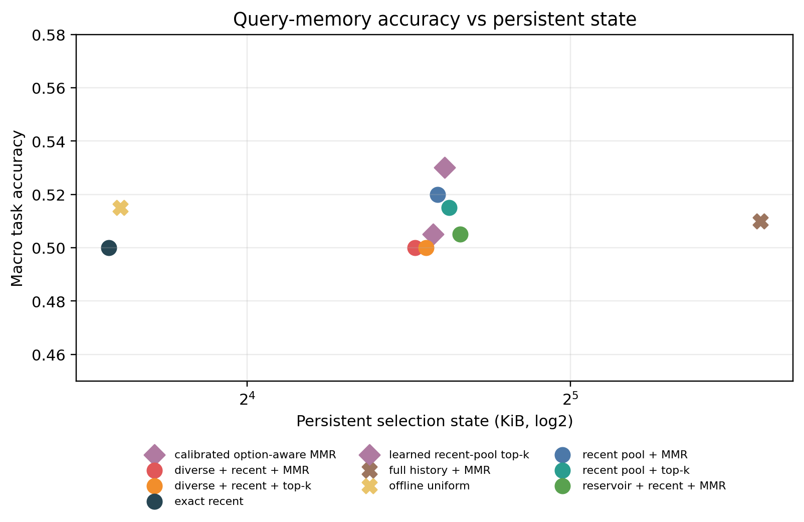
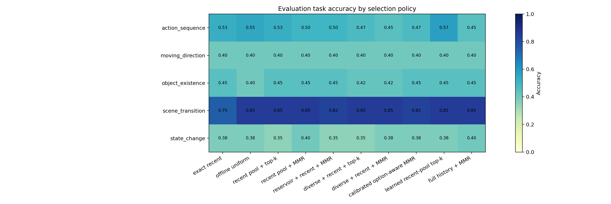
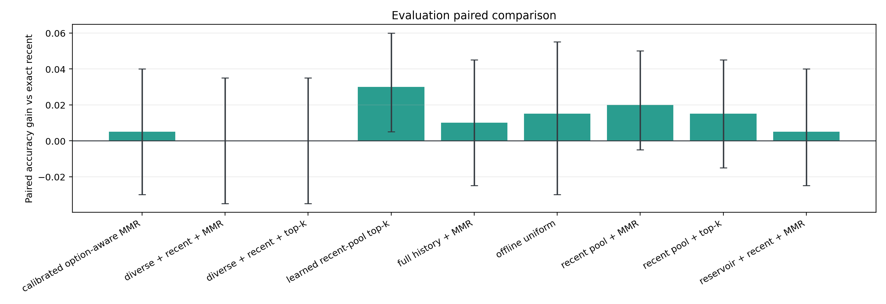
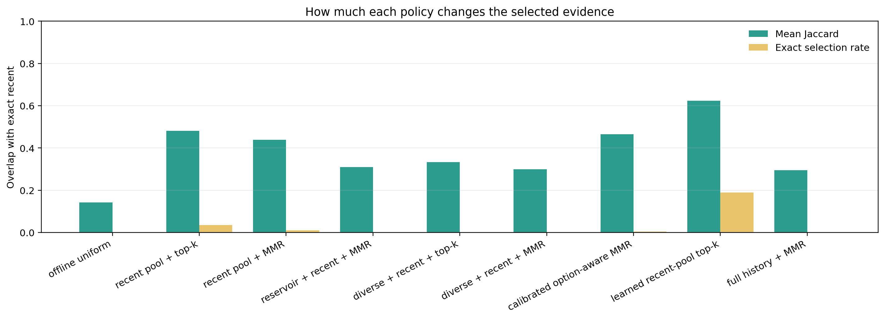
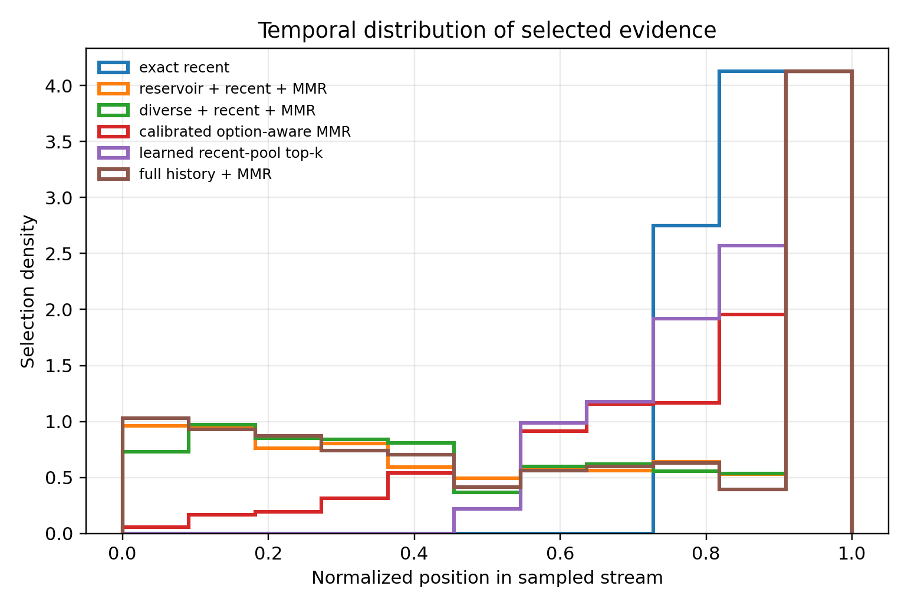

# MVBench Query-Memory Result Analysis

## Validity

- Cache records: 200 / 200.
- Split and cache checks: PASS.
- Evaluation labels were not used to select frames or tune hyperparameters.
- The primary selector uses question-only retrieval. The calibrated secondary selector uses all candidate options symmetrically.
- CLIP frame embeddings and raw-frame replay are not counted in persistent state bytes.

## Main Result

- Exact recent: 50.00% macro accuracy.
- Frozen confirmatory primary (Recent pool + top-k): 51.50%, +1.50% versus exact recent.
- Best bounded question-only selector (Recent pool + MMR): 52.00%.
- Offline full-history upper bound: 51.00%.
- Exploratory option-aware selector: 50.50%, +0.50% versus exact recent.
- Exploratory learned readout: 53.00%, +3.00% versus exact recent.
- Promotion gate: PASS.

## Method Comparison

| Policy | Macro accuracy | Gain vs recent | Paired 95% CI | State KiB | Retrieval MFLOPs | Bounded | Option-aware |
|---|---:|---:|---:|---:|---:|:---:|:---:|
| Learned recent-pool top-k | 53.00% | +3.00% | [+0.50%, +6.00%] | 24.14 | 0.123 | yes | yes |
| Recent pool + MMR | 52.00% | +2.00% | [-0.50%, +5.00%] | 24.08 | 0.221 | yes | no |
| Offline uniform | 51.50% | +1.50% | [-3.00%, +5.50%] | 12.05 | 0.000 | no | no |
| Recent pool + top-k | 51.50% | +1.50% | [-1.50%, +4.50%] | 24.08 | 0.025 | yes | no |
| Full history + MMR | 51.00% | +1.00% | [-2.50%, +4.50%] | 48.14 | 0.442 | no | no |
| Calibrated option-aware MMR | 50.50% | +0.50% | [-3.00%, +4.00%] | 24.14 | 0.319 | yes | yes |
| Reservoir + recent + MMR | 50.50% | +0.50% | [-2.50%, +4.00%] | 24.08 | 0.221 | yes | no |
| Diverse + recent + MMR | 50.00% | 0.00% | [-3.50%, +3.50%] | 24.08 | 0.221 | yes | no |
| Diverse + recent + top-k | 50.00% | 0.00% | [-3.50%, +3.50%] | 24.08 | 0.025 | yes | no |
| Exact recent | 50.00% | 0.00% | reference | 12.05 | 0.000 | yes | no |

## Task Breakdown

| Task | Exact recent | Recent pool + top-k | Recent pool + MMR | Calibrated option-aware MMR | Learned recent-pool top-k | Offline uniform | Full history + MMR |
|---|---:|---:|---:|---:|---:|---:|---:|
| action_sequence | 52.50% | 52.50% (0.00%) | 50.00% (-2.50%) | 47.50% (-5.00%) | 57.50% (+5.00%) | 55.00% (+2.50%) | 45.00% (-7.50%) |
| moving_direction | 40.00% | 40.00% (0.00%) | 40.00% (0.00%) | 40.00% (0.00%) | 40.00% (0.00%) | 40.00% (0.00%) | 40.00% (0.00%) |
| object_existence | 45.00% | 45.00% (0.00%) | 45.00% (0.00%) | 45.00% (0.00%) | 45.00% (0.00%) | 40.00% (-5.00%) | 45.00% (0.00%) |
| scene_transition | 75.00% | 85.00% (+10.00%) | 85.00% (+10.00%) | 82.50% (+7.50%) | 85.00% (+10.00%) | 85.00% (+10.00%) | 85.00% (+10.00%) |
| state_change | 37.50% | 35.00% (-2.50%) | 40.00% (+2.50%) | 37.50% (0.00%) | 37.50% (0.00%) | 37.50% (0.00%) | 40.00% (+2.50%) |

## Stability Diagnostics

- Its selected evidence has mean Jaccard 0.481 versus Exact recent, while 191/200 final predictions remain unchanged.
- Only 6 samples improve and 3 worsen, so the point gain or loss depends on very few decision flips.

## Hyperparameters

- Diversity weight: 0.5.
- Temporal coverage weight: 0.0.
- Option contrast weight: 0.0.
- Recency feature weight: 0.1.
- Novelty feature weight: 0.0.
- Learned ridge coefficients: question_relevance=+0.0026, option_contrast=+0.0088, recency=+0.0008, novelty=+0.0011.
- Learned readout parameter bytes: 48.
- Feature weights were loaded from a frozen file before the confirmatory evaluation.
- Frozen hyperparameter SHA256: `c04db25ab9597c4079e675a2790f3cee56e40bf2d87b06b20b4215dcabf26681`.
- The learned readout was also frozen before the confirmatory evaluation.
- Frozen learned-ranker SHA256: `65226a3ef558bf0968d48fa8a482cec85a7a0d39af85f0226c785f613e666f12`.

## Decision

The frozen primary bounded question-only selector passes the CLIP proxy gate and should be checked with the paired LLaVA raw-frame anchor.

## Figures

## Claim Boundary

The visual evidence cache is not counted in this CLIP proxy. A positive result promotes only a selection-policy anchor.
