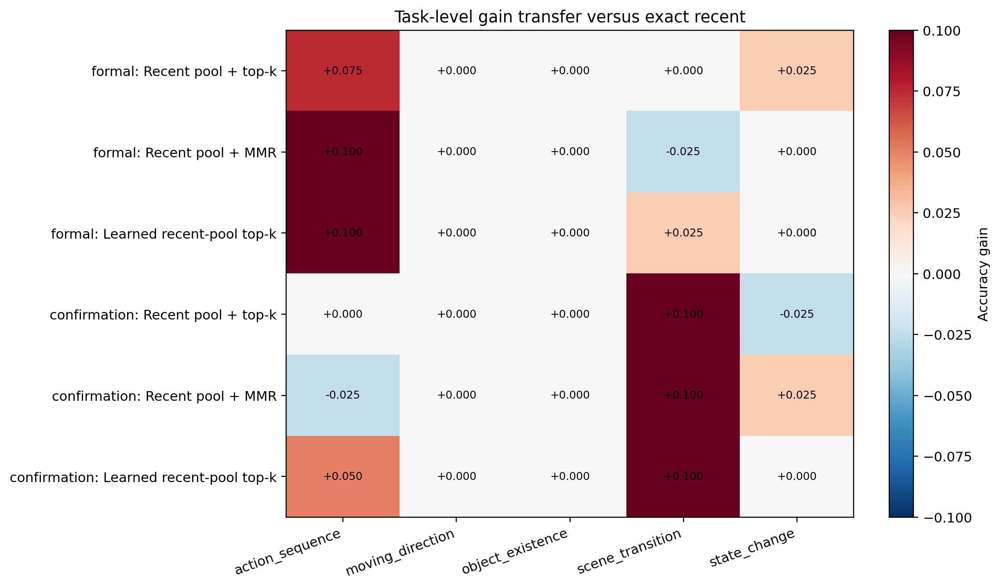

# Formal-to-Confirmation Query-Memory Analysis

The formal evaluation and untouched-reserve confirmation contain 200 disjoint records each. Pooled values below are descriptive and do not erase the post-hoc status of policies selected after the formal evaluation.

## Paired Results

| Policy | Formal gain | Reserve gain | Pooled gain | Pooled flips |
|---|---:|---:|---:|---:|
| Recent pool + top-k | +2.00% [+0.00%, +4.50%] | +1.50% [-1.50%, +4.50%] | +1.75% [+0.00%, +3.75%] | 11 better / 4 worse |
| Recent pool + MMR | +1.50% [-1.00%, +4.00%] | +2.00% [-0.50%, +5.00%] | +1.75% [+0.00%, +3.75%] | 11 better / 4 worse |
| Learned recent-pool top-k | +2.50% [+0.00%, +5.00%] | +3.00% [+0.50%, +6.00%] | +2.75% [+1.00%, +4.75%] | 13 better / 2 worse |
| Offline uniform | +3.00% [-0.50%, +6.50%] | +1.50% [-3.00%, +6.00%] | +2.25% [-0.50%, +5.00%] | 21 better / 12 worse |
| Full history + MMR | +0.50% [-3.50%, +4.50%] | +1.00% [-2.50%, +4.50%] | +0.75% [-1.75%, +3.25%] | 15 better / 12 worse |

## Interpretation

- The frozen learned readout is the only tested bounded policy whose paired point gain is positive in both disjoint evaluations; its descriptive pooled gain is +2.75%.
- The frozen top-k confirmation primary also remains positive when pooled (+1.75%), but its reserve interval crosses zero and the answer changes are sparse.
- Task-level plots must be checked because a positive aggregate can still be concentrated in scene-transition or action-sequence examples.
- These CLIP results justify only a paired raw-frame VLM anchor, not a claim of bounded deployment or a native learned memory.

## Figures

