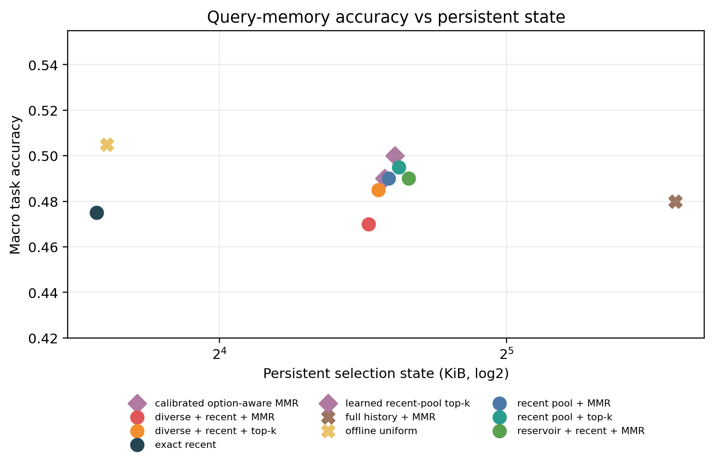
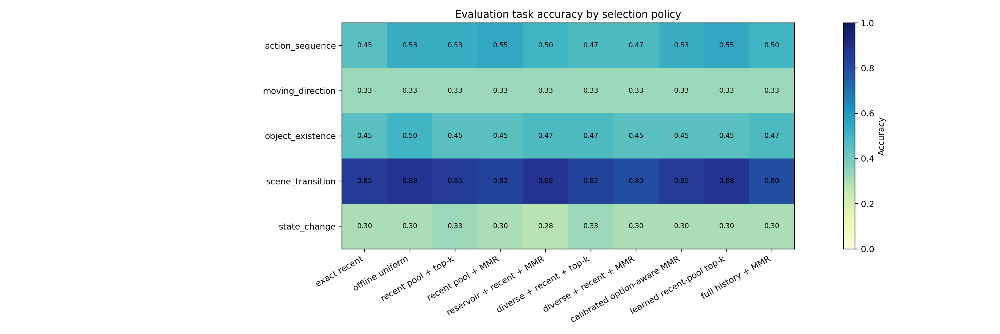
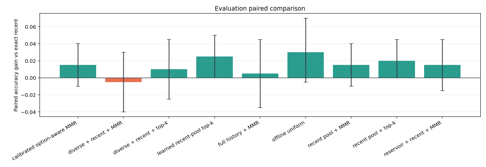
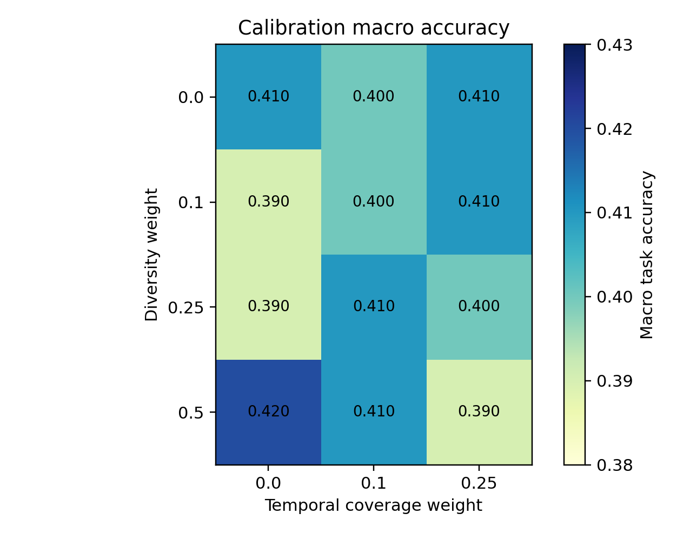
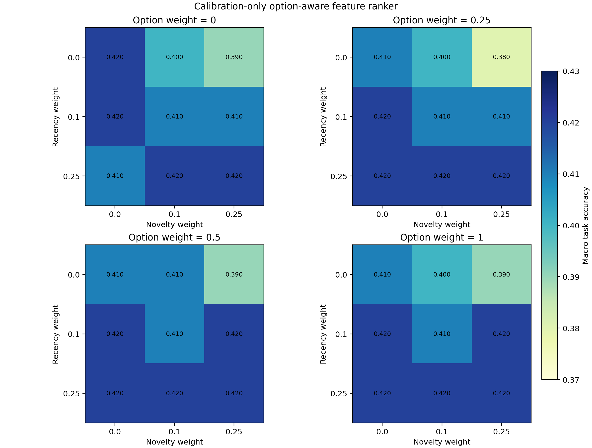
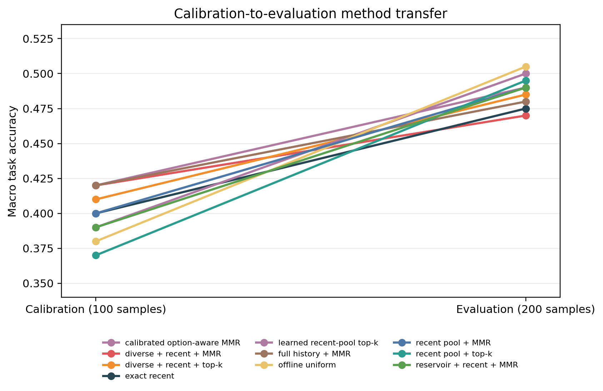
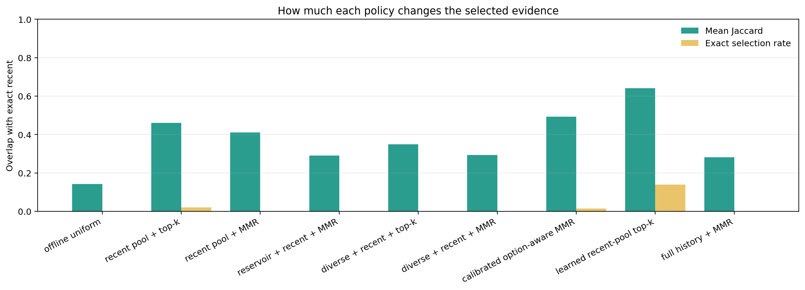
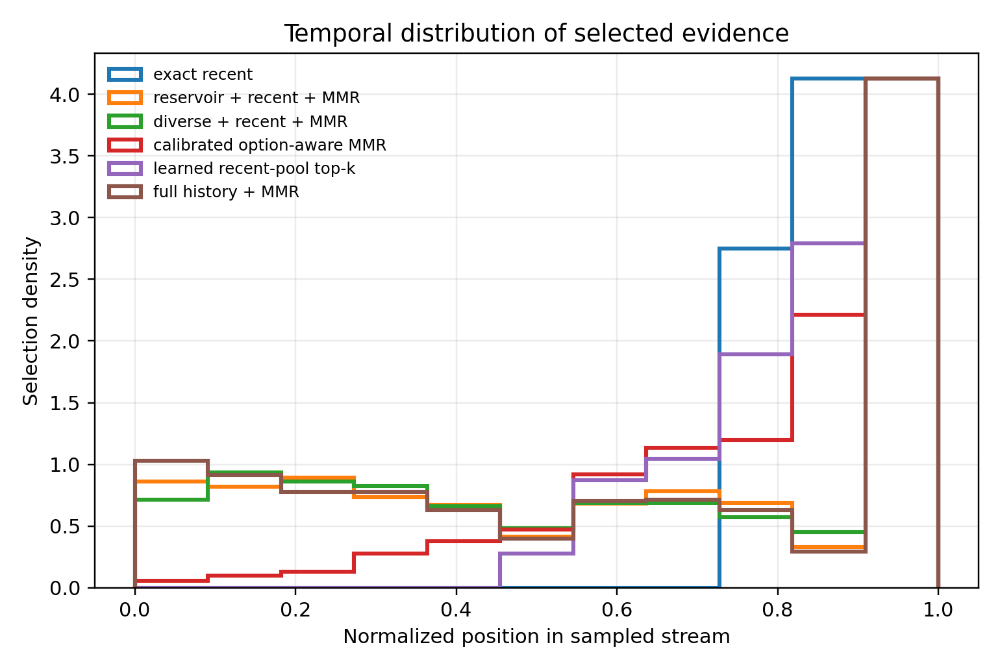

# MVBench Query-Memory Result Analysis

## Validity

- Cache records: 300 / 300.
- Split and cache checks: PASS.
- Evaluation labels were not used to select frames or tune hyperparameters.
- The primary selector uses question-only retrieval. The calibrated secondary selector uses all candidate options symmetrically.
- CLIP frame embeddings and raw-frame replay are not counted in persistent state bytes.

## Main Result

- Exact recent: 47.50% macro accuracy.
- Preregistered primary (Diverse + recent + MMR): 47.00%, -0.50% versus exact recent.
- Best bounded question-only selector (Recent pool + top-k): 49.50%.
- Offline full-history upper bound: 48.00%.
- Exploratory option-aware selector: 49.00%, +1.50% versus exact recent.
- Exploratory learned readout: 50.00%, +2.50% versus exact recent.
- Promotion gate: FAIL.

## Method Comparison

| Policy | Macro accuracy | Gain vs recent | Paired 95% CI | State KiB | Retrieval MFLOPs | Bounded | Option-aware |
|---|---:|---:|---:|---:|---:|:---:|:---:|
| Offline uniform | 50.50% | +3.00% | [-0.50%, +7.00%] | 12.05 | 0.000 | no | no |
| Learned recent-pool top-k | 50.00% | +2.50% | [0.00%, +5.00%] | 24.14 | 0.123 | yes | yes |
| Recent pool + top-k | 49.50% | +2.00% | [0.00%, +4.50%] | 24.08 | 0.025 | yes | no |
| Calibrated option-aware MMR | 49.00% | +1.50% | [-1.00%, +4.00%] | 24.14 | 0.319 | yes | yes |
| Recent pool + MMR | 49.00% | +1.50% | [-1.00%, +4.00%] | 24.08 | 0.221 | yes | no |
| Reservoir + recent + MMR | 49.00% | +1.50% | [-1.50%, +4.50%] | 24.08 | 0.221 | yes | no |
| Diverse + recent + top-k | 48.50% | +1.00% | [-2.50%, +4.50%] | 24.08 | 0.025 | yes | no |
| Full history + MMR | 48.00% | +0.50% | [-3.50%, +4.50%] | 48.14 | 0.442 | no | no |
| Exact recent | 47.50% | 0.00% | reference | 12.05 | 0.000 | yes | no |
| Diverse + recent + MMR | 47.00% | -0.50% | [-4.00%, +3.00%] | 24.08 | 0.221 | yes | no |

## Task Breakdown

| Task | Exact recent | Diverse + recent + MMR | Recent pool + top-k | Calibrated option-aware MMR | Learned recent-pool top-k | Offline uniform | Full history + MMR |
|---|---:|---:|---:|---:|---:|---:|---:|
| action_sequence | 45.00% | 47.50% (+2.50%) | 52.50% (+7.50%) | 52.50% (+7.50%) | 55.00% (+10.00%) | 52.50% (+7.50%) | 50.00% (+5.00%) |
| moving_direction | 32.50% | 32.50% (0.00%) | 32.50% (0.00%) | 32.50% (0.00%) | 32.50% (0.00%) | 32.50% (0.00%) | 32.50% (0.00%) |
| object_existence | 45.00% | 45.00% (0.00%) | 45.00% (0.00%) | 45.00% (0.00%) | 45.00% (0.00%) | 50.00% (+5.00%) | 47.50% (+2.50%) |
| scene_transition | 85.00% | 80.00% (-5.00%) | 85.00% (0.00%) | 85.00% (0.00%) | 87.50% (+2.50%) | 87.50% (+2.50%) | 80.00% (-5.00%) |
| state_change | 30.00% | 30.00% (0.00%) | 32.50% (+2.50%) | 30.00% (0.00%) | 30.00% (0.00%) | 30.00% (0.00%) | 30.00% (0.00%) |

## Stability Diagnostics

- Diverse + recent + MMR moves from 42.00% (rank 3/10) to 47.00% (rank 10/10).
- Its selected evidence has mean Jaccard 0.294 versus Exact recent, while 187/200 final predictions remain unchanged.
- Only 6 samples improve and 7 worsen, so the point gain or loss depends on very few decision flips.
- Exploratory Recent pool + top-k moves from 37.00% (rank 10/10) to 49.50% (rank 3/10).
- It has mean evidence Jaccard 0.460, but 194/200 predictions are tied; this ranking reversal requires the untouched-reserve confirmation.

## Hyperparameters

- Diversity weight: 0.5.
- Temporal coverage weight: 0.0.
- Option contrast weight: 0.0.
- Recency feature weight: 0.1.
- Novelty feature weight: 0.0.
- Learned ridge coefficients: question_relevance=+0.0026, option_contrast=+0.0088, recency=+0.0008, novelty=+0.0011.
- Learned readout parameter bytes: 48.
- All values above were selected on the disjoint calibration split and frozen before evaluation.

## Decision

The frozen primary bounded question-only selector does not pass the CLIP proxy gate. Do not claim that bounded online query memory is solved; inspect task-specific failures before spending GPU time on a formal LLaVA anchor.

## Figures

## Claim Boundary

The visual evidence cache is not counted in this CLIP proxy. A positive result promotes only a selection-policy anchor.
