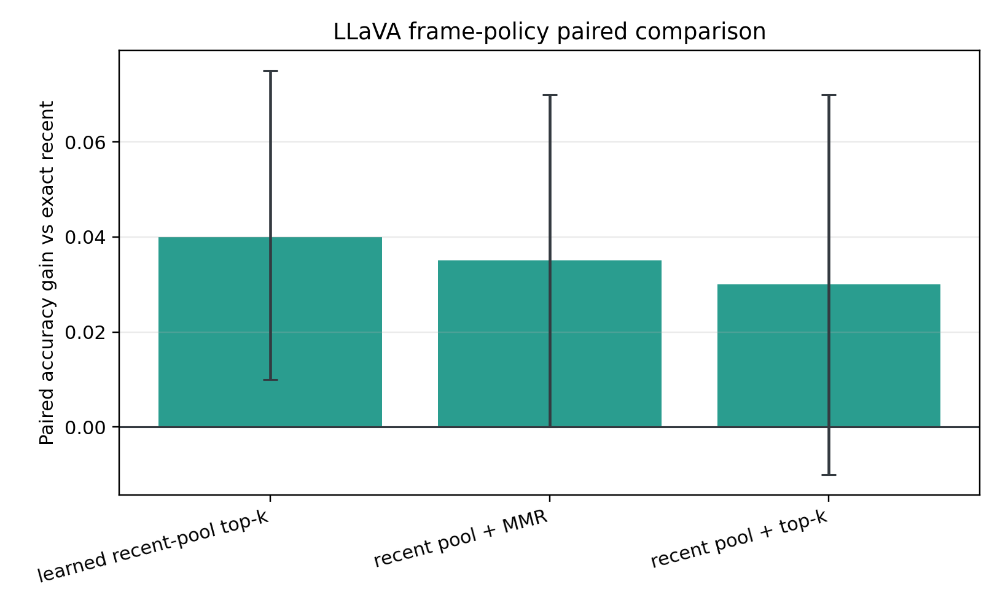

# MVBench Query-Memory LLaVA Anchor

## Validity

- Completed checkpoints: 200.
- Prediction rows: 800.
- Configuration fingerprints: 1.
- Selection-manifest SHA256: `dbc763008af72a9e335039bc0ab61e08e4fc5375b3996b72a304c2ea9789945c`.
- All policies are evaluated on the same raw-frame examples with the same visual-token budget.

## Overall Results

| Policy | Accuracy | Gain vs recent | Paired 95% CI | Better / worse | McNemar p | Parse rate | End-to-end | Model only |
|---|---:|---:|---:|---:|---:|---:|---:|---:|
| Exact recent | 47.00% | reference | reference | reference | reference | 100.00% | 4.88 s | 0.30 s |
| Recent pool + top-k | 50.00% | +3.00% | [-1.00%, +7.00%] | 11 / 5 | 0.2101 | 100.00% | 4.78 s | 0.28 s |
| Recent pool + MMR | 50.50% | +3.50% | [+0.00%, +7.00%] | 10 / 3 | 0.0923 | 100.00% | 4.74 s | 0.28 s |
| Learned recent-pool top-k | 51.00% | +4.00% | [+1.00%, +7.50%] | 10 / 2 | 0.0386 | 100.00% | 4.71 s | 0.28 s |

## Direct Selector Comparisons

- Learned versus recent-pool top-k: +1.00%, 95% CI [-2.00%, +4.00%], 5 better / 3 worse.
- Learned versus recent-pool MMR: +0.50%, 95% CI [-3.00%, +4.00%], 7 better / 6 worse.
- The learned readout is significant versus exact recent, but not versus the two query-only recent-pool controls.

## Task Breakdown

| Task | Exact recent | Top-k gain | MMR gain | Learned gain |
|---|---:|---:|---:|---:|
| action_sequence | 42.50% | +2.50% | +0.00% | +5.00% |
| moving_direction | 40.00% | +0.00% | +0.00% | +0.00% |
| object_existence | 57.50% | -2.50% | -2.50% | +0.00% |
| scene_transition | 60.00% | +5.00% | +7.50% | +7.50% |
| state_change | 35.00% | +10.00% | +12.50% | +7.50% |

## Budget

- Visual tokens per example: 512.
- LLM visual-token activation proxy: 4096.00 KiB.
- Exact-recent selection state: 12.05 KiB.
- Learned recent-pool selection state: 24.14 KiB.
- The query policies retain a 16-vector pool while exact recent retains 8 vectors, so this anchor is not a matched-state deployment comparison.
- End-to-end policy latency includes selection bookkeeping, video decoding, image preprocessing, and model generation. The model-only column measures `model.generate`.
- Raw-frame replay remains an anchor-only mechanism and is not a bounded persistent-state result.

## Decision

- Frozen top-k primary transfer gate: PASS.
- Frozen learned-readout transfer gate: PASS.
- A passing policy may proceed to a native learned-memory experiment, but this anchor alone does not establish a streaming memory contribution.
- The next experiment must match persistent bytes and isolate learned ranking from the benefit of retaining a larger recent pool.

## Figures

