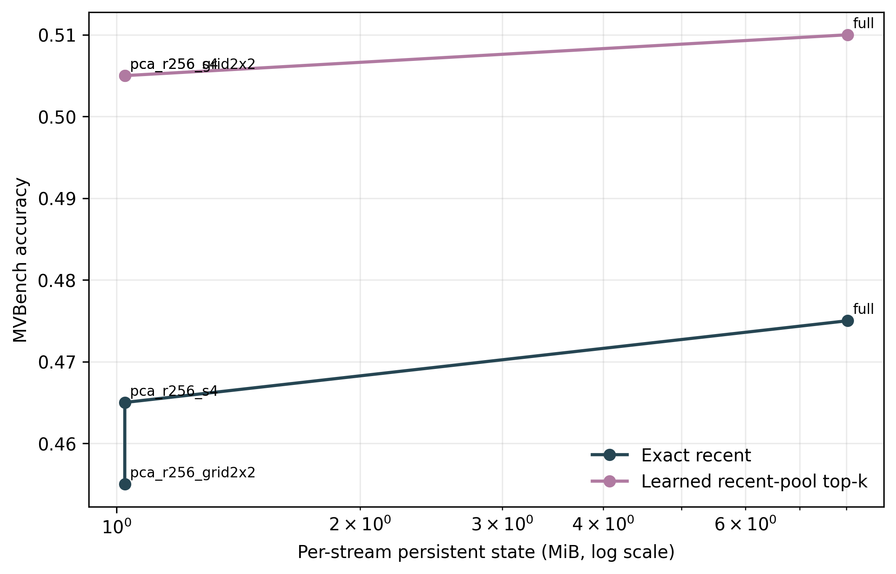
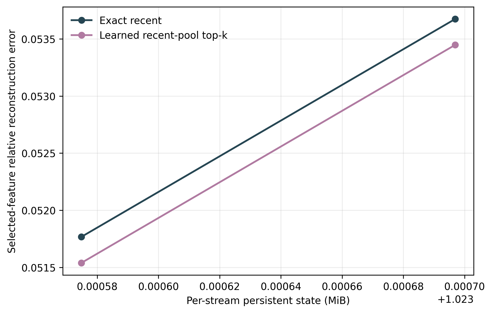
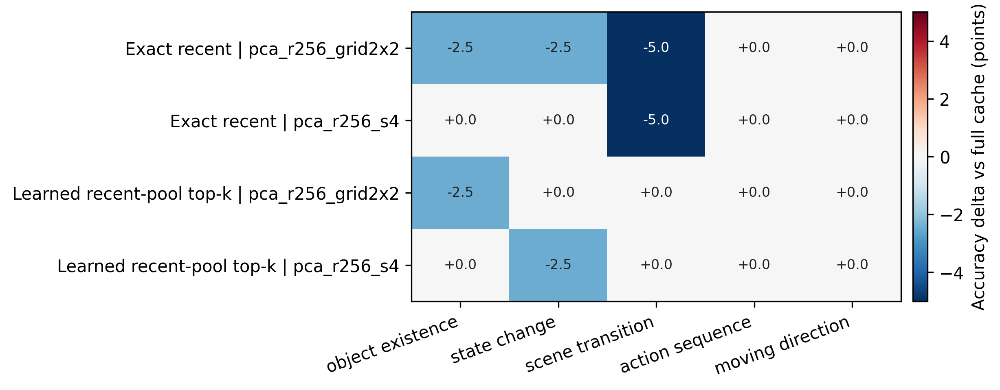
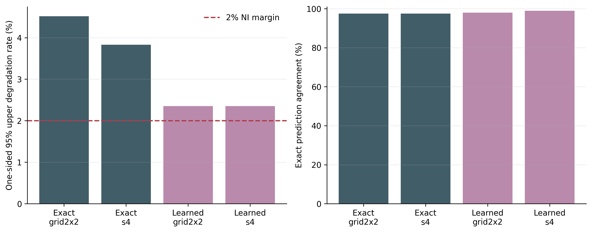

# Compressed Native Feature-Memory Analysis

- Completed checkpoints: 200.
- Configuration fingerprints: 1.

## Variant Summary

| Selector | Memory | Accuracy | Steady-state MiB | Cold-start MiB | Compression | Selected error |
|---|---|---:|---:|---:|---:|---:|
| Exact recent | full | 47.50% | 8.024 | 8.024 | 1.00x | 0.0000 |
| Exact recent | pca_r256_grid2x2 | 45.50% | 1.024 | 3.031 | 7.84x | 0.0518 |
| Exact recent | pca_r256_s4 | 46.50% | 1.024 | 3.032 | 7.84x | 0.0537 |
| Learned recent-pool top-k | full | 51.00% | 8.024 | 8.024 | 1.00x | 0.0000 |
| Learned recent-pool top-k | pca_r256_grid2x2 | 50.50% | 1.024 | 3.031 | 7.84x | 0.0515 |
| Learned recent-pool top-k | pca_r256_s4 | 50.50% | 1.024 | 3.032 | 7.84x | 0.0534 |

## Paired Accuracy Versus Full Cache

Non-inferiority margin: 2.0%. The decision uses the one-sided 95% Clopper-Pearson upper bound on full-correct/compressed-wrong outcomes.

| Selector | Memory | Gain | 95% CI | Prediction agreement | Better / worse | Worse upper 95% | Non-inferior |
|---|---|---:|---:|---:|---:|---:|---:|
| Exact recent | pca_r256_grid2x2 | -2.00% | [-4.00%, -0.50%] | 97.50% | 0 / 4 | 4.52% | no |
| Exact recent | pca_r256_s4 | -1.00% | [-3.00%, +1.00%] | 97.50% | 1 / 3 | 3.83% | no |
| Learned recent-pool top-k | pca_r256_grid2x2 | -0.50% | [-1.50%, +0.00%] | 98.00% | 0 / 1 | 2.35% | no |
| Learned recent-pool top-k | pca_r256_s4 | -0.50% | [-1.50%, +0.00%] | 99.00% | 0 / 1 | 2.35% | no |

## Query-Conditioned Selector Gain at Matched State

| Memory | Candidate versus exact recent | Gain | 95% CI | Better / worse | McNemar p |
|---|---|---:|---:|---:|---:|
| full | Learned recent-pool top-k | +3.50% | [+0.00%, +7.00%] | 10 / 3 | 0.0923 |
| pca_r256_grid2x2 | Learned recent-pool top-k | +5.00% | [+2.00%, +8.50%] | 11 / 1 | 0.0063 |
| pca_r256_s4 | Learned recent-pool top-k | +4.00% | [+1.00%, +7.00%] | 9 / 1 | 0.0215 |

## Claim Boundary

- PCA and sparse residual coding are established compression tools. This experiment tests task preservation and systems trade-offs, not mathematical novelty.
- Shared codec parameters and per-stream state are reported separately. Cold-start state includes the shared codec for compressed variants; steady-state state does not amortize it into every stream.
- A lower reconstruction error is not sufficient; promotion requires preserving full-cache LLaVA accuracy.
- The non-inferiority gate is conservative: compressed improvements do not offset full-correct/compressed-wrong events.

## Figures

