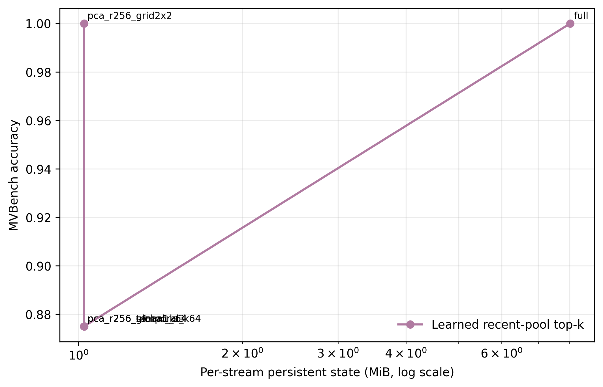
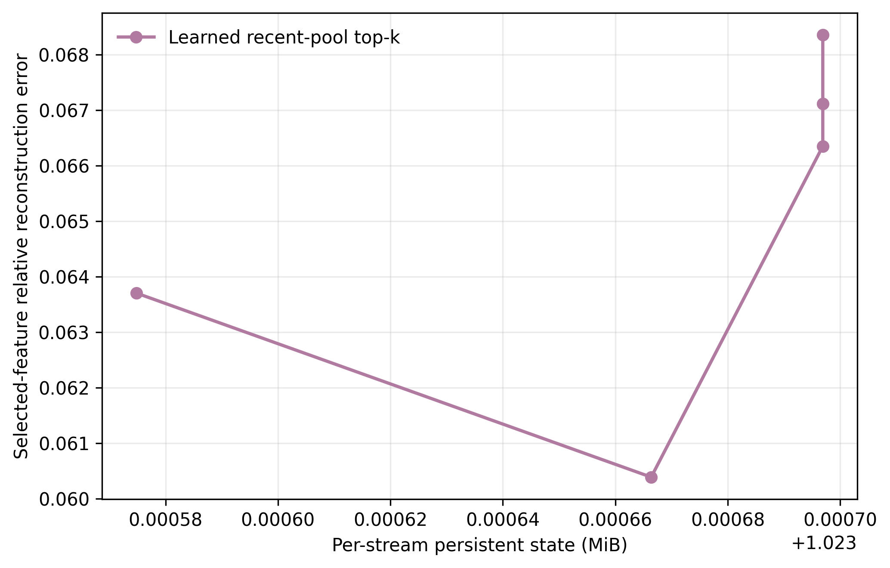
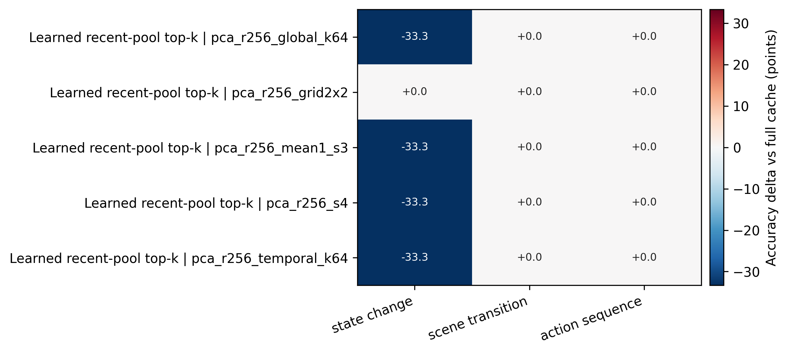
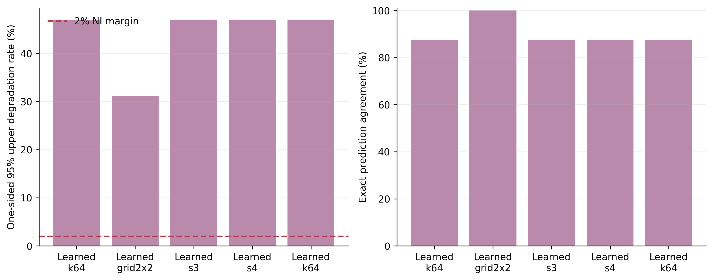

# Compressed Native Feature-Memory Analysis

- Completed checkpoints: 8.
- Configuration fingerprints: 1.

## Variant Summary

| Selector | Memory | Accuracy | Steady-state MiB | Cold-start MiB | Compression | Selected error |
|---|---|---:|---:|---:|---:|---:|
| Learned recent-pool top-k | full | 100.00% | 8.024 | 8.024 | 1.00x | 0.0000 |
| Learned recent-pool top-k | pca_r256_global_k64 | 87.50% | 1.024 | 3.032 | 7.84x | 0.0663 |
| Learned recent-pool top-k | pca_r256_grid2x2 | 100.00% | 1.024 | 3.031 | 7.84x | 0.0637 |
| Learned recent-pool top-k | pca_r256_mean1_s3 | 87.50% | 1.024 | 3.031 | 7.84x | 0.0604 |
| Learned recent-pool top-k | pca_r256_s4 | 87.50% | 1.024 | 3.032 | 7.84x | 0.0671 |
| Learned recent-pool top-k | pca_r256_temporal_k64 | 87.50% | 1.024 | 3.032 | 7.84x | 0.0684 |

## Paired Accuracy Versus Full Cache

Non-inferiority margin: 2.0%. The decision uses the one-sided 95% Clopper-Pearson upper bound on full-correct/compressed-wrong outcomes.

| Selector | Memory | Gain | 95% CI | Prediction agreement | Better / worse | Worse upper 95% | Non-inferior |
|---|---|---:|---:|---:|---:|---:|---:|
| Learned recent-pool top-k | pca_r256_global_k64 | -12.50% | [-37.50%, +0.00%] | 87.50% | 0 / 1 | 47.07% | no |
| Learned recent-pool top-k | pca_r256_grid2x2 | +0.00% | [+0.00%, +0.00%] | 100.00% | 0 / 0 | 31.23% | no |
| Learned recent-pool top-k | pca_r256_mean1_s3 | -12.50% | [-37.50%, +0.00%] | 87.50% | 0 / 1 | 47.07% | no |
| Learned recent-pool top-k | pca_r256_s4 | -12.50% | [-37.50%, +0.00%] | 87.50% | 0 / 1 | 47.07% | no |
| Learned recent-pool top-k | pca_r256_temporal_k64 | -12.50% | [-37.50%, +0.00%] | 87.50% | 0 / 1 | 47.07% | no |

## Query-Conditioned Selector Gain at Matched State

| Memory | Candidate versus exact recent | Gain | 95% CI | Better / worse | McNemar p |
|---|---|---:|---:|---:|---:|

## Claim Boundary

- PCA and sparse residual coding are established compression tools. This experiment tests task preservation and systems trade-offs, not mathematical novelty.
- Shared codec parameters and per-stream state are reported separately. Cold-start state includes the shared codec for compressed variants; steady-state state does not amortize it into every stream.
- A lower reconstruction error is not sufficient; promotion requires preserving full-cache LLaVA accuracy.
- The non-inferiority gate is conservative: compressed improvements do not offset full-correct/compressed-wrong events.

## Figures

