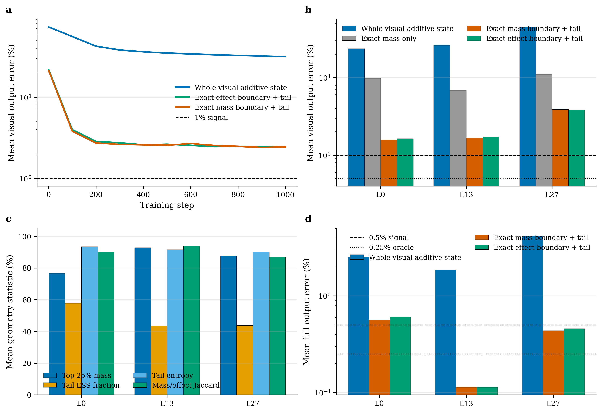

# 条件冗余、可加状态与 exact innovation：统一理论和新实验边界

日期：2026-08-30

范围：Wan2.1 去噪 residual 历史、LLaVA-OneVision/VSI reader memory、固定 CMRQ selection、可加 `N/Z` 状态和 exact-boundary tail oracle。

## 直接判决

当前理论与实验是一致的，但结论需要比“结构化方法失败”更精确：

\[
\boxed{
\text{冗余存在于条件分布中；冻结模型没有把它暴露为低带宽、跨样本稳定的充分状态。}
}
\]

这解释了为什么：

- 增加固定低秩、BCM/BCCB、DPLR 或 past-only expert 没有解决 Wan residual；
- current block input 的逐通道 field 在部分 Wan 层恢复了大部分 oracle gap；
- 固定 reader-risk basis 在 VSI calibration 有信号，到 official selection 却不显著优于 permuted null；
- 训练一个完全可加的 width-32 `N/Z` 状态能显著降低误差，却无法逼近完整 OneVision visual measure；
- 精确读取 25% 高质量原子后，hybrid 误差再下降一个数量级，但高熵 tail 仍不能满足冻结 fidelity Gate。

因此，下一主线不是更大的固定结构，也不是继续调 fallback threshold。唯一仍有清晰机制依据的方向是：

> **让模型在训练或低成本适配时主动形成条件充分、可合并的 bulk state；无法进入该状态的条件创新保留为规则 exact evidence，并用任务风险决定渐进式修正或回退。**

这不是当前已实现的正向方法。当前结果只把它限定成一个有条件的下一 Gate。

## 一、历史结果在同一理论下如何对齐

| 证据 | 结果 | 统一解释 |
|---|---:|---|
| Wan `EXP-004` past-residual-only | 最强 causal 方法约 `1.001x` AR(2) | 增加算子容量不能恢复缺失的 current mode/orientation |
| Wan target-visible temporal oracle | 晚层最高 `5x--11x` | 条件坐标存在，但推理时不可观测 |
| Wan `EXP-005` current-input diagonal field | pooled risk `1.937x`，oracle-gap recovery `0.877` | current state 提供有效条件变量 |
| Wan `EXP-005` breadth Gate | 仅 L21/L24/L25 通过 | 条件冗余高度 layer/stage dependent，不能统一跳层 |
| VSI calibration CMRQ | margin-zero fallback `7/72`，剩余 1 mismatch | 固定 bulk 加少量风险边界在已见分布上有信号 |
| VSI official selection CMRQ | agreement `93.88%`；paired KL CI 跨零 | 固定风险方向不随未来问题稳定迁移 |
| query-fixed prototype/Gaussian/page 系列 | 全部 no-go | K/V 的局部统计或规则页不能充当开放查询的充分统计量 |
| 本轮 whole-measure additive `N/Z` | visual `31.51%`，full `2.86%` | width-32 正值可分离 kernel 不能表示完整 frozen attention measure |
| 本轮 25% exact + additive tail oracle | visual `2.37%`，full `0.372%` | 尖峰和 bulk 分解有效，但 residual bulk 仍超出函数类 |

这里的共同边界是：

\[
\text{统计相关性}
\not\Rightarrow
\text{低条件创新}
\not\Rightarrow
\text{低维充分状态}
\not\Rightarrow
\text{便宜且可部署的算子}.
\]

## 二、本轮新增实验

### 2.1 数据边界和实现检查

- 模型：冻结 LLaVA-OneVision Qwen2-7B。
- visual tokens：8 帧、每帧 196 token，共 1,568 token。
- 层：0、13、27；每层 28 heads，head dim 128。
- 训练：VSI calibration positions 1--72。
- 开发：positions 73--96。
- positions 97--120 未捕获、未读取，仍是一次性 confirmation reserve。
- 新实验没有读取 official selection 或 formal；旧 CMRQ 已独立使用 official selection 并关闭 no-go。
- exact Q/K/V eager-attention replay 在 96 个样本、三层上最大误差为 `0.0`。
- 相关远端测试 `15/15`、additive tests `8/8`、boundary tests `4/4`、geometry test `1/1` 通过。

### 2.2 Whole-measure additive state

状态为：

\[
S=\sum_j\phi_k(k_j)v_j^\top,
\qquad
z=\sum_j\phi_k(k_j),
\]

\[
\hat y(q)=\frac{\phi_q(q)^\top S}{\phi_q(q)^\top z}.
\]

`S,z` 对任意不交叠片段严格可加，因此它直接测试“固定宽度、query-independent、mergeable memory”函数类。只训练 per-head Q/K feature projections、bias 和正 visual mass scale；原 reader/QKV 全部冻结。

| endpoint | untrained | learned |
|---|---:|---:|
| visual mean | 73.406% | **31.509%** |
| visual P95 | 94.930% | **52.518%** |
| visual worst | 97.004% | **65.178%** |
| full mean | 4.863% | **2.863%** |
| full P95 | 9.341% | **7.453%** |
| analytic state ratio | - | **97.24x** |

分层 learned visual mean 为：

- L0：23.598%；
- L13：26.062%；
- L27：44.867%。

训练到 1,000 步仍缓慢下降，但后 100 步只降低约 `0.42--0.68` 个百分点，距离 `1%` Gate 仍有一个数量级。冻结判决为 `NO_ADDITIVE_NZ_FEATURE_STATE`，因此没有打开 confirmation。

### 2.3 Exact-boundary plus additive-tail oracle

第二个 Gate 不增加 width，只改变一次函数类。对每个 sample/layer/head 精确保留 25% visual tokens，additive state 只拟合剩余 tail，并共享同一个 numerator/denominator：

\[
\hat y=
\frac{N_{\Omega}^{\rm exact}+\hat N_{\bar\Omega}}
     {Z_{\Omega}^{\rm exact}+\hat Z_{\bar\Omega}}.
\]

比较两个同预算 oracle support：

- `mass_topk`：最高 exact logits；
- `effect_topk`：最高 \(e^{s_j}\lVert v_j-y_{visual}\rVert_2\)。

| selector | exact-only visual mean | learned-tail visual mean/P95/worst | learned-tail full mean/P95 |
|---|---:|---:|---:|
| mass top-k | 9.228% | **2.368% / 4.567% / 5.252%** | **0.372% / 0.733%** |
| effect top-k | 9.238% | **2.384% / 4.401% / 5.442%** | **0.392% / 0.792%** |

analytic active-state ratio 为 `3.842x`，但它没有计入 dense oracle selector、writer、kernel 或 cold exact storage，因此不是速度声明。

两种 selector 都不满足 visual `1%/2%/5%` capacity-signal 门槛，冻结判决为 `NO_BOUNDARY_ADDITIVE_TAIL_PATH`。positions 97--120 继续封存。

分层 mass-top learned-tail visual mean 为：

- L0：1.561%；
- L13：1.664%；
- L27：3.879%。

这不是单一坏层造成的假失败；没有一层通过 1% signal，L27 只是更困难。

### 2.4 Tail geometry

FP64 诊断仅使用已暴露 development split，不能改变 Gate 判决。

| layer | top-25% mass | tail ESS / tail tokens | tail normalized entropy | mass/effect support Jaccard |
|---:|---:|---:|---:|---:|
| 0 | 76.60% | 57.74% | 93.52% | 89.98% |
| 13 | 92.83% | 43.58% | 91.59% | 93.80% |
| 27 | 87.61% | 43.80% | 89.96% | 86.87% |

这给出两个新 insight：

1. exact boundary 确实移除了大量概率质量，因此 hybrid 相对 whole-state 大幅改善不是偶然；
2. 剩余 tail 的 entropy 仍接近 0.9，且有效支持覆盖数百个 token，所以它不是“再找几个 outlier”就能解决的稀疏残差。

mass/effect Jaccard 很高，effect support 平均保留的质量还略低于 mass support。value-aware heuristic 没有发现一组独立的低质量、高杠杆异常原子。

跨层聚合时，tail max probability 与误差相关；但逐层相关很弱或方向变化。这说明简单 scalar uncertainty 主要识别“哪一层难”，不能在同层内可靠认证样本，和此前 tiny controller/risk-observable writer no-go 一致。

原始数据和绑定脚本：

- `analysis/onevision_reader_quotient_stage_a_20260830/additive_nz_feature_state_dev_v1/`
- `analysis/onevision_reader_quotient_stage_a_20260830/exact_boundary_additive_tail_dev_v1/`
- `analysis/onevision_reader_quotient_stage_a_20260830/exact_boundary_tail_geometry_dev_v2_fp64/`
- `figures/plot_conditional_redundancy_state_gate.py`

## 三、理论为什么一致

### 3.1 条件创新分解是共同核心

对被替换模块输出 \(Y\)、历史 \(H\) 和廉价观测 \(Z\)：

\[
\mathbb E\lVert Y-\hat Y(Z,H)\rVert^2
=
\mathbb E\operatorname{tr}\operatorname{Cov}(Y\mid Z,H)
+
\mathbb E\lVert\mathbb E[Y\mid Z,H]-\hat Y(Z,H)\rVert^2.
\]

第一项是给定信息集后的条件创新下限；第二项才是函数族和拟合误差。固定结构只能降低第二项。`EXP-004 -> EXP-005` 的变化只增加 current input，就把 Wan 风险近乎减半，正是第一项发生变化的证据。

对 open-query visual memory，未来 query \(q\) 本身是条件变量。若 writer 在写入视频时不知道未来问题，一个固定有限状态必须同时支持很大的 query family。当前 whole-state no-go 表明 frozen OneVision 没有把这一 family 压入 32 维 positive feature map。

### 3.2 Additive state 的本质是指数核低秩近似

visual attention 是联合 K/V 测度的指数倾斜：

\[
Z(q)=\sum_j e^{q^\top k_j},
\qquad
N(q)=\sum_j e^{q^\top k_j}v_j.
\]

用 \(r\) 维 `N/Z` state 等价于近似：

\[
e^{q^\top k}\approx\phi_q(q)^\top\phi_k(k),
\]

其 query-key kernel rank 至多 \(r\)。Performer/FAVOR+ 已给出正随机特征近似 softmax attention 的理论和架构先例；Infini-attention 已使用局部 exact attention 加长期 compressive linear memory。因此，本轮不能主张首次 additive `N/Z` memory。[Performer](https://arxiv.org/abs/2009.14794)、[Infini-attention](https://arxiv.org/abs/2404.07143)

本轮的贡献是目标模型上的否定边界：post-hoc width-32 learned feature map 不能成为 frozen OneVision 的高保真 reader substitute；即使 exact 移除 25% 质量最大的原子，tail 仍是高熵且条件相关的。

### 3.3 热力学解释只适用于正确对象

对 diffusion/DiT，Score-SDE 把生成写成时间依赖反向随机过程，漂移误差应按噪声协方差和 suffix 传播风险度量，而不是普通 feature cosine。[Score-SDE](https://arxiv.org/abs/2011.13456)

路径 KL 的二次近似：

\[
D_{KL}(P\Vert\hat P)
\simeq
\frac12\mathbb E\int
\delta b_t^\top a_t^{-1}\delta b_t\,dt
\]

可以解释 Wan 不同 denoising stage 的误差不等价。随机热力学提供轨迹、不可逆性和 entropy production 的背景，但 Wan 内部 feature 没有可直接宣称的物理温度。[Seifert](https://arxiv.org/abs/1205.4176)

对于 OneVision reader，没有 diffusion path，也不应搬用 \(a_t^{-1}\)。对应 metric 应来自 final logits、answer margin 或 downstream Jacobian。两类任务共享的是“条件创新/有限观测”框架，不共享具体热力学度量。

## 四、与视频理解相关工作的边界

- [LongVU](https://arxiv.org/abs/2410.17434) 已使用跨模态 query、帧间相似性和时空自适应压缩。
- [Quest](https://arxiv.org/abs/2406.10774) 已使用 query 与 page-level K min/max 做关键 KV page 选择。
- [StreamMem](https://arxiv.org/abs/2508.15717) 已研究 query-agnostic、固定大小的 streaming video KV memory。
- [StreamKV](https://arxiv.org/abs/2511.07278) 已使用语义 segment、KV retrieval 与 compression。
- [MuKV](https://arxiv.org/abs/2605.22269) 已使用 patch/frame/segment 多粒度 KV 和半层次 retrieval。
- [VarRate](https://arxiv.org/abs/2607.15498) 已指出不可逆 token eviction 在 query-agnostic reuse 下脆弱，并以 variable-rank 保留所有 token。
- [Compressive Transformer](https://arxiv.org/abs/1911.05507) 和 Infini-attention 已覆盖长期压缩记忆的大框架。

因此，不能主张首次 query-aware compression、首次 exact + compressed memory、首次 additive state 或首次多粒度 streaming memory。

若后续要形成独立贡献，差异必须来自一个统一优化原则，而不是模块清单：

> **support-state co-design：exact support 的目标不是保留最大 attention mass，而是使未读取部分成为低条件创新、可合并的任务充分状态；部署时使用校准 adverse-risk 证书渐进修正。**

当前 effect-top heuristic 与 mass-top 几乎相同，说明这个目标尚未被实现。

## 五、下一方法：Conditional Innovation Memory

### 5.1 单一原则

将每个历史单元分成两类，而不是预设低秩/稀疏/BCM：

\[
\text{memory item}=
\begin{cases}
\text{bulk state}, & \text{若它属于条件充分统计；}\\
\text{exact innovation}, & \text{否则。}
\end{cases}
\]

可部署状态写为：

\[
M_t=(S_t,z_t,\mathcal E_t,U_t),
\]

其中 `S,z` 是 mergeable bulk，\(\mathcal E\) 是规则 exact evidence buffer，\(U\) 是校准 uncertainty/risk state。

### 5.2 必须训练原生，而非继续 post-hoc 拟合

训练目标应同时约束任务、merge path 和预算：

\[
\min_{\theta,\psi}
\mathbb E_{V,q}
\left[
D_{KL}\bigl(p_{dense}(\cdot\mid V,q)\Vert p_{M}(\cdot\mid V,q)\bigr)
+\lambda_{pc}\mathcal L_{path}
+\lambda_c C_{H200}(M)
\right],
\]

\[
\mathcal L_{path}
=
\left\|
M(A\cup B)-M(A)\oplus M(B)
\right\|^2.
\]

训练只允许更新：

- memory writer / feature map；
- regular group support scorer；
- shared normalization；
- 可选 Q/K LoRA rank 4/8，使注意力质量主动进入可表示 bulk。

base vision encoder、LLM 主干和 V 投影先冻结。只有 support 与 state 在同预算下联合训练显著优于单独训练，才支持“怎样叠加”的创新主张。

### 5.3 Exact correction 应保持测度一致

若使用渐进 exact retrieval，正确控制变量形式是：

\[
\hat N_{\Omega}
=
\hat N_{all}
+\sum_{g\in\Omega}
\left(N_g^{exact}-\hat N_g\right),
\]

\[
\hat Z_{\Omega}
=
\hat Z_{all}
+\sum_{g\in\Omega}
\left(Z_g^{exact}-\hat Z_g\right),
\qquad
\hat y_{\Omega}=\hat N_{\Omega}/\hat Z_{\Omega}.
\]

这比“分别归一化两条 branch 再混合”严格；所有 exact groups 取回时恢复 dense measure。历史结果已警告输出误差不保证随任意 group 单调下降，因此 support 仍需直接优化 task risk。

### 5.4 风险证书

对于 future query，fallback 条件应是校准分位数而非局部 MSE：

\[
\widehat q_{1-\alpha}
\left(
R_{task}\mid q,M,\Omega
\right)
\le
\epsilon_{margin}.
\]

若不满足，则按 risk/cost 继续读 exact groups；证书必须在 untouched query/video 上验证覆盖率。简单 entropy、mass 或 tail max 不能直接充当证书，本轮逐层相关性已否定这一捷径。

## 六、下一 Gate 和停止条件

### Gate A：低成本训练原生容量

数据仍只用 1--72 train、73--96 development；97--120 保持未读。

同 active-state 预算比较：

1. exact support only；
2. learned additive state only；
3. independently trained support + state；
4. jointly trained support-state；
5. joint + Q/K LoRA rank 4/8，仅在 4 显著为正后运行。

support 必须是 4-token/regular page 粒度，不能使用 token-level oracle。主要 endpoint 改为 dense teacher logits KL、answer margin 与任务 accuracy；同时保留 local `N/Z` error 防止任务偶然抵消。

只有 joint 在相同 exact fraction、state width 和 active-read proxy 下同时满足：

- 相对 independent support + state 至少 25% task-risk 改善；
- development answer agreement至少 98%，无 harmful flip；
- merge-order/path consistency error小于 1%；
- analytic active-state ratio至少 3x；

才打开 positions 97--120 confirmation。

### Gate B：确认和真实系统成本

confirmation 通过后才测：

- unknown future-query 类型迁移；
- multiple questions per same video；
- cold exact storage、writer 和 router 成本；
- H200 active-read latency与端到端 TTFT。

实际 whole-reader speedup小于 `1.2x` 或 task loss超过 1 point 时停止系统路线。

### 明确 no-go

如果 joint support-state 在 development 仍不优于 independent baseline，结论应是：

> frozen/low-cost adapted OneVision 的 open-query memory 不能由当前 bounded state 接口高保真承载。

此时停止自研 post-hoc memory compressor，转用 StreamMem/StreamKV/MuKV/Quest/VarRate 类强 baseline，或训练一个原生 state/render 分离的视频理解模型。不再增加 BCM blocks、固定风险 atoms、feature width 或 heuristic fallback。

## 七、当前可主张与不可主张

可以主张：

- 条件变量比固定算子容量更关键；
- width-32 additive `N/Z` state 在 frozen OneVision 上有明显但不足的容量；
- 25% exact boundary 可将 full-output mean 从 2.863% 降至 0.372%，但 visual tail 仍不满足 fidelity Gate；
- tail 高熵且 mass/effect support 高度重叠，继续找少量静态 outlier 缺乏依据；
- 下一步必须改变训练接口和任务目标。

不能主张：

- confirmation、formal 或跨数据集成立；
- additive/hybrid state 可部署；
- `3.842x` 是实测加速；
- thermodynamic entropy 等同于内部 feature entropy；
- 所有低秩、稀疏或结构化 memory 都无效；
- 已经形成独立于现有 streaming-memory 工作的论文方法。
