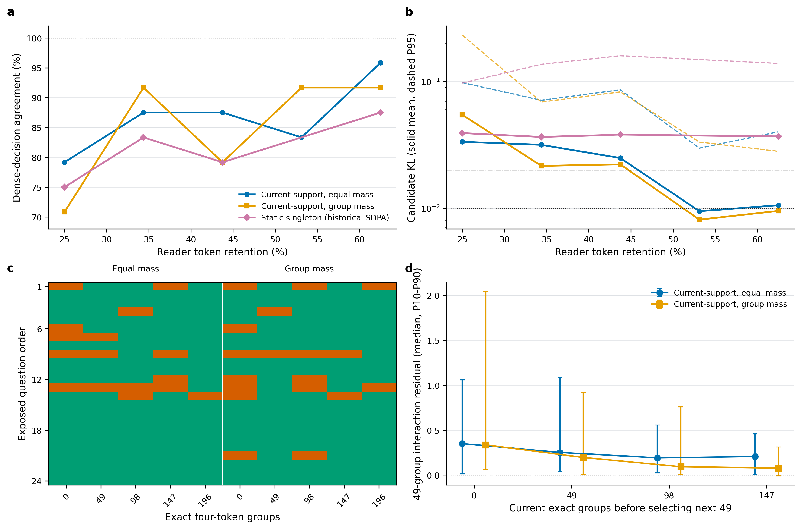
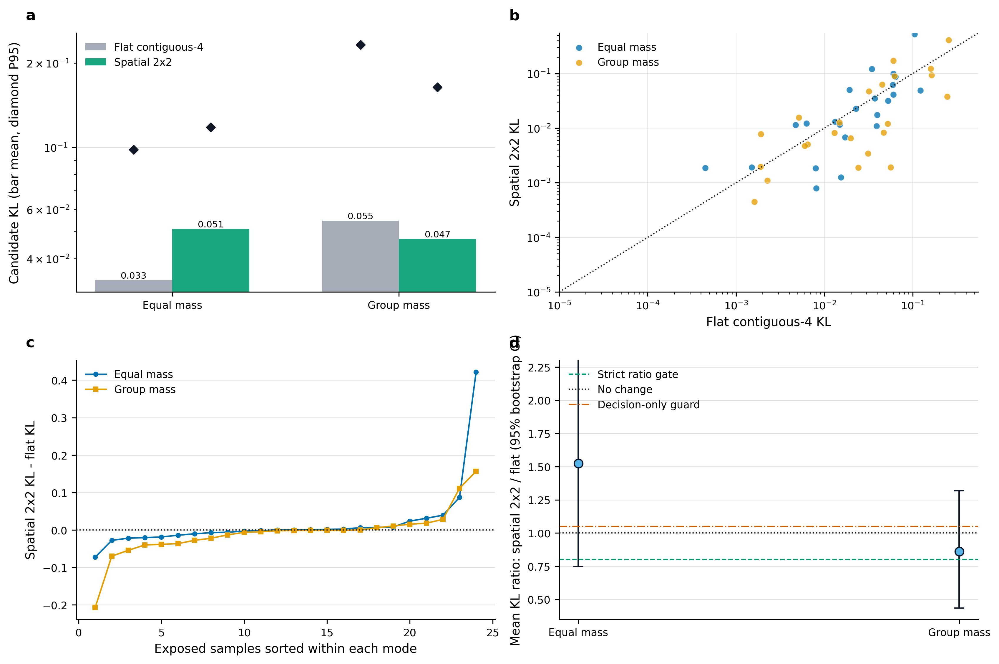
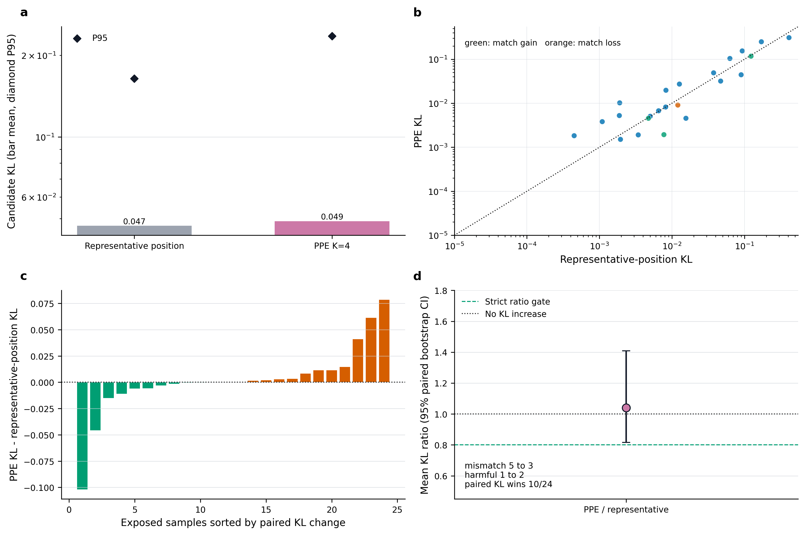

# 条件冗余理论、压缩路径几何与 reader-aligned 边际审计

日期：2026-08-30
范围：Wan `EXP-002`--`EXP-005` 的理论边界，以及 VSI/OneVision stable quotient、
target-risk budget、位置几何和 reader-aligned singleton 诊断。本文不改变 Wan
`L-026` 主线，不读取 VSI positions 97--120、selection 或 formal endpoint。

## 0. 直接结论

用户提出的“条件冗余、双时间几何和 diffusion 非平衡路径风险”框架在抽象层面
与历史结果一致，而且确实帮助我们继续定位了核心问题；但必须做三项收紧：

1. 它说明应寻找高信息增益的条件观测和正确 endpoint metric，不自动推出 BCM、
   BCCB、low-rank 或任何固定算子。
2. Girsanov/path-KL 只适用于满足条件的同扩散矩阵 SDE。Wan 当前的离散确定性
   sampler 仍应使用 suffix Jacobian、rollout 或 terminal loss，不能把内部 feature
   直接赋予物理温度。
3. 视频理解 reader 不是 diffusion。这里可借用的是条件风险、successive
   refinement 和 information-per-cost，不是 entropy production 的物理解释。

本轮新增证据把瓶颈推进了两层：

> 失败不仅来自局部 writer 看不到全局 reader state；当前 frozen reader 的可变长度
> quotient 路径本身也不满足单调 successive refinement。恢复更多 exact token
> 可能使决策和 KL 反而变差。

同预算的真实空间 `2x2` 控制进一步表明，几何邻接不是独立有效因素。它只在
proportional group mass 同时存在时获得决策级 headroom；equal mass 下反而恶化。
因此可复用对象更接近“带质量和位置的局部测度”，而不是一个无权 token 均值。
随后执行的 paper-faithful `K=4` PPE 虽将 mismatch 从 `5` 降至 `3`，却增加
harmful 并放大 P95 KL，正式判决为 `NO_PPE_HEADROOM`。因此位置完整性也不能单独
建立安全的 frozen-reader refinement path。

因此当前最有潜力的核心不再是“更好的静态 support teacher”，而是：

> **Position/measure-aware、reader-aligned、path-consistent 的层次 quotient memory。**
> 训练时让每个 quotient node 显式携带原始坐标与 token mass，并在嵌套拆分路径上
> 直接约束 reader 分布单调接近 dense；运行时才预测 current-support-conditioned
> 边际收益并做校准 fallback。

这保留了最初的“稳定 bulk + sparse exact innovation + progressive read”动机，但
否定了 frozen reader 上把各 group 风险独立相加的版本。

## 1. 理论与历史实验是否一致

### 1.1 条件风险分解是正确主轴

对固定正半定任务度量 `W`，平方风险可分解为：

\[
R_W(\hat Y)
=
\mathbb E\operatorname{tr}\operatorname{Cov}_W(Y\mid Z,H)
+
\mathbb E\|\mathbb E[Y\mid Z,H]-\hat Y(Z,H)\|_W^2.
\]

它准确解释了历史结果：

| 证据 | 结果 | 对应解释 |
|---|---:|---|
| `EXP-004` past-only full-rank/MoE | 最佳约 `1.001x` | 增加函数容量没有补回 current mode |
| `EXP-004` target-visible oracle | late layer 最高 `11.077x` | 目标条件下存在强冗余 |
| `EXP-005` current-input diagonal field | pooled `1.937x` | current input 显著降低部分层的条件创新 |
| `EXP-005` breadth gate | 仅 layers `21/24/25` 通过 | 该 observer 不是十层连续接口 |
| VSI stable quotient | bulk 可压缩 | 存在统计冗余 |
| VSI local metadata writer/controller | recall 约 `30%` | 局部低带宽状态看不到 reader boundary |

因此“统计冗余存在”与“存在便宜、共享、闭环稳定的算子”确实是不同命题。

### 1.2 双时间曲率是有用诊断，不是已测事实

把物理视频时间记为 `tau`、去噪时间记为 `lambda`，交换缺陷

\[
\mathcal F_{\tau\lambda}
=-
\partial_\tau L_\lambda
+\partial_\lambda L_\tau
+[L_\tau,L_\lambda]
\]

能解释为什么物理 transport 不自动成为跨 denoising-step residual predictor。
RoPE、AdaLN、CFG、遮挡和 routing 都可使该曲率随条件变化。但当前实验没有直接
估计这一定义中的两个生成元，所以它应被称为机制模型，而不是经验测量结果。

### 1.3 diffusion 路径风险需要严格适用边界

若 exact 与 approximate SDE 具有相同、非退化扩散矩阵，并满足 Girsanov 条件，
漂移差的路径代价由

\[
\frac12\mathbb E\int
\delta b_t^\top a_t^{-1}\delta b_t\,dt
\]

控制。这支持“低噪阶段同样 feature MSE 可能更危险”的判断。[Score-SDE](https://arxiv.org/abs/2011.13456)
与随机热力学可提供背景，[Seifert](https://arxiv.org/abs/1205.4176)；但 Wan 的离散
UniPC/rCM 评估不能直接用该式替代真实 rollout。正确实现仍需：

\[
\mathcal R_{\ell,k,H}
=e_{\ell,k}^\top G_{\ell,k,H}e_{\ell,k}
+\operatorname{tr}(G_{\ell,k,H}\Sigma_{\rm inn})
+\beta H(M\mid Z).
\]

这里 `G` 必须由 suffix/terminal 任务诱导，而不是默认 `I`。

## 2. 新增 budget 与几何诊断

### 2.1 dense-gradient budget frontier：没有可靠容量窗口

在已暴露 positions 73--96 上，把 exact group 从 `0` 扫到 `392`：

| exact groups | token retention | agreement | harmful | KL mean / P95 |
|---:|---:|---:|---:|---:|
| 0 | 25.00% | 70.83% | 2 | 0.0600 / 0.2154 |
| 98 | 43.75% | 91.67% | 2 | 0.0270 / 0.0874 |
| 196 | 62.50% | 95.83% | 1 | 0.0113 / 0.0321 |
| 245 | 71.88% | 95.83% | 0 | 0.0106 / 0.0263 |
| 343 | 90.63% | 91.67% | 1 | 0.0104 / 0.0329 |
| 392 | 100.00% | 100% | 0 | 0 / 0 |

即使 target-risk mass 在 `k=343` 已约 100%，决策仍会错误；路径也不是单调的。
预注册判决为 `NO_USEFUL_CAPACITY_WINDOW`。

### 2.2 保留原始位置显著改善离散决策，但没有恢复分布

同一 gradient support 在三种路径下比较：

| `k=196` 机制 | reader slots | agreement | harmful | KL mean / P95 |
|---|---:|---:|---:|---:|
| compact contiguous positions | 62.5% | 91.67% | 1 | 0.0122 / 0.0374 |
| compact original positions | 62.5% | **100%** | **0** | 0.0213 / 0.0468 |
| fixed repeated quotient | 100% | **100%** | **0** | 0.0329 / 0.1631 |

原始位置把离散 reader 决策恢复到 `24/24`，证明 quotient 不是完全无效；但 KL
未达 `0.01/0.02`，且 `k=294/343` 又出现错误，预注册判决仍为
`NO_GEOMETRY_RECOVERY`。

这说明位置是必要状态之一，却不是充分状态。token multiplicity、attention
normalization 和 group interaction 仍未解决。

### 2.3 dense-gradient teacher 本身不稳定

两个独立运行的 `compact_contiguous` 在 `k=0/392` 完全一致，说明 base quotient
和 dense endpoint 稳定；一旦使用非零 gradient support，排序差异产生：

| `k` | 改变 top-1 的问题数 | mean absolute KL delta | max delta |
|---:|---:|---:|---:|
| 98 | 2/24 | 0.00366 | 0.02371 |
| 128 | 0/24 | 0.00967 | **0.14269** |
| 196 | 1/24 | 0.00355 | 0.03160 |
| 343 | 3/24 | 0.00356 | 0.03164 |

因此此前“target-gradient oracle”必须收窄为 **BF16/SDPA dense-path 一阶 teacher**，
不是可变长度 compact path 的真实 oracle，也不够稳定到承担主 capacity claim。

## 3. reader-aligned singleton Gate：真实局部收益仍不能形成路径

为排除 teacher/objective mismatch，本轮对 24 个已暴露问题、每个 392 个 group
逐一执行真实 compact reader：

\[
\Delta_g(\varnothing,q)
=D_q(\varnothing)-D_q(\{g\}),
\qquad
D_q(\Omega)=\operatorname{KL}(p_{\rm dense}^q\Vert p_\Omega^q).
\]

按该真实 singleton benefit 排序后形成静态嵌套路径，结果为：

| exact groups | retention | agreement | harmful | KL mean / P95 |
|---:|---:|---:|---:|---:|
| 0 | 25.00% | 75.00% | 3 | 0.0392 / 0.0974 |
| 49 | 34.38% | 83.33% | 1 | 0.0365 / 0.1369 |
| 98 | 43.75% | 79.17% | 2 | 0.0381 / 0.1601 |
| 196 | 62.50% | 87.50% | 0 | 0.0369 / 0.1392 |
| 245 | 71.88% | 87.50% | 0 | 0.0427 / 0.1527 |
| 343 | 90.63% | 91.67% | 0 | 0.0141 / 0.0729 |
| 392 | 100.00% | 100% | 0 | 0 / 0 |

预注册判决为 `NO_STATIC_READER_PATH`，dense/full equivalence 与重复推理误差均为
`0`。

更关键的是交互量：

\[
I_q(\Omega_k)
=D_q(\Omega_k)
-\left[D_q(\varnothing)-\sum_{g\in\Omega_k}\Delta_g(\varnothing,q)\right].
\]

| `k` | mean interaction residual | median | positive samples |
|---:|---:|---:|---:|
| 49 | **0.555** | 0.324 | 22/24 |
| 98 | **0.878** | 0.358 | 21/24 |
| 196 | **1.213** | 0.424 | 21/24 |

前 49 个 singleton 收益相加会预测平均 KL 为 `-0.518`，实际为 `0.0365`；到
196 个时预测为 `-1.176`，实际仍为 `0.0369`。24/24 问题均至少出现一次 KL
反向增加，共 `71` 次 budget-to-budget KL regression；另有 `6` 次
match-to-mismatch regression。

这不是 predictor 太弱，而是 set function 本身不满足当前方法需要的单调可加性。
实际边际必须写为：

\[
\Delta_g(\Omega,q)
=D_q(\Omega)-D_q(\Omega\cup\{g\}),
\]

它依赖当前 support、序列长度、位置、token mass 和全部 reader state。

### 3.1 与 adaptive submodularity 的关系

若收益函数单调且满足 diminishing returns，current-support greedy 才有经典近似
保证。[Adaptive Submodularity](https://arxiv.org/abs/1003.3967) 给出了这一类信息
获取问题的理论基础。当前结果更严重：某些 exact split 直接增大 `D`，因此连
单调性都不成立；不能继续把一阶 score 相加成 certificate。

### 3.2 baseline reader 本身较弱

本组 dense reader task accuracy 只有 `25%`。所以 agreement/KL 只是“复现该
reader”的 fidelity，不等于任务质量。任何最终方法都必须在更强 reader、完整
VSI/VideoMME 等 endpoint 和 wall-clock 上重新验证，不能从当前 24 个问题得出
通用视频理解结论。

## 4. 为什么现有 compaction path 会违反单调性

压缩 reader 实际计算的是：

\[
p_\Omega^q
=\operatorname{softmax}
f\left(
T_\Omega(X),
P_\Omega,
M_\Omega,
q
\right),
\]

其中：

- `T_Omega` 决定 exact/quotient token；
- `P_Omega` 决定保留后的 RoPE/position geometry；
- `M_Omega` 是每个 token 代表的原始 patch 数量；
- support 改变序列长度和后续所有层的 attention denominator。

旧 gradient teacher 在 dense fixed-slot 点上线性化；singleton teacher在空 support
点测量。两者都没有估计从 `Omega` 到 `Omega union {g}` 的真实条件边际。

ToMe 已明确跟踪 token size，并在 attention logits 中做 proportional attention；
其消融表明该机制对 supervised model 很重要。[ToMe](https://arxiv.org/abs/2210.09461)
因此 token mass 不是可选元数据，也不是我们的新意。

本轮 measure-preserving 实现尝试了显式 4D additive mask，但 all-mass-one 路径
相对普通 2D SDPA path 的 candidate logits 仍变化 `0.25`。两次尝试均按协议归类
为 **invalid engineering**，不能解释为 proportional attention 无效。后续必须先
在同一 attention kernel path 中通过 all-mass-one dense-equivalence，才可比较 mass。

## 5. 核心改进：Path-Consistent Successive-Refinement Quotient

### 5.1 状态表示

每个层次 quotient node 不只保存一个 mean，而保存：

\[
n=(\mu_n,\;m_n,\;p_n,\;c_n,\;\text{children}_n),
\]

其中：

- `mu_n`：bulk representative；
- `m_n`：代表的原始 token mass；
- `p_n`：原始时空坐标或可组合位置统计；
- `c_n`：低成本 content/query key；
- children：冷存的 exact innovation 或下一层 quotient。

BCM/BCCB 可以作为离线布局或局部编码工具，但不再承担 reader-risk basis。

### 5.2 训练目标直接作用于嵌套路径

训练时采样一条嵌套路径

\[
\Omega_0\subset\Omega_1\subset\cdots\subset\Omega_B,
\]

并优化：

\[
\mathcal L
=
\sum_b w_b D_q(\Omega_b)
+\lambda\sum_b
\left[D_q(\Omega_{b+1})-D_q(\Omega_b)+\epsilon\right]_+
+\beta C_{\rm reader}(\Omega_b)
+\gamma\mathcal L_{\rm coverage}.
\]

第一项保证各预算 fidelity；第二项直接惩罚“读得更多反而更坏”；第三项约束真实
token/latency；第四项校准遗漏风险。这个目标把 progressive read 变成训练原生的
successive refinement，而不是假定 frozen reader 自动具有该性质。信息论中的
[successive refinement](https://arxiv.org/abs/1707.09567) 是理论参照，但神经
reader 是否可逐级精化必须靠训练和实验建立。

### 5.3 teacher 与 deployable router 分离

离线 teacher 使用真实 current-support marginal：

\[
g_b^*=\arg\max_g
\frac{\Delta_g(\Omega_b,q)}{\Delta C_g}.
\]

部署 router 只能看 `(q, c_n, m_n, p_n, current support summary)`，预测边际收益
与上分位风险。只有当嵌套路径本身先稳定，预测器问题才有意义；否则再强的 writer
也只是在拟合一个不一致接口。

### 5.4 exact anchor 与校准 fallback

运行时维护剩余风险上界 `U_b`：

\[
U_b=Q_{1-\alpha}
\left(D_q(\Omega_b)\mid z_b\right).
\]

若 `U_b` 超过预算，则继续拆分或 full fallback。这里 exact read 相当于高成本
测量/anchor，作用是降低条件创新与校准不确定度；这正是热力学/信息增益框架真正
能指导的地方。

## 6. 与相关工作的边界

| 工作 | 已覆盖 | 本方向不能声称 | 尚可验证的差异 |
|---|---|---|---|
| [ToMe](https://arxiv.org/abs/2210.09461) | merging、token size、proportional attention | 首次 mass-aware merging | reader-risk path consistency |
| [FrameFusion](https://arxiv.org/abs/2501.01986) | similarity merge + importance prune | 首次 merge/prune 混合 | adverse-risk nested split |
| [LongVU](https://openreview.net/pdf/584946fd40dfa8c20c7c527f77e27a340b88664f.pdf) | query/inter-frame adaptive compression | 首次 query-aware video compression | actual compact-reader marginal与校准 fallback |
| [MMInference](https://openreview.net/forum?id=me6PfbATWM) | modality-aware permutation sparse attention与kernel | 首次视频 grid/sparse layout | memory quotient的successive-refinement语义 |

FrameFusion 报告高相似 token 在早层可 merge、深层再按重要性 prune；LongVU
使用 query 与 inter-frame dependency；这些都与“稳定 bulk + task-sensitive
innovation”相容。但它们没有让我们的当前结果自动成立。创新必须由相同
reader、相同 token/latency budget 下的独立增益证明。

## 7. 下一轮严格顺序

### Gate M0：同 kernel 的 measure equivalence

1. 在 eager 或可控 SDPA attention path 中，让 equal-mass 2D/4D 或 fused bias
   candidate logits 等价到 `1e-5`。
2. 再测试 `log m` proportional attention；不先比较质量。
3. 若无法获得同路径等价，停止该实现，不把 kernel 数值差异当算法证据。

### Gate M1：train-free monotonicity ceiling

在已暴露数据上比较：

- original-position only；
- original-position + proportional mass；
- current-support greedy marginal；
- fixed repeated diagnostic ceiling。

继续条件：在 `k<=196` 达到 `24/24`、`0 harmful`、KL `<=0.01/0.02`，且无
match/KL regression。若 mass-aware current-support oracle 仍失败，关闭 frozen
reader 的 train-free progressive quotient，不再增加 controller/BCM 容量。

### Gate M2：低成本 path-consistency adaptation

仅在 M1 表明函数类有上限、但 frozen path 不稳定时进行：

- 冻结视觉 encoder、原始 QKV 和绝大多数 reader 参数；
- 只训练 quotient tokenizer、mass/position adapter、small support router 与
  normalization ratio；
- 训练 positions 1--72，positions 73--96 只做 selection，positions 97--120
  保持一次性最终验证；
- 公平比较 tokenizer-only、router-only、joint path-consistency，以及 ToMe、
  FrameFusion、LongVU 风格 baseline；
- 最终必须补 stronger reader、完整任务、真实 token latency 和 end-to-end wall-clock。

## 8. 对 Wan 主线的影响

该 reader 结果不能用于宣称 Wan cache/attention 失败或成功。它只强化一个共同
原则：

\[
\text{条件冗余}
\not\Rightarrow
\text{raw-space 固定算子}
\not\Rightarrow
\text{单调可部署路径}.
\]

Wan 仍应先完成 released rCM/few-step H200 incumbent；若后续训练 state model，
应把 persistent world/causal state 与 per-step renderer 分离，并用完整 rollout
风险训练，而不是继续 post-hoc 拟合 raw residual。

## 9. 最终判决

当前 frozen-reader、post-hoc 静态 support 路线应继续 `park`。但最初目标并没有
完全失败：stable quotient bulk、exact innovation 和 conditional risk 都有实证
基础。真正需要改变的是它们之间的接口：

\[
\boxed{
\text{stable measure quotient}
+\text{reader-aligned nested refinement}
+\text{path-consistency training}
+\text{calibrated exact fallback}
}
\]

这是一条比“再加一个 low-rank/BCM/controller”更简洁、更接近核心 field problem
的路线。当前最优动作是先完成 M0/M1 的函数类与数值等价诊断；只有它们通过，
才值得投入小步适配与系统 kernel。

## 9.1 M0 后续校正：同 kernel 的 mass 代数等价已通过

M0 最终在 OneVision Qwen2 的 eager attention path 中通过。普通路径、显式
all-mass-one 路径和重复执行在 24 个已暴露问题上的 full-vocabulary logits 最大
误差均为 `0`；`k=392` 的 full-refinement 路径与 dense endpoint 误差也为 `0`。
正式判决为 `SAME_KERNEL_MASS_VALID`。

在此基础上加入 quotient token 的 `log m` bias 后，weighted diagnostics 为：

| exact groups | agreement | KL mean / P95 |
|---:|---:|---:|
| 0 | 70.83% | 0.05464 / 0.23258 |
| 196 | 75.00% | 0.02651 / 0.13432 |
| 392 | 100% | 0 / 0 |

这些数值只说明 proportional mass 已在相同 attention 实现中被正确表达，不说明
它优于 equal mass，也不说明路径单调。eager harness 不是生产延迟候选；标准
SDPA/FlashAttention 也没有直接暴露任意 per-key `log m` 接口，真实部署仍需融合
`exp(score) * mass`、预变换或等价 kernel。M0 首次尝试在全部 forward 完成后因
summary 聚合错误退出，按协议只修复一次聚合逻辑；失败尝试保留，第二次运行才是
上述有效结果。

## 9.2 理论导出的核心候选：风险有界的层次测度 memory

M0/M1 的更深作用不是再证明一种 token score，而是指出当前 decoder
self-attention 接口本身不利于渐进精化。一个更可证明的接口是把视觉状态作为经验
测度，由独立 cross-attention reader 消费：

\[
\mu=\sum_i\delta_{(p_i,k_i,v_i)},\qquad
Z(q)=\int e^{q^\top k}\,d\mu,\qquad
N(q)=\int e^{q^\top k}v\,d\mu,\qquad
A(q,\mu)=N(q)/Z(q).
\]

对层次节点 `g`，保存 mass `m_g`、centroid `bar k_g/bar v_g`、位置状态及半径
`r_k/r_v`。若 `||q||<=Q`，centroid 近似的局部 denominator 余项满足：

\[
\epsilon^Z_g
\le
m_g e^{q^\top\bar k_g}
\left(e^{Q r_{k,g}}-1\right),
\]

numerator 余项可保守界为：

\[
\epsilon^N_g
\le
m_g e^{q^\top\bar k_g}
\left[
e^{Q r_{k,g}}r_{v,g}
+
\left(e^{Q r_{k,g}}-1\right)\|\bar v_g\|
\right].
\]

`N/Z` 的全局误差再由 `sum_g epsilon_g`、`Z` 的正下界和 triangle inequality
控制。实际误差可能因不同节点抵消而非单调，但可以递归保存 envelope：

\[
b_g=\max\left(\tilde b_g,\sum_{c\in\operatorname{child}(g)}b_c\right).
\]

这样把父节点拆成 children 后，未读风险上界按构造不增加。运行时选择：

\[
g^*=\arg\max_g
\frac{b_g-\sum_{c\in\operatorname{child}(g)}b_c}
{\Delta T_{\rm measured}(g)},
\]

并在校准后的 task-risk 上界低于门槛时停止，否则继续拆分或 exact fallback。
这个结构把“稳定 bulk、精确 innovation、条件风险”统一成 adaptive quadrature，
而不是 BCM、低秩和 controller 的并列叠加。

它有四个必须保留的边界：

1. 上述可加性只直接适用于 query 固定的单个 cross-attention memory 接口；在当前
   多层 decoder self-attention 中，压缩会改变后续 query 和状态，不能套用该证明。
2. 几何半径给出的 bound 可能很松，必须用 reader Jacobian/adverse loss 做校准；
   校准证书只对相同数据分布提供统计覆盖，不是任意输入的绝对保证。
3. [FMMformer](https://arxiv.org/abs/2108.02347)、
   [H-Transformer-1D](https://arxiv.org/abs/2107.11906)、
   [Fast Multipole Attention](https://arxiv.org/abs/2310.11960) 和
   [MuSe](https://arxiv.org/abs/2509.10406) 已覆盖层次近远场、multipole 或
   centroid/dipole 近似；不能声称首次层次 attention 或 multipole memory。
4. 可能成立的独立点只能是 actual-reader adverse-risk calibration、可组合 remainder
   envelope、progressive exact split 与实测成本共同决定的 fallback，并且必须在
   相同 reader、token budget 和 latency 下胜过 ToMe/PPE/FMM 类 baseline。

因此 M1 仍是必要 Gate：它先判断当前 frozen decoder 是否已经存在可利用的条件
路径。若 M1 失败，先做同预算 `2x2` geometry/PPE 控制；该控制也失败后，应停止
继续扩充 frozen self-attention controller，转而用单层 external memory prototype
直接验证上述可加 bound 与一次性 support 选择。只有 prototype 同时通过风险和
成本门槛，才训练小型 quotient/risk adapter。

## 9.3 M1 结果：current-support 有 headroom，但没有安全渐进路径

M1 在 positions 73--96 的 24 个已暴露问题上有效完成，未读取 positions
97--120、selection 或 formal。每个样本包含 8 帧、1,568 个视觉 token 和 392 个
展平连续的 4-token group；两种路径都保留原始位置，并在同一个 eager attention
实现中比较 equal mass 与 group mass。离线 teacher 在当前 support 上逐一执行真实
compact reader，按条件 KL benefit 选择下一批 49 个 group：

\[
\Delta_g(\Omega,q)
=D_q(\Omega)-D_q(\Omega\cup\{g\}).
\]

该实验是 transductive 的 batched receding-horizon capacity diagnostic，不是精确
逐 group greedy，也不是部署 router。完整运行耗时 `5,416.10 s`，得到 240 条路径
记录和 61,152 条条件边际记录；正式判决为
`NO_BATCHED_CURRENT_SUPPORT_PATH`。

| mode | exact groups | retention | agreement | mismatch | harmful | KL mean / P95 |
|---|---:|---:|---:|---:|---:|---:|
| equal mass | 0 | 25.00% | 79.17% | 5 | 1 | 0.03348 / 0.09814 |
| equal mass | 49 | 34.38% | 87.50% | 3 | 1 | 0.03162 / 0.07118 |
| equal mass | 98 | 43.75% | 87.50% | 3 | 2 | 0.02487 / 0.08613 |
| equal mass | 147 | 53.13% | 83.33% | 4 | 1 | 0.00946 / 0.02978 |
| equal mass | 196 | 62.50% | **95.83%** | **1** | **1** | 0.01054 / 0.04010 |
| group mass | 0 | 25.00% | 70.83% | 7 | 3 | 0.05464 / 0.23258 |
| group mass | 49 | 34.38% | 91.67% | 2 | 0 | 0.02157 / 0.06893 |
| group mass | 98 | 43.75% | 79.17% | 5 | 2 | 0.02218 / 0.08285 |
| group mass | 147 | 53.13% | 91.67% | 2 | 1 | **0.00810** / 0.03330 |
| group mass | 196 | 62.50% | 91.67% | 2 | 1 | 0.00951 / 0.02810 |

两个 mode 的 strict budget 均为空。最接近门槛的 equal-mass `k=196` 仍有一个
match-to-mismatch harmful flip，且 P95 是注册门槛 `0.02` 的约两倍；group-mass
虽把 mean KL 降至 `0.00951`，却有两个 mismatch 和一个 harmful。两个 harmful
样本的 compressed top-1 margin 都为 `0.125`，因此也不能用“只在近零 margin
处失败”解释。

### 9.3.1 路径非单调不是均值偶然波动

| mode | match-to-mismatch transitions | KL-increase transitions | 有 KL 回退的样本 |
|---|---:|---:|---:|
| equal mass | 6 | 36 | 24/24 |
| group mass | 8 | 33 | 22/24 |

虽然每轮被选中的 49 个 singleton 中有 `71.7%--90.8%` 具有正条件收益，把这些
单项收益相加仍严重高估联合更新。令：

\[
I_{49}
=D_q(\Omega_{b+1})
-\left[D_q(\Omega_b)-\sum_{g\in B_b}\Delta_g(\Omega_b,q)\right].
\]

equal-mass 四轮的 median `I_49` 为 `0.349/0.251/0.192/0.206`，正值样本分别为
`24/24, 23/24, 23/24, 23/24`；group-mass 为
`0.335/0.195/0.092/0.077`，正值样本为 `22/24, 22/24, 23/24, 19/24`。
因此条件边际确有信息，但 49-group batch 内高度冗余并存在 error cancellation；
它不是可直接相加的风险 certificate。

这保留了一个很窄的可能性：更小 batch 或联合 support optimizer 可能改善
transductive oracle。但精确逐 group teacher 约需把四轮扩展到近 196 轮，既昂贵
又不可部署；当前证据不支持直接投入这种 brute-force oracle。

### 9.3.2 proportional mass 是必要表示，不是通过机制

在 `k=49/98/147/196`，group mass 相对 equal mass 的 mean KL 分别变化
`-0.01005/-0.00269/-0.00135/-0.00102`，但逐样本 KL 胜出仅为
`15/12/12/11` 个，决策净胜负分别为 `2:1, 2:4, 3:1, 1:2`。因此 mass 的均值
收益由少量样本驱动且不稳定，不能把 M1 的剩余 headroom 归因于 mass；M0 只证明
它被正确表达。

### 9.3.3 结论边界与下一动作

M1 相对历史 static singleton 明显降低 KL，说明 current support 是有价值的条件
变量；但 historical static 使用 SDPA，而 M1 使用 eager，因此该比较只能是描述性
诊断，不能作为严格 method win。M1 的有效 null 只关闭：

> 原始位置、可选 proportional mass、展平连续 4-token group、每轮 49-group
> current-support singleton teacher 组成的 frozen-reader 路径。

它不关闭 exact sequential greedy、true `2x2` geometry、PPE、多节点 joint
optimizer、external cross-attention memory 或训练原生 path consistency。由于当前
展平连续 group 会在部分位置跨越 `14x14` 行边界，因此先执行一个便宜、相同
预算的 `flat-4 vs true-2x2` 几何控制。PPE 不能用代表位置近似，必须在 RoPE 内
真正聚合多个 constituent position；只有几何控制达到预注册结果，才单独授权该
paper-faithful PPE 控制。若无改善，则冻结 self-attention 的 train-free progressive
quotient 应保持 parked，后续只比较：

1. 单层 external memory 上的可加 numerator/denominator remainder bound；
2. 冻结视觉 encoder/QKV，仅训练 quotient、position/mass adapter 和一次性 support
   router 的 path-consistency 适配；
3. ToMe、PPE、DyCoke、ForestPrune 和 FMM/MuSe 类同预算 baseline。

## 9.4 真实空间 2x2 控制：质量与几何必须联合表示

冻结的 topology control 在相同 reader、rank、八帧和 `25%` token retention 下，
比较原有展平连续四元组与每帧 `14x14` 网格上的非重叠真实 `2x2`。两条 flat
路径逐位复现 M1 `k=0`：maximum KL repeat error 为 `0`，预测不一致数为 `0`。
实验只读取 positions 73--96；positions 97--120、selection 和 formal 未读取。

| mass mode | geometry | agreement | mismatch | harmful | KL mean / P95 |
|---|---|---:|---:|---:|---:|
| equal mass | flat contiguous-4 | 79.17% | 5 | 1 | 0.03348 / 0.09814 |
| equal mass | spatial 2x2 | 75.00% | 6 | 2 | 0.05105 / 0.11792 |
| group mass | flat contiguous-4 | 70.83% | 7 | 3 | 0.05464 / 0.23258 |
| group mass | spatial 2x2 | **79.17%** | **5** | **1** | **0.04702 / 0.16398** |

正式判决为 `TRUE_2X2_DECISION_HEADROOM`，不是 strict
`TRUE_2X2_GEOMETRY_HEADROOM`。group-mass 路径满足 mismatch `7→5`、harmful
`3→1` 和 mean/P95 ratio `0.861/0.705`；mean ratio 未达到 strict `0.8`。
equal-mass 的 mean/P95 ratio 则为 `1.525/1.202`，决策和 harmful 也同时恶化。

逐样本审计进一步限制了结论。group-mass 的 spatial `2x2` 在 `16/24` 个样本上
降低 KL，单侧 sign-test 为 `p=0.0758`；mean KL delta 的 paired bootstrap 95%
区间为 `[-0.0331, 0.0173]`，mean-ratio 区间为 `[0.434, 1.317]`。equal-mass
仅 `12/23` 个非平局样本胜出，mean-ratio 区间为 `[0.748, 2.592]`。所以当前证据
支持的是一个交互机制：

\[
\text{spatial topology} \times \text{proportional mass},
\]

而不是“真实 `2x2` 已经稳定优于 flat grouping”。这与层次测度解释一致：group
mean 改变 support geometry，`log m_g` 恢复合并节点代表的 softmax measure；只做
其中一个会产生位置或归一化 mismatch。

按照预注册 outcome mapping，decision-only headroom **不授权**重跑 M1 的
current-support teacher，只授权一次 paper-faithful multi-position/PPE 控制。该控制
必须在 RoPE 变换中保留四个 constituent position 的贡献，不能继续用单个代表
位置冒充 PPE。若 PPE 不能把 group-mass spatial `2x2` 推到 strict 门槛，则 frozen
self-attention topology tuning 保持 parked，转向 query 固定的 external-memory
remainder bound 或低成本 path-consistency adaptation。

## 9.5 Paper-faithful PPE：top-1 改善不等于风险改善

按照 9.4 的 decision-only outcome mapping，本轮只执行一次 PPE 控制。模型仍为
一维 Qwen2 RoPE，因此对每个真实 `2x2` quotient 使用 `K=4`：四个 member 按
reconstructed feature 到 group mean 的平方 L2 距离由近到远稳定排序，64 个 RoPE
frequency pair 均分成四组，每组绑定一个原始位置。非视觉 token、token value、
group mass、causal mask、eager attention 和所有模型参数保持不变。将普通标量位置
扩展到全部 frequency pair 时，24 个样本的 maximum full-vocabulary logit error 为
`0`；incumbent 的 KL 和预测也逐位复现，说明差异只来自 multi-position rotation。

| method | agreement | mismatch | harmful | KL mean / P95 |
|---|---:|---:|---:|---:|
| representative position | 79.17% | 5 | 1 | 0.04702 / 0.16398 |
| PPE center-ranked K=4 | **87.50%** | **3** | 2 | 0.04891 / 0.23526 |

PPE 获得三次 match gain、一次 match loss，因此 mismatch 净减少两项；但该 loss
同时新增一个 harmful。mean/P95 ratio 为 `1.040/1.435`，逐样本 KL 仅 `10/24`
胜出，单侧 sign-test 为 `p=0.798`。paired mean KL delta 的 bootstrap 95% 区间为
`[-0.0115, 0.0144]`，mean-ratio 区间为 `[0.816, 1.408]`。正式判决为
`NO_PPE_HEADROOM`。

该结果不能解释为 PPE 一般无效；[PPE](https://openreview.net/forum?id=OV0AoK7QEr)
在训练/架构适配过的 MLLM token compression 中保留多位置线索。本轮只说明：对该
OneVision frozen-reader、该 true-`2x2` group-mass quotient 和暴露 endpoint，PPE
在离散 top-1 与分布风险之间发生 trade-off，不能满足 adverse-risk guard。

这也给条件冗余理论一个更精确的修正：

\[
I(Y;\text{position}\mid H)>0
\quad\not\Rightarrow\quad
R_{\mathrm{reader}}(\text{PPE})\le R_{\mathrm{reader}}(\text{representative}).
\]

位置确实携带信息，但 frozen self-attention 会让 token merge 改变后续 query、
normalization 和跨层状态；局部信息增益不保证 suffix risk 单调。按预注册 stop rule，
继续增加 train-free position/topology variant 现已 parked，不重跑 M1 current-support
路径。后续只有两条与证据一致的路线：

1. 在 query 固定的 external cross-attention memory 上验证可组合
   numerator/denominator remainder envelope，使 split 按构造不增加风险上界；
2. 冻结视觉 encoder/QKV，只训练 quotient position/mass adapter 与嵌套路径损失，
   直接把 top-1/KL trade-off 纳入 path consistency，而不是事后选择 PPE 规则。

## 10. 工件

- `analysis/.../target_risk_budget_frontier_exposed_v1/`
- `analysis/.../group_compaction_geometry_exposed_v1/`
- `analysis/.../reader_aligned_singleton_marginal_exposed_v1/`
- `analysis/.../same_kernel_mass_equivalence_exposed_v1/`
- `analysis/.../batched_current_support_marginal_exposed_v1/`
- `analysis/.../true_2x2_geometry_exposed_v1/`
- `analysis/.../true_2x2_ppe_exposed_v1/`
- `analysis/.../measure_preserving_compaction_invalid_attempts/`
- `figures/target_risk_compaction_geometry_audit.{png,pdf,svg}`
- `figures/reader_aligned_singleton_marginal_audit.{png,pdf,svg}`
- `figures/batched_current_support_marginal_audit.{png,pdf,svg}`
- `figures/true_2x2_geometry_control.{png,pdf,svg}`
- `figures/true_2x2_ppe_control.{png,pdf,svg}`
- 每张图对应的 bound CSV 位于同一 `figures/` 目录。
