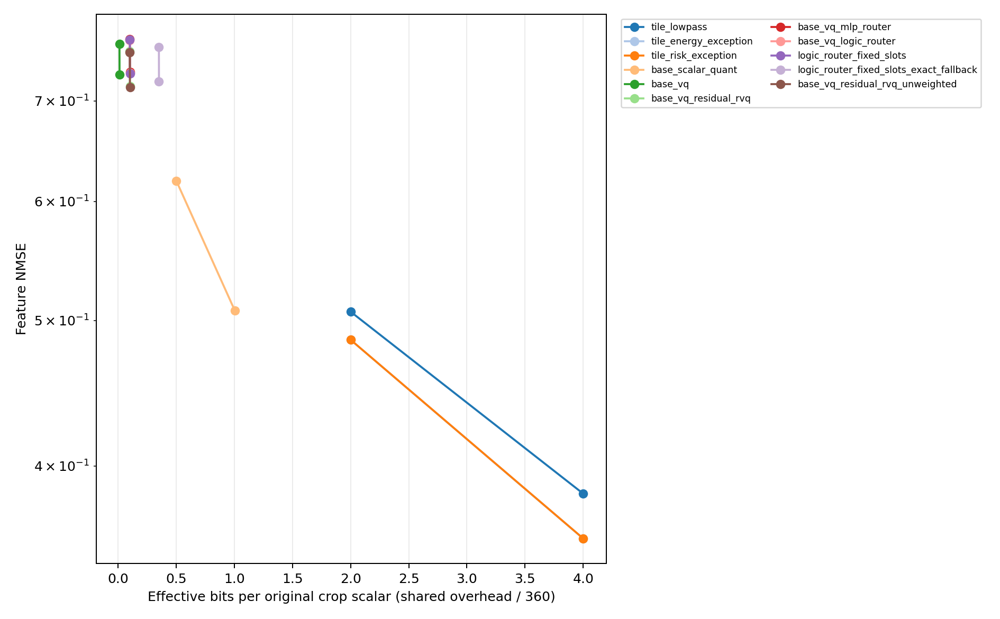
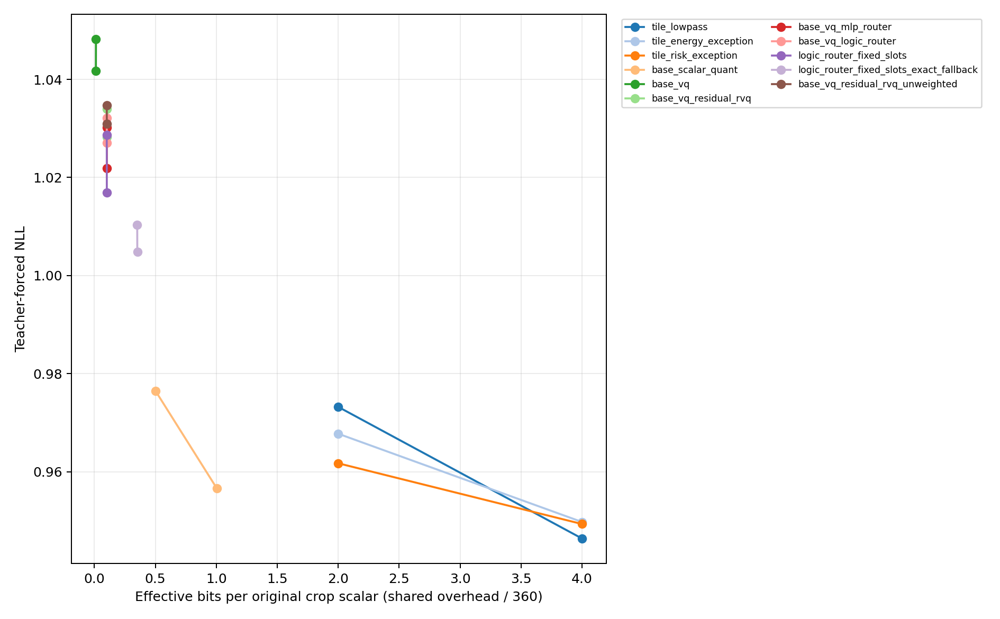
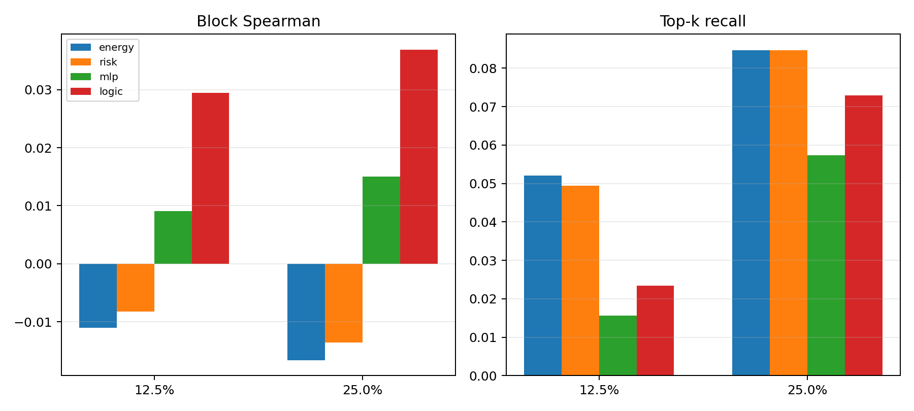
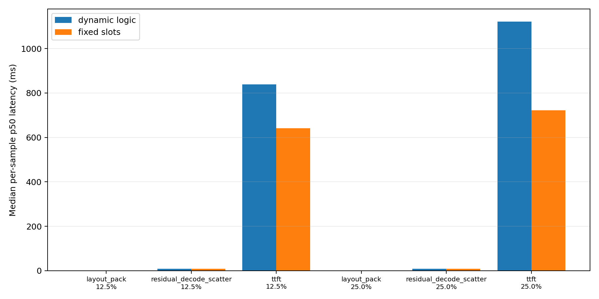

# TileLogic-RVQ Formal Experiment Report

## 1. Executive Summary

- Feature/rate/oracle evaluation: **PASS**, 360 evaluation samples and 23 variants per sample.
- Quality and teacher-NLL evaluation: **PASS**, paired on the same 360 samples.
- Latency diagnostics: **PASS as diagnostics**, with paired dynamic/fixed component and TTFT rows.
- Aggregate positive claim allowed: **NO**.
- The evidence does not support an aggregate positive claim; see the independent decisions.

The quality path reconstructs the original 1,280 visual tokens before Qwen execution. It is information-quality evidence, not native compact-prefill latency evidence. No PPA, kernel-fusion, or physical-hardware claim is made.

## 2. Independent Decision Questions

| ID | Question | Status |
|---|---|---|
| 1 | Base VQ extends the full-overhead frontier beyond INT4 | FAIL |
| 2 | Fisher RVQ improves on base-only and unweighted RVQ | FAIL |
| 3 | MLP routing beats energy and cosine-risk heuristics | FAIL |
| 4 | Discrete logic retains the MLP routing benefit | INCONCLUSIVE |
| 5 | Fixed slots reduce layout, decoder, and TTFT cost | FAIL |
| 6 | Fully charged exact fallback improves the frontier | FAIL |

Each decision follows `TILELOGIC_RVQ_EXPERIMENT.md`. Missing required evidence is `INCONCLUSIVE`; complete evidence that misses a threshold is `FAIL`. Detailed machine-readable evidence is in `decision_summary.json`.

## 3. Protocol And Leakage Controls

- Datasets: GQA, TextVQA, ChartQA; 80 calibration and 120 evaluation examples per dataset.
- Oracle subsets: 16 calibration and 16 disjoint evaluation examples per dataset.
- Codebooks, Fisher weights, router normalization/MLP/tree, and fixed slots use calibration records only.
- Feature and quality evaluation use exactly 360 evaluation records; calibration records loaded by formal evaluation: 0.
- Shared overhead is amortized over exactly 360 evaluation samples. Stream-only rate and break-even count remain separately reported.
- Rate precision is tied to executed, explicitly serialized, or exact round-tripped logical payloads: FP32 INT4 scales, VQ metric weights, MLP/normalizer state, logic leaves, and curvature priors; FP16 codewords, scale tables, logic thresholds, and exact fallback values.
- The rate correction was checked over 360 samples and 8280 variants; all compared non-rate fields are structurally identical, with run-time-only `elapsed_seconds` excluded.
- Cache provenance covers 600 entries and records the source-manifest hash, model revision, and tensor dtypes without changing cached tensor payloads.
- Model: `external://private/66285546d2b821cf421d4f5eb2576359d3770cd3`.
- Feature GPU: `NVIDIA A800 80GB PCIe`; latency GPU: `NVIDIA A800 80GB PCIe`.

## 4. Rate-Distortion And Quality

| Method | Rate | Eff. bit/value | Stream bit/value | NMSE | Fisher NMSE | NLL | Score |
|---|---|---|---|---|---|---|---|
| base_scalar_quant | 0.125000 | 0.501953 | 0.501953 | 0.619083 | 0.534752 | 0.976434 | 0.641667 |
| base_scalar_quant | 0.250000 | 1.003906 | 1.003906 | 0.507636 | 0.434461 | 0.956601 | 0.650000 |
| base_vq | 0.125000 | 0.011931 | 0.000732 | 0.764094 | 0.674562 | 1.041761 | 0.627778 |
| base_vq | 0.250000 | 0.012663 | 0.001465 | 0.728805 | 0.638284 | 1.048196 | 0.619444 |
| base_vq_logic_router | 0.125000 | 0.101127 | 0.000668 | 0.768477 | 0.678920 | 1.032096 | 0.627778 |
| base_vq_logic_router | 0.250000 | 0.101791 | 0.001332 | 0.730535 | 0.639844 | 1.027115 | 0.633333 |
| base_vq_mlp_router | 0.125000 | 0.101183 | 0.000668 | 0.769454 | 0.680046 | 1.030195 | 0.628704 |
| base_vq_mlp_router | 0.250000 | 0.101846 | 0.001332 | 0.732107 | 0.641625 | 1.021864 | 0.632407 |
| base_vq_residual_rvq | 0.125000 | 0.101103 | 0.000668 | 0.755050 | 0.664180 | 1.033943 | 0.628704 |
| base_vq_residual_rvq | 0.250000 | 0.101767 | 0.001332 | 0.716137 | 0.623797 | 1.028246 | 0.630556 |
| base_vq_residual_rvq_unweighted | 0.125000 | 0.101103 | 0.000668 | 0.754076 | 0.664162 | 1.034782 | 0.627778 |
| base_vq_residual_rvq_unweighted | 0.250000 | 0.101767 | 0.001332 | 0.714675 | 0.623766 | 1.030937 | 0.630556 |
| logic_router_fixed_slots | 0.125000 | 0.101096 | 0.000637 | 0.768798 | 0.679629 | 1.028680 | 0.631481 |
| logic_router_fixed_slots | 0.250000 | 0.101733 | 0.001274 | 0.729782 | 0.640043 | 1.016967 | 0.635185 |
| logic_router_fixed_slots_exact_fallback | 0.125000 | 0.351058 | 0.250599 | 0.760171 | 0.672347 | 1.010322 | 0.643519 |
| logic_router_fixed_slots_exact_fallback | 0.250000 | 0.351695 | 0.251236 | 0.721082 | 0.632710 | 1.004877 | 0.637037 |
| tile_energy_exception | 0.125000 | 2.000035 | 2.000035 | 0.485330 | 0.432621 | 0.967740 | 0.641667 |
| tile_energy_exception | 0.250000 | 4.000065 | 4.000065 | 0.357898 | 0.319318 | 0.949738 | 0.660185 |
| tile_lowpass | 0.125000 | 2.000000 | 2.000000 | 0.506723 | 0.452332 | 0.973212 | 0.634259 |
| tile_lowpass | 0.250000 | 4.000000 | 4.000000 | 0.383405 | 0.343379 | 0.946366 | 0.670370 |
| tile_risk_exception | 0.125000 | 2.000035 | 2.000035 | 0.485368 | 0.432674 | 0.961712 | 0.644444 |
| tile_risk_exception | 0.250000 | 4.000065 | 4.000065 | 0.357950 | 0.319389 | 0.949324 | 0.662963 |

Paired dataset-level answer scores and aggregate token-weighted teacher NLL:

| Method | Rate | GQA score | TextVQA score | ChartQA score | Aggregate NLL |
|---|---|---|---|---|---|
| base_scalar_quant | 0.125000 | 0.691667 | 0.608333 | 0.625000 | 0.976434 |
| base_scalar_quant | 0.250000 | 0.708333 | 0.616667 | 0.625000 | 0.956601 |
| base_vq | 0.125000 | 0.683333 | 0.583333 | 0.616667 | 1.041761 |
| base_vq | 0.250000 | 0.675000 | 0.575000 | 0.608333 | 1.048196 |
| base_vq_logic_router | 0.125000 | 0.675000 | 0.583333 | 0.625000 | 1.032096 |
| base_vq_logic_router | 0.250000 | 0.683333 | 0.591667 | 0.625000 | 1.027115 |
| base_vq_mlp_router | 0.125000 | 0.683333 | 0.586111 | 0.616667 | 1.030195 |
| base_vq_mlp_router | 0.250000 | 0.691667 | 0.588889 | 0.616667 | 1.021864 |
| base_vq_residual_rvq | 0.125000 | 0.675000 | 0.586111 | 0.625000 | 1.033943 |
| base_vq_residual_rvq | 0.250000 | 0.683333 | 0.591667 | 0.616667 | 1.028246 |
| base_vq_residual_rvq_unweighted | 0.125000 | 0.675000 | 0.583333 | 0.625000 | 1.034782 |
| base_vq_residual_rvq_unweighted | 0.250000 | 0.691667 | 0.583333 | 0.616667 | 1.030937 |
| logic_router_fixed_slots | 0.125000 | 0.683333 | 0.586111 | 0.625000 | 1.028680 |
| logic_router_fixed_slots | 0.250000 | 0.691667 | 0.597222 | 0.616667 | 1.016967 |
| logic_router_fixed_slots_exact_fallback | 0.125000 | 0.700000 | 0.613889 | 0.616667 | 1.010322 |
| logic_router_fixed_slots_exact_fallback | 0.250000 | 0.683333 | 0.611111 | 0.616667 | 1.004877 |
| none | N/A | 0.708333 | 0.666667 | 0.666667 | 0.882239 |
| tile_energy_exception | 0.125000 | 0.691667 | 0.600000 | 0.633333 | 0.967740 |
| tile_energy_exception | 0.250000 | 0.708333 | 0.638889 | 0.633333 | 0.949738 |
| tile_lowpass | 0.125000 | 0.683333 | 0.611111 | 0.608333 | 0.973212 |
| tile_lowpass | 0.250000 | 0.725000 | 0.652778 | 0.633333 | 0.946366 |
| tile_risk_exception | 0.125000 | 0.691667 | 0.608333 | 0.633333 | 0.961712 |
| tile_risk_exception | 0.250000 | 0.708333 | 0.647222 | 0.633333 | 0.949324 |

`effective_bits_per_original_value` includes codebooks, metric weights, scale tables, router parameters/normalizers/tree state, curvature priors, and fixed-slot metadata amortized over the evaluation set. `rate_components.csv` preserves every stream/shared component. The machine audit loads the stored artifacts and rejects any rate component whose charged precision differs from execution, explicit serialization, or an exact declared-precision round trip.

## 5. Router Metrics

Decision metrics use per-block cumulative marginal benefit. Spearman and top-k recall are computed on the 48 disjoint evaluation-oracle samples. Marginal Spearman is retained as a stage-aware diagnostic.

| Rate | Router | Spearman | Marginal rho | Top-k recall | N |
|---|---|---|---|---|---|
| 0.125000 | energy | -0.011040 | -0.025971 | 0.052083 | 48 |
| 0.125000 | logic | 0.029443 | 0.271685 | 0.023438 | 48 |
| 0.125000 | mlp | 0.009090 | 0.217356 | 0.015625 | 48 |
| 0.125000 | risk | -0.008270 | -0.024694 | 0.049479 | 48 |
| 0.250000 | energy | -0.016611 | -0.018269 | 0.084635 | 48 |
| 0.250000 | logic | 0.036894 | 0.271796 | 0.072917 | 48 |
| 0.250000 | mlp | 0.014977 | 0.218289 | 0.057292 | 48 |
| 0.250000 | risk | -0.013554 | -0.017106 | 0.084635 | 48 |

## 6. Mode Usage And Budget Error

| Method | Rate | Drop | RVQ1 | RVQ2 | Exact | Depth/all | Depth/VQ-active | Budget abs. rel. err. |
|---|---|---|---|---|---|---|---|---|
| base_vq_logic_router | 0.125000 | 0.967947 | 0.003212 | 0.028841 | 0.000000 | 0.060894 | 1.899797 | 0.001651 |
| base_vq_logic_router | 0.250000 | 0.937500 | 0.000000 | 0.062500 | 0.000000 | 0.125000 | 2.000000 | 0.000000 |
| base_vq_mlp_router | 0.125000 | 0.968750 | 0.000000 | 0.031250 | 0.000000 | 0.062500 | 2.000000 | 0.000000 |
| base_vq_mlp_router | 0.250000 | 0.937500 | 0.000000 | 0.062500 | 0.000000 | 0.125000 | 2.000000 | 0.000000 |
| base_vq_residual_rvq | 0.125000 | 0.968750 | 0.000000 | 0.031250 | 0.000000 | 0.062500 | 2.000000 | 0.000000 |
| base_vq_residual_rvq | 0.250000 | 0.937500 | 0.000000 | 0.062500 | 0.000000 | 0.125000 | 2.000000 | 0.000000 |
| logic_router_fixed_slots | 0.125000 | 0.968750 | 0.000000 | 0.031250 | 0.000000 | 0.062500 | 2.000000 | 0.261044 |
| logic_router_fixed_slots | 0.250000 | 0.937500 | 0.000000 | 0.062500 | 0.000000 | 0.125000 | 2.000000 | 0.247444 |
| logic_router_fixed_slots_exact_fallback | 0.125000 | 0.968750 | 0.000000 | 0.015625 | 0.015625 | 0.031250 | 2.000000 | 0.000124 |
| logic_router_fixed_slots_exact_fallback | 0.250000 | 0.937500 | 0.000000 | 0.046875 | 0.015625 | 0.093750 | 2.000000 | 0.000231 |

Exact fallback mode includes the complete FP16 2x2xC residual payload. Budget error is reported from the emitted stream fields rather than silently normalized away.

## 7. Measured Latency And Peak Memory

Paired dynamic-versus-fixed decision components:

| Rate | Component | Dynamic p50 ms | Fixed p50 ms | Paired reduction | Lower? |
|---|---|---|---|---|---|
| 0.125000 | layout_pack | 0.123392 | 0.118784 | 0.000000 | FAIL |
| 0.125000 | residual_decode_scatter | 9.261312 | 9.248512 | 0.001076 | PASS |
| 0.125000 | ttft | 839.242397 | 640.966303 | 0.232400 | PASS |
| 0.250000 | layout_pack | 0.119808 | 0.119808 | 0.000000 | FAIL |
| 0.250000 | residual_decode_scatter | 8.986112 | 9.128704 | -0.000145 | FAIL |
| 0.250000 | ttft | 1.1221e+03 | 722.274605 | 0.358654 | PASS |

All measured component, prefill, and TTFT summaries:

| Component | Method | Rate | p50 ms | p95 ms | Peak alloc MiB | Peak reserve MiB |
|---|---|---|---|---|---|---|
| base_vq_search | base_vq | 0.125000 | 0.806656 | 0.831360 | 7.2178e+03 | 7.9420e+03 |
| base_vq_search | base_vq | 0.250000 | 0.782592 | 0.814464 | 7.2399e+03 | 7.9420e+03 |
| codec_plus_prefill_first_logits | base_vq_logic_router | 0.125000 | 359.736328 | 362.913885 | 7.7344e+03 | 7.9420e+03 |
| codec_plus_prefill_first_logits | base_vq_logic_router | 0.250000 | 654.679550 | 658.875548 | 7.7344e+03 | 7.9420e+03 |
| codec_plus_prefill_first_logits | logic_router_fixed_slots | 0.125000 | 175.524605 | 177.196134 | 7.7344e+03 | 7.9420e+03 |
| codec_plus_prefill_first_logits | logic_router_fixed_slots | 0.250000 | 257.438210 | 258.077546 | 7.7344e+03 | 7.9420e+03 |
| codec_roundtrip | base_vq_logic_router | 0.125000 | 296.702072 | 302.124048 | 7.2906e+03 | 7.9420e+03 |
| codec_roundtrip | base_vq_logic_router | 0.250000 | 589.756622 | 594.574234 | 7.2940e+03 | 7.9420e+03 |
| codec_roundtrip | logic_router_fixed_slots | 0.125000 | 111.454233 | 113.865903 | 7.2906e+03 | 7.9420e+03 |
| codec_roundtrip | logic_router_fixed_slots | 0.250000 | 193.215263 | 194.580288 | 7.2940e+03 | 7.9420e+03 |
| layout_pack | base_vq_logic_router | 0.125000 | 0.123392 | 0.129408 | 7.2332e+03 | 7.9420e+03 |
| layout_pack | base_vq_logic_router | 0.250000 | 0.119808 | 0.128051 | 7.2387e+03 | 7.9420e+03 |
| layout_pack | logic_router_fixed_slots | 0.125000 | 0.118784 | 0.130022 | 7.2332e+03 | 7.9420e+03 |
| layout_pack | logic_router_fixed_slots | 0.250000 | 0.119808 | 0.124006 | 7.2387e+03 | 7.9420e+03 |
| logic_router | base_vq_logic_router | 0.125000 | 4.628992 | 4.827187 | 7.2251e+03 | 7.9420e+03 |
| logic_router | base_vq_logic_router | 0.250000 | 4.631040 | 4.817792 | 7.2334e+03 | 7.9420e+03 |
| prefill_first_logits | base_vq_logic_router | 0.125000 | 65.312000 | 66.803533 | 7.7254e+03 | 7.9420e+03 |
| prefill_first_logits | base_vq_logic_router | 0.250000 | 65.317631 | 66.537983 | 7.7254e+03 | 7.9420e+03 |
| prefill_first_logits | logic_router_fixed_slots | 0.125000 | 65.141758 | 66.217804 | 7.7254e+03 | 7.9420e+03 |
| prefill_first_logits | logic_router_fixed_slots | 0.250000 | 65.397249 | 66.816640 | 7.7254e+03 | 7.9420e+03 |
| prefill_first_logits | none | N/A | 65.224192 | 66.747211 | 7.7164e+03 | 7.9420e+03 |
| residual_decode_scatter | base_vq_logic_router | 0.125000 | 9.261312 | 9.292903 | 7.2650e+03 | 7.9420e+03 |
| residual_decode_scatter | base_vq_logic_router | 0.250000 | 8.986112 | 9.282278 | 7.2664e+03 | 7.9420e+03 |
| residual_decode_scatter | logic_router_fixed_slots | 0.125000 | 9.248512 | 9.330074 | 7.2650e+03 | 7.9420e+03 |
| residual_decode_scatter | logic_router_fixed_slots | 0.250000 | 9.128704 | 9.277440 | 7.2664e+03 | 7.9420e+03 |
| residual_rvq_search | base_vq_residual_rvq | 0.125000 | 1.431808 | 1.466394 | 7.2571e+03 | 7.9420e+03 |
| residual_rvq_search | base_vq_residual_rvq | 0.250000 | 1.392896 | 1.447987 | 7.2665e+03 | 7.9420e+03 |
| ttft | base_vq_logic_router | 0.125000 | 839.242397 | 860.721120 | 7.7499e+03 | 7.9420e+03 |
| ttft | base_vq_logic_router | 0.250000 | 1.1221e+03 | 1.1385e+03 | 7.7499e+03 | 7.9420e+03 |
| ttft | logic_router_fixed_slots | 0.125000 | 640.966303 | 676.851675 | 7.7499e+03 | 7.9420e+03 |
| ttft | logic_router_fixed_slots | 0.250000 | 722.274605 | 739.410315 | 7.7499e+03 | 7.9420e+03 |
| ttft | none | N/A | 542.137997 | 556.094257 | 7.7409e+03 | 7.9420e+03 |

Full component rows, p50/p95/p99, and peak allocated/reserved memory are in `latency_metrics.csv`. TTFT includes image preprocessing, visual encoding, codec reconstruction, native multimodal positions, language prefill, and first-token generation. Both compressed paths expand to 1,280 visual tokens, so these rows do not establish a native compact-sequence prefill benefit.

A during-run GPU process/pmon snapshot is archived as `gpu_co_residency_during_run.log` (SHA256 `0f5a8c85ce76188af49c33093299ab66e96a0a158599853bcebb62ecc96513c5`). It records co-residency for diagnostic interpretation and does not establish an exclusive-GPU performance signoff.

Public-provenance note: the GPU co-residency log has private source SHA256 `0f5a8c85ce76188af49c33093299ab66e96a0a158599853bcebb62ecc96513c5` and sanitized public SHA256 `9316b959c0edbe1c1ab457dc0131dfd08b920321935404fa97b0b8d8948a65d6`. The public copy is 19623 bytes.

## 8. Evidence Boundaries

- Base/residual codebooks are continuous FP16 tables; the logic router controls path/depth and does not replace the reconstruction datapath.
- Lower precision is never charged for an FP32 value unless the encoder performs that lower-precision round trip before reconstruction or routing.
- MLP is a calibration-only routing upper bound. The logic tree is discrete and uses deployable, quantized-feature thresholds.
- Fisher distortion is a diagonal empirical proxy, not an exact Hessian.
- Teacher-forced NLL uses the first manifest answer verbatim; dataset answer scores use all manifest answers.
- GPU timing is an implementation diagnostic for the current PyTorch path, not ASIC/FPGA PPA.
- Answer scores and teacher NLL cover the stated 360-example protocol only.

## 9. Output Map

- `feature_metrics.csv`: feature, Fisher, rate, mode, and budget aggregates.
- `quality_metrics.csv`: dataset scores, agreement, and teacher NLL.
- `method_points.csv`: overall rate-distortion points.
- `rate_components.csv`: exact stream/shared bit components.
- `router_sample_metrics.csv` and `router_metrics.csv`: oracle routing evidence.
- `latency_metrics.csv` and `latency_paired_dynamic_fixed.csv`: timing and memory.
- `decision_summary.json` and `decision_summary.csv`: six frozen-rule decisions.
- `result_audit_report.md`: independent machine audit.
- `../rate_precision_correction_validation.json`: old/new feature-ledger semantic comparison.
- `../cache_provenance_backfill.json`: hash-linked cache provenance migration.
