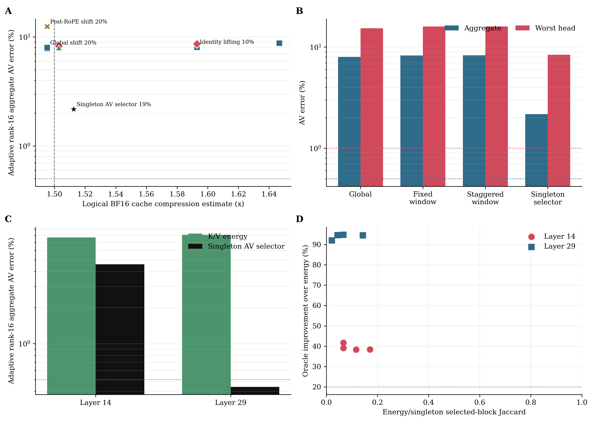
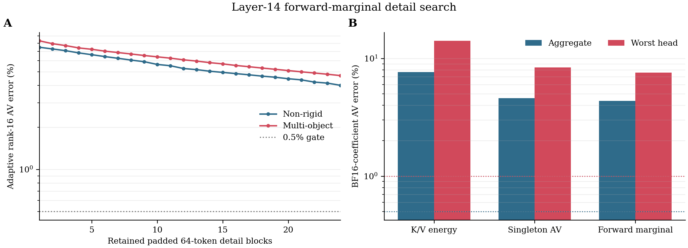

# 自回归视频结构化长记忆：Butterfly-Lifting Probe

日期：2026-08-05

状态：四轮预注册表示能力筛选已完成；均判定为 `null`，未进入 kernel、rollout 或 H200 加速阶段。提交前的独立审计发现 v3 只是不具联合最优保证的 singleton selector；v4 因此补做严格同预算 forward-marginal search 与 BF16 coefficient round-trip。v4 仍失败，但它不是全局组合最优，结论继续限定在已测试 predictor/search family。

## 1. 核心结论

本轮没有把固定 BCM/BCCB 或 token-Butterfly 重新包装成另一种稀疏 attention，而是保留原始动机中真正有价值的四个部分：

1. 局部空间联系用于预测相邻视频状态；
2. Butterfly 的多尺度树用于连接短程细节与长程历史；
3. 循环/位移结构只作为可逆预测器，不再假设完整 attention 是循环矩阵；
4. coarse 分支表示低时间秩背景，稀疏 detail 分支保留高秩事件，再用 rank-16 输出残差测量剩余容量。

由此得到 **Causal Butterfly-Lifting Memory**。它压缩的是历史 K/V 表示，重建后仍执行原始单次 dense softmax，因此不会引入旧 token-Butterfly 的多次 softmax 路径扩散，也没有 sparse/linear 分支各自归一化造成的质量混淆。

实验同时给出一个正面机制结果和一个受限的停止结论：

- 残差信息驱动的 detail 分配相对 K/V 能量排序降低 held-out adaptive rank-16 聚合误差 `72.83%`，说明“把有限高秩 payload 分给真正影响 AV 的事件”是有效机制。
- 但即使使用不可部署、可访问 dense 输出的 singleton outcome-aware selector，结果仍为 `2.176%` 聚合、`8.375%` 最坏 head，远未达到预注册的 `0.5%/1%` 门槛。因此，**已测试的 global/window cyclic lifting 与 energy/singleton detail selectors 尚不能成为严格近无损的统一长记忆主路径**。
- v4 在最难的 Layer 14 上每一步重新评估完整已选集合；BF16 forward-marginal 仅将 singleton 的 `4.586%/8.375%` 降至 `4.364%/7.602%`，相对聚合改善 `4.85%`。BF16 coefficient round-trip 相对 FP32 coefficient 只增加约 `0.00048` 个百分点，失败主要来自表示而非 coefficient dtype。

这不是“结构化方法均无效”的结论，也不是 24-block 组合空间的数学容量下界。v4 已补充联合 marginal interaction，但 forward greedy 仍不保证全局最优。当前证据足以停止为现有 global/8x8 cyclic predictor 训练 detail router，却不能否定改变 predictor/dictionary 后的新结构函数类。

## 2. 为什么不重复旧方案

### 2.1 固定 BCM/BCCB 的失败边界

此前 BCM/BCCB 审计显示，显著增加结构容量并未消除大幅 AV 误差，主要问题是固定 Fourier 特征向量与内容相关 attention 特征向量错配。可追溯的自回归视频 BCCB 结果见 [AR_VIDEO_RESIDUAL_WIDTH_MEMORY_SCREEN_20260805.zh-CN.md](AR_VIDEO_RESIDUAL_WIDTH_MEMORY_SCREEN_20260805.zh-CN.md)；本节的历史结果不属于本轮三个 lifting result 目录。

若多个 BCCB expert 只通过标量 gate 混合，仍有

\[
C_m=F^H\operatorname{diag}(\lambda_m)F,
\qquad
\sum_m g_m(x)C_m
=F^H\operatorname{diag}\!\left(\sum_mg_m(x)\lambda_m\right)F.
\]

expert 数量只能改变 eigenvalue，不能改变随内容、head、step 和运动旋转的 eigenvector。3D RoPE 提供相对位置载波，但内容幅度和相位仍决定 logits；它不会使完整 attention 成为平移不变卷积。

本轮因此只把循环矩阵用作 K/V 邻帧预测的可逆 permutation。周期边界产生的误差显式进入 detail，而不再被误当成 attention 语义。

### 2.2 token-Butterfly 的失败边界

此前九级 token-Butterfly product 及其 Q/K LoRA 修正仍保留了大幅输出误差。原因不是 Butterfly 无法形成全局可达图，而是每级局部 attention 都重新 softmax：

\[
\hat A=P_LP_{L-1}\cdots P_1.
\]

这把一次全局条件分布变成多步 Markov 路径扩散。固定 XOR stage 还让同一组 Q/K 同时承担不相容的局部和长跨度匹配。增加 gate 或 LoRA 不能恢复被改变的算子语义。

本轮的 lifting tree 只在线性 cache 编解码中使用 Butterfly 拓扑，softmax 仍只执行一次。

### 2.3 时间均值与静态低秩尾部的失败边界

固定多分辨率时间摘要的既有结果同样未通过严格门槛；详情见 [AUTOREGRESSIVE_VIDEO_RESIDUAL_MEMORY_LONGLIVE_20260805.zh-CN.md](AUTOREGRESSIVE_VIDEO_RESIDUAL_MEMORY_LONGLIVE_20260805.zh-CN.md)。时间均值不是 query-dependent softmax 的充分统计量，而静态低秩输出基底不能跟踪跨样本旋转的缺陷子空间。

本轮改为可逆 coarse/detail 分解：不把 detail 永久平均掉，而是显式选择少量高秩 detail block。

## 3. 方法：Causal Butterfly-Lifting Memory

### 3.1 因果 cache 分区

当前 LongLive capture 有 12 帧历史。本轮固定：

- 3 帧 sink：精确保留；
- 3 帧 recent：精确保留；
- 中间 6 帧：进入三层 dyadic lifting tree。

该选择继承模型原有 sink/recent 语义，不把已有机制算作创新。

### 3.2 可逆 lifting

对相邻历史状态使用

\[
d=x_1-P_\delta x_0,
\qquad
c=x_0+\tfrac12P_\delta^{-1}d,
\]

并通过

\[
\hat x_0=c-\tfrac12P_\delta^{-1}\hat d,
\qquad
\hat x_1=P_\delta\hat x_0+\hat d
\]

重建。全 detail 保留时数值可逆；删除 detail 时，误差由被删除系数明确控制。

多层 recursion 产生：

- 一个 coarse map：低时间秩、长跨度背景；
- 五个 detail maps：运动、遮挡、局部外观变化等高秩事件；
- 每个 detail 按 64-token regular block 存储，便于后续规则 kernel。

### 3.3 循环预测器的位置

`P_delta` 是二维 cyclic shift，不是 attention matrix。v1 每个 merge 使用全局共享 shift；v2 在 `8x8` 窗口中使用局部 shift，并跨 tree level 采用 `(0,0)`、`(4,4)`、`(0,4)` staggered partition。

K 优先在 inverse-3D-RoPE 后的 canonical domain 中变换，再按原 frame ID 恢复 RoPE。这样避免把位置旋转本身误计为不可预测 detail。post-RoPE 版本仅作消融。

### 3.4 低秩与高秩的严格分工

本轮不是简单相加 `BCM + LoRA`：

- coarse lifting 是时间轴的低秩背景表示；
- sparse details 是 token 域的高秩事件 payload；
- adaptive rank-16 只作为 evaluator，测量剩余 AV 缺陷是否还存在低维上界。

若记 cache 重建误差为 `delta K, delta V`，一阶输出误差近似为

\[
\delta Y \approx J_K(Q,K,V)\,\delta K + A(Q,K)\,\delta V.
\]

因此最小化 `||delta K||` 和 `||delta V||` 并不等于最小化 `||delta Y||`。真正有价值的高秩 detail 应由 query、attention、V leverage 和轨迹风险共同决定。这正是 v3/v4 outcome-aware search 要验证的瓶颈。

## 4. 预注册实验

### 4.1 数据与作用域

- 模型：LongLive-1.3B v1.0 capture。
- 记录：4 个 prompt class x 2 个 hard cells，共 8 captures。
- cells：`layer14/frame15/call1` 与 `layer29/frame18/call1`。
- held-out 决策：`test_nonrigid_s3` 与 `valid_multi_object_s2`，共 4 captures、48 个 head records。
- capture 已被此前实验多次探索，因此所有结论都是 development-exposed exploratory evidence；正结果必须用新 prompt/seed 复核。
- 环境：PyTorch `2.9.1+cu128`、CUDA `12.8`；本轮表示 probe 在空闲 RTX 4090 上运行，未占用正在执行其他任务的 H200。

### 4.2 固定门槛

| Gate | 门槛 |
|---|---:|
| dense-reference parity | `<=0.5%` |
| cache compression，含索引与 shift metadata | `>=1.5x` |
| direct reconstructed AV | aggregate `<=1%`，worst `<=2%` |
| adaptive rank-16 capacity | aggregate `<=0.5%`，worst `<=1%` |
| v1 global shift mechanism | 相对 identity 至少改善 `10%` |
| v2 window mechanism | 相对同预算 global 至少改善 `20%` |
| v3 residual selector mechanism | 相对 K/V-energy 至少改善 `20%` |
| v4 forward-marginal mechanism | 相对 singleton 至少改善 `20%`，并通过 BF16 `0.5%/1%` |

冻结协议原先规定：未通过 adaptive capacity 时停止 predictor、router、kernel 和 rollout。该规则对 v1/v2 的 predictor 筛选仍成立；但提交前审计确认 v3 的 singleton 排序不是联合 support 上限，因此 v3 的自动 `stop_butterfly_lifting_and_detail_routing` 只作为原始 protocol outcome 保留，不能升级为整个结构函数族的论文结论。

### 4.3 精度与存储语义

v1-v3 的质量 evaluator 为隔离结构容量，使用 FP32 lifting/coarse/detail arithmetic；表中的压缩比则按 BF16/FP16 每元素 2 bytes 计算，是 **logical BF16 payload estimate**。v1-v3 没有执行 coefficient BF16 序列化、反序列化，因此：

- 质量结果是对候选更有利的 FP32 capacity diagnostic；
- `1.495x/1.503x/1.513x` 不是当前 FP32 tensor 实际驻留显存压缩比；
- v4 已对 selected root/detail coefficients 补 BF16 round-trip 和规则 tile padding；
- 若按当前 FP32 tensor 实际驻留粗算，v2 仅约 `1.20x`，所以本轮不形成实际 cache-memory 收益声明。

## 5. 四轮结果

### 5.1 v1：全局循环 lifting

| 方法 | detail | logical BF16 compression | direct aggregate/worst | + adaptive rank-16 aggregate/worst |
|---|---:|---:|---:|---:|
| identity lifting | 20% | `1.495x` | - | `8.068% / 15.300%` |
| canonical shared shift | 20% | `1.495x` | `14.129% / 25.449%` | `8.002% / 15.300%` |
| post-RoPE shared shift | 20% | 约 `1.495x` | - | `12.481% / 25.483%` |
| per-head shift | 20% | 约 `1.495x` | - | `7.848% / 14.559%` |

shared shift 相对 identity 只改善 `0.824%`，远低于 `10%` gate；40 个 merge node 中 27 个选择 `(0,0)`，其余主要是很小的水平位移。canonical pre-RoPE 明显优于 post-RoPE，但内容运动没有被一个全局循环预测器集中成稀疏 detail。

压缩比 `1.495x` 也略低于系统门槛，因此 v1 为 `null`。

### 5.2 v2：8x8 局部、staggered-window lifting

| 方法 | detail | logical BF16 compression | adaptive rank-16 aggregate/worst |
|---|---:|---:|---:|
| global shared shift | 19% | `1.5029x` | `8.006% / 15.300%` |
| staggered 8x8 window shift | 19% | `1.5029x` | `8.280% / 15.953%` |

局部 window 反而恶化 `3.42%`。更细粒度没有解决问题，原因包括：

- 真实 motion/occlusion 不是窗口内单一 cyclic permutation；
- 窗口边界切断跨窗口物体和长跨度联系；
- K/V reconstruction-energy 最优 shift 未必是 AV-sensitivity 最优 shift；
- 更强局部预测在当前 energy selector 下没有改善 Layer 14 的剩余缺陷。

按冻结协议，不继续缩小窗口、扩大 shift bank 或训练 flow router。

### 5.3 v3：残差信息 detail oracle

v3 对 125 个候选 regular detail block 逐个重建，在同一记录的 dense AV 和 adaptive rank-16 评价下计算 singleton residual reduction，再选取 19% block。它使用禁止部署的 dense label，只回答“outcome-aware singleton ranking 是否明显优于 K/V energy”，不回答联合 24-block 组合的最优容量。

| selector | logical BF16 compression | adaptive rank-16 aggregate/worst | 结论 |
|---|---:|---:|---|
| K/V detail energy | `1.5029x` | `8.006% / 15.300%` | quality fail |
| residual singleton oracle | `1.5126x` | `2.176% / 8.375%` | mechanism pass，quality fail |

相对改善为 `72.83%`，但绝对误差仍分别是门槛的 `4.35x` 和 `8.38x`。这足以阻止直接训练一个只模仿 singleton label 的 router；但因为 singleton ranking 不是联合 marginal greedy、beam search 或全局组合 oracle，它不足以证明所有 detail router 或当前 transform 的联合 support 容量均失败。

两种 selector 使用相同的 24 个 regular blocks。oracle 更常选择末端不足 64 token 的边界块，因此逻辑 packed ratio 稍高。该差异不会给 oracle 更多质量 payload，反而更少；但它也意味着本轮不是所有等字节组合的严格全局下界，结论应限定为强 null evidence，而非数学不可能性证明。

## 6. 逐层诊断

| Layer | K/V-energy aggregate/worst | residual oracle aggregate/worst | aggregate 相对改善 |
|---|---:|---:|---:|
| 14 | `7.677% / 14.122%` | `4.587% / 8.375%` | `40.3%` |
| 29 | `8.096% / 15.300%` | `0.435% / 1.586%` | `94.6%` |

该差异比总体均值更重要，但仍应按 heuristic selector 而非容量下界解释：

- Layer 29 在知道真实 AV residual 后几乎可被当前结构表达；其 aggregate 已通过 `0.5%`，worst 接近但未通过 `1%`。这里的主要问题可能是部署 selector，而不是 coarse/detail 表示本身。
- Layer 14 使用 dense-labeled singleton selector 仍为 `4.587%/8.375%`。这说明独立 block 排序不足，可能来自 block interaction、19% detail 容量不足，或 lifting predictor 产生不可低秩的 error amplification；三者尚未被联合 oracle 区分。
- 在联合 gate 通过前不能使用统一长记忆策略；当前可部署策略中 Layer 14 仍应保持 exact/dense fallback。

在 held-out 四个 captures 上，K/V-energy 与 singleton selector support 的 Jaccard 只有：

- mean `0.0857`；
- min `0.0667`；
- max `0.1429`。

held-out 逐记录改善范围为 `39.09%` 到 `94.76%`。全部八个 development-exposed captures 的 Jaccard mean/min/max 为 `0.0868/0.0213/0.1707`，改善范围为 `38.31%–94.76%`。这些结果直接证明本轮 K/V reconstruction-energy 与 AV-sensitive support 明显错配；本轮没有直接测试 FFT energy 或 motion-amplitude selector，不能外推否定它们。

### 5.4 v4：Layer-14 forward-marginal 与 BF16 payload

独立审计指出 v3 不能处理 block interaction。v4 固定两个 held-out Layer-14 captures、24 个 padded `64`-token blocks 和完全相同的 `1.5029x` logical BF16 payload。每一步对所有剩余候选重新计算当前联合 support 的 dense AV + adaptive rank-16 SSE，再选最小者；最终将 root coarse 与 retained details 实际 round-trip 到 BF16 后 replay。

| selector | BF16 adaptive aggregate/worst | 相对 singleton | logical padded BF16 compression |
|---|---:|---:|---:|
| K/V energy | `7.678% / 14.124%` | - | `1.5029x` |
| singleton AV | `4.586% / 8.375%` | baseline | `1.5029x` |
| forward marginal | `4.364% / 7.602%` | `4.85%` | `1.5029x` |

两个 capture 的 24-step FP32-coefficient trajectory 分别结束于 `3.995%` 和 `4.691%`。forward marginal 与 singleton support 的 Jaccard 为 `0.655` 和 `0.778`；energy 与 marginal 仅为 `0.143` 和 `0.091`。搜索约耗时 `192s/capture`，是 evaluator-only cost。

FP32 与 BF16 coefficient 的 pooled 结果分别为 `4.36346%` 和 `4.36394%`，worst 分别为 `7.60086%` 和 `7.60210%`。因此：

- v3 的 singleton 缺口是真实但很小，不能解释与 `0.5%/1%` gate 的数量级差距；
- coefficient BF16 round-trip 不是当前误差主因；
- 当前 global-shift lifting 在 Layer 14 上表现出对 support heuristic 不敏感的高误差区间；
- forward greedy 仍非全局组合 oracle，故不能写成不可能性证明，但已足以否决直接训练 router 和实现 kernel 的工程动作。

## 7. 理论解释

### 7.1 为什么 pre-RoPE 有帮助却不够

canonical K 去除了已知的位置旋转载波，使相邻帧预测更接近比较内容本身，因此 v1 明显优于 post-RoPE。可是 canonical content phase、幅值、遮挡与多物体运动仍随样本变化，不能由共享 cyclic shift 消除。

这说明 RoPE 处理域是必要设计变量，但不是循环平稳性的充分条件。

### 7.2 为什么 residual oracle 改善很大

K/V energy selector 近似优化

\[
\min_\Omega \|\delta K_\Omega\|_F^2+\|\delta V_\Omega\|_F^2,
\]

而输出真正关心的是

\[
\min_\Omega
\left\|
J_K\delta K_\Omega+A\delta V_\Omega
\right\|_F^2.
\]

softmax Jacobian、当前 query 和 V leverage 会把少量低能 detail 放大，也会使部分高能 detail 对最终 AV 近乎无关。低 Jaccard 和 Layer 29 的 `94%+` 改善验证了这种敏感度错配。

### 7.3 为什么 singleton selector 仍失败，以及它没有证明什么

singleton score 只估计每块独立收益，但 detail block 之间存在互补和冗余；同时 rank-16 correction 只覆盖输出缺陷的一个低维尾部。其选择为

\[
\Omega_{single}=\operatorname{TopK}_j\{-E(\{j\})\},
\]

而真正需要的是

\[
\Omega^*=\arg\min_{|\Omega|=24}E(\Omega).
\]

一般情况下 `Omega_single` 不等于 `Omega*`，因为 `E` 对 support 并非模块函数。Layer 14 的结果只说明当前 singleton heuristic 产生的

\[
D_{\Omega}=Y_{dense}-Y_{lifting}(\Omega)
\]

在 19% payload 后仍具有较宽谱。v4 已用 forward marginal 重新评估每次加入后的联合集合，只获得 `4.85%` 相对改善，说明 singleton interaction gap 很小；但 forward greedy 仍不能等价于全局 `Omega*`。因此当前可以停止直接训练 router，而不能把结果表述为严格组合不可能性。

### 7.4 低秩与高秩仍然有用，但不是统一静态分解

Layer 29 表明“少量高秩 detail + rank-16 tail”在当前 heuristic 下已接近严格门槛；Layer 14 表明同一 heuristic 不能统一成立。正确的理论对象应是条件率失真：

\[
\min_{\mathcal T,\Omega,L}
\mathbb E\left[
\|G^{1/2}(Y-\hat Y_{\mathcal T,\Omega,L})\|^2
\right]
+\lambda B_{cache}
+\mu T_{H200},
\]

其中 transform `T`、detail support `Omega` 和 low-rank tail `L` 都应按 layer/head/step 风险认证，而非假设一个固定全局结构。

## 8. 与已有工作的边界

| 工作 | 已覆盖内容 | 本轮不能声称 | 本轮仍不同的诊断问题 |
|---|---|---|---|
| [Pixelated Butterfly](https://openreview.net/forum?id=Nfl-iXa-y7R) | block-Butterfly + low-rank | 首次 Butterfly 与低秩混合 | 预训练 AR 视频 cache 的 post-hoc 可逆 lifting 上限 |
| [Dimension Mixer](https://proceedings.mlr.press/v280/sapkota25a.html) | Transformer 中的多级 group/Butterfly mixing | 首次多尺度跨块通信 | 不改变原 softmax 语义的 cache 编解码 |
| [LongLive](https://arxiv.org/abs/2509.22622) | frame sink、短窗、KV recache | sink/recent 分层记忆创新 | sink/recent 之间的结构化 residual 表示 |
| [Echo-Forcing](https://arxiv.org/abs/2605.16003) | anchor/compressed/recent 层次记忆 | 首次分层长记忆 | lifting detail 的 AV-sensitive 容量证书 |
| [Future Forcing](https://arxiv.org/abs/2605.30083) | canonical pre-RoPE query 稳定性、future-aware merge | 首次 inverse-RoPE 或 query-aware merge | 循环 lifting predictor 是否能保留高秩事件 |
| [Forcing-KV](https://arxiv.org/abs/2605.09681) / [Head Forcing](https://arxiv.org/abs/2605.14487) | head 异构压缩和层次记忆 | 首次 head-wise fallback | 哪些 cell 的 structured memory 具有可认证表示上限 |
| [QuantVideoGen](https://arxiv.org/abs/2602.02958) | 内容自适应 centroid/residual 量化 | 首次多阶段 residual cache | 规则 lifting detail 与低秩尾部的互补性 |

因此，本轮若形成论文材料，价值主要是结构化长记忆的受控负结果、selector-objective mismatch 和 layer-dependent 机制发现，而不是一个已经成立的新加速方法或函数族不可能性证明。

## 9. 当前可声明、不可声明与未知

### 可声明

- 可逆 Butterfly lifting 避免了 repeated-softmax Butterfly 的语义改变，核心 invariant 已由 9 个单元测试验证。
- canonical pre-RoPE 域比 post-RoPE 域更适合 K 的跨帧预测。
- 全局 cyclic shift 相对 identity 几乎无收益，8x8 局部 cyclic predictor 进一步恶化。
- AV-residual-informed detail allocation 明显优于 K/V-energy allocation，且选择集合重合度极低。
- Layer 29 在 singleton selector 下接近门槛；Layer 14 在 energy、singleton 与 forward-marginal 三种 support 下均明显失败。

### 不可声明

- 不能声明当前方法保持生成质量、提升长期一致性或加速 H200。
- 不能把 adaptive rank-16 或 dense-labeled singleton selector 当成部署算法或函数族上界。
- 不能把 8 captures、2 cells 外推到完整 LongLive、长达 48/96 帧的视频或其他 AR 视频模型。
- 不能声明所有 Butterfly、BCM/BCCB、结构化 cache 或低秩方法均失败。

### 未知

- 新 prompt/seed、更多 layer/head/denoising step 上的可压缩 cell 比例。
- 48/96 帧历史下长跨度 coarse memory 的收益是否增大。
- query-guided lazy detail decoding 能否同时减少存储和 attention token 数。
- 全局组合最优或多轮 swap/beam 相对 forward greedy 还能改善多少；当前误差余量表明它不太可能单独跨越门槛，但尚未严格证明。
- learned nonperiodic lifting predictor 是否能改变 Layer 14 的误差区间。
- 真正 fused packed-KV attention 的 H200 latency。

## 10. 是否继续以及怎样继续

在当前严格目标下，v4 已补完审计要求的最小 gate。研究动作收敛为：**不为当前 global/window cyclic lifting 训练 router，不开发对应 kernel 或 rollout。**冻结 v3 decision JSON 不回写；v4 独立记录修正后的协议和结果。

若继续保留结构化动机，下一轮必须改变 predictor 函数类，而不是继续优化同一 selector：

1. calibration-only 学习 nonperiodic lifting predictor，限制为局部 Toeplitz/Butterfly factors 或少量 motion-conditioned charts，避免任意 dense mapping；
2. 训练目标直接使用 future-query proxy 下的 AV/trajectory distortion，而不是 K/V reconstruction energy；
3. detail dictionary 可加入少量规则跨尺度 event atoms，但 payload、tile shape 和 predictor 参数必须有界；
4. 先在 development-exposed Layer 14 做 capacity screen，再冻结方案并采集新 prompt/seed；Layer 29 只作为 sanity cell；
5. 只有新函数类的 dense-label capacity 达到 `0.5%/1%`，才训练可部署 selector；
6. 只有 selector 达到 `1%/2%` 且实际 BF16 cache `>=1.5x` 后，才实现 lazy decode/fused kernel；H200 必须报告真实 wall-clock。

若论文需要更紧的组合下界，可补一次预注册 1-swap/beam audit；但 forward marginal 仅改善 `4.85%`、距离门槛仍约 `8.7x/7.6x`，继续扩大搜索不应成为主研发方向。

这条后续路线的独立问题不是“Butterfly + low-rank”，而是：

> 在不改变原始 attention 语义的前提下，能否用硬件规则、可逆的多尺度 cache transform，把 future-query-sensitive 高秩事件压缩为有限 detail payload，并对不可压缩 cell 给出可靠证书与 fallback？

如果联合 support 和 learned predictor 依次仍无法使 Layer 14 通过新 capture gate，应把该结构降为离线诊断或宽松内存模式，严格近无损主路径转向内容自适应量化、已有动态 KV policy 或 exact low-precision dense attention。

## 11. 可复现资产

- v1 协议：`docs/ar_video_butterfly_lifting_memory_protocol_20260805.md`
- v2 协议：`docs/ar_video_windowed_lifting_protocol_20260805.md`
- v3 协议：`docs/ar_video_lifting_detail_oracle_protocol_20260805.md`
- v4 协议：`docs/ar_video_lifting_forward_marginal_protocol_20260805.md`
- 核心实现：`scripts/ar_video_butterfly_lifting_core.py`
- 主 probe：`scripts/probe_ar_video_butterfly_lifting.py`
- residual oracle：`scripts/probe_ar_video_lifting_detail_oracle.py`
- forward-marginal search：`scripts/probe_ar_video_lifting_forward_marginal.py`
- 单元测试：`scripts/test_ar_video_butterfly_lifting_core.py`
- 原始结果：`results/butterfly_lifting_primary_full_20260805a/`、`results/windowed_lifting_primary_full_20260805a/`、`results/lifting_detail_oracle_primary_full_20260805a/`
- v4 原始结果：`results/lifting_forward_marginal_l14_heldout_20260805a/`
- v4 运行身份补记：`results/lifting_forward_marginal_l14_heldout_20260805a/provenance.json`；该文件在独立审计后生成，原始 manifest/decision 未改写。
- 绘图脚本与 CSV：`figures/ar_video_butterfly_lifting_20260805_plot.py`、`figures/ar_video_butterfly_lifting_20260805/`、`figures/ar_video_lifting_forward_marginal_20260805_plot.py`、`figures/ar_video_lifting_forward_marginal_20260805/`
