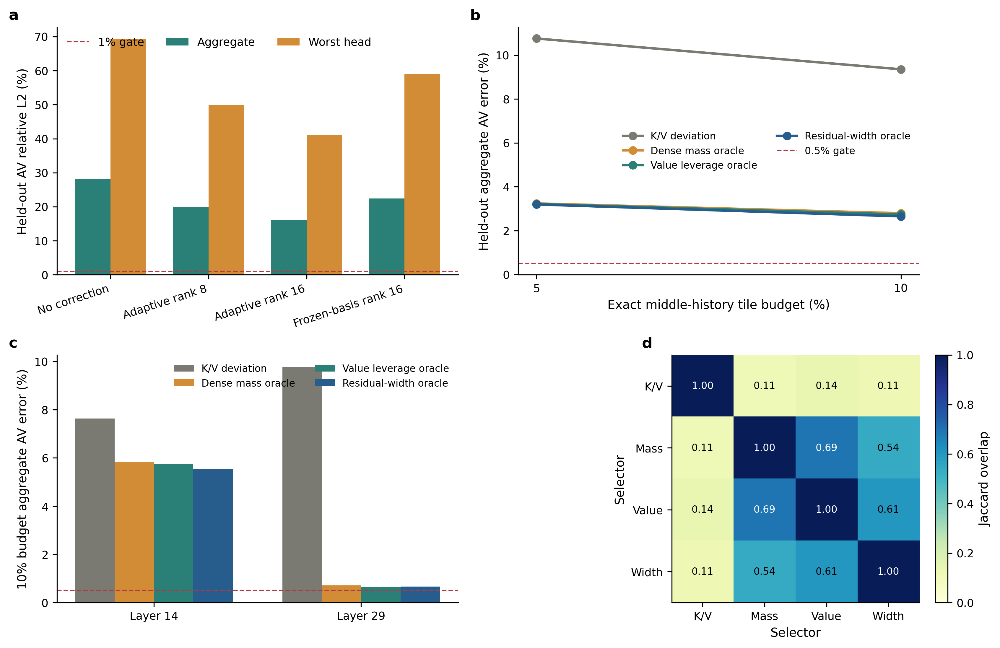

# AR 视频长记忆：BCCB 与残差宽度写入筛选

## 结论

这轮验证得到两个明确的停止结论：

1. 动态 Q/K 条件化、query-tile 粒度的 BCCB/Toeplitz 仍不能作为 LongLive 长记忆主表示。完整 held-out 的 adaptive rank-16 上限为 `16.12%` 聚合误差、`41.06%` 最坏 head；冻结输出基底进一步恶化为 `22.45%/59.06%`。
2. “按剩余 AV 缺陷的 rank-16 尾宽选择 exact write”与现有工作有概念差异，但实测没有形成足够独立的收益。10% 预算下，它相对最强 value-leverage oracle 仅改善 `3.15%`，绝对误差仍为 `2.65%/10.20%`，未通过 `0.5%/1%` 门槛。

因此，不应继续增加 BCCB block、low-rank rank 或更复杂的 support oracle。下一条更有潜力的主线应是：

> **Trajectory-certified variable-rate residual memory：保留全部历史 token，用 layer x head x chunk 风险证书分别分配 K/V 位宽和 residual refinement stage；只有极少高风险 tile 使用 BF16/FP8 精确刷新。**

这条路线不是“再做一个 QVG”：差异必须落在 K/V 分离、非均匀 residual-stage 分配、轨迹风险证书和 fused packed-KV attention 上。

绘图原始数据保存在 `figures/ar_video_residual_width_screen_20260805/ar_video_residual_width_screen_data.csv`。

## 与现有工作的边界

| 工作 | 已覆盖内容 | 本轮候选的差异 | 审计结论 |
|---|---|---|---|
| [PackCache](https://arxiv.org/abs/2601.04359) | condition anchor、跨帧衰减、空间位置保持 | 不按时间衰减，而按 exact write 后剩余 AV 的尾秩选择 | 有差异，但 oracle 增益太小 |
| [FlowCache](https://arxiv.org/abs/2602.10825) | chunkwise cache、importance-redundancy KV 压缩 | 目标从重要性/冗余改为 tail compressibility | 有差异，但 value leverage 已近似覆盖收益 |
| [Forcing-KV](https://arxiv.org/abs/2605.09681) | head specialization、静态/动态 pruning | 支持集由残差流形目标决定 | 函数目标不同，但当前无质量上限优势 |
| [Echo-Forcing](https://arxiv.org/abs/2605.16003) | 层次记忆、scene recall、difference-aware decay | 选择 exact tile 而非 scene/frame memory | 不是相同粒度，但不能支持更强结果 |
| [Quant VideoGen](https://arxiv.org/abs/2602.02958) | semantic smoothing、progressive residual quantization | 下一主线需做非均匀 K/V rate 和轨迹证书 | 仍有空间，但不能声称首次 residual quantization |
| [SLA](https://arxiv.org/abs/2509.24006) | sparse critical + low-rank marginal attention | 本轮把 support 目标改为降低剩余低秩尾宽 | 概念相近；当前结果不足以形成竞争方法 |

文献检索没有发现“在 AR 视频记忆中，以 exact support 对剩余 AV 缺陷 intrinsic rank 的下降作为写入目标”的同构方法，因此该问题定义具有差异；但新颖的问题定义只有在显著优于 mass/value 基线时才有方法价值，本轮没有满足这一条件。

## 实验纪律

- 模型：LongLive-1.3B，官方代码 commit `e52d9ef6865d843282a6b5e9d46d03b35f88929d`。
- 数据：冻结的 96 条 Q/K/V capture；BCCB 使用全部 capture，残差宽度 screen 使用预注册的 8 条 hard-cell capture。
- BCCB 主候选：3 sink + 3 recent exact、5% event tile、动态 query-tile BCCB、adaptive/frozen rank-16 诊断。
- 残差宽度 screen：layer 14 与 29、四类 prompt、64-token tile、5%/10% 完全相同预算。
- 对比选择器：K/V deviation、dense attention mass、value leverage、singleton residual-width。
- residual-width、mass、value 三个选择器都读取当前记录的 dense 信息，均明确标为不可部署 oracle；没有用 held-out 记录训练任何 basis 或 predictor。
- 所有 attention 分支使用共享 softmax 归一化；算术 reduction 不是实测 speedup。

## BCCB 前置门控

| 方法 | Held-out 聚合 AV 误差 | 最坏 head | 乐观算术 reduction |
|---|---:|---:|---:|
| 动态 tile BCCB + 5% event | 28.22% | 69.28% | 1.73x |
| 加 adaptive rank-8 | 19.87% | 49.90% | 1.73x |
| 加 adaptive rank-16 | 16.12% | 41.06% | 1.73x |
| 冻结 calibration basis rank-16 | 22.45% | 59.06% | 1.73x |

早层 smoke 曾达到约 `0.645%/1.047%`，但完整协议显示这是明显的层选择偏差：layer 14 的 adaptive rank-16 约为 `10%`，layer 29 为 `18%--21%`。这说明动态 BCCB 的失败不是容量不足，而是时空位移平稳性只在少量早层局部成立。

## 残差宽度写入结果

Held-out、adaptive rank-16：

| Selector | 5% aggregate / worst | 10% aggregate / worst |
|---|---:|---:|
| K/V deviation | 10.76% / 21.84% | 9.35% / 20.10% |
| Dense mass oracle | 3.24% / 12.70% | 2.80% / 11.00% |
| Value leverage oracle | 3.21% / 12.86% | 2.74% / 11.45% |
| Residual-width oracle | **3.20% / 12.14%** | **2.65% / 10.20%** |

相对最强基线，width oracle 的聚合改善仅为：

- 5% budget：`0.62%` relative；
- 10% budget：`3.15%` relative。

这远低于预注册的 `20%` mechanism gate。10% 时 width 与 mass 的平均 Jaccard 为 `0.535`，与 value leverage 为 `0.605`；5% 时重合进一步升至 `0.743/0.693`。主要收益来自找出高 attention mass、高 V leverage 的 token，而不是把剩余缺陷塑造成一个显著更低维的新流形。

分层结果也说明 width 不是统一优势：

- layer 14：width `5.54%`，优于 value `5.73%`，但绝对误差仍很高；
- layer 29：value `0.656%`，反而略优于 width `0.668%`，且最坏 head 仍超过 `2%`。

width oracle 每条 capture 约需 `9.57 s` 的 150 次 singleton 评估；mass/value 统计约 `0.075 s`。即使忽略其 dense-label 泄漏，额外收益也不足以支持部署 router。

## 为什么停止 support/BCM 主线

令基础记忆近似产生缺陷 (D_\Omega=Y-\hat Y_\Omega)，tail-width 目标为

\[
R_r(\Omega)=\sum_{i>r}\sigma_i^2(D_\Omega).
\]

本轮 oracle 直接以 singleton 边际 (R_{16}(\varnothing)-R_{16}(\{c\})) 排序 exact tile。若“support-manifold co-design”是主要遗漏机制，它应明显优于只看 mass 或 value leverage 的选择；结果没有出现这一现象。原因是当前高杠杆 tile 同时主导 attention mass、V contribution 和尾部能量，三个目标高度相关。support 选择可以删除大误差源，却不能改变 layer 14 中剩余缺陷的高维内容相关结构。

BCCB 失败则更直接：即使 kernel 由当前 Q/K、query tile 和 frame pair 动态生成，每个 tile 内仍共享位移模板；layer 14/29 的内容相位、遮挡和对象运动使这一平稳假设失效。低秩分支只能截取部分输出尾部，不能修复错误的主算子。

## 仍有潜力且更有差异的下一方向

已有结果共同支持“分配精度，而不是继续删除 support”：

- QVG 审计中 K-only INT4 已接近严格门槛，而 V residual 是主要误差源；
- layer x head 风险排序在 calibration 与 held-out 间高度稳定；
- 本轮 dense mass/value 几乎覆盖 residual-width 的全部收益；
- 固定 low-rank/BCCB 不能描述跨内容旋转的缺陷。

建议下一方法写为：

\[
\min_{b_i^K,b_i^V,s_i}
\sum_i\left[D_i^K(b_i^K,s_i;H_i^K)+D_i^V(b_i^V,s_i;w_i^V)\right]
+\lambda T_{\mathrm{H200}},
\]

其中 (b_i^K,b_i^V) 是 K/V 分离位宽，(s_i) 是 residual refinement stage；每个 token 至少保留 coarse code，不再不可逆删除。与 QVG 的边界必须是：

1. layer x head x chunk/tile 非均匀 stage，而非统一 PRQ；
2. K/V 分离 rate，优先保护 V；
3. calibration-only trajectory-risk certificate 和运行时 fallback；
4. packed decode、RoPE 与 attention 融合，实际测 H200 latency；
5. 失败 cell 保留 FP8/BF16，不强迫统一压缩。

最小下一 gate 应只测试 `K-INT4 + V-FP8`、`K-FP8 + V-FP8` 和 BF16，并在 5%/10%/20% refinement budget 下比较 uniform、value leverage 与 calibration risk。若 `K-INT4 + V-FP8 + 20% refinement` 的 oracle 仍不能达到 `1%/2%`，应停止严格无损的 train-free variable-rate 路线；若 oracle 通过而 proxy 失败，再考虑只训练 rate gate 的低成本适配。

## 最终定位

本轮有价值的贡献是严谨排除两条看似新颖但无充分收益的路线：动态 recurrent BCCB 与 residual-width exact-write。残差宽度目标在问题定义上有差异，但没有达到方法级优势。当前最值得继续的方向是风险认证的 K/V 分离可变码率记忆；BCM/BCCB 仅保留为局部 router 特征或离线诊断，不再作为主表示。
