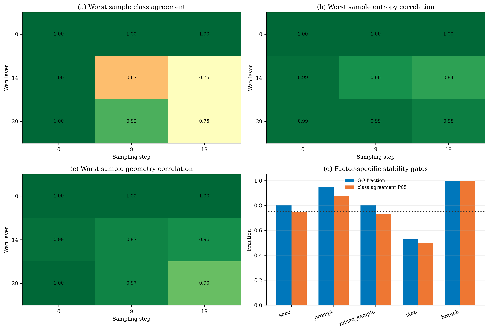

# Wan F81 Attention Head 阶乘稳定性与混合执行器改进

## 核心结论

本轮完成了 `4 samples x 3 sampling steps x 3 layers x 2 CFG branches = 72`
个真实 Wan2.1-T2V-1.3B F81 attention 单元的统计。结果把“动态”进一步拆清楚了：

1. head 的粗粒度角色在 prompt 与 seed 之间通常稳定，但在 diffusion step 之间明显变化；
2. conditional/unconditional 两个 CFG branch 的角色统计几乎完全一致，可以共享算子类别；
3. layer 0 在样本、step 和 CFG 三个维度都稳定，允许静态 head-role 策略；
4. layer 14 是最不稳定的探测层，不能使用跨样本或跨 step 的固定角色表；
5. layer 29 对样本较稳定，但对 step 不稳定，适合 timestep bucket，而不是 step-agnostic 路由；
6. 这些结论只支持共享“选择哪类算子”的规则，不支持共享 token mask、activation、量化尺度或 frozen low-rank correction basis。

因此，改进后的主路径不应是一个统一的 sparse + low-rank 配置，而应是：

> **layer x timestep bucket x head 的角色先验，加上只在不稳定单元启用的内容条件化路由。**

## 实验范围

- 模型：Wan2.1-T2V-1.3B；
- 视频：F81，self-attention token 数 `32,760`；
- prompts：2；
- seeds：2；
- sampling steps：`0 / 9 / 19`；
- layers：`0 / 14 / 29`；
- CFG branches：`cond / uncond`；
- heads：每个单元 12；
- 每个 head 使用 128 个采样 query 统计 entropy、geometry mass、top-64 mass 与 participation support。

规则分类仅用于低成本先验：

- `localized`：normalized entropy `<=0.55` 且 geometry mass `>=0.80`；
- `transitional`：normalized entropy `<=0.80` 且 geometry mass `>=0.50`；
- 其余为 `diffuse`。

该分类不是质量结论，也没有证明某个 sparse kernel 已经可部署。

## 因素分解结果

| 比较因素 | Pair 数 | GO fraction | Entropy corr P05 | Geometry corr P05 | Class agreement P05 | Localized Jaccard P05 |
| --- | ---: | ---: | ---: | ---: | ---: | ---: |
| seed | 36 | 0.806 | 0.982 | 0.957 | 0.750 | 0.000 |
| prompt | 36 | 0.944 | 0.971 | 0.977 | 0.875 | 0.458 |
| prompt + seed | 36 | 0.806 | 0.951 | 0.944 | 0.729 | 0.000 |
| sampling step | 72 | 0.528 | 0.855 | 0.809 | 0.500 | 0.000 |
| CFG branch | 36 | 1.000 | 0.994 | 0.989 | 1.000 | 1.000 |

最强稳定因素是 CFG branch，最弱因素是 sampling step。prompt 的稳定性高于 seed，
但总体的 `fixed_layer_step_router_go` 仍未通过，因为中央层的 seed 变化会使少数 head
越过人工分类边界。

## 分层结论

| Layer | 跨 seed GO | 跨 prompt GO | 跨 step GO | CFG 共用 GO | 建议 |
| ---: | ---: | ---: | ---: | ---: | --- |
| 0 | 1.000 | 1.000 | 1.000 | 1.000 | 静态 head-role 表可进入下一阶段 |
| 14 | 0.500 | 0.833 | 0.167 | 1.000 | 必须内容/step 条件化并保留 dense fallback |
| 29 | 0.917 | 1.000 | 0.417 | 1.000 | 样本先验可复用，但必须按 step 分桶 |

step 差异也不是均匀的：

- layer 14 的 `step 0 -> 19` GO fraction 为 `0`，class agreement 最低 `0.417`；
- layer 29 的 `step 0 -> 19` GO fraction 也为 `0`；
- layer 0 的三个 step pair 均为 `1.0`；
- layer 29 的 `step 9 -> 19` 比 `step 0 -> 19` 稳定，说明 early/late 分桶比等宽分桶更合理。

只探测了 3 个 layer，不能把 layer 0/14/29 直接插值成完整 30 层策略。下一轮应在 dense
reference rollout 中在线累计全层 compact statistics，而不是继续保存数十 GB QKV。

## 与 sparse + low-rank oracle 的联合解释

在 layer 0、step 0、conditional branch 的独立 seed 上，12.5% key-block density 与
per-sample rank-16 tail 达到：

- 动态 mask + 自适应 basis：aggregate `0.629%`，worst head `1.85%`；
- frozen mask + 自适应 basis：aggregate `0.630%`；
- 动态 mask + frozen basis：aggregate `2.76%`；
- frozen mask + frozen basis：aggregate `2.68%`，worst head `11.75%`。

这里必须避免一个错误推论：`0.629% -> 0.630%` 不代表所有 head 的 sparse support
都稳定。它只说明在允许 held-out oracle basis 自适应时，mask 差异可以被 rank-16 tail
吸收。按 head 检查后，结构更明确：

| Head 类型示例 | Entropy | Geometry mass | Mask Jaccard | Adaptive rank-16 error | Frozen-basis error |
| --- | ---: | ---: | ---: | ---: | ---: |
| localized head 4 | 0.382 | 0.936 | 0.962 | 0.13% | 0.18% |
| transitional head 7 | 0.722 | 0.674 | 0.918 | 1.85% | 4.00% |
| diffuse head 8 | 0.997 | 0.064 | 0.090 | 0.58% | 10.39% |
| diffuse head 9 | 0.983 | 0.088 | 0.341 | 0.93% | 11.75% |

在这 12 个 head 上，frozen-basis error 与 entropy 的 Pearson correlation 为 `+0.781`，
与 geometry mass、top-64 mass、mask Jaccard 和 basis overlap 的 correlation 分别为
`-0.757 / -0.700 / -0.785 / -0.803`。样本数只有 12，这些是描述性证据而不是因果证明，
但它与 head-role 分解一致：

- localized head 的 support 与 correction 都容易迁移；
- transitional head 需要动态 critical 与小型条件化 tail；
- diffuse head 的低密度 sparse 路径没有意义，其 oracle 成功主要依赖重新学习低秩输出子空间。

## 改进后的三类执行器

### 1. Localized：可编译 sparse critical

对稳定 localized heads 使用固定候选 geometry stencil、固定 tile layout 与少量动态 refresh。
路由只需在候选块中选择，不应先形成 dense attention 再 top-k。calibration mask 可以作为
候选集合，但必须在 held-out prompt/seed/step 上验证 recall 与 worst-head output error。

### 2. Transitional：动态 sparse + 条件化 marginal

使用 pooled Q/K block summaries 计算廉价 block score，再执行真正 selected-key softmax：

\[
s_{uv}=\langle \bar q_u,\bar k_v\rangle + b_{\rm geometry}(u,v,t),
\qquad
Y_u^{\rm critical}=\operatorname{softmax}_{v\in S_u}(QK^T)V.
\]

当 block size 为 64 时，粗粒度 score 的复杂度约为
`O((N/64)^2 d)`，远小于 dense `O(N^2 d)`。它仍需实测 gather、排序与 kernel launch，
不能只按 FLOPs 推导速度。

marginal tail 不应继续使用 frozen output-PCA basis。更可部署的两个候选是：

1. 由 Q/K landmarks 在线生成因子的 Nyström/linear-attention tail；
2. 低成本适配得到的小型 content-conditioned dictionary，gating 只读取 pooled Q/K、step、
   motion 与 cache age。

### 3. Diffuse：FP8 dense 或内容生成的低秩 bulk

diffuse heads 不应被强制使用与 localized heads 相同的 sparse density。优先比较：

- fused FP8 dense attention；
- 内容生成的 linear/Nyström attention；
- BF16 dense fallback。

静态 low-rank correction 在 diffuse heads 上失败，不等于低秩 attention 必然失败。前者固定
的是输出缺陷特征向量；后者可以从当前 Q/K 动态生成左右因子，理论对象不同。

## CFG 共享的准确边界

`branch_shared_router_go=true` 只允许：

- cond/uncond 共用 head role；
- 共用 kernel family 与 tile layout；
- 在确认风险相近后共用 refresh schedule。

它不允许直接共用：

- Q/K/V activation；
- quantization scale；
- low-rank coefficient；
- cache content；
- 最终 sparse mask。

工程上可以让两支一起批处理或并行到两张 H200，但数值参数仍按 branch 计算。

## 统一目标与质量门槛

对 head `h`、layer `l`、step bucket `b`，建议优化：

\[
\min_{a,S,\theta}
\mathbb E\left[
\left\|G_{l,b}^{1/2}
\left(Y^D_{l,b,h}-Y^{a,S,\theta}_{l,b,h}\right)\right\|_2^2
\right]
+\lambda C_{\rm H200}(a,S,\theta),
\]

其中 `a` 为 localized/transitional/diffuse 对应的算子，`G` 为轨迹风险权重，`C_H200`
必须来自真实 fused kernel latency。

进入 rollout 前同时满足：

- aggregate local output error `<=1%`；
- every-head error `<=2%`，不允许 aggregate 掩盖 diffuse head；
- 多 prompt/seed/step 的 held-out 门槛全部通过；
- isolated local kernel median speedup `>=2x`，P95 `>=1.5x`；
- router 不读取 dense attention，不发生 CPU sync；
- correction 与 sparse softmax/AV 融合，或其独立开销已计入真实 wall-clock。

## 下一轮最小充分实验

1. 全 30 层 compact head-role scan：在 reference rollout 内直接累计统计，只保存 CSV；
2. 对 layer 0/14/29 与 step 0/9/19 分别跑 12.5%/rank-16 oracle，得到 cell-wise worst-head frontier；
3. 按 head role 比较 static geometry、pooled-Q/K router、Nyström/linear tail 与 FP8 dense；
4. 先实现 isolated H200 fused `64x64` sparse-softmax-AV，不先接完整 rollout；
5. 只有 local quality 与 `>=2x` 同时通过，才接入 World Foundry 做多 prompt、多 seed F81 视频；
6. 最终报告 SSIM、LPIPS、VBench、motion consistency、worst sample 与真实端到端速度。

停止条件：如果 per-cell oracle 在代表性 layer/step 上不能同时达到 aggregate `<=1%`、
worst-head `<=2%`，停止该 cell 的 sparse + tail 路线；如果数值通过但 fused local speedup
`<1.5x`，停止完整 rollout，转向 FP8 dense、exact CFG parallel 或 NFE/solver 优化。

## 证据文件

- 总体统计：`attention_head_factorial_f81_v1/summary/attention_head_factorial_summary.csv`；
- 分层统计：`attention_head_factorial_f81_v1/summary/attention_head_factorial_layer_summary.csv`；
- step-pair 统计：`attention_head_factorial_f81_v1/summary/attention_head_factorial_step_pair_summary.csv`；
- 全部 216 个 pair：`attention_head_factorial_f81_v1/summary/attention_head_factorial_pairs.csv`；
- 决策与实验边界：`attention_head_factorial_f81_v1/summary/attention_head_factorial_summary.json`；
- 汇总脚本：`scripts/summarize_attention_head_factorial.py`；
- 单元测试：`scripts/test_attention_head_factorial.py`。

最终定位与 [Sparse-vDiT](https://arxiv.org/abs/2506.03065) 的多模式稀疏、
[SLA](https://arxiv.org/abs/2509.24006) 的 sparse critical + low-rank marginal 和
[SLA2](https://arxiv.org/abs/2602.12675) 的可学习路由方向一致。这里新增的 Wan F81 证据是：
**算子角色对 CFG 和多数样本稳定，但对 step 与中央层不稳定；真正需要条件化的是 marginal
内容子空间和少数不稳定单元，而不是让所有 head 都承担完整动态路由开销。**
