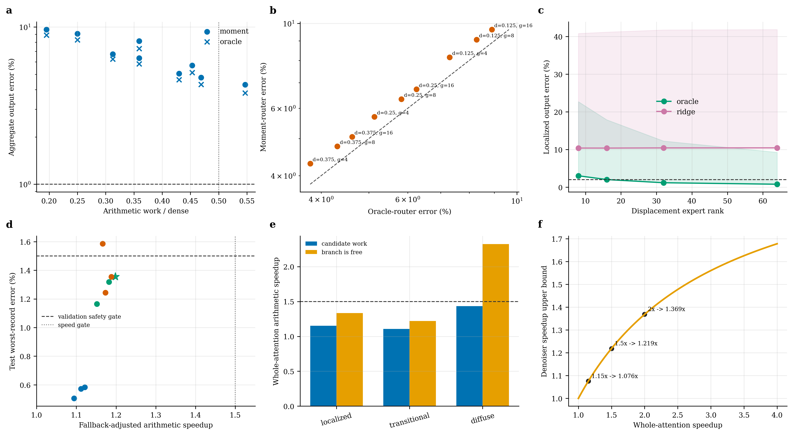

# F81 Content-Structured Attention Probe 与路线收敛报告

日期：2026-07-26

## 1. 最终判断

本轮完成了此前缺失的两个函数类验证，并增加了 validation-calibrated fallback：

1. 当前 K/V 统计驱动的 exact-critical + block-moment marginal；
2. 非周期、边界感知的局部 displacement expert mixture；
3. moment-mass confidence gate + dense fallback。

结论不是“所有结构化 Attention 都失败”，而是：

| 路线 | 数值结论 | 系统结论 | 处理 |
|---|---:|---:|---|
| 全 head block-moment tail | `4.775%` 聚合、`52.01%` 最坏（工作量 `46.88%`） | 未过质量门槛 | 停止作为主路径 |
| oracle block router | `4.315%` 聚合、`49.30%` 最坏 | router 不是主瓶颈 | 停止继续优化同类 router |
| localized displacement rank-8 oracle | `3.012%` 聚合、`22.69%` 最坏 | 固定低秩 displacement basis 不够 | 停止低 rank 路线 |
| localized displacement rank-64 oracle | `0.768%` 聚合、`9.24%` 最坏 | 平均可拟合，但最坏值仍不合格 | 不进入 kernel |
| Q-only displacement gate | rank `8-64` 均约 `10.4%` 聚合 | 增 rank 不改善可部署 gate | 停止 Q-only gate |
| 保守 moment-confidence fallback | `0.248%` 聚合、`1.356%` 最坏 | 算术 Attention 仅 `1.198x` | 仅保留为附属 expert |

**主路线应继续采用动态高秩 sparse-critical + content-generated marginal tail；localized geometry/moment 只能作为置信度门控的边缘分支，不能主导 Attention。**

本轮没有继续写 H200 fused kernel。这是 stop gate 的执行结果，而不是实验缺漏：候选在忽略 moment reduction、gather、softmax、launch 和 fallback 开销时都只有 `1.198x` 算术上界，已低于 `1.5x` kernel 继续门槛。

## 2. 实验范围与方法

### 2.1 数据范围

- 模型与长度：World Foundry 中的 Wan 视频 DiT，F81，token grid `21 x 30 x 52 = 32,760`。
- 样本：`2 prompts x 2 seeds`。
- Transformer cell：layers `0, 14, 29`，sampling steps `0, 9, 19`，本轮使用 `cond` branch。
- Capture 数：`4 x 3 x 3 = 36`；每个 capture `12 heads`。
- block-moment 每个 capture 采样一个 `64-query` tile。
- displacement 每个 capture 采样 `32` 个内部 query，局部半径 `2 x 4 x 4`，共 `405` 个非周期 offset。
- 校准/验证/测试严格按 sample id 划分：`s00 / s01 / {s02, s03}`。
- 数值 probe 在空闲 RTX 4090 上运行；此前的 Attention 占比与系统 timing 来自 H200 实测。

因此，本报告是 cell-level 数值与系统筛选证据，不等价于完整 F81 rollout/VBench 结论。

### 2.2 Current-K/V block moment

对每个 query tile，先用当前 K 的 block centroid 路由，选择 exact critical blocks；未选择的 block 被分为更小的 tail groups，每组直接从当前 K/V 计算统计量。

Centroid 近似为：

\[
\widehat{Y}_{g}
\propto
n_g \exp(q^\top \bar{k}_g / \sqrt d)\bar{v}_g.
\]

Diagonal-Gaussian 版本进一步加入 K 方差和 K/V 对角协方差。它不使用冻结输出 basis，因此比此前 frozen low-rank correction 更接近可部署函数类。

对照两类 router：

- `moment`：只读当前 pooled K，可部署候选；
- `oracle_mass`：读取 dense attention block mass，仅用于分离 routing 与 tail approximation 误差。

算术工作量 proxy 包含 router landmarks、exact selected keys 和 tail landmarks，但**不包含** K/V moment reduction、索引、kernel launch 与不规则内存访问。

### 2.3 Local displacement mixture

Attention row 被对齐到固定 THW offset stencil，不使用周期 wrap-around。每个 head/cell 在 calibration rows 上拟合：

\[
p_{\mathrm{local}}(q)
\approx
\mu + Bc(q),
\qquad B\in\mathbb{R}^{405\times r}.
\]

分别评价：

- `oracle_nonnegative`：held-out row 直接投影求最优系数；
- `ridge_nonnegative`：只从当前 Q 用 ridge 预测系数。

该 probe 保留了 local window 外部的精确输出，因此只回答“局部 expert 能否替换”，不能直接给出完整 sparse-attention 加速结论。

在线性、未裁剪的 expert mixture 中可讨论 `rank <= r+1`；非负 clamp 后不再具有这一简单 rank 上界。

## 3. Block-moment 结果

### 3.1 容量 Pareto

| density | tail group | work/dense | moment 聚合 | moment 最坏 | oracle 聚合 | oracle 最坏 |
|---:|---:|---:|---:|---:|---:|---:|
| 0.125 | 16 | 0.1953 | 9.634% | 81.75% | 8.895% | 78.41% |
| 0.125 | 8 | 0.2500 | 9.070% | 76.15% | 8.279% | 72.96% |
| 0.250 | 8 | 0.3594 | 6.340% | 62.98% | 5.825% | 60.85% |
| 0.375 | 16 | 0.4297 | 5.055% | 55.80% | 4.625% | 52.93% |
| 0.375 | 8 | 0.4688 | 4.775% | 52.01% | 4.315% | 49.30% |

即使接近 `50%` dense arithmetic，仍远离 `1% / 2%` 质量门槛。oracle 与 moment 的误差差距小，说明主要问题是 tail distribution 不能由少量 moments 表示，而不是选错 critical block。

Diagonal-Gaussian 版本在 pilot 中出现数倍聚合误差和极端 outlier。原因是高斯 moment-generating approximation 对 heavy-tailed logits、K/V 相关项和方差估计非常敏感，并不适合直接用于该 Attention softmax tail。

### 3.2 按 head role 分解

最佳预算内配置 `density=0.375, tail=8`：

| role | test records | 占比 | 聚合误差 | P95 | 最坏 |
|---|---:|---:|---:|---:|---:|
| localized | 54 | 25.00% | 0.515% | 1.552% | 8.233% |
| transitional | 39 | 18.06% | 3.529% | 8.857% | 9.535% |
| diffuse | 123 | 56.94% | 8.783% | 25.44% | 52.01% |

正面信号是 localized 平均误差很低；负面信号是它只占全部 head-cell 的 `25%`，且存在少数 outlier。

如果只对 localized records 使用该候选，其他 records dense fallback：

\[
S_{\mathrm{attn}}
=
\frac{1}{0.75 + 0.25\times0.4688}
=1.153x.
\]

即使 localized 分支完全免费，上限也只有：

\[
S_{\mathrm{attn}}^{\mathrm{free}}
=\frac{1}{1-0.25}=1.333x<1.5x.
\]

因此 localized BCCB/moment 成功也不足以成为主加速路径；必须同时解决 transitional 或 diffuse heads。

## 4. Confidence fallback 结果

`router_selected_mass_proxy` 完全由当前 moment logits 计算，不读取 dense attention。配置和阈值只在 validation 上选择，test 不参与选择。

直接使用 `2%` validation 门槛时，冻结策略在 test 达到：

- 聚合误差 `0.245%`；
- 最坏 `2.141%`，略超严格门槛；
- 覆盖 `31.48%`；
- fallback-adjusted arithmetic speed `1.219x`。

使用 `1.5%` validation 安全裕量后，冻结策略为：

- `density=0.25, tail_group=16`；
- proxy threshold `0.984569`；
- test 接受 `52 / 216 = 24.07%` records，其中 `47 localized + 5 transitional`；
- 聚合误差 `0.248%`；
- P95 `0.963%`；
- 最坏 `1.356%`；
- fallback-adjusted arithmetic work `0.8345`；
- arithmetic Attention speedup `1.198x`。

这证明一个有限但真实的结论：**moment-mass 可以作为训练免费、低风险的 fallback certificate 特征。** 但它证明的不是主加速器，因为 `1.198x` 还是忽略真实 kernel overhead 的上界。

## 5. Local displacement 结果

### 5.1 Oracle capacity 与可部署 gate

| rank | calibration basis energy | oracle 聚合 | oracle 最坏 | Q-ridge 聚合 | Q-ridge 最坏 |
|---:|---:|---:|---:|---:|---:|
| 8 | 96.27% | 3.012% | 22.69% | 10.372% | 40.80% |
| 16 | 99.04% | 2.009% | 17.88% | 10.366% | 41.16% |
| 32 | 99.93% | 1.165% | 12.24% | 10.412% | 41.74% |
| 64 | ~100% | 0.768% | 9.24% | 10.423% | 41.85% |

这里再次出现“calibration energy 看起来接近完美，但 held-out output 不合格”的现象。rank-64 oracle 降低了平均误差，却不能控制最坏样本；Q-only gate 随 rank 增加完全不改善，说明瓶颈不是 basis 容量，而是系数需要当前 K/V、内容、运动和可能的 CFG/step 条件。

更重要的是，oracle rank-8 本身未过门槛，因此暂时没有必要继续为该固定 displacement basis 设计更复杂 gate。先满足 oracle gate，再讨论 predictor，能避免在错误 basis 上过拟合路由器。

## 6. 为什么 moments 与固定 displacement 失败

### 6.1 Softmax tail 需要的不只是低阶 K/V moments

每组真实贡献为：

\[
Y_g(q)=
\frac{\sum_{j\in g}\exp(q^\top k_j)v_j}
{\sum_m\sum_{j\in m}\exp(q^\top k_j)}.
\]

Centroid 只保留 `E[K]` 与 `E[V]`；diagonal Gaussian 也只保留逐维方差和对角 K/V 协方差。真实贡献还依赖：

- 非高斯 logit tail；
- full K covariance；
- 与 query 方向相关的 K/V cross covariance；
- softmax denominator 的组间竞争；
- 高杠杆 V outlier。

因此“当前 K/V 生成”消除了 frozen basis 问题，但没有消除分布摘要不足的问题。

### 6.2 固定位移 eigenvectors 与动态内容不匹配

局部对齐只解决了平移坐标系，不会使真实 attention 变成固定卷积：遮挡、非刚体运动、多物体 flow、语义锚点和边界仍让系数与特征方向随样本旋转。rank-64 oracle 的平均改善说明 displacement 坐标有部分价值；Q-ridge 的平台期说明固定 basis 加 Q-only 系数不是正确的可部署参数化。

### 6.3 表示完备不等于预算完备

随着 tail group 变为 1 或 displacement rank 接近 stencil size，两种方法都可逼近 dense attention；这只是无约束完备性。真正相关的是：

\[
\min_{a,\theta}\ C_{\mathrm{H200}}(a,\theta)
\quad\text{s.t.}\quad
E_{\mathrm{trajectory}}(a,\theta)\le\epsilon.
\]

本轮在 `work <= 0.5 dense` 或 `rank <= 64` 的约束下否定了简单函数类，因而不应继续通过无限缩小 group 或增加 rank 强行获得数值通过。

## 7. 与此前证据合并

| 证据 | 结果 | 含义 |
|---|---:|---|
| fixed/global/hierarchical BCM | 最好约 `50.41%` | 固定 Fourier/displacement 主 basis 错配 |
| dynamic sparse 12.5% + adaptive rank-16 oracle | `0.629%` 聚合、`1.85%` 最坏 | sparse-critical + low-dimensional tail 的表示命题成立 |
| frozen low-rank basis | `2.68-2.76%`，最坏 `11.75%` | 静态跨样本 U 不成立 |
| position-only basis bank | 最好约 `2.82%`，最坏超 `12%` | 仅位置/step 分桶不够 |
| current-K/V block moments | 最好预算内 `4.775%`，最坏 `52.01%` | 简单内容摘要仍不够 |
| confidence-gated subset | `0.248%`，最坏 `1.356%` | 可安全覆盖约四分之一 records，但速度不足 |

所以尚未被否定、且最值得继续的命题是：

> 动态高秩稀疏 critical 主体 + 由当前内容生成的 richer marginal tail + dense/FP8 fallback。

## 8. 与现有工作的关系

- [Sparse-vDiT](https://arxiv.org/abs/2506.03065) 报告 diagonal、multi-diagonal、vertical-stripe 等多种 pattern，并采用按 layer/head 搜索和 pattern-specific kernels，而不是单一 BCCB；论文报告 Wan2.1 实际推理 `1.58x`。这与本轮“多角色、单一固定结构不够”的结果一致。
- [SLA](https://arxiv.org/abs/2509.24006) 将 high-rank critical、low-rank marginal 与 negligible 分开，并通过少量 fine-tuning 和 fused sparse-linear kernel 实现论文所报 Attention 与端到端加速。它更接近此前通过的 `dynamic sparse + adaptive tail oracle`。
- [SLA2](https://arxiv.org/abs/2602.12675) 进一步指出启发式 sparse/linear split 可能次优，引入 learnable router、直接 sparse-linear formulation 与 QAT。这与本轮 oracle/router 分离结果共同说明：router 必须服务于足够强的 tail function class，单独优化 router 无法修复 block moments。

## 9. 收敛后的系统结构

建议将 Attention executor 收敛为三类，而不是强迫所有 heads 使用同一近似：

1. **Diffuse：FP8/BF16 dense FlashAttention**
   - 该角色占 `56.94%`，决定主速度上限；
   - 优先做 fused FP8、scale bucketing、QAT/低成本适配；
   - 不使用固定 BCM 或 centroid tail。

2. **Transitional：dynamic sparse-critical + content-generated tail**
   - sparse mask 必须由当前 Q/K 或低成本 router 生成；
   - tail 应测试 Nyström/landmark、kernel feature 或少量可学习 linear branch；
   - correction 直接拟合 `AV` 或 rollout-weighted defect，不拟合概率 Frobenius 范数。

3. **Localized：confidence-gated geometry/moment expert**
   - 仅当 moment-mass certificate 通过时启用；
   - 失败立即 dense/FP8 fallback；
   - 只在与更广泛 sparse kernel 融合、额外开销接近零时保留，不单独开发 kernel。

## 10. 下一步与 stop/go 门槛

### P0：复现强 baseline，而不是继续扩 BCM

优先接入或忠实复现 Sparse-vDiT / SLA 类 dynamic sparse-linear Attention，先验证同一 Wan/World Foundry stack 上的 kernel 与质量。当前简单 BCM、block moments 与 Q-only displacement gate 均停止。

### P1：content-generated tail probe

按以下顺序筛选：

1. per-sample sparse-critical + Nyström/landmark tail oracle；
2. layer-step bucket landmark selection；
3. current pooled Q/K router；
4. 少量 fine-tuning 的 linear tail；
5. 与 FP8 bulk 的联合误差整形。

继续门槛：

- test aggregate output error `<=1%`；
- every record/head `<=2%`；
- 跨 prompt/seed transfer；
- fallback-adjusted arithmetic whole-Attention speed `>=1.5x`；
- 预测 fused H200 whole-Attention speed `>=1.5x`，目标 `2x`。

### P2：只有数值和覆盖率同时通过才写 H200 kernel

Kernel 必须融合：

- router/mask；
- sparse QK；
- marginal branch；
- shared softmax normalization；
- output accumulation；
- optional FP8 cast/scale。

独立 Python branch、额外完整 tensor clone 或多个小 GEMM 不进入端到端结论。

### P3：rollout

只有 local fused kernel 达到 `>=1.5x` 后才进入 F81 多 prompt/seed rollout，评价 dense-relative trajectory、SSIM/PSNR、VBench 与真实 wall-clock。若 Attention `2x`，按实测 Attention share `53.88%`，denoiser Amdahl 上限约 `1.369x`；这仍是系统收益的合理目标，而不是 `2x` 端到端承诺。

## 11. 可视化与原始数据

- 六面板原始数据：`results/content_structure_decision_f81_v1/content_structure_decision_data.csv`
- block capacity：`results/block_moment_marginal_f81_capacity_v1/`
- displacement capacity：`results/local_displacement_mixture_f81_capacity_v1/`
- deployable confidence run：`results/block_moment_marginal_f81_confidence_v1/`
- conservative confidence calibration：`results/block_moment_confidence_margin15_v1/`

## 12. 一句话结论

**局部几何/BCM 类结构可以被置信度门控后安全用于少数 heads，但覆盖率决定它只能是附属分支；真正能越过 `1.5x` Attention 门槛的主路径必须同时处理占多数的 diffuse/transitional heads，因此应转向融合 FP8 dense + dynamic sparse-critical + richer content-generated tail，而不是继续扩大固定 BCM 或 frozen low-rank basis。**
