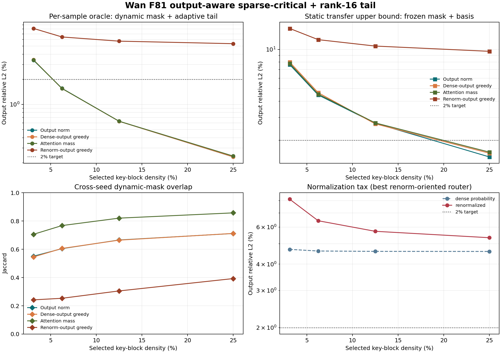
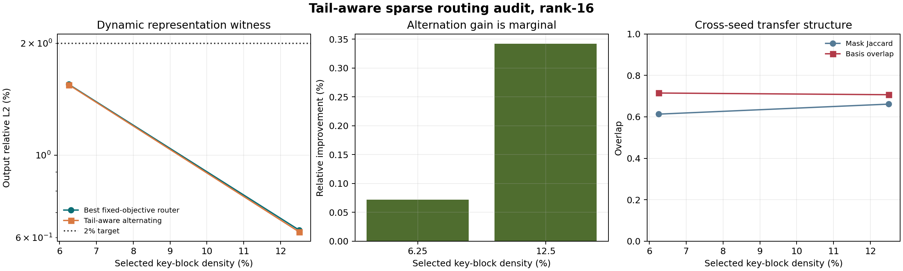
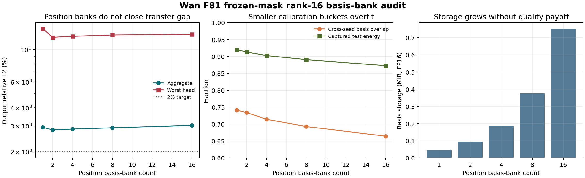

# F81 动态稀疏 Critical + 条件化低秩 Tail 审计

日期：2026-07-26

## 核心结论

本轮结果没有恢复静态 BCM，也没有证明一个可部署的低秩 attention 已经成立。它更精确地把剩余机会定位为：

> head-role-aware dynamic sparse critical + content-conditioned low-rank/linear marginal + dense fallback。

最关键的四个结论如下。

1. 在真实 Wan2.1-T2V-1.3B F81 Q/K/V replay 上，`64 x 64` 块、12.5% key-block 密度和 per-sample rank-16 输出尾部可以把 12-head 聚合局部误差降到 `0.629%`，逐 head 最大值为 `1.84%`。这证明该预算下存在一个表示 witness。
2. 固定 calibration mask、但允许 held-out 自适应 basis 时误差仍为 `0.630%`。mask 冻结几乎没有损失，当前主瓶颈不是跨 seed support 迁移。
3. 固定 calibration basis 后，动态 mask 为 `2.76%`，mask 与 basis 同时固定为 `2.68%`；head 9 达到 `11.75%`。真正失败的是静态 defect subspace transfer。
4. 更复杂的 tail-aware alternating router 仅改善 `0.07%-0.34%`；2/4/8/16 个位置 basis bank 也不能过门槛。应停止继续增加静态路由和位置 basis 复杂度，转向内容条件化系数/子空间与 head-wise fallback。

## 证据边界

本实验使用：

- 模型：Wan2.1-T2V-1.3B；
- 视频长度：F81，token grid 为 `21 x 30 x 52 = 32,760`；
- cell：layer 0、sampling step 0、conditional branch；
- heads：12，head dimension 为 128；
- calibration：seed 20260740；
- held-out：seed 20260741；
- 动态主实验：4 个分散的连续 64-query tiles；
- basis-bank 实验：16 个分散的连续 64-query tiles。

现有 8 个名义 capture 只有 2 个 bit-distinct QKV 内容组。layer-0/step-0 self-attention 位于 prompt/CFG 信息进入之前，因此本轮是跨 seed 结构筛查，不是多 prompt、跨 layer/step 或端到端视频质量证据。

所有误差均为 pre-output-projection attention 输出 `AV` 的 relative L2。没有包含 O projection、residual、后续 block、扩散轨迹、量化或视频指标。

## 输出感知的实验定义

对每个连续 64-query tile 和 head，把 32,760 个 keys 划成 512 个连续 64-key blocks。第 `b` 个块的精确输出贡献为：

\[
C_b=A_{:,K_b}V_{K_b},\qquad Y=AV=\sum_b C_b.
\]

比较四种块选择规则：

- `mass_topk`：按 attention mass 选择；
- `contribution_norm`：按 `||C_b||_F` 选择；
- `dense_output_greedy`：贪心最小化未归一化输出残差；
- `renorm_output_greedy`：贪心最小化 selected-key 重新归一化后的输出残差。

对选择集合 `S`，可稀疏重算的输出为：

\[
Y_S=
\frac{\sum_{j\in S}\exp(q^Tk_j)V_j}
{\sum_{j\in S}\exp(q^Tk_j)}.
\]

低秩 tail 直接拟合输出缺陷，而不是 attention probability：

\[
E=Y-Y_S,\qquad
E\approx CB^T,\quad B\in\mathbb R^{128\times r}.
\]

这里的 per-sample `B` 和系数 `C` 都使用 held-out defect 的最优 SVD，是不可部署的表示 witness。它只能证明“存在”，不能证明运行时可以低成本得到该 correction。

另外保留 `dense_probability` 上限作为诊断，但它使用所有 key 的 softmax denominator，不属于可部署 sparse attention。本报告的主结论只使用 `renormalized` 路径。

## 四层 Transfer 分解

实验分别报告：

1. 动态 mask + held-out 自适应 basis；
2. calibration 冻结 mask + held-out 自适应 basis；
3. 动态 mask + calibration 冻结 basis；
4. calibration 冻结 mask + calibration 冻结 basis。

rank-16 的最佳结果如下。不同列允许选择各自最优的非 `renorm_output_greedy` 路由，因此用于定位瓶颈，不是单一部署配置。

| Key-block density | 动态 mask + 自适应 basis | 冻结 mask + 自适应 basis | 动态 mask + 冻结 basis | 冻结 mask + 冻结 basis |
| ---: | ---: | ---: | ---: | ---: |
| 3.125% | 3.384% | 3.385% | 7.862% | 7.649% |
| 6.25% | 1.551% | 1.550% | 4.557% | 4.466% |
| 12.5% | 0.629% | 0.630% | 2.762% | 2.678% |
| 25.0% | 0.235% | 0.237% | 1.711% | 1.492% |

### 为什么 mask 不是当前主瓶颈

12.5% 密度下，简单路由的跨 seed mask Jaccard 为约 `0.665-0.820`。更重要的是，冻结 mask 后允许自适应 basis，误差从 `0.629%` 仅变为 `0.630%`。这说明不同 seed 即使选择了不同块，其差异大多仍落在 rank-16 可修复的输出子空间中。

相反，冻结 basis 后误差立即上升到 `2.76%-3.11%`。平均 basis overlap 约为 `0.71-0.72`，不足以稳定覆盖 held-out defect。

### rank-8 不足以保护所有 heads

在 12.5% 密度下，rank-8 动态聚合误差为 `1.19%`，看似通过 2% 门槛，但逐 head 最大值为 `3.39%`。rank-16 的聚合误差为 `0.629%`，逐 head最大值降到 `1.84%`。因此当前严格局部门槛需要 rank-16 或 head-wise dense fallback，不能只看聚合平均选择 rank-8。

### 25% 静态配置仍不稳健

rank-16 + 25% 的冻结 mask/basis 聚合误差为 `1.49%`，但最差 head 9 仍为 `6.68%`。聚合过门槛不能替代逐 head 风险门。

## Head 9 的随机矩阵/熵解释

head 9 在两个 seed 上都表现为稳定的 diffuse、Gaussian-like attention：

- normalized entropy 约 `0.983`；
- participation support fraction 约 `0.70`；
- top-64 mass 约 `1.1%`；
- top-256 mass 约 `3.45%`；
- top-1024 mass 约 `10.2%`；
- 固定 THW geometry mass 约 `8.8%`。

这类 head 不存在低密度 sparse critical 主路径。它应进入 linear/low-rank bulk、低精度 dense 或 dense fallback，而不是被迫与 localized heads 使用相同稀疏率。

这也解释了为什么统一平均会误导：localized/transitional heads 可以从少量 critical blocks 获益，diffuse head 的信息却分布在大范围 keys 上。head role 在两个 seed 上高度稳定，适合作为低成本第一层路由；具体 mask 和 defect basis 则仍需内容条件化。

## Tail-aware Alternating Router

我们进一步直接优化低秩无法修复的残差：

\[
\min_{S,B}\left\|(Y-Y_S)(I-BB^T)\right\|_F^2.
\]

每轮先拟合 rank-16 basis，再把 block contribution 投影到 `B` 的正交补上重新做 renormalized greedy routing。结果为：

| Density | 初始路由 | Alternating 后 | 相对改善 |
| ---: | ---: | ---: | ---: |
| 6.25% | 1.5475% | 1.5464% | 0.072% |
| 12.5% | 0.6238% | 0.6217% | 0.342% |

收益小于一次真实 kernel/rollout 噪声预算，不足以支持更复杂的在线路由。简单 contribution/mass/dense-output 初始化已经自然产生强低维残差，进一步交替优化迅速落入同一固定点。

## 固定位置 Basis Bank

为了区分“basis 随位置变化”与“basis 随内容变化”，我们使用 16 个 query tiles，把 calibration defect 按固定位置分为 1/2/4/8/16 个 rank-16 basis，并在独立 seed 的相同位置使用 oracle coefficients。

| Basis bank 数 | 聚合误差 | 最差 head | 最差 tile | 平均 overlap | FP16 basis storage |
| ---: | ---: | ---: | ---: | ---: | ---: |
| 1 | 2.940% | 13.881% | 17.259% | 0.741 | 0.047 MiB |
| 2 | 2.823% | 12.126% | 16.946% | 0.734 | 0.094 MiB |
| 4 | 2.861% | 12.320% | 16.459% | 0.714 | 0.188 MiB |
| 8 | 2.919% | 12.597% | 18.025% | 0.693 | 0.375 MiB |
| 16 | 3.033% | 12.714% | 16.824% | 0.664 | 0.750 MiB |

2-bank 只有很小改善，继续细分反而降低 overlap 和 captured test energy。这是典型 calibration overfit，明确否定了“只增加固定位置小 basis 即可解决迁移”的方案。

## 改进后的最合理系统

### 1. Head-role executor

先用离线稳定统计把 head 分为三类：

- localized：静态可编译 geometry patterns + 少量动态 block refresh；
- transitional：动态 block-sparse critical + 条件化低秩 marginal；
- diffuse：linear/low-rank bulk、FP8 dense 或 BF16 dense fallback。

不能要求所有 heads 使用统一 density。head 9 应作为必须单独处理的 adversarial case。

### 2. Content-conditioned marginal tail

下一步不是增加 position bank，而是学习或低成本校准：

\[
B_{\ell,h,b}(x)=\operatorname{orth}\left(\sum_{m=1}^{M}\pi_m(\phi(x))U_{\ell,h,b,m}\right),
\qquad
C=f_{\ell,h,b}(Q,\phi(K,V),\text{motion},\text{CFG}).
\]

其中 `b` 是 timestep bucket，`phi` 只使用 pooled Q/K、entropy proxy、motion、CFG 和 cache age 等低成本特征。必须验证的是 held-out output error，而不是 basis overlap 本身。

更可部署的实现不是在线构造 PCA basis，而是让 marginal branch 采用 linear-attention feature map或小型低秩 adapter，使系数由 Q 直接生成，并与 sparse `AV` 融合到同一个 kernel epilogue。

### 3. 联合量化只拟合 combined defect

在 sparse + tail 数值结构过门后，量化目标应为：

\[
d_{SQ}=A_DV_D-\left(A_{S}^{Q}V^Q+Y_{\text{marginal}}\right),
\]

而不是分别拟合 `d_sparse` 和 `d_quant` 后相加。优先尝试 Hopper 友好的 FP8/INT8；当前 INT4 FFN 和 eager 多分支已经证明数值压缩不会自动兑现 H200 加速。

### 4. Risk-aware dense refresh

局部 `<2%` 只是进入 rollout 的门槛。最终 action 仍应是 `{dense, quantized sparse+tail, cache/forecast}`，并按 layer、step、CFG、motion 和累计 trajectory risk 回退。BF16 dense 只刷新 feature reference 和 cache age，不会重置已偏移 latent。

## H200 速度边界

现有 profile 中 F81 self-attention 占 denoiser `53.88%`。若 fused attention 路径真实达到：

| Attention local speedup | Denoiser Amdahl 上限 |
| ---: | ---: |
| 1.5x | 1.219x |
| 2.0x | 1.369x |
| 3.0x | 1.561x |
| 4.0x | 1.678x |

达到 `1.2x` denoiser 理论上至少需要约 `1.45x` attention local speedup，且这还没有计入 routing、gather、tail、fallback 和 launch 开销。项目的工程门槛继续使用更稳健的 `>=2x` sparse-attention local speedup。

12.5% density 不能直接解释为 8x。当前 oracle 的 mass/contribution 路由本身读取了 dense attention；实际实现必须使用 pooled/geometry proxy，不能先计算 dense scores 再选块。selected-key softmax、sparse `AV`、low-rank coefficient/correction 和输出合并也必须融合，否则 kernel launch 与不规则访存会吞掉理论收益。

## Stop/Go 决策

| 模块 | 当前决策 | 重新开启/进入下一阶段条件 |
| --- | --- | --- |
| 固定 BCM/BCCB attention 主路径 | STOP | 不再增加 block/basis 数 |
| 固定 position basis bank | STOP | 内容条件化模型证明其必要后才保留少量专家 |
| Tail-aware alternating online router | STOP | 相对收益至少 `>=10%`，当前仅 `0.34%` |
| Head-role heterogeneous executor | GO | factorial capture 跨 layer/step/prompt/CFG 稳定 |
| Dynamic sparse + per-sample rank-16 表示 | REPRESENTATION GO | 12.5% 下所有 heads `<2%`，当前通过 |
| Frozen/deployable low-rank tail | NO-GO | 多内容 held-out 所有 heads `<2%`；当前 head 9 失败 |
| Fused H200 sparse + marginal kernel | CONDITIONAL GO | local median `>=2x`、P95 `>=1.5x`、无 CPU sync |
| F81 end-to-end rollout | PENDING | 多 prompt/seed SSIM/VBench/motion gate 与真实 `>=1.2x` |

## 下一步实验

1. 等 factorial capture 完成后，在 layer x step x CFG cell 上重跑 12.5%/rank-16 probe，先验证所有 head 的 per-sample上限。
2. 使用至少 3 个独立 calibration 内容、1 个 validation 内容和 2 个 test 内容训练小型 content-conditioned mixture/linear-tail；严禁用 test 选择专家数或正则化。
3. 对 diffuse heads 单独比较 linear attention、FP8 dense 和 dense fallback；对 localized heads比较可编译 geometry mask 与 pooled-Q/K router。
4. 先做 isolated fused `64 x 64` sparse-softmax-AV + tail epilogue H200 benchmark。若 local speedup `<1.5x`，停止完整 rollout；若 `>=2x`，再接 World Foundry。
5. 在完整 20-step、多 prompt、多 seed rollout 上报告 latent error、SSIM、LPIPS、VBench、motion consistency、最差样本和真实 wall-clock。

## 证据与复现

- 动态/transfer probe：`scripts/probe_dynamic_sparse_lowrank_oracle.py`
- Tail-aware alternating：`scripts/probe_tail_aware_sparse_router.py`
- Position basis bank：`scripts/probe_conditional_defect_basis_bank.py`
- 单元测试：`scripts/test_dynamic_sparse_lowrank_oracle.py`
- 单元测试：`scripts/test_tail_aware_sparse_router.py`
- 单元测试：`scripts/test_conditional_defect_basis_bank.py`
- 动态结果：`results/dynamic_sparse_lowrank_oracle_f81_full_v1/`
- Tail-aware 结果：`results/tail_aware_sparse_router_f81_full_v1/`
- Basis-bank 结果：`results/conditional_defect_basis_bank_f81_full_v1/`

方法定位与 [Sparse-vDiT](https://arxiv.org/abs/2506.03065) 的多模式硬件感知稀疏、[SLA](https://arxiv.org/abs/2509.24006) 的 sparse critical + low-rank marginal 分解以及 [SLA2](https://arxiv.org/abs/2602.12675) 的可学习路由方向一致。本项目的新证据重点是：在 Wan F81 的严格输出域和跨 seed 条件下，mask 迁移比 defect basis 迁移容易；位置静态 basis 无法替代内容条件化。
