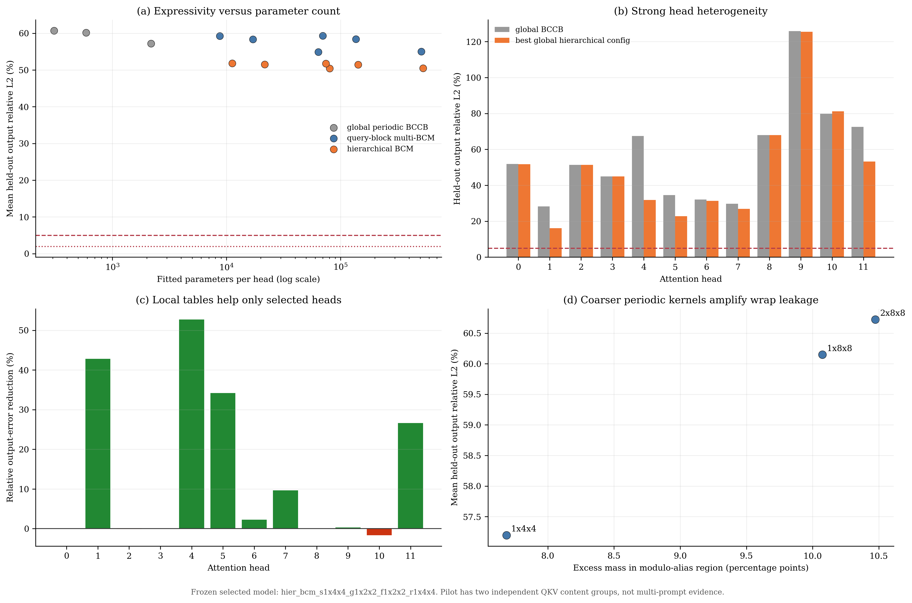
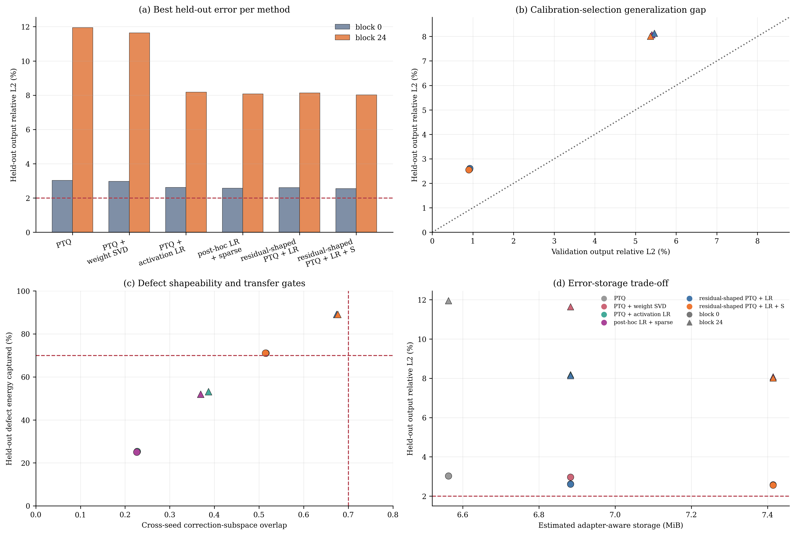

# 多块 BCM Attention 与联合量化误差整形实验报告

日期：2026-07-26

## 结论摘要

本轮并行验证了两条路线：

1. 用更复杂、局部化的多块 BCM/BCCB 逼近 F81 self-attention。
2. 用 `Q(W-beta L-S)+L+S` 联合塑造 INT4 FFN 缺陷，并用 low-rank 与块稀疏分支修复。

两条路线都得到可复现但不支持主路径部署的结论：

| 路线 | 最好结果 | 预注册门槛 | 判断 |
| --- | ---: | ---: | --- |
| global periodic BCCB | mean output L2 `57.20%` | `<5%` | NO-GO |
| query-block multi-BCM | mean output L2 `54.91%` | `<5%` | NO-GO |
| hierarchical BCM | mean output L2 `50.41%` | `<5%` | NO-GO |
| INT4 + rank-16 + 2% sparse shaping, block 0 | `2.555%` | `<2%` | NO-GO |
| INT4 + rank-16 + 2% sparse shaping, block 24 | `8.014%` | `<2%` | NO-GO |
| INT4 + rank-64 + 5% sparse shaping, block 0 | `2.265%` | `<2%` | NO-GO |
| INT4 + rank-64 + 5% sparse shaping, block 24 | `7.112%` | `<2%` | NO-GO |

复杂 BCM 只能改善部分 head，不能作为 attention 主路径。联合整形证明了量化缺陷可以被主动推入更低维的子空间，但跨 seed correction basis 仍旋转，且容量增加的收益迅速饱和。当前最合理的主线仍是：

> dynamic sparse high-rank critical attention + low-rank marginal tail + cache-aware dense refresh

BCM 只保留为少数 head 的候选 marginal basis；联合量化整形只保留为需要少量适配且具备 fused kernel 时的候选，不进入训练免费主路径。

## 方向 A：复杂多块 BCM Attention

### 三层模型

全局周期 BCCB 使用单个 head-specific 位移表：

\[
\hat A_h(q,k)=\operatorname{Norm}\left[g_h\left(B((k-q)\bmod(T,H,W))\right)\right].
\]

Query-block multi-BCM 去掉周期边界，并按 query 所在 THW tile 选择不同生成表：

\[
\hat A_h(q,k)=\operatorname{Norm}\left[g_{h,r(q)}\left(B(k-q)\right)\right].
\]

Hierarchical BCM 再加入全局 coarse、tile-conditioned residual 和局部 fine residual：

\[
\hat A_h=\operatorname{Norm}\left[g_h^{\mathrm{coarse}}+
\delta g_{h,r(q)}^{\mathrm{tile}}+
\mathbf 1_{\mathrm{local}}\delta g_{h,r(q)}^{\mathrm{fine}}\right].
\]

该模型比单一 BCCB 完备：query 分块逐渐细化、delta bucket 逐渐缩小时，它可以逼近任意 attention row。但完备性的代价是参数量趋近完整 attention 表，固定表仍无法表达样本相关的 support/warping，并失去压缩和 kernel 复用价值。因此真正需要检验的是误差随参数增长是否快速下降，而不是理论上是否能在无限参数下拟合。

### 严格切分

- 数据来自真实 Wan2.1-T2V-1.3B F81、layer 0、step 0 的 post-RoPE Q/K/V。
- token grid 为 `21 x 30 x 52 = 32,760`，共 `12` heads，head dim `128`。
- 两个 seed-20260740 replay 仅用于 calibration；两个 seed-20260741 replay 仅用于 held-out。
- 每个 head 使用 32 个 THW 分层 query，表在 held-out 前冻结。
- 旧 independence audit 表明 8 个名义 replay 实际只有 2 个 bit-distinct QKV 内容组。layer 0 self-attention 位于 prompt cross-attention 之前，prompt 和 CFG branch 在此处不可见。因此本实验是跨 seed 结构筛查，不是多 prompt 泛化证据。

### 结果

| 模型 | 参数/head | Mean output L2 | Max output L2 | 相对 global 改善 |
| --- | ---: | ---: | ---: | ---: |
| global BCCB, `1x4x4` | 2,184 | 57.20% | 125.84% | baseline |
| multi-BCM, `1x4x4`, grid `1x2x2` | 63,960 | 54.91% | 125.63% | 4.0% |
| hierarchical, `1x4x4`, grid `1x2x2` | 80,250 | 50.41% | 125.50% | 11.9% |
| hierarchical, `1x4x4`, grid `2x4x4` | 530,070 | 50.47% | 125.35% | 11.8% |

参数增加 `36.7x` 后，最好 hierarchical 模型仍有 `50.41%` 平均误差；继续增加到 `242.7x` 参数没有继续下降。所有模型都未通过 `5%` 宽松门槛。

Head 异质性很强：

| Head | Global BCCB | Hierarchical | 相对改善 |
| ---: | ---: | ---: | ---: |
| 1 | 28.2% | 16.1% | 42.8% |
| 4 | 67.4% | 31.9% | 52.7% |
| 5 | 34.6% | 22.8% | 34.2% |
| 11 | 72.5% | 53.2% | 26.6% |
| 0/2/3/8/9 | 近似不变 | 近似不变 | 约 0% |
| 10 | 79.9% | 81.2% | -1.7% |

这说明局部位移表可以描述某些 localized/transitional head 的平均几何角色，但无法描述动态 support、内容相关 V 方向和高杠杆 cancellation。它支持 head-role router，不支持固定 BCM 替换 attention。

Periodic wrap-around 也可测量：coarse scale 从 `1x4x4` 变为 `1x8x8`、`2x8x8` 时，预测在 modulo-alias 区域的过量概率质量从 `7.69` 增至 `10.07/10.47` 个百分点，平均输出误差同步从 `57.20%` 增至 `60.15/60.72%`。

## 方向 B：联合量化、低秩与块稀疏误差整形

### 方法

目标分解为：

\[
W\approx Q_\theta(W-\beta L-S)+L+S,\qquad \beta\in[0,1].
\]

其中 `beta=0` 退化为 post-hoc activation low-rank correction，`beta=1` 为完整 residual shaping。交替优化流程为：

1. 固定 `L,S`，对 `W-beta L-S` 做 per-output-channel symmetric INT4 quantization。
2. 在真实 FFN activation 上拟合 dense 与 quantized 输出缺陷，更新 rank-r correction。
3. 用 activation-weighted block score 从剩余权重误差中选择 `64x128` 静态块。
4. 重复两轮，并只用 calibration-run 的 odd steps 选择 clip 与 beta。
5. seed-20260724 仅用于最终 held-out 评估。

数据是 Wan F17 的真实 `ffn_hidden_post_gelu`，block 0/24 的 down projection。该实验检验局部表达能力，不等于端到端视频质量，也没有 fused H200 kernel 加速声明。

### Rank-16 对比

| Block | 方法 | Held-out L2 | Defect energy | Cross-seed overlap |
| ---: | --- | ---: | ---: | ---: |
| 0 | INT4 PTQ | 3.029% | 0% | - |
| 0 | PTQ + weight SVD r16 | 2.972% | 3.7% | - |
| 0 | PTQ + activation LR r16 | 2.617% | 25.3% | 0.227 |
| 0 | residual-shaped r16 + 2% sparse | 2.555% | 71.1% | 0.514 |
| 24 | INT4 PTQ | 11.950% | 0% | - |
| 24 | PTQ + weight SVD r16 | 11.643% | 5.1% | - |
| 24 | PTQ + activation LR r16 | 8.182% | 53.1% | 0.387 |
| 24 | residual-shaped r16 + 2% sparse | 8.014% | 89.1% | 0.676 |

主动整形显著提高 defect energy 与 subspace overlap，但最终误差改善很小。原因是它同时放大了 low-rank correction 之前的 base defect。由 `final_error/sqrt(1-energy)` 反推，block 24 的完整 shaping base defect 约为 `24%`，而普通 PTQ 仅为 `11.95%`；修掉近 89% 的能量后仍剩约 8%。

### 容量与 beta 上限

| Block | Rank | Sparse | Validation 选择 beta | Held-out L2 | Overlap | Extra ops |
| ---: | ---: | ---: | ---: | ---: | ---: | ---: |
| 0 | 16 | 2% | 1.00 | 2.555% | 0.514 | 0.571B |
| 0 | 16 | 5% | 0.50 | 2.512% | 0.370 | 1.096B |
| 0 | 64 | 5% | 1.00 | 2.265% | 0.578 | 1.741B |
| 24 | 16 | 2% | 0.75 | 8.019% | 0.609 | 0.571B |
| 24 | 16 | 5% | 1.00 | 7.879% | 0.664 | 1.096B |
| 24 | 64 | 5% | 1.00 | 7.112% | 0.610 | 1.741B |

中间 beta 只在两个 rank-16 配置被选中，且改善不足 `0.1` 个百分点。rank 从 16 增至 64、sparse 从 2% 增至 5% 仍未通过 2% 门槛，并将估计存储从 PTQ 的约 `6.56 MiB` 增至 `9.16 MiB`。额外 `1.741B` ops 约为该 sampled down projection dense GEMM 的 10%，在没有 fusion 时很可能抵消 INT4 收益。

## 理论解释

联合整形解决的是 defect spectrum，不自动解决 defect transfer。令 calibration 与 held-out 的主子空间分别为 `U_cal` 与 `U_test`。即使 `U_cal` 上 rank-r 能量接近 1，只要：

\[
\frac{1}{r}\|U_{cal}^\top U_{test}\|_F^2
\]

显著低于 1，固定 correction 仍会在新 seed 上失效。本实验最好 overlap 为 `0.676`，rank-64 并未继续提高，说明增加 rank 同时吸收了更多 sample-specific 方向。

复杂 BCM 的失败与之类似：它固定了 Fourier/位移基，而真实 attention 的特征向量和 sparse support 随内容、motion、step 与 layer 旋转。增加 query tile 可以减轻全局平稳性假设，却不能消除动态特征向量错配；当 tile 细到足以拟合时，参数与运行代价已趋近 dense attention。

## 最终决策

| 模块 | 决策 | 重新开启条件 |
| --- | --- | --- |
| Global/hidden-channel BCM | 停止 | 无；已有随机子空间与 FFT cost 反证 |
| Multi-block BCM attention 主路径 | 停止 | held-out output L2 `<5%` 且参数/块密度明显低于 sparse baseline |
| BCM marginal basis | 低优先级保留 | factorial capture 证明特定 head/step 稳定，且可与 sparse kernel 融合 |
| Training-free INT4 + LR + S | 停止主路径 | local L2 `<2%`、overlap `>=0.7`、fused speedup `>=1.15x` |
| Low-cost trajectory-aware adaptation | 条件 GO | layer x step bucket basis 在多 prompt/seed rollout 上通过质量门 |
| Dynamic critical sparse attention | 主线 GO | 完成 F81 fused kernel 与多 prompt/seed end-to-end 验证 |

下一关键实验不是继续增加 BCM tile 或 rank，而是等待 factorial QKV capture 后验证：

1. head-role classifier 能否跨 prompt/seed/step/CFG 泛化；
2. critical sparse mask 的 block density 与 output defect；
3. low-rank tail 是否只拟合 sparse 后的 marginal output defect；
4. dense refresh 是否能控制累计 trajectory risk；
5. fused H200 kernel 是否达到局部 `>=1.15x`、端到端 `>=1.2x`。

## 证据与复现

- 原始联合整形：`results/joint_quant_lr_shaping_cpu_v2/`
- rank-32/64 容量筛查：`results/joint_quant_lr_shaping_capacity_cpu_v1/`
- beta sweep：`results/joint_quant_lr_shaping_beta_cpu_v1/`
- 多块 BCM：`results/multiblock_bcm_attention_f81_cpu_v1/`
- 统一决策 CSV：`results/joint_bcm_decision_summary.csv`
- 代码：`scripts/probe_joint_quant_lr_shaping.py`
- 代码：`scripts/probe_multiblock_bcm_attention.py`
- 可视化：`scripts/plot_joint_quant_lr_shaping.py`
- 可视化：`scripts/plot_multiblock_bcm_attention.py`

相关方法定位与当前主线一致：[Sparse-vDiT](https://arxiv.org/abs/2506.03065) 使用多种 head/layer 稀疏模式与硬件感知搜索；[SLA](https://arxiv.org/abs/2509.24006) 将 critical high-rank、marginal low-rank 与 negligible attention 分开处理。它们支持“动态稀疏主路径 + 低秩尾部”，而不是固定 BCCB 替换完整 attention。
