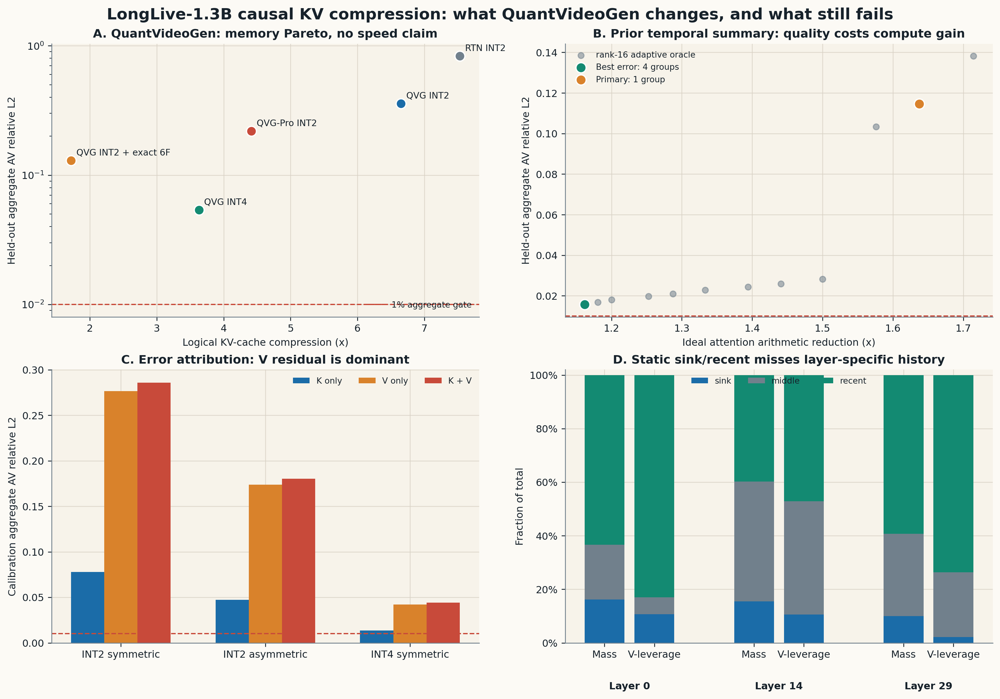

# QuantVideoGen 与既有 AR 视频压缩路线对照审计

## 1. 结论先行

QuantVideoGen（QVG）的核心 insight 有效：**内容自适应的语义平滑明显优于直接低比特量化**。在同一 LongLive capture 上，INT2 RTN 的 held-out 聚合 `AV` 误差为 `83.25%`，QVG INT2 降至 `35.83%`。但在“聚合误差不超过 `1%`、最坏 head 不超过 `2%`”的严格局部保真门槛下，QVG 的统一 INT2、QVG-Pro、统一 INT4 和固定 sink/recent 策略均失败。

最明显有潜力的方向不是继续增加 PRQ stage，也不是回到固定 BCM/BCCB 主路径，而是：

> **Risk-weighted heterogeneous KV cache：以 layer×head 静态认证作为低开销先验，分别为 K/V 选择 BF16、FP8 或低比特 residual；再由 pre-RoPE query、帧级 attention mass 和 value leverage 决定少量精确刷新，最后通过融合 dequant-attention kernel 真正兑现 H200 加速。**

这条方向同时吸收 QVG 的内容自适应码本、PackCache 的条件锚点与时间衰减、Forcing-KV 的 head specialization，以及 Future Forcing 的 pre-RoPE query 稳定性，但其独立问题应定义为：**轨迹风险加权的 K/V 分离率失真分配与渐进解码**，而不是简单拼接已有模块。

原始绘图数据保存在 `figures/qvg_ar_video_20260805/*.csv`。

## 2. QVG 真正证明了什么

[Quant VideoGen](https://arxiv.org/abs/2602.02958) 是训练免费 KV-cache 压缩方法。它先在每个 chunk/head 内做 Semantic-Aware Smoothing，即用 K-means centroid 消除语义均值，再对 residual 做 Progressive Residual Quantization。官方在 LongCat-Video、HY-WorldPlay 和 Self-Forcing 上报告最高约 `7×` KV 存储压缩，以及低于 `4%` 的端到端**额外时延**。[官方代码](https://github.com/svg-project/Quant-VideoGen)固定到 commit `0601468f2dbba6a17ac7086faec6d41527cad188`。

这里必须区分三个命题：

1. QVG 证明低比特 KV 可以显著降低长视频工作内存。
2. 官方实现先完整解压 packed K/V，再调用普通 attention，因此它没有直接减少 attention token 数或 QK/AV FLOPs。
3. “低于 `4%` 额外时延”不是“获得推理加速”。若要加速，仍需要融合 packed-KV attention，或只解码被当前 query 需要的 residual/token。

QVG 与此前失败路线的关键差别是，它不要求缺陷落在跨样本固定的 Fourier 或低秩子空间。每条记录、每个 head 的 centroid 和 assignment 都随当前内容变化，因此它能处理高秩但局部聚类的 K/V 分布。

## 3. 本次验证范围

实验使用 LongLive-1.3B 官方代码 commit `e52d9ef6865d843282a6b5e9d46d03b35f88929d`，在 236 服务器 H200 NVL 上复用已冻结的 96 条 capture：

- 8 个 prompt/seed 记录，包含 calibration、validation 和 test；
- layer `0/14/29`，起始帧 `15/18`，denoising call `1/3`；
- 每条记录 12 个 key frame、3 个 query frame、12 heads、head dim 128；
- 每个 query frame 保存 4 个 64-token tile，共 768 个 query；
- K 在量化前确定性移除捕获的 3D RoPE，重构后恢复原 RoPE；
- dense-reference parity 聚合 `0.0982%`、最坏 `0.1928%`，通过 `0.5%` parity gate。

当前结论只针对这些采样 query 和 12-frame local cache，不是完整 rollout、VBench 或端到端 wall-clock 结论。尤其是 QVG 的主要价值会随历史变长而增大，当前短窗口低估了长上下文内存收益。

## 4. 完整 held-out 结果

| 方法 | KV 逻辑压缩 | 聚合 AV 误差 | 最坏 head | 判断 |
|---|---:|---:|---:|---|
| RTN INT2 B64 | 7.53× | 83.25% | 187.93% | 直接量化失败 |
| QVG INT2 S1 B64 | 6.65× | 35.83% | 53.59% | 压缩通过，质量失败 |
| QVG-Pro INT2 S4 B16 | 4.41× | 21.88% | 32.93% | 更多 stage 不足以修复 |
| QVG INT4 S1 B64 | 3.63× | 5.39% | 9.14% | 最强统一量化，但仍失败 |
| QVG INT2 + 3 sink/3 recent BF16 | 1.72× | 12.97% | 30.31% | 固定帧策略失败 |

冻结协议的正式判定为 `null`：主方法满足 `>=6×` 压缩，但没有满足 `1%/2%` 质量门槛，且不允许产生 attention speedup 声明。

固定 sink/recent 在第一条 layer-0 capture 上曾达到 `1.14%/1.71%`，但完整 held-out 结果显示这是局部偶然：

| 层 | sink/recent 聚合 AV 误差 | 最坏 head |
|---|---:|---:|
| 0 | 1.95% | 4.18% |
| 14 | 11.31% | 24.88% |
| 29 | 15.05% | 30.31% |

因此不能从一条早层记录推断固定 recent cache 足够。

## 5. 为什么失败：误差和存储归因

### 5.1 V residual 是主要瓶颈

归因 probe 在预先冻结的 calibration 三层上分别只替换 K、只替换 V 和同时替换 K/V：

| residual 格式 | 仅 K 的 AV 误差 | 仅 V 的 AV 误差 | K+V AV 误差 |
|---|---:|---:|---:|
| INT2 symmetric | 7.77% | 27.65% | 28.58% |
| INT2 asymmetric | 4.74% | 17.37% | 18.01% |
| INT4 symmetric | 1.35% | 4.21% | 4.41% |

非对称 INT2 有明显改善，但没有改变结论；INT4 中 K 已接近门槛，V 仍主导。因此下一步应分离 K/V 位宽和刷新策略，而不是统一增加 stage。

### 5.2 BCM 压 assignment 的总收益很小

QVG S1 每侧 packed state 的字节构成为：

| 组件 | 占 packed state |
|---|---:|
| low-bit residual | 83.12% |
| centroids | 9.09% |
| scales | 5.20% |
| cluster IDs | 2.60% |

即使 BCM/BCCB 将 cluster ID 压到零字节，端到端 KV 存储也只改善约 `2.6%`。循环结构若保留，应服务于低成本候选 frame/tile router，而不是 assignment 压缩或完整 attention 输出。

### 5.3 固定 sink/recent 没有适配层级差异

Calibration 上各历史区域的平均 attention mass / value-leverage 为：

| 层 | sink mass / leverage | middle mass / leverage | recent mass / leverage |
|---|---:|---:|---:|
| 0 | 16.1% / 10.7% | 20.5% / 6.3% | 63.3% / 83.0% |
| 14 | 15.4% / 10.6% | 44.8% / 42.3% | 39.8% / 47.1% |
| 29 | 10.0% / 2.2% | 30.8% / 24.2% | 59.3% / 73.6% |

layer 14 对 middle history 的需求显著更强，因此统一的 3-sink/3-recent policy 必然浪费部分预算，同时漏掉高杠杆中间帧。

### 5.4 风险角色比具体内容更稳定

按 `(layer, head)` 聚合后，calibration 与 held-out 的风险排序高度一致：

- QVG INT2 Pearson `0.994`，Spearman `0.993`；
- QVG INT4 Pearson `0.994`，Spearman `0.993`；
- sink/recent Pearson `0.997`，Spearman `0.998`。

这支持一个便宜的静态认证表，而不支持每个 token 都运行复杂 router。静态表负责选择候选精度/策略，动态信号只在 frame 或 64-token tile 粒度修正。

## 6. 与此前结果如何统一

### 6.1 Temporal summary + low-rank

此前 `phasealigned_recency_g1_event_0p05 + adaptive rank-16 oracle` 的 held-out 聚合误差为 `11.46%`、最坏 `34.13%`，理想算术缩减 `1.64×`。增加到 4 个 summary group 后，最好可到 `1.57%`、最坏 `9.71%`，但理想算术缩减只剩 `1.16×`，而且使用的是不可部署的 adaptive oracle。

该路线通过删除 token 获取计算收益，但缺陷随内容旋转，固定 calibration basis 恶化到更高误差。QVG 保留全部 token，通过每条记录的动态 codebook 获取内存收益。两者的共同结论是：

- 删除太多 token，动态低秩 tail 无法稳定补回；
- 保留全部 token 但统一 INT2，V residual 噪声仍过大；
- 需要把“哪些 token 精确”和“每个 K/V residual 用多少 bit”联合分配。

### 6.2 BCM/BCCB

固定 BCM/BCCB 曾因共享 Fourier eigenvectors、周期边界和内容相关特征向量错配而失败。在因果 AR 视频中，时间轴又是 lower-triangular/滑窗语义，更不满足全局 circulant 假设。QVG 的结果进一步表明真正可利用的是内容聚类和风险不均匀，而不是固定周期结构。

BCM/BCCB 仍可保留三个小角色：

1. localized head 的非周期 shift/Toeplitz 候选生成；
2. frame/tile router 的低成本几何先验；
3. 语义分组后的局部 assignment/delta 熵编码。

这些都不是主压缩路径，且第 3 项受 `2.6%` assignment 占比限制。

### 6.3 为什么低秩仍可能在训练后有效

[VideoMLA](https://arxiv.org/abs/2605.30351) 发现预训练视频 attention 的 99%-energy rank 高于实用 latent dimension，但训练得到的 MLA bottleneck 仍可将每 token KV 存储降低 `92.7%`，并在 B200 上获得 `1.23×` throughput。它与我们的结果并不矛盾：

- post-hoc SVD/固定 low-rank 要拟合原模型的高秩分布，因此失败；
- 训练后的 bottleneck 允许模型主动重排表示，在受限子空间内适配任务。

若训练免费路线不能通过，下一选择应是冻结主干，只训练共享 KV down/up projection、head gate 和 normalization 的低成本适配，而不是继续增加静态 rank。

## 7. 理论上最合理的改进

设一条 query 的输出为

\[
y_q=\sum_i a_{qi}v_i.
\]

V 量化的一阶输出误差为

\[
\delta y_q^{V}=\sum_i a_{qi}\,\delta v_i.
\]

若把 rollout 风险写成 \(g_q\)，独立噪声近似下，token \(i\) 的自然率失真权重为

\[
w_i^V=\sum_q g_q a_{qi}^2.
\]

K 误差通过 softmax Jacobian 传播：

\[
\delta y_q^K\approx
\frac{1}{\sqrt d}\sum_i
a_{qi}(q^\top\delta k_i)(v_i-y_q).
\]

对应的局部风险矩阵近似为

\[
H_i^K=\sum_q
\frac{g_q a_{qi}^2\lVert v_i-y_q\rVert^2}{d}
qq^\top.
\]

QVG 的 K-means 主要最小化未加权欧氏 residual；它不知道某个 V token 是否被高杠杆 query 反复读取，也不知道 K 误差是否沿高敏感 query 方向扰动 logits。这解释了“重构误差尚可，但 AV/轨迹误差仍大”。

下一方法应优化

\[
\min_{b_i^K,b_i^V,\mathcal E}
\sum_i
\left[
D_i^K(b_i^K;H_i^K)+
D_i^V(b_i^V;w_i^V)
\right]
+\lambda C_{\mathrm{H200}},
\]

其中 \(b_i^{K/V}\) 是分离位宽，\(\mathcal E\) 是精确 frame/tile 集合，成本使用真实 packed bytes 与 fused-kernel latency。

## 8. 最有潜力的系统形态

### A. 最高优先级：异构风险加权 KV cache

1. 用 calibration 建立 `(layer, head, denoising bucket)` 静态风险表。
2. K 优先测试 INT4/FP8，V 优先测试 FP8/BF16；不再默认 K/V 同位宽。
3. 条件 token、少量 sink 和高风险 recent/middle tile 保持精确，但预算由当前 pre-RoPE query 风险决定，而不是固定帧数。
4. 用 attention-weighted K-means 或 weighted residual clipping，让码本优先保护高 value-leverage token。
5. 设计嵌套 bitstream：centroid、coarse residual、fine residual、exact correction；只为高风险 tile 解码更深层。
6. 将 unpack/dequant、RoPE 和 FlashAttention 融合，禁止先物化完整 BF16 K/V。
7. 运行时不确定时回退 FP8/BF16，并记录 fallback rate。

### B. 计算加速必须引入 token reduction

[PackCache](https://arxiv.org/abs/2601.04359) 通过条件锚点、时间衰减和空间保持位置编码报告 `1.7–2.2×` 端到端加速；[Forcing-KV](https://arxiv.org/abs/2605.09681) 依据稳定 head 角色对 static/dynamic heads 使用不同 pruning，在 LongLive/Self-Forcing 上报告最高 `1.35×/1.50×`，1080P 更高。它们说明：

- QVG 适合解决容量和带宽；
- 真正减少 QK/AV 工作量仍需要 pruning/compaction；
- 最合理组合是先由静态 head 认证决定可否压缩，再按 query 风险联合选择 token 数和 residual 位宽。

[Future Forcing](https://arxiv.org/abs/2605.30083) 对 pre-RoPE query 稳定性的观察，可用于预测未来 query 风险，而无需读取未来 dense attention。[Sparse Forcing](https://arxiv.org/abs/2604.21221) 则表明少量训练可将持久 block-sparse attention 变成实际加速路径。

### C. 若允许低成本训练

若训练免费 oracle 可过门槛、规则 predictor 失败，只训练以下小模块 1k–2k steps：

- shared KV bottleneck 或 K/V 分离 projection；
- layer/head precision gate；
- frame/tile refresh router；
- residual scale 和 branch normalization。

主 QKV 与 DiT 主干保持冻结。该路径比 post-hoc low-rank 更符合 VideoMLA 的正向证据。

## 9. 下一轮 gate 与停止条件

建议只开一个主 gate：

1. 在 calibration 上测试 `K-INT4 + V-FP8`、`K-FP8 + V-FP8` 和 BF16 fallback，并直接评价 `AV`。
2. 只用 calibration 建立 layer×head 静态模式；冻结后评价完整 held-out。
3. 在固定 5%/10%/20% 精确 tile 预算下，比较 fixed recent、attention-mass oracle、value-leverage oracle 和 pre-RoPE proxy。
4. 只有局部聚合 `<=1%`、最坏 `<=2%`，才进入 48+ frame rollout。
5. fused attention 必须在 H200 上达到 `>=1.5×` 局部加速，且完整 attention fallback 后仍有明确收益，才声称加速。

停止条件：

- 若 `K-INT4 + V-FP8 + 20% exact` 的 oracle 仍过不了 `1%/2%`，停止严格保真的训练免费低比特路线；
- 若 oracle 通过、pre-RoPE proxy 失败，转低成本 router 适配；
- 若数值通过但融合 kernel `<1.5×`，保留为内存扩展方法，不声称 turbo；
- 不再增加固定 BCM blocks、普通 PRQ stage 或静态 low-rank rank。

## 10. 最终判断

QVG 对我们最重要的启示不是“2 bit 已经解决 AR 视频”，而是：**AR 视频 KV 的可压缩性主要来自内容自适应局部聚类和风险不均匀，而不是全局低秩或全局循环平稳性。**

当前最值得推进的是异构 K/V 率失真分配。它既有清晰理论目标，也有现有实验支撑：V residual 主导、历史 leverage 层级不同、head 风险跨样本稳定，并且 QVG packed state 的主要字节确实位于 residual。相比继续扩大 BCM 或 PRQ stage，这条路线更可能同时获得严格质量、可观内存收益和可兑现的 H200 加速。
