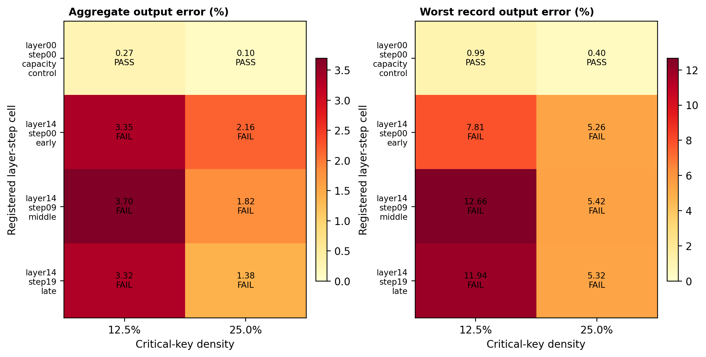
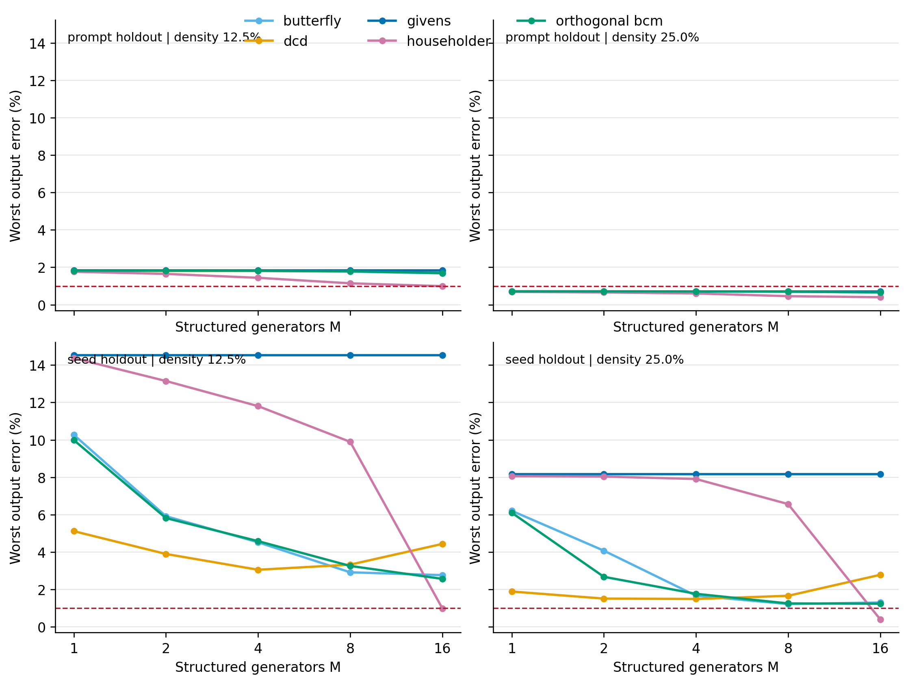
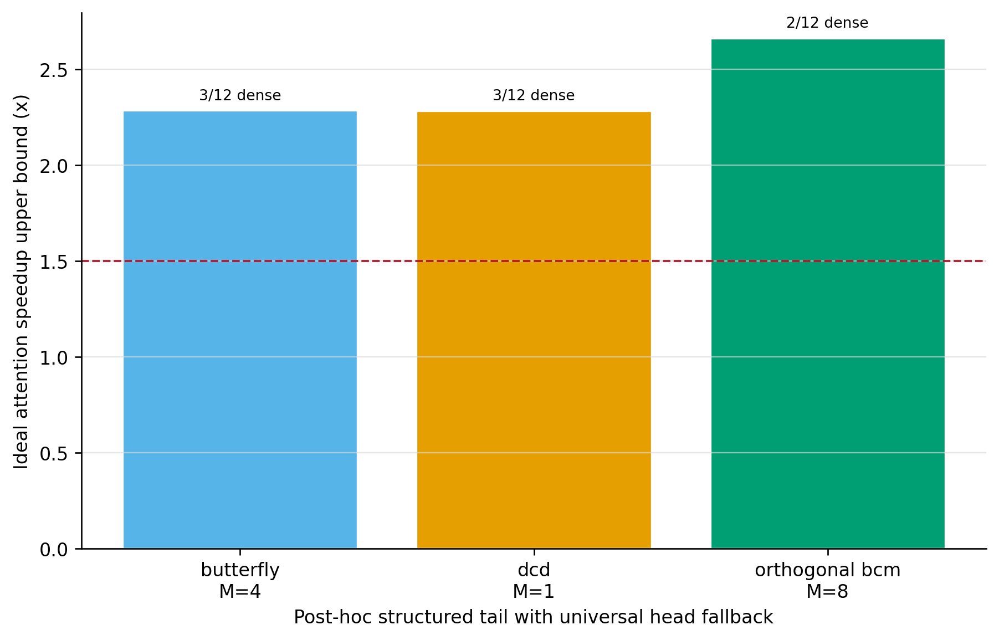

# F81 Restricted-Rotation Oracle：结果与停止判据

## 1. 结论

本轮完成了 `full Procrustes / Givens / Householder / orthogonal BCM / DCD / Butterfly` 的 post-hoc restricted-rotation oracle，并在跨 seed、跨 prompt 两种 source/target 划分上直接评价稀疏 Attention 的 `AV` 输出误差。

最终结论分为三层：

1. **通用低维旋转未过预注册门槛。** 在唯一通过 adaptive rank-16 pre-gate 的 `layer 0 / step 0` 上，低 payload 最优候选 Butterfly-8 经 `600 steps × 4 restarts` 后为跨 holdout 聚合 `0.285%`、最坏 `1.082%`；orthogonal BCM-8 为 `0.317% / 1.195%`。两者均未达到 `aggregate <= 0.5%` 且 `worst <= 1%`。
2. **Householder-16 可以精确恢复 adaptive 上界，但不构成低维成功。** 它需要 `16 × 128 = 2048` 个动态标量，恰好等于直接生成一个 `128 × 16` basis 的 payload。其算术开销很低，但参数生成问题没有被压缩。
3. **异构 head fallback 在容易 cell 上仍有局部潜力。** refined BCM-8 与 Butterfly-8 将 heads 7、9 统一回退 dense 后，保留 heads 的跨 holdout误差分别为约 `0.272% / 0.693%` 与 `0.243% / 0.660%`，理想 attention-work 上限约 `2.66x`。但这只是 post-hoc、单 cell、无 kernel 的上限；`layer 14` 三个 step 的 adaptive rank-16 本身均失败，因此不能触发全局 Q/K/V rotation gate 或 H200 kernel 开发。

因此，本轮按预注册停止规则给出的工程决策是：

> 停止把低维 Grassmann rotation 作为通用 Attention 主路径；保留 BCM-8 / Butterfly-8 作为 localized-head 附属候选。下一主线仍应是 FP8/BF16 dense、动态 sparse-critical、少量 learned sparse-linear tail，以及稳定 dense fallback。

## 2. 协议与有效性边界

注册范围：

- 捕获：4 个 prompt/seed 样本，均来自已有 F81 dense Q/K/V replay；
- CFG branch：`cond`；
- cell：`layer 0 / step 0` capacity control，以及 `layer 14 / step {0, 9, 19}`；
- 粒度：`layer × step bucket × head × 64-query tile`；
- critical route：每个样本/head/tile 使用 dense 信息选择 64-key contiguous blocks，测试 density `12.5% / 25%`；
- tail：rank 16，系数始终为 oracle projection；
- holdout：seed-20260740 -> seed-20260741，以及 prompt-0 -> prompt-1；
- 质量门槛：聚合 relative L2 `<= 0.5%`、任一 record `<= 1%`；
- 结构门槛：`M <= 16`、额外算术工作 `< 5% dense`、动态标量 `<= 512`；
- 速度门槛：只有未来 Whole-Attention H200 实测 `>= 1.5x` 才可继续。

重要边界：critical mask、target basis、旋转参数和 tail coefficient 均可读取 held-out dense defect。因此这是**函数类容量 oracle**，不是可部署 transfer 结果。head fallback 同样由 held-out error post-hoc 选择。

## 3. Adaptive Pre-Gate

即使允许每个样本/head/tile 重新计算最优 rank-16 basis，只有 layer-0 control 通过：

| Cell | Density | Critical-only | Adaptive rank-16 aggregate | Worst record | Gate |
|---|---:|---:|---:|---:|---|
| layer 0, step 0 | 12.5% | 18.474% | 0.265% | 0.993% | PASS |
| layer 0, step 0 | 25% | 10.053% | 0.099% | 0.401% | PASS |
| layer 14, step 0 | 12.5% | 28.975% | 3.349% | 7.807% | FAIL |
| layer 14, step 0 | 25% | 19.591% | 2.161% | 5.265% | FAIL |
| layer 14, step 9 | 12.5% | 17.171% | 3.697% | 12.663% | FAIL |
| layer 14, step 9 | 25% | 10.477% | 1.818% | 5.425% | FAIL |
| layer 14, step 19 | 12.5% | 12.616% | 3.322% | 11.935% | FAIL |
| layer 14, step 19 | 25% | 7.112% | 1.378% | 5.320% | FAIL |

这一步给出了强停止证据：在 layer 14，问题不是 source basis 旋转得不够好，而是 target sample-adaptive rank-16 本身就不够。任何旋转都不能突破该上界。

## 4. Restricted Rotation 结果

### 4.1 无 dense fallback

下表使用两个 holdout 中更差的 aggregate / worst：

| Family | M | Dynamic scalars | Density | Aggregate | Worst | 结论 |
|---|---:|---:|---:|---:|---:|---|
| Householder | 16 | 2048 | 25% | 0.100% | 0.401% | 质量 PASS，payload FAIL |
| Butterfly | 8 | 512 | 25% | 0.323% | 1.221% | 注册运行，worst FAIL |
| orthogonal BCM | 8 | 448 | 25% | 0.341% | 1.254% | 注册运行，worst FAIL |
| Butterfly | 8 | 512 | 25% | 0.285% | 1.082% | 高迭代审计，worst FAIL |
| orthogonal BCM | 8 | 448 | 25% | 0.317% | 1.195% | 高迭代审计，worst FAIL |
| orthogonal BCM | 16 | 896 | 25% | 0.267% | 1.240% | payload 与 worst 均 FAIL |
| DCD | 4 | 1276 | 25% | 0.356% | 1.493% | payload 与 worst 均 FAIL |

高迭代审计说明普通优化不足只解释了部分差距，不能将 `1.221%` 稳定降到 `<1%`。seed holdout 是主瓶颈：refined Butterfly-8 在 prompt 为 `0.158% / 0.685%`，在 seed 为 `0.285% / 1.082%`。

### 4.2 为什么 Householder-16 不算成功

对 `d=128, r=16`，Grassmann 流形 `Gr(r,d)` 的维数为：

\[
\dim Gr(16,128)=16(128-16)=1792.
\]

一个任意 target rank-16 子空间通常需要约 1792 个自由度。16 个 dense Householder vectors 带来 2048 个标量，和直接输出 `d × r = 2048` basis 同阶。实验中它精确追平 full Procrustes 是数值控制闭合，而不是发现了低内在维旋转。

相反：

- 16 个 Givens 只有 48 个动态标量，但 seed worst 仍为 `8.176%`；
- BCM-8 有 448 个标量，refined seed worst 为 `1.195%`；
- Butterfly-8 有 512 个标量，refined seed worst 为 `1.082%`。

这表明 source-to-target 子空间变化存在结构，但在当前严格最坏误差下，其有效自由度仍高于 512-scalar family 能稳定覆盖的范围。

### 4.3 固定旋转为何无效

对任意共享正交矩阵 `R`：

\[
\lVert (RB_0)^T(RB_*) \rVert_F^2
=
\lVert B_0^TB_* \rVert_F^2.
\]

因此固定 QuaRot/SpinQuant 式旋转可以改变量化器看到的坐标分布，但不能改善两个 defect subspace 的 transfer overlap。这里必须预测内容相关的 `R(Q,K,V)`；本轮证明的是其动态参数量仍然过高。QuaRot 与 SpinQuant 的成功主要来自量化坐标整形，不能直接外推为低秩 tail transfer。[QuaRot](https://arxiv.org/abs/2404.00456)、[SpinQuant](https://arxiv.org/abs/2405.16406)

## 5. Head Fallback 上限

在 layer-0 control 上，用两个 holdout 的失败 head 并集作为统一 dense fallback：

| Candidate | Dense heads | Kept aggregate / worst | Dynamic scalars | Ideal attention upper bound |
|---|---|---:|---:|---:|
| refined Butterfly-8, 25% | 7, 9 | 0.243% / 0.660% | 512 | 2.66x |
| refined orthogonal BCM-8, 25% | 7, 9 | 0.272% / 0.693% | 448 | 2.66x |
| registered orthogonal BCM-8, 25% | 7, 9 | 0.291% / 0.919% | 448 | 2.66x |

该速度按下式估计：

\[
C_{eff}
=f_{dense}
+(1-f_{dense})(density+C_{tail+rotation}),
\qquad
S_{ideal}=1/C_{eff}.
\]

它忽略 routing、parameter generation、gather/scatter、kernel launch、load imbalance 和 dense/sparse fusion，因此不是 H200 实测。更关键的是，layer 14 的 adaptive ceiling 已失败，layer-0 的局部上限不能外推到 Whole-Attention。

这一结果支持异构路径，而不支持统一替换：localized heads 可保留 gated BCM/Butterfly 候选；transitional heads 需要 learned sparse-linear tail；diffuse/high-risk heads继续 FP8/BF16 dense。该定位与 Sparse-vDiT 的多稀疏模式以及 SLA/SLA2 的 sparse-linear 异构分解方向一致。[Sparse-vDiT](https://arxiv.org/abs/2506.03065)、[SLA](https://arxiv.org/abs/2509.24006)、[SLA2](https://arxiv.org/abs/2602.12675)

## 6. 工程与数值审计

- 16 个输入 capture 及协议均绑定 SHA-256；fresh output 和 SUCCESS marker 防止 stale artifact 混入。
- 首轮 float32 Householder 控制在极小 reference head 上出现误差放大；无效 artifact 已完整移入 remote trash。basis 对齐、QR 和最终审计改为 float64 后，`Householder-16 == full Procrustes == adaptive` 逐项闭合。
- attention、mask、稀疏输出及 structured optimizer 仍保持 float32，不改变算法语义。
- 新增 10 项 restricted-rotation / analysis 边界测试，在 236 CUDA 环境全部通过。236 项目 venv 的全量回归唯一环境缺口为 pandas，且 DNS 阻断镜像安装；正式 CUDA 运行未注入其他 `site-packages`，避免遮蔽 `torch 2.9.1+cu128`。同步到 210 后，在用户指定的 `bitnet` 环境补装 requirements 中已声明的纯 Python `imageio 2.37.4`，最终全量 90 项测试通过，Torch/NumPy 版本保持 `2.2.2+cpu / 1.26.4` 不变。
- 未启动 H200 kernel benchmark：按协议，通用低-payload oracle 未过 gate，继续做 kernel 会把表示失败与系统优化混在一起。

## 7. Artifact

- 注册 raw：`results/restricted_rotation_oracle_f81_registered_v1/`
- 注册分析：`results/restricted_rotation_oracle_f81_registered_analysis_v2/`
- 高迭代 raw：`results/restricted_rotation_oracle_f81_refinement_v1/`
- 高迭代分析：`results/restricted_rotation_oracle_f81_refinement_analysis_v2/`
- 注册配置：`configs/restricted_rotation_oracle_f81_v1.json`
- 高迭代配置：`configs/restricted_rotation_oracle_f81_refinement_v1.json`
- 核心实现：`scripts/restricted_rotation_oracle_core.py`
- Probe：`scripts/probe_restricted_rotation_oracle.py`
- 分析与绘图：`scripts/analyze_restricted_rotation_oracle.py`

所有 raw/analysis SUCCESS 中记录的 36 个 artifact SHA-256 已在下载后再次校验一致。
