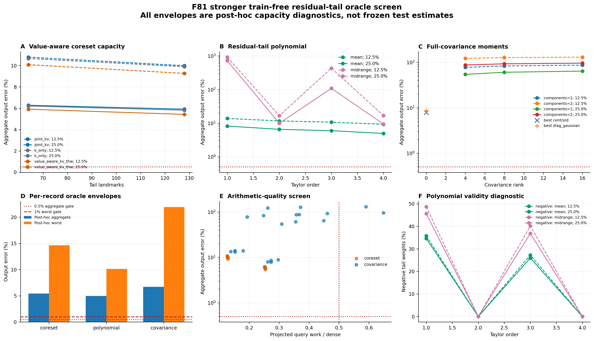
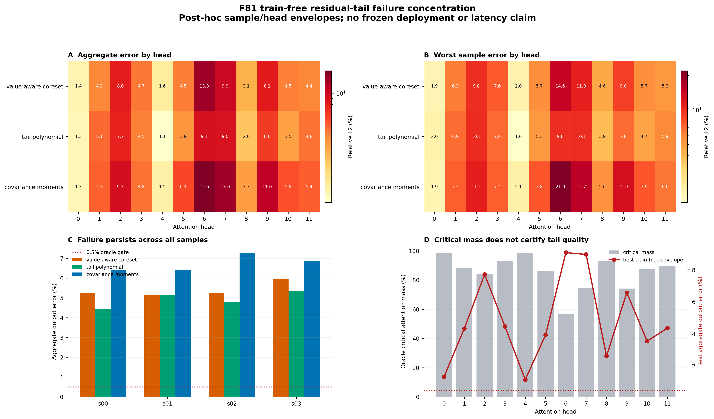

# F81 强免训练 Residual-Tail Oracle 审计

日期：2026-07-28

## 1. 核心结论

本轮完成了此前约定的最后一次有依据的免训练 tail 筛选：

1. value-aware K/V/THW coreset；
2. 删除 exact critical blocks 后的 1-4 阶 residual-tail polynomial；
3. rank-4/8/16 完整低秩 K/V covariance moments；
4. 所有分支均使用严格共享归一化：

\[
\hat Y=\frac{N_{\mathrm{exact}}+\hat N_{\mathrm{tail}}}
{Z_{\mathrm{exact}}+\hat Z_{\mathrm{tail}}}.
\]

三类方法全部未通过预注册 oracle 门槛。即使允许每个 sample/head 在看过结果后选择最优候选，聚合误差仍为 `4.952%-6.719%`，最坏 sample/head 为 `10.134%-21.938%`，而门槛为 `0.5% / 1%`。因此决策为：

> `STOP_TRAINFREE_TAIL`：停止继续增加普通 landmarks、Taylor 阶数、covariance rank、BCM block 或简单 moments；不开发对应 H200 kernel，不进入 F81 rollout。

这不等于“低秩对视频 Attention 无效”。此前 sample-adaptive rank-16 直接拟合输出缺陷时曾得到 `0.629%` 聚合、`1.85%` 最坏值，证明低维输出 witness 存在。当前失败说明的是：这些免训练、低成本、跨 query 共享的参数化无法从当前 Q/K/V 稳定生成那个随内容旋转的 defect subspace。

## 2. 注册范围与证据边界

- 模型输入：Wan2.1-T2V-1.3B F81 replay；
- cell：layer `14`、sampling step `9`、timestep `859`、`cond` self-attention；
- 样本：`2 prompts x 2 seeds = 4`，每个 capture SHA256 唯一；
- heads：12；每个 head 取 3 个相隔位置的 64-query tiles；
- keys：`32,760`，按 64-key block 选择；
- exact critical density：`12.5% / 25%`；
- 执行：独占可见 RTX 4090 GPU 1，仅做数值容量 probe；
- 产物：4 captures、6,912 tile rows、2,304 head/config rows，114.42 秒正常完成。

这些 captures 曾用于先前探索。critical mask 使用 dense attention mass，value-aware 权重也读取 dense `AV`；oracle envelope 还允许每个 sample/head 后验选择候选。因此结果只能作为函数类容量上界，不能写成 untouched test、可部署路由或 H200 延迟结果。该证据边界对负结论是保守的：连这个偏乐观上界都失败，当前函数类无需进入部署阶段。

## 3. 主要结果

### 3.1 注册集合上的最优固定配置

| 方法族 | 后验最优固定配置 | 聚合误差 | 最坏 sample/head | Query work proxy |
|---|---|---:|---:|---:|
| Value-aware coreset | K/V/THW, `m=128`, density 25% | `5.426%` | `14.617%` | `0.254` |
| Residual-tail polynomial | mean center, order 4, density 25% | `4.952%` | `10.134%` | 未实现 feature 化 |
| Covariance moments | centroid, 2 components/block, density 25% | `7.876%` | `23.380%` | `0.273` |

上述“最优固定”也在看过整个注册集合后选择，不是冻结 test estimate。work proxy 仅包含 query arithmetic；coreset 的 dense leverage、在线聚类，covariance 的 moment/SVD 构造，以及 gather、launch、融合成本均未计入。

### 3.2 每个 sample/head 的后验 oracle envelope

| 方法族 | 聚合误差 | 最坏 sample/head | 满足单记录 `<=1%` | 算术上界 |
|---|---:|---:|---:|---:|
| Value-aware coreset | `5.409%` | `14.617%` | `2/48` | `3.939x` |
| Residual-tail polynomial | `4.952%` | `10.134%` | `4/48` | 不报告 |
| Covariance moments | `6.719%` | `21.938%` | `4/48` | `3.267x` |

四个样本上的最优 polynomial 聚合误差分别为 `4.451%`、`5.135%`、`4.801%`、`5.343%`。失败不是某一个 prompt 或 seed 的孤立异常。

## 4. 逐方法归因

### 4.1 Value-aware landmarks 有改善，但函数类仍不足

`m=128, density=25%` 下，K-only、joint K/V、value-aware K/V/THW 的固定配置聚合误差分别为 `5.817%`、`5.914%`、`5.426%`。value-aware 相对 K-only 改善约 `6.7%`，并在后验 envelope 中被 48 个 sample/head 中的 38 个选中；这说明高杠杆 V 与位置确实提供信息。

但聚类仍对一个 query tile 共享同一 K/V partition 和 centroid。真正重要的 V 方向依赖 query，centroid 不能保留 cluster 内 `exp(q^T k)` 与 V 的高阶相关性。增加 landmarks 从 64 到 128 只有小幅收益，距离门槛仍约一个数量级，因此不再扩大普通 coreset 容量。

### 4.2 删除 critical 后，tail score 仍不平滑

25% exact critical density 下，剩余 score 的平均动态范围仍为 `18.523`。mean-centered polynomial 从 order 1 的 `8.198%` 降到 order 4 的 `4.952%`，趋势有效，但 order 4 仍是聚合门槛的 `9.9x`、最坏门槛的 `10.1x`。

midrange 的奇数阶会产生约 `36.8%-45.6%` 负 tail weights，并在约 `0.16%-0.24%` query 上形成非正共享分母，出现灾难值；偶数阶虽保持非负，却仍有 `9.46%-9.94%` 聚合误差。该结果否定了“删除尖峰后可用低阶全局 Taylor 核”的前提。由于未实现 TensorSketch 或 random-Maclaurin feature map，polynomial 不具有任何速度结论。

### 4.3 完整 covariance rank 不是缺失环节

centroid 固定配置为 `7.876%`，diagonal Gaussian 为 `8.605%`；low-rank Gaussian 的最佳固定配置反而为 `54.358%`，rank 从 4 增到 16 没有改善。实现已通过 full-rank covariance 与 K/V cross-covariance 精确重建测试，所有注册输出也保持有限值。

因此主要问题不是 covariance rank 不够，而是二阶 Gaussian moment closure 与真实 tail 分布不匹配。softmax 的指数倾斜会放大非 Gaussian 高阶 cumulants、outlier keys 和 query-dependent V/K correlation；增加二阶 rank 不能恢复这些项。

## 5. 失败集中在哪里

head 6 是三类方法共同的最难点。其 25% oracle critical blocks 平均只覆盖 `56.7%` attention mass；最优 coreset、polynomial、covariance 的逐 head 聚合误差分别为 `13.25%`、`9.07%`、`15.64%`。head 7 和 head 9 也持续困难。

head 0/4 的 critical mass 约为 `98.5%`，因而相对容易，但最优逐 head 误差仍约 `1.1%-1.6%`，最坏样本约 `1.6%-2.1%`，仍不能通过严格 oracle 门槛。高 selected mass 只能作为粗风险特征，不能单独充当 tail fidelity certificate。

## 6. 与已有结果如何统一

本轮比普通 segment Nystrom 明显更强：后者后验聚合/最坏误差为 `22.684% / 57.062%`，本轮最佳 polynomial 为 `4.952% / 10.134%`。这证明 residual-tail 专用目标、value-aware 信息和共享归一化是正确改进，而不是无效尝试。

但它仍无法达到 sample-adaptive output-SVD witness 的量级。原因在于二者解决的问题不同：

- adaptive rank-16 在看过真实输出 defect 后直接选择 128 维输出空间中的最佳子空间；
- 当前方法必须用固定的低成本 moments、landmarks 或低阶 kernel 从 Q/K/V 生成 tail；
- defect basis 随 prompt、seed、head、query 位置和 step 旋转，训练免费的固定生成规则没有足够条件信息。

不同历史 probe 覆盖的 layer/step/tile 数并不完全相同，因此不能把它们当作严格同表排名；这里只用于机制交叉验证。

## 7. 最终决策与下一条路线

按照预注册停止顺序，本轮之后：

1. 停止 train-free Nystrom/普通 landmark 扩容；
2. 停止 residual-tail polynomial 高阶扩展；
3. 停止 Gaussian covariance rank/components 扩展；
4. 不为失败函数类开发 fused H200 kernel；
5. 不进行 F81 rollout，也不报告算术 proxy 为实际加速。

下一条仍合理的路线是小型 learned Q/K-conditioned sparse-linear tail：冻结原始 QKV，仅训练低维 projection、branch gate 和共享 normalization ratio，并直接最小化 sparse + tail 的 `AV` defect。它必须使用独立 calibration/validation/test prompt 与 seed，冻结配置后满足 test aggregate `<=1%`、每个 sample/head `<=2%`，再进入融合 kernel；whole-Attention H200 实测门槛保持 `>=1.5x`，目标 `2x`。

Diffuse heads 继续优先使用 fused FP8/BF16 dense FlashAttention；localized heads 只在已有 confidence certificate 通过时使用 geometry/moment 附属路径。learned tail 主要服务 transitional heads，不再试图用一个统一近似覆盖全部 heads。

## 8. 复现与产物

- 协议：`docs/trainfree_tail_oracle_protocol.md`
- 注册配置：`configs/trainfree_tail_oracle_f81_v1.json`
- 数值实现：`scripts/trainfree_tail_oracle_core.py`
- Probe：`scripts/probe_trainfree_tail_oracles.py`
- 分析：`scripts/analyze_trainfree_tail_oracles.py`
- 单元测试：`scripts/test_trainfree_tail_oracles.py`
- 注册原始结果：`results/trainfree_tail_oracle_f81_registered_v1/`
- 图表与源 CSV：`results/trainfree_tail_oracle_f81_registered_analysis_v1/`

注册 run 的 config SHA256 为 `7a67eea53abd288c79f4fd8b80e76a1b5868ef1cf557e58dccf46aeaafeddfef`。本地下载后的全部结果文件已与 236 服务器逐文件核对 SHA256。
