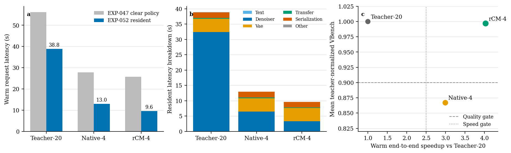

# Wan rCM 精确常驻运行时与 H200 Pareto

日期：2026-09-01  
实验：`EXP-052`  
判决：`PASS`

## 结论

保持 UMT5 常驻、完整重算每个不同的正提示词、并且只在原生 CFG 路径复用全局固定负提示词后，官方 rCM4 在 H200 上达到 `9.638 s` 的 F81 warm-request 中位延迟。相同精确运行时下 teacher20 为 `38.846 s`，端到端加速为 `4.031x`，超过冻结的 `2.5x` 门槛。

这不是近似缓存：四个正提示词都独立执行 UMT5，正提示词 cache hit 为零。F17 的 teacher20、native4 和 rcm4 在清理式与常驻式运行时之间均得到逐元素完全相同的解码 CPU tensor，网络调用次数也完全一致。因此 EXP-047 的质量与多样性结论可以无条件继承。

## 结果

| 方法 | 文本 (s) | 去噪器 (s) | VAE (s) | CPU 搬运 (s) | 序列化 (s) | warm request (s) |
|---|---:|---:|---:|---:|---:|---:|
| teacher20 | 0.068 | 32.296 | 4.377 | 0.236 | 1.775 | 38.846 |
| native4 | 0.066 | 6.401 | 4.298 | 0.257 | 1.947 | 12.975 |
| rcm4 | 0.064 | 3.205 | 4.308 | 0.254 | 1.796 | 9.638 |

文本专项 screen 的最小中位节省为 `15.208 s/request`，明显高于 `5.5 s` 门槛。rCM denoiser 相对 teacher20 为 `10.076x`；端到端为 `4.031x`。

## 新发现

EXP-047 的 `2.181x` 并不是 rCM 的真实 warm-service 上限。旧 harness 每个请求都调用官方 `clear_umt5_memory()`，销毁全局 UMT5 encoder 并在下一请求重新构造；NFE 已经降到四次网络调用后，这个固定开销反而主导了端到端时间。

精确消除重复构造后，瓶颈发生了第二次迁移：

- VAE：`4.308 s`，约占 rCM request 的 `44.7%`；
- denoiser：`3.205 s`，约占 `33.3%`；
- serialization：`1.796 s`，约占 `18.6%`；
- text：`0.064 s`，仅约占 `0.7%`。

因此“继续优化 Attention 就能显著提高端到端速度”的假设已经不成立。此前 F81 FA3 FP8 Attention 的 `1.51x` 局部加速仍有价值，但在四步 rCM 的真实 warm request 中只可能贡献小幅增益。下一阶段必须把它与 VAE decode、GPU-to-CPU 搬运和编码/序列化流水并列比较，并以这次 `9.638 s` 为公平基线。

## 理论含义

正结果来自训练原生的有限时间 flow-map 压缩与精确系统生命周期优化，而不是冻结 whole-block residual 的 BCM、Butterfly 或低秩闭合。EXP-048 已证明 rCM 权重并未形成 rank-64 late-block Markov state；EXP-052 则证明内部状态不低秩并不妨碍端点映射在训练后用四次网络调用保持质量。

这修正了最初的结构化假设：生成侧真正可压缩的是条件概率流的有限时间端点映射和可精确复用的系统工作，不是 raw hidden residual 上跨样本共享的固定结构算子。

## 边界

- 这是 warm-service 结果，不包含进程和模型冷启动。
- F81 timing 为四提示词、一个 seed；质量仍引用 EXP-047 的四提示词、两个 seed 和八项 VBench。
- 没有加入 FP8、稀疏、cache、自定义 Attention 或 VAE kernel。
- 两张物理卡均为 H200 NVL，且每次科学运行的选中卡均保持隔离；方法间物理 index 不完全相同是共享主机调度限制。

