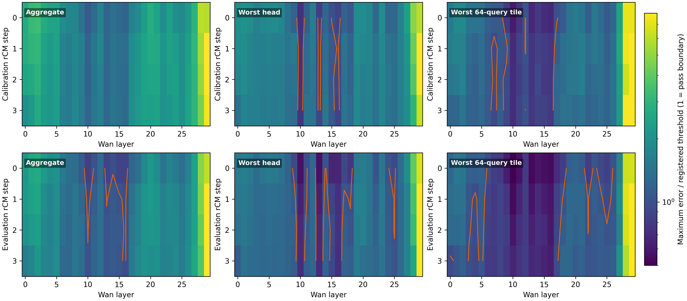
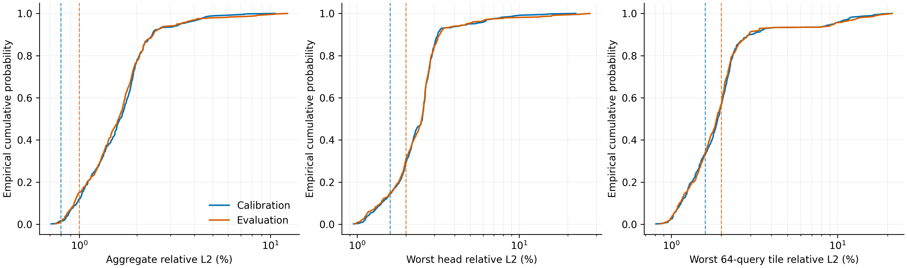

# rCM on-policy 低精度 Dense Attention 判决

日期：2026-09-01  
实验：`EXP-054`  
判决：`coverage-null`

## 核心结论

SageAttention SM90 在真实 F81 shape 上确实达到 `1.586377x` 局部 attention
加速，但发布版 rCM4 的 on-policy 轨迹没有形成可部署的静态整 cell 低精度区间。
在四个 calibration identity、四个 rCM step 和 30 个 Wan layer 上，`120` 个
完整 self-attention cell 中没有一个同时满足冻结的
`0.8% / 1.6% / 1.6%` aggregate/head/tile 误差门槛。

因此冻结 atlas 选择 `0/120` cells，低于要求的 `87/120`，投影 resident request
仍为 `9.637995s`、`1.000x`。实验按预注册规则停止，没有运行 S2/S3，也没有生成
候选视频或质量结论。

## 算子与 Atlas 结果

S0 中 reference wrapper 的 F17 latent 逐 bit 相等，patch 前后均为四次网络调用。
真实 Q/K/V shape 为 `[1,32760,12,128]`；FA3 BF16 与 Sage 的中位时间分别为
`14.590048ms` 和 `9.197088ms`。这证明算子速度是真实的，不是 FLOPs proxy。

S1 完成 `960` 条唯一 finite 记录，dual path 始终返回 FA3，因而两组身份都保持
exact baseline trajectory。

| Split | Aggregate mean/P95/max | Worst head mean/P95/max | Worst tile mean/P95/max |
|---|---:|---:|---:|
| Calibration | `1.761% / 3.392% / 10.570%` | `2.643% / 4.864% / 22.423%` | `2.515% / 9.446% / 21.287%` |
| Evaluation | `1.790% / 3.251% / 12.280%` | `2.761% / 4.705% / 27.369%` | `2.560% / 9.558% / 21.326%` |

最接近门槛的是 `step 0 × layer 10`，calibration 最大误差为
`0.887% / 1.177% / 0.981%`。它通过 head/tile，却仍超过 `0.8%` aggregate 门槛。
从单项看，calibration 中 `13` 个 cell 通过 head、`32` 个通过 tile，但 aggregate
为 `0/120`，所以当前首要数值瓶颈是整体输出偏差，不是局部极端 head。

## 新发现

校准与评估的 cell threshold score 相关系数为 `0.981887`，两者最安全的十个
cell 有七个重合。evaluation 在更宽的 `1%/2%/2%` 门槛下有十个独立 cell 通过，
主要集中于 layers 10、13、15、16。这说明：

1. 风险拓扑是稳定的，哪些层容易量化并非随机；
2. 当前失败主要是绝对误差和安全余量不足，而不是跨 prompt 排名完全旋转；
3. 这些局部弱信号仍不足以形成 atlas，因为冻结 calibration 规则没有选中任何 cell；
4. 不能在观察 evaluation 后把 calibration 门槛从 `0.8%` 放宽到 `1%`。

这也修正了对 rCM 的一个预期：

\[
\text{finite-time flow map 可被四步学生摊销}
\not\Rightarrow
\text{学生内部 attention 自动变得低精度安全}.
\]

EXP-048 已经表明 rCM 不会自动产生 rank-64 late-block state closure；EXP-054
进一步表明它也不会自动产生静态整 cell 低精度岛。训练原生的端点映射压缩与内部
算子可压缩性是两个独立性质。

## 决策边界

- `C-032` 在注册候选类内 refuted；`L-032` parked。
- 保留 Sage `1.586x` 为算子证据，但不能换算成候选端到端收益。
- 不运行 S2/S3，不声称视频质量或 resident request 加速。
- 不否定单独接受的 QAT/训练量化、不同 backend/checkpoint 或 exact system 优化。
- 当前公平基线仍是 EXP-052 的 `9.637995s` resident rCM4。

