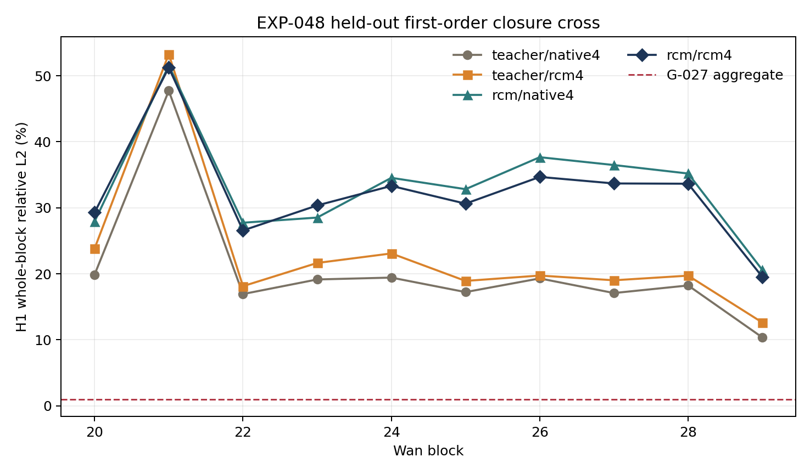
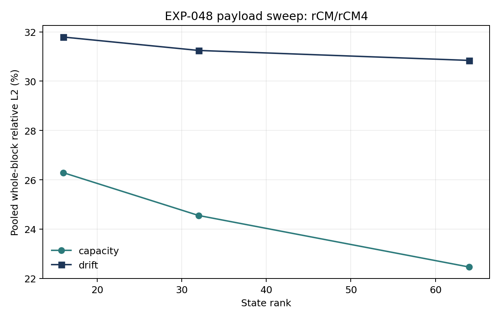
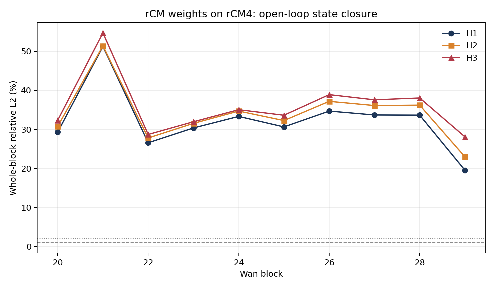

# EXP-048：rCM 蒸馏是否诱导低率状态闭合

日期：2026-08-27
状态：完成，`G-027 = null/adverse`

## 核心结论

本实验否定了一个具体且重要的假设：官方四步 rCM 权重并没有自然诱导出一个可由
calibration-only、rank-64 token state 表达的晚层闭合动力学。它不仅没有比 teacher
更容易压缩，在固定输入轨迹的 2x2 对照中反而显著更难。

这不是对 rCM 端点生成质量或四步加速的判决。EXP-047 仍负责回答 released rCM 的
端到端速度/质量 Pareto；EXP-048 只回答内部 late-block residual 是否因为蒸馏而变成
低率、近 Markov、可开放环预测的状态。

## 为什么值得验证

EXP-045 表明 current-input diagonal field 在少数晚层可恢复动态坐标，但只有 3/10 层
通过局部门槛。EXP-046 又表明 teacher 上 target-visible rank-64/96 whole-block state
分别仍有 4.833%/4.345% 聚合误差。一个仍未回答的可能性是：few-step distillation
不仅改变输出，还把内部动力学训练成更适合大步更新的低率状态。

EXP-048 因此没有继续扩大 teacher 的后处理 rank，而是做权重与轨迹的完全交叉：

| | native4 latent trajectory | rCM4 latent trajectory |
|---|---:|---:|
| teacher weights | `D(T, X_T)` | `D(T, X_R)` |
| rCM weights | `D(R, X_T)` | `D(R, X_R)` |

这能区分“rCM 权重本身更闭合”与“只是在自己的 on-policy trajectory 上误差被抵消”。

## 冻结实验设计

- 模型：Wan2.1-T2V-1.3B，F17 480p，token grid `5x30x52`。
- 层：连续 blocks 20--29；四个 macro denoising stages。
- calibration：4 个新 prompt/seed，每个 stage 固定采样 256 个 token row。
- selection：4 个未参与拟合的 prompt/seed，使用全部 7,800 tokens。
- rank：16、32、64。
- basis：model-specific basis，以及跨两模型/两轨迹共享的 shared basis。
- 方法：capacity、reuse、AR(1)、current-input drift、one-step AR(2)+drift。
- 开放环：H1、H2、H3；H2/H3 只从最后一个 exact anchor 递推 state。
- 判定指标：whole-block-output relative L2，不用 residual energy capture 替代。
- 无 VAE decode、视频质量或性能声明；GPU2 有一个停止态外部进程保留显存。

主状态为

\[
C_k=r_kU,
\]

主转移为

\[
\widehat C_k=a_k\widehat C_{k-1}
+b_k(h_k-h_{k-1})U.
\]

所有 basis 与系数只在 calibration 上拟合。Selection 只做固定评估，不更新任何
参数、rank、门槛或 fallback。

## Gate 结果

| G-027 条件 | 实际结果 | 判定 |
|---|---:|---:|
| rCM/rCM4 capacity `<=0.5%/1%` | pooled `22.460%`，worst `33.030%`，0/10 层 | FAIL |
| rCM/rCM4 H1 `<=1%/2%` | pooled `30.843%`，worst `57.278%`，0/10 层 | FAIL |
| 两条固定轨迹上权重改善 `>=25%` | 0/10 层同时通过 | FAIL |
| H2 `<=2%/4%` | pooled `33.096%`，worst `54.047%` | FAIL |
| H3 `<=2%/4%` | pooled `35.734%`，worst `56.884%` | FAIL |
| two-lag H1 advantage `<=10%` | `0.137%` | PASS |
| shared-basis H1 penalty `<=25%` | `0.049%` | PASS |

最容易的 block 29 仍有 `13.543%` capacity 和 `19.531%` H1 聚合误差；最难的
block 21 H1 达到 `51.244%`。不存在接近门槛的层。

## 2x2 权重与轨迹分解

rank-64、model-specific basis 的 pooled whole-block error 为：

| Weights | Input trajectory | Capacity | H1 drift |
|---|---|---:|---:|
| teacher | native4 | 10.721% | 20.473% |
| teacher | rCM4 | 12.958% | 22.858% |
| rCM | native4 | 22.569% | 31.753% |
| rCM | rCM4 | 22.460% | 30.843% |

由此可得：

- 固定 native4 输入，rCM 权重使 H1 error 增加 `55.10%`。
- 固定 rCM4 输入，rCM 权重使 H1 error 增加 `34.93%`。
- 对 teacher，换成 rCM4 trajectory 使 H1 error 增加 `11.65%`。
- 对 rCM，自身 rCM4 trajectory 只使 H1 error 降低 `2.86%`。
- pooled interaction 为 `-0.279` log-risk，说明 on-policy trajectory 确有部分抵消，
  但远不足以逆转权重本身的负效应。

逐层上，rCM 在 native4 输入的 10/10 层都更差；在 rCM4 输入也有 9/10 层更差。
唯一例外是 block 21 的 rCM4 H1 相对 teacher 改善 `3.82%`，仍远低于 25% 门槛，
且其绝对 H1 error 为 `51.24%`。

## 为什么 calibration energy 看起来不错，输出却完全不行

calibration rank-64 residual energy capture 的逐层均值为：

| Basis | Mean | Min--max |
|---|---:|---:|
| teacher model-specific | 93.16% | 85.75%--99.54% |
| rCM model-specific | 80.18% | 70.63%--97.88% |
| shared | 84.86% | 76.35%--98.44% |

`80% energy captured` 容易造成“已经很低秩”的错觉，但未捕获的 20% energy 对应约
44.7% residual relative L2。Held-out rCM/rCM4 rank-64 实际捕获 82.63% residual
energy，仍对应 `41.68%` residual L2 和 `22.46%` whole-block-output L2。

本实验中 residual-to-output norm scale 约为 `0.539`。要使 capacity output error
达到 0.5%，residual L2 必须小于约 0.93%，也就是至少捕获约 `99.991%` residual
energy。rank-64 的 82.63% 与这个要求不在同一数量级。

因此失败不是 output denominator 的异常放大，也不主要是 selection leakage 或
跨样本 basis 崩溃。更直接的原因是：高保真 whole-block 替代需要接近完整的 residual
energy，而 rCM residual 比 teacher residual 更不集中。

## Rank、历史与开放环

| Rank | Capacity | H1 drift |
|---:|---:|---:|
| 16 | 26.288% | 31.791% |
| 32 | 24.552% | 31.247% |
| 64 | 22.460% | 30.843% |

rank 从 16 增至 64 只改善 3.83 个 capacity 百分点和 0.95 个 H1 百分点，曲线明显
平台化。主要瓶颈不是再加少量 state width。

AR(2)+drift 相对一阶 drift 只改善 `0.137%`，说明两步历史不能修复该函数类；
shared basis 仅恶化 `0.049%`，说明失败也不能归因于 teacher/rCM 之间一个简单的
hidden gauge。H2/H3 则从已经很大的 H1 继续增长，未形成开放环稳定闭合。

## 与已有负结果的合并解释

1. EXP-045 说明少数 late blocks 存在 current-input 可观测性，但覆盖不广。
2. EXP-046 说明即使 target-visible rank-64/96 correction 也不能达到严格 whole-block
   门槛。
3. EXP-048 进一步说明 released few-step distillation 没有自动把该内部表示训练成
   calibration-transferable low-rate closure；相反，rCM residual 的 rank concentration
   低于 teacher。

三者共同排除的是同一条后处理路线：在不改变训练目标和内部架构时，用一个共享低率
state 去跳过完整 Wan late block。它们不否定：

- rCM 作为完整四步 denoiser 的端到端价值；
- same-step attention/FFN kernel 优化；
- 在训练时显式植入 state/innovation/renderer 分离的模型；
- 物理视频时间上的长期记忆或 autoregressive KV/state 管理。

## 决策

关闭 C-027，park L-027，不训练当前 basis 的 observer/router，不扩大 post-hoc rank，
不做 renderer kernel 或近似 rollout。若继续训练态路线，需要新决策，并且训练目标必须
直接约束：

\[
\text{state sufficiency}
+\text{multi-step closure}
+\text{whole-block rendering}
+\text{closed-loop endpoint risk},
\]

而不能假设普通 few-step output distillation 会自然产生这些性质。

## 完整性与工程记录

- engineering smoke attempt00：发布 checkpoint 缺少部分可选训练元数据键，加载前失败。
- attempt01：训练元数据带 `net.` 前缀，清理顺序错误，加载前失败。
- attempt02：两项最小兼容修复后通过；recorder 前后输出满足 exact `torch.equal`。
- calibration 4/4、selection 4/4 identity 完整。
- selection 共 22,080 行，全部 finite，退出码 0。
- official source commit：`ed3cb14dd936f92cdc9f9381af7369991509b41f`。
- teacher checkpoint SHA-256：`96b6b242ca1c2f24e9d02cd6596066fab6d310e2d7538f33ae267cb18d957e8f`。
- rCM checkpoint SHA-256：`3baa20e8e64c7f1ee6e4a377f5a04b8e4d193e0a1a1241814879a004fd77370a`。
- 远端相关测试：17/17 通过。
- 远端工作区：2.4 GiB，低于 30 GiB 上限。
- selection evaluator 的 18.9 分钟主要是 CPU 上重复 FP64 全张量能量复算，不是可用于
  论文的 H200 latency；本实验明确不做性能声明。

## Artifact

- `wan_rcm_state_closure_exp048_20260827/selection_v1/cell_metrics.csv`
- `wan_rcm_state_closure_exp048_20260827/analysis_v1/block_gate_summary.csv`
- `wan_rcm_state_closure_exp048_20260827/analysis_v1/cross_effects.csv`
- `wan_rcm_state_closure_exp048_20260827/analysis_v1/mechanism_sweep.csv`
- `wan_rcm_state_closure_exp048_20260827/analysis_v1/rank_sweep.csv`
- `wan_rcm_state_closure_exp048_20260827/analysis_v1/summary.json`
