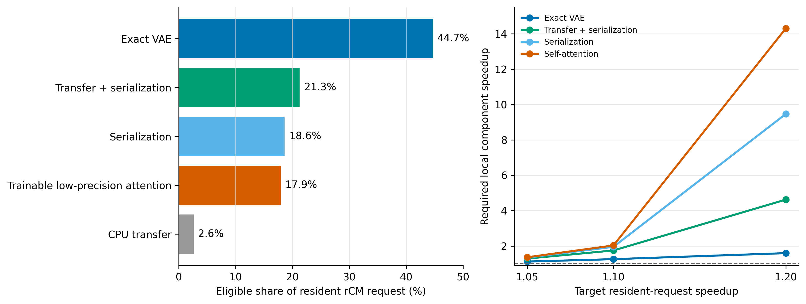

# resident rCM 下一后继选择：exact full-F81 VAE CUDA Graph

日期：2026-09-01
状态：`PLAN-066` 候选选择完成；`RDR-038` 待研究者接受

## 1. 直接结论

在 `EXP-052` 的 exact resident rCM4 `9.637995s` 基线上，下一项应测试
**不改变官方 F81 VAE 数学图和时间调度的 CUDA Graph capture/replay**。它只消除
Python 与 GPU launch 边界，不改变 21 个 latent frame 的顺序、causal-conv cache、
权重、BF16、kernel、VAE 输出或 MP4 路径。

这与已经关闭的 `EXP-053` 不同。后者合并 temporal chunks，F81 四个 prompt 全部
失去 bitwise equality；本候选不允许合并 frame，也不允许 `torch.compile` 重新生成
kernel。它首先回答更窄的问题：官方逐帧 VAE 是否存在可由静态 replay 精确移除的
launch-bound 冗余。

当前只是 Amdahl 与代码就绪度选择，不是 VAE 已经加速或 CUDA Graph 必然可捕获的
结果。任何 GPU 执行都需要先接受 `RDR-038`。

## 2. Amdahl 决策面

`EXP-052` 的 rCM4 组件中位时间为：VAE `4.308300s`、denoiser `3.205365s`、
serialization `1.796082s`、CPU transfer `0.253741s`、text `0.064420s`。

| 候选 | 可作用请求时间 | 完全消除上限 | 达到请求 1.05x 所需局部加速 | 达到请求 1.10x 所需局部加速 |
|---|---:|---:|---:|---:|
| exact VAE | `4.308s / 44.7%` | `1.808x` | **`1.119x`** | **`1.255x`** |
| transfer + serialization | `2.050s / 21.3%` | `1.270x` | `1.288x` | `1.747x` |
| serialization only | `1.796s / 18.6%` | `1.229x` | `1.343x` | `1.952x` |
| self-attention | `1.727s / 17.9%` | `1.218x` | `1.362x` | `2.030x` |

`EXP-054` 已实测 Sage SM90 的 self-attention 局部速度为 `1.586377x`。即使假设
全部 self-attention 都能安全替换，请求上限也只有 `1.070935x`；实际 train-free
atlas 为 `0/120`，所以当前可兑现值仍为 `1.000x`。训练量化需要新 checkpoint、
训练数据和质量 Gate，不应在 exact 系统候选之前打开。

serialization 路径当前在 CPU 上顺序执行 libx264。它可以改善服务吞吐，但同一请求
必须等完整 VAE、GPU-to-CPU transfer 和编码结束；改变 codec、preset 或异步响应契约
也可能改变最终 bitstream/decoded pixels。它适合作为后续独立系统 Gate，而不是先于
最大 exact 组件。

## 3. 为什么 CUDA Graph 是新的、受限的 VAE 问题

官方 `WanVAE_.decode` 对 F81 的 21 个 latent frames 逐个调用 `Decoder3d`：

1. 每个 frame 重置 Python `conv_idx`；
2. decoder 内逐层更新 causal-conv feature cache；
3. 每个 frame 结束后执行累计 `torch.cat`；
4. 整个调用没有现成 CUDA Graph；tokenizer compile callback 默认关闭。

`EXP-053` 说明跨 frame 合并会改变 F81 数值，但没有测量保持完全相同 kernel 序列时
CPU launch overhead 的占比。CUDA Graph 可以把一次固定 shape 的完整官方调用捕获为
静态 replay；如果实现只复制新 latent 到静态 input，并返回静态 output，它不需要改变
任何模型算子。

该候选仍有真实风险：Python cache 对象只在 capture 时执行，graph pool 可能增加显存，
某些分配或 SDPA backend 也可能不可捕获。必须使用连续不同输入 replay 检查 stale state，
不能只比较同一输入重复运行。

只读源码计数进一步限定了预期。F81 一次 decode 包含 21 次完整 decoder 调用、
33 个 CausalConv3d 模块在时间循环中的 693 次应用，以及至少 861 次
Conv3d/Conv2d/Upsample 模块应用。这个静态重复表面支持测试 launch amortization。
另一方面，20 次累计输出 `torch.cat` 共写入 860 个 output-frame units，相当于最终
81 帧输出的 `10.62x`；CUDA Graph 不会删除这些 convolution 或 copy 工作。因此
`1.12x` VAE 门槛不是预期必过值，而是区分 launch-bound 与 compute/memory-bound 的
有效 stop rule。

官方 PyTorch 文档要求 capture 前在 side stream 完成 warmup，并长期保留静态 input
和 output；每次新输入先 `copy_` 到固定地址再 replay。NVIDIA 的约束文档也说明 graph
引用的外部内存必须在 graph 生命周期内保持有效，capture 内分配由 graph-aware pool
管理。[PyTorch CUDA semantics](https://docs.pytorch.org/docs/main/notes/cuda.html)、
[NVIDIA CUDA Graph constraints](https://docs.nvidia.com/dl-cuda-graph/cuda-graph-basics/constraints.html)

## 4. 三候选的决策价值

### 4.1 exact VAE CUDA Graph

- 最大剩余组件，仅需 `1.119x` VAE 即可产生 `1.05x` 请求收益；
- 与 rCM 模型、scheduler 和质量完全正交；
- 若 bitwise exact，可继承 `EXP-047/052` 的质量证据；
- 一次失败即可区分 launch-bound 与 kernel-bound，不会重开 temporal scheduling。

### 4.2 transfer/serialization

- 理论上限第二，但单请求的依赖链仍是 VAE -> transfer -> codec；
- overlap 更可能改善 steady-state throughput，而非当前注册的单请求 latency；
- 改 codec/preset 不自动保持相同视频 artifact，必须另行定义 exactness contract。

### 4.3 trainable low-precision Attention

- Sage 本地速度已成立，且风险拓扑跨身份稳定；
- 但 train-free calibration safe coverage 为零，必须改变 checkpoint 或训练策略；
- 当前局部速度即使全覆盖也只有 `1.071x` 请求上限，训练成本与质量风险最高。

因此排序不是声称 VAE 有算法新颖性，而是在当前 exact incumbent 上最大化下一次实验的
信息增益与可兑现端点收益。

## 5. 提议 Gate

`RDR-038` 提议 `C-033 / L-033 / EXP-055 / G-034`：

1. F17 固定 shape 验证 capture、连续三次不同 latent replay、bitwise equality 和内存；
2. F81 使用四个 `EXP-052` prompt 的 rCM4 on-policy latent，不按输入选择实现；
3. baseline 与 graph 都包含静态 input copy、必要的 output handoff、GPU sync；
4. VAE 局部至少 `1.12x` 且投影 request 至少 `1.05x` 才进入完整 resident endpoint；
5. 完整 endpoint 至少 `1.05x`、decoded CPU tensor bitwise equal、显存不超过
   `EXP-052` 峰值的两倍才支持候选；
6. `1.25x` VAE / `1.10x` request 作为 stretch，不用观察后结果放宽 hard gate。

禁止在同一 Gate 中加入 temporal chunking、`torch.compile`、FP8、attention 修改、
新 convolution kernel、codec 修改或 tolerance relaxation。

## 6. 结论边界

- 选择结果不更新 L-030；resident rCM4 `9.637995s` 仍是唯一 incumbent。
- CUDA Graph 通过只证明 exact execution redundancy，不构成新生成算法。
- CUDA Graph null 不否定 VAE kernel fusion/backend 优化，只说明 launch replay 不足。
- 低精度 Attention 保留为需单独训练决策的后续候选，不再复用已失败的 static atlas。

绑定数据：

- `wan_rcm_successor_plan066_20260901/candidate_frontier.csv`
- `wan_rcm_successor_plan066_20260901/required_component_speedup.csv`
- `wan_rcm_successor_plan066_20260901/summary.json`
- `wan_rcm_successor_plan066_20260901/vae_graph_source_feasibility.json`
