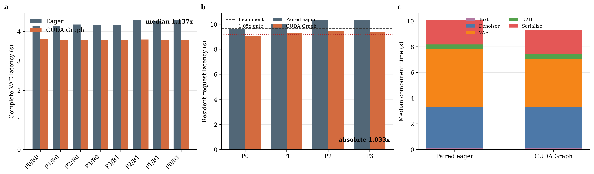

# 条件冗余理论、视频理解边界与 Wan exact runtime 新证据

日期：2026-09-02
实验：`EXP-055 / G-034`
结论：`speed-boundary`

## 1. 直接判决

这轮结果在两个层面上必须分开表述：

- **科学诊断达到预期。** 三个 F17 latent、四个 F81 prompt、交错重放、重复输入、
  重放后 eager 以及四个完整 CPU 视频全部逐 bit 一致。完整 VAE 达到
  `1.1367x`，证明 Wan VAE 存在可兑现的 exact execution-graph redundancy。
- **注册的完整方法主张未达到预期。** 完整 resident request 为 `9.3257s`，
  相对 `9.6380s` incumbent 只有 `1.0335x`，未达到 `1.05x`。

因此不能写成“CUDA Graph 已解决 rCM 端到端瓶颈”，也不能写成“没有收益”。
准确结论是：

\[
\boxed{
\text{exact VAE launch redundancy 为正}
\quad\land\quad
\text{standalone endpoint promotion 为负}
}
\]

## 2. 初始理论到底哪里对、哪里过强

最初直觉来自视频局部运动、时空相关、低秩/高秩混合和规则结构。长期实验逐步
拆开了下面这条曾被默认连续成立的链：

\[
\text{相关性}
\Rightarrow
\text{可预测性}
\Rightarrow
\text{可压缩性}
\Rightarrow
\text{可观测性}
\Rightarrow
\text{可组合性}
\Rightarrow
\text{系统加速}.
\]

其中真正普适的是条件风险分解。对目标 (Y)、廉价观测 (Z)、历史 (H) 和
任务度量 (G)：

\[
\mathbb E\|Y-f(Z,H)\|_G^2
=
\underbrace{\mathbb E\operatorname{Tr}\operatorname{Cov}_G(Y\mid Z,H)}
_{\text{不可观测条件创新}}
+
\underbrace{\mathbb E\|\mathbb E[Y\mid Z,H]-f(Z,H)\|_G^2}
_{\text{函数族与估计误差}}.
\]

增大 rank、BCM block、Butterfly stage 或 expert 数只能降低第二项。若当前 mode、
future query、运动坐标或 value leverage 不在 (Z) 中，第一项不会消失。

因此过去的负结果是相互一致的：

| 实验 | 结果 | 实际否定的命题 |
|---|---:|---|
| EXP-002 | conditional rank-4 可变成 raw rank-62 | 条件低秩不等于共享 raw basis |
| EXP-003 | warp/BCCB 约 `0.975x`，2/9 cell | 物理位移不能直接替代去噪 residual |
| EXP-004 | past-only full-rank 约 `1.001x` AR(2) | 容量不能补回缺失的 current mode |
| EXP-005 | current-input field `1.937x`，仅 3/10 层 | 当前观测有效但不是全局接口 |
| EXP-050/051 | joint residual 4.281%，风险差 66.5% | 注册的 support-state 函数类/训练路径不闭合 |
| EXP-053 | F17 exact、F81 非 exact | 短状态相等不能认证长缓存状态闭包 |
| EXP-055 | VAE `1.1367x`、请求 `1.0335x` | 组件冗余不自动成为稳健端到端收益 |

## 3. Wan：新的正向发现是什么

### 3.1 固定数据结构失败，但固定执行图成立

BCM/BCCB 假设固定 Fourier 特征向量；静态 low-rank 假设共享输出子空间；跨步
residual predictor 假设廉价历史包含当前动态坐标。这些假设在 Wan 上均被不同
程度否定。

CUDA Graph 测试的是完全不同的对象。设官方 VAE 为固定 shape 的算子序列：

\[
F(x)=K_n\circ\cdots\circ K_2\circ K_1(x).
\]

图重放没有构造 \(\hat F\)，而是保持同一个 (F)，只把逐 kernel CPU launch
从每次请求搬到一次捕获：

\[
T_{\mathrm{eager}}
=T_{\mathrm{GPU}}+N_{\mathrm{launch}}t_{\mathrm{launch}}+T_{\mathrm{alloc}},
\]

\[
T_{\mathrm{graph}}
=T_{\mathrm{GPU}}+t_{\mathrm{replay}}+T_{\mathrm{copy}}+T_{\mathrm{handoff}}.
\]

这里没有条件创新误差：

\[
\delta F(x)=F_{\mathrm{graph}}(x)-F_{\mathrm{eager}}(x)=0
\]

在全部注册输入上逐 bit 成立。新的 insight 是：

> Wan 的 causal VAE cache 在 Python 控制层看起来动态，但固定 F17/F81 shape 下，
> 真正的 tensor dependency DAG 可以跨内容精确重放；可压缩的是 launch schedule，
> 不是视频状态。

### 3.2 数值结果

F17 `0,1,2,1,0` 交错重放全部 `max_abs=0`、`relative_l2=0`，且重放后 eager
未被污染。F81 两轮八对结果为：

| 指标 | 数值 | 门槛 |
|---|---:|---:|
| eager VAE median | `4.2317s` | - |
| graph VAE median | `3.7228s` | - |
| VAE speedup | `1.1367x` | `>=1.12x` |
| projected request speedup | `1.0647x` | `>=1.05x` |
| F81 component peak | `32,292 MiB` | `<=59,948 MiB` |

完整请求保持四次网络调用和 CPU 视频逐 bit 相等：

| Prompt | eager (s) | graph (s) | paired speedup |
|---:|---:|---:|---:|
| P0 | 9.5770 | 9.0179 | 1.0620x |
| P1 | 10.0099 | 9.2644 | 1.0805x |
| P2 | 10.3411 | 9.4659 | 1.0925x |
| P3 | 10.2943 | 9.3870 | 1.0967x |

同进程 paired median 为 `1.0865x`，说明 graph 收益不是噪声；但相对冻结的
EXP-052 incumbent 只有 `1.0335x`。这一差异不能用 paired baseline 偷换注册门槛。

### 3.3 为什么投影通过、实测失败

EXP-052 的非 VAE 中位数组成为：文本约 `0.064s`、denoiser `3.205s`、D2H
`0.254s`、序列化 `1.796s`。本轮 graph 请求对应中位数约为：

| 组件 | EXP-055 graph median |
|---|---:|
| Text | `0.0783s` |
| Denoiser | `3.2465s` |
| VAE | `3.7284s` |
| D2H | `0.3532s` |
| Serialization | `1.9104s` |

相对 incumbent，VAE 约省 `0.580s`，其余部分合计约增加 `0.268s`，最终只净省
约 `0.312s`。这就是 Amdahl 投影缺少方差裕量的具体来源，而不是图突然失效。

## 4. Wan：是否获得了新的机制理解

是，但不是新的生成模型压缩算法。

1. **冗余对象必须分层。** feature/state redundancy 受 conditional innovation
   限制；execution-DAG redundancy 不受该 Bayes floor 限制。
2. **rCM 改变了瓶颈分布。** NFE/denoiser 已大幅下降后，VAE、D2H、序列化从
   次要项变为主项；继续只优化 attention 很容易得到很低端到端收益。
3. **exact component 仍需绝对 endpoint gate。** 组件 `1.1367x` 不足以稳定保证
   服务 `1.05x`，尤其当 candidate margin 只有约 `0.15s`。
4. **长缓存 exactness 可以被实证认证。** EXP-053 证明短序列状态等价不能外推；
   EXP-055 则通过不同输入和反向顺序证明固定 F81 graph 的状态覆盖是完整的。
5. **结构方法的位置更清楚。** BCM/Butterfly/low-rank 仍只能作为有局部证据的
   geometry/tail expert；不能借用 CUDA Graph 的 exact 正结果为其背书。

## 5. 视频理解：当前是否达到预期

视频理解侧没有达到“冻结模型上得到可部署长视频 state”的方法预期，但达到了
更重要的诊断预期：它定位了为什么 query-independent state 比 Wan 当前状态更难。

Wan 推理时的 timestep、CFG、current latent 和 current block input 已知；而
视频理解 writer 往往不知道未来问题 (Q)。它必须生成 query-independent 状态
(S(V))，使得：

\[
Y=g(S(V),Q),
\qquad
I(Y;V\mid S,Q)\approx0.
\]

EXP-050/051 的 width-32 additive state 没有成为这一 query family 的充分统计量。
固定 state 后加入 exact support 可以修补特定 residual；一旦 state 与 support
共同更新，residual gauge 也随之移动：

\[
D_{\theta,\Omega}=Y-\widehat Y_{\theta,\Omega},
\qquad
\Omega^\star(\theta)=\arg\min_{|\Omega|=B}R(\theta,\Omega).
\]

这形成离散、非光滑的双层问题。当前 joint residual 的恶化严格否定的是注册的
width、page、hard support、预算和训练路径，不是“state 与 support 永远不能协同”。

更深的 insight 有三点：

1. **开放 query 提高了条件创新 floor。** writer 看不到未来 query，固定低带宽
   state 很难同时服务语义、空间、计数和时序问题。
2. **self-attention 不天然 successive-refinement。** 增加 token 会同时改变 query、
   RoPE、归一化和后续 hidden，故 \(\Omega_{b+1}\supset\Omega_b\) 不保证风险下降。
3. **未来方向必须 train-native。** 更合理的是 external cross-attention memory、
   semantic/event node、query-aware read、nested path training 和 calibrated task-risk
   fallback；继续给冻结 reader 增加 BCM/rank/page 的潜力已经很低。

因此，视频理解侧的当前状态是：

| 维度 | 判决 |
|---|---|
| post-hoc 固定结构 | 低潜力，已充分止损 |
| 条件冗余理论 | 仍成立，并得到更严格边界 |
| query-independent additive state | 当前函数类失败 |
| train-native query-aware memory | 中高潜力，尚无正向实验证据 |
| 实际 H200 加速 | 尚未建立 |

## 6. 双时间与“热力学”解释是否仍一致

一致，但要限制其角色。物理视频时间 \(\tau\) 和去噪时间 \(\lambda\) 一般不交换：

\[
\mathcal F_{\tau\lambda}
=-\partial_\tau L_\lambda+\partial_\lambda L_\tau+[L_\tau,L_\lambda].
\]

RoPE、AdaLN、CFG、遮挡和 attention routing 都会使交换缺陷变化。这解释固定
warp/BCCB 为什么不能从物理运动直接外推到 denoising residual。

扩散路径风险可写成近似漂移代价：

\[
D_{\mathrm{KL}}(P\|\widehat P)
\approx
\frac12\mathbb E\int
\delta b_t^\top a_t^{-1}\delta b_t\,dt.
\]

它适合指导近似方法的 timestep/layer refresh，不适合把内部 feature entropy
直接称为物理温度。EXP-055 是 exact 变换，
\(\delta b_t=0\)，因此与该风险理论正交；这正是它能在静态结构失败后仍取得
正向组件结果的原因。

## 7. 下一步优先级

1. **不提升 L-033 为独立主线。** 保留 exact graph wrapper，只有在新注册的
   VAE + D2H/serialization exact bundle 中才重新测完整请求。
2. **Wan 实际加速继续以 L-030 为基线。** 优先级是更低 NFE/更强 student、
   same-step fused dense/FP8 attention、精确 I/O scheduling；任何方法都必须超过
   `9.6380s` 的冻结 resident endpoint。
3. **近似 residual cache 只限局部。** 仅 EXP-005 已通过 observability 的层可作为
   候选，并必须有 suffix-risk 与 refresh；不再做全局 raw residual closure。
4. **视频理解若继续，转 train-native interface。** external memory、query-aware
   reader、semantic/event node、nested refinement 与 task-risk certificate 是同一条
   主线，不再堆固定 BCM/BCCB/Butterfly。

## 8. 最终总结

起初的“视频存在强时空冗余”直觉没有被推翻；被推翻的是它会自动变成固定、低秩、
可观测、可组合且硬件友好的表示。新的统一结论是：

\[
\boxed{
\text{conditional redundancy}
\neq
\text{fixed closure}
\neq
\text{cheap observability}
\neq
\text{system speedup}
}
\]

同时，EXP-055 补上了一个正向分支：

\[
\boxed{
\text{即使状态不可后验结构化，固定执行 DAG 仍可被 exact 地摊销}
}
\]

这使项目从“继续寻找万能结构”收敛到两个更可靠的方向：模型侧设计原生条件状态
接口，系统侧只优化已实测的真实瓶颈，并始终用绝对端到端门槛约束组件收益。
