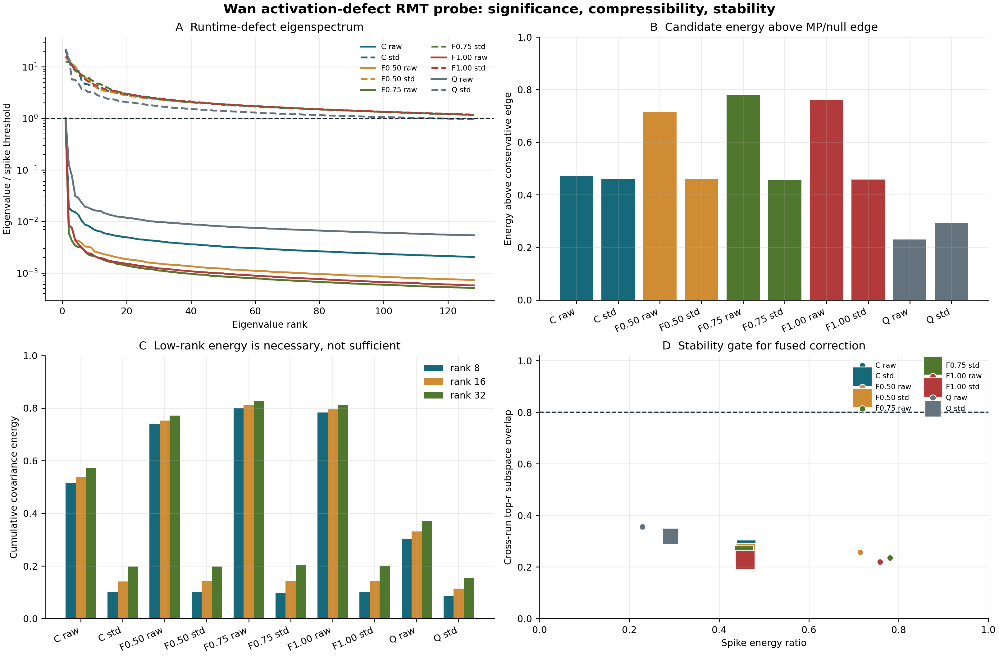

# Wan2.1 严格保真 H200 实测结果

日期：2026-07-26

环境：2 x NVIDIA H200 NVL，PyTorch 2.9.1+cu128，CUDA 12.8，Wan2.1-T2V-1.3B，FA3 BF16，UniPC 20 step。

## 结论

1. 双卡 CFG branch parallel 是已验证的精确加速：F17 平均端到端 `1.7743x`，final latent 和解码像素逐值一致。
2. DiT speculative verification 在当前模型上没有 LLM 式 batch 摊薄：完整 Wan 的 F17/F81 batch-2 成本为 `1.952x/1.990x`。
3. 全局 runtime-defect low-rank correction 不成立：channel-standardized rank-16 能量仅 `11.37%–14.38%`，跨 run top-16 overlap 仅 `0.220–0.356`。
4. 下一主线是 F81 fused geometry-aware sparse attention；F17 则优先 exact K/V cache、compile/graph 和 whole-block fusion。

## 精确 CFG

| repeat | sequential E2E (s) | CFG-parallel E2E (s) | speedup | latent rel-L2 | frame SSIM |
|---:|---:|---:|---:|---:|---:|
| 0 | 5.810497 | 3.298453 | 1.761583x | 0 | 1.0 |
| 1 | 5.878109 | 3.289319 | 1.787029x | 0 | 1.0 |
| mean | 5.844303 | 3.293886 | **1.774306x** | **0** | **1.0** |

`latent_max_abs=0`、`pixel_max_abs=0`、exact fraction 均为 1。计时包含 text encoding、denoising、跨卡通信、scheduler 和 VAE decode；两次运行交替方法顺序。

原始证据：

- [`cfg_f17/generation_runs.csv`](cfg_f17/generation_runs.csv)
- [`cfg_f17/cfg_parallel_paired_metrics.csv`](cfg_f17/cfg_parallel_paired_metrics.csv)
- [`cfg_f17/cfg_parallel_summary.json`](cfg_f17/cfg_parallel_summary.json)
- [`cfg_f17/generation_manifest.json`](cfg_f17/generation_manifest.json)

## 推测执行硬件 Gate

| case | batch | full Wan latency (ms) | ratio vs batch 1 | parallel efficiency |
|---|---:|---:|---:|---:|
| F17 | 1 | 133.058 | 1.000x | 1.000 |
| F17 | 2 | 259.782 | 1.952x | 1.024 |
| F17 | 4 | 508.239 | 3.820x | 1.047 |
| F81 | 1 | 813.575 | 1.000x | 1.000 |
| F81 | 2 | 1619.204 | 1.990x | 1.005 |
| F81 | 4 | 3301.635 | 4.058x | 0.986 |

`parallel efficiency = batch / latency_ratio`。即使假设 acceptance=100%、draft cost=0，最好速度上界也只有表中 efficiency；实际 acceptance、draft 和 residual sampling 会让它更低。因此当前 deterministic 20-step、双 H200 配置停止完整 speculative sampler。

原始证据：

- [`full_model_batch/wan_target_batch_benchmark.csv`](full_model_batch/wan_target_batch_benchmark.csv)
- [`full_model_batch/manifest.json`](full_model_batch/manifest.json)
- [`speculative_batch/speculative_batch_benchmark.csv`](speculative_batch/speculative_batch_benchmark.csv)

## Runtime Defect RMT

| operator | standardized rank-16 energy | spike energy | top-16 overlap |
|---|---:|---:|---:|
| cache reuse | 0.14085 | 0.46025 | 0.26853 |
| forecast 0.50 | 0.14217 | 0.45889 | 0.25432 |
| forecast 0.75 | 0.14375 | 0.45556 | 0.24581 |
| forecast 1.00 | 0.14279 | 0.45855 | 0.22849 |
| FP8 recompute | 0.11372 | 0.29132 | 0.31915 |

MP/null 边界以上存在候选结构，但 top-16 basis 跨 run 不稳定，且不能覆盖主要标准化缺陷能量。raw-centered forecast 的高 rank-16 能量来自 channel-scale outlier，不能当成通用低秩证据。RMT 在这里是筛查工具，不是 bulk 可删除的证明。

原始证据：

- [`defect_rmt/defect_rmt_summary.csv`](defect_rmt/defect_rmt_summary.csv)
- [`defect_rmt/defect_rmt_eigenvalues.csv`](defect_rmt/defect_rmt_eigenvalues.csv)
- [`defect_rmt/defect_rmt_manifest.json`](defect_rmt/defect_rmt_manifest.json)

## 证据边界

- CFG 当前是 F17、1 prompt、1 seed、2 个交替顺序 repeat；结论需要扩展到 F81 和多 prompt/seed，但数值精确性已经通过 latent 与像素双重验证。
- full-Wan batch probe 使用 initial-noise 的第一个 UniPC timestep，证明当前 shape 的硬件经济性；若未来换模型、kernel、sampler 或 GPU，需要重跑。
- RMT 汇总跨 4 个 run，但视频 token 行相关，MP 假设只是近似；因此同时使用 circular-shift empirical null 和跨 run stability gate。
- MP spike、局部低秩能量和最终质量之间没有自动蕴含关系，任何 correction 仍须 trajectory-weighted paired rollout 和 fused-kernel 延迟验证。
