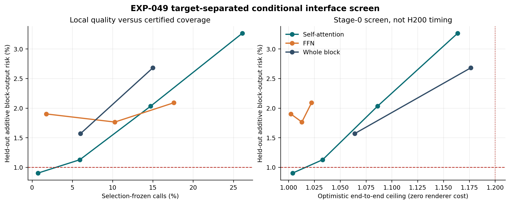

# 条件率失真前沿：模块目标分离后的必要条件审计

日期：2026-08-29  
实验：`EXP-049`  
结论：Stage-0 boundary/null；不进入 suffix、训练或 H200 kernel

## 核心结论

把 whole-block residual 拆成 self-attention、FFN 和 whole-block 三个目标，
并给每个目标提供其自然的当前状态接口，仍没有得到同时满足质量、迁移、
覆盖率和速度必要条件的候选。

这不是“模型无冗余”。target-visible 场把全调用误差从 AR(2) 的
`5.50%/6.72%/6.12%` 分别降到 `2.73%/3.54%/3.51%`，说明当前内容确实
携带额外信息。失败发生在两个转换：

1. 该信息不能由跨身份冻结的逐通道三系数场稳定恢复；
2. 少数可恢复调用的 runtime 覆盖不足以抵消 Amdahl 上限。

## 冻结策略结果

| 目标 | 覆盖率 | deployable agg./worst | oracle agg./worst | gap recovery | 零 renderer 端到端上限 |
|---|---:|---:|---:|---:|---:|
| Attention | 5.926% | 1.127% / 1.314% | 0.578% / 0.721% | 18.19% | 1.033x |
| FFN | 1.759% | 1.901% / 2.719% | 0.893% / 1.250% | -2.02% | 1.002x |
| Whole block | 0% | - | - | - | 1.000x |

最接近质量门槛的 attention 点只覆盖 `0.741%` 调用，deployable 为
`0.902%/1.143%`，oracle 为 `0.541%/0.695%`，恢复 `61.98%` oracle gap，
但零成本加速上限只有 `1.004x`。八个调用全部集中在 B0/B1 和
step 6/8/9/10，并不是广泛可压缩区。

## 为什么没有继续做 H200 计时

对 runtime share `f`、跳过比例 `q` 和候选相对成本 `rho>=0`：

\[
S=\frac{1}{1-fq+fq\rho}\leq\frac{1}{1-fq}.
\]

达到 `1.2x` 至少需要免费跳过 `30.93%` attention、`134.52%` FFN 或
`16.67%` whole block。FFN 单独在数学上不可能；质量接近的 attention
只有 `0.741%`；放宽到 `2%` selection 时 attention 覆盖 `26.11%`、误差
却升至 `3.264%/4.390%`，零成本上限仍仅 `1.164x`。whole block 覆盖
`15%` 时也只有 `1.176x` 上限且误差为 `2.680%/3.452%`。

因此 H200 实测成本只能把这些点向更差方向移动。停止计时不是资源问题，
而是先用严格下界排除了无决策价值的测量。

## 与历史结果的统一解释

- `EXP-003`：简单模块复用/一阶预测只移除 `1.081%` denoiser work；
- `EXP-005/045`：current input 在少数层恢复大量 oracle gap，但 breadth 和
  open-loop 失败；
- `EXP-046/048`：提高 whole-block state rank 并未建立闭合动态；
- `EXP-049`：目标分离也没有把条件冗余变成足够广、足够便宜的接口。

统一结论是：

\[
\text{条件冗余}
\not\Rightarrow
\text{跨身份共享场}
\not\Rightarrow
\text{足够覆盖率}
\not\Rightarrow
\text{可部署加速}.
\]

下一步不能再增加 diagonal/DPLR/BCM rank。若要复活，必须先在开发数据上
证明一种新的内容观测或训练原生接口把**质量有效覆盖率**提高到 Amdahl
必要线以上，再谈 suffix 和 kernel。更合理的独立主线仍是 same-step
sparse attention、已发布少步 student，或训练原生 state/render 分离。

