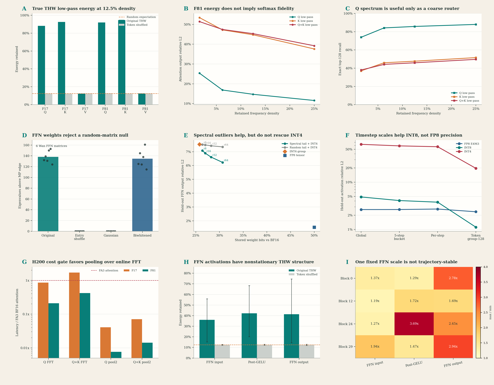

# World Foundry 功能感知熵与结构审计

日期：2026-07-26
模型：Wan2.1-T2V-1.3B / World Foundry，30 blocks，hidden size 1536，12 heads，head dim 128，FFN size 8960
硬件：NVIDIA H200 NVL，CUDA 12.8，PyTorch 2.9.1+cu128
状态：本轮五组正式探针均正常结束；本文只把实测数字写成结论，论文数字均标为作者报告值



## 1. 执行结论

1. **hidden-channel FFT 的失败只否定了 channel locality，不等于 Wan/DiT 不可压缩。** 六个真实 Wan FFN 矩阵在 MP 上边界之外平均有 138.2 个谱异常值；逐元素打乱和匹配高斯对照均为 0。训练后的权重更符合“随机样 bulk + 结构化 spike”，而不是纯随机矩阵。
2. **真正的几何结构位于 token 的 T x H x W 轴，但能量集中不等于算子可替换。** 在保留 12.5% THW 低频时，F81 的 Q/K 分别保留 91.94%/94.59% 去均值能量，V 仅 12.56%。然而直接低通 K 后，attention 输出相对误差仍为 44.77%。softmax 会放大与 query 对齐的高频方向，不能用频谱能量直接推断功能误差。
3. **Q 的 THW 结构可作为 coarse router 特征，但不适合直接替代 attention。** F81 Q-only 低通在 12.5% 密度时，top-128 support recall 为 85.77%，但 attention 输出误差仍为 14.69%，捕获的精确 attention mass 仅 33.72%。因此它最多承担候选召回，最终 critical tiles 仍需精确 QK、共同 softmax 归一化和 escape path。
4. **在线 FFT 的 H200 成本门槛没有通过。** F81 Q 的 FP32 THW FFT 往返耗时为 FA3 BF16 attention 的 20.97%，Q+K 为 41.86%；F17 分别达到 85.50% 和 169.71%。相比之下，2x2 spatial pooling 本身在 F81 只占 0.76%/1.42%，因此下一版 coarse router 应优先验证 pooling，而不是 cuFFT。
5. **谱异常方向有真实功能贡献，但不足以免训练救活 INT4。** 在 held-out seed 的真实 FFN 激活上，row-group INT4 的局部输出误差为 7.533%；保留 BF16 spectral rank-16 后降为 6.891%，相对改善 8.5%。随机 rank-16 几乎无效。rank-64 可降至 6.225%，但存储已从 25.78% 升至 30.66% BF16 bits，仍远差于 FP8 的 1.540% 输出误差。
6. **DiT activation 的 timestep 非平稳性真实存在，但不同格式的主导误差不同。** 固定 global、5-step bucket 和 per-step scale 下，FP8 E4M3 都约为 2.6% 局部误差，说明误差主要受尾数精度而非 scale 漂移主导；INT8 从 global 改为 per-step 可明显改善，token-group-128 dynamic 可进一步降到约 1.0%-1.25%；activation INT4 即使 token-group-128 仍为 17.6%-20.9%，应停止。
7. **综合既有结果，主线不应改成 FFT 压缩。** F81 继续采用 `sparse high-rank critical path + low-rank marginal tail + cache-aware refresh`；本轮新增的 Q 几何结构只用于低成本路由特征。F17 继续优先 pointwise/epilogue/runtime fusion。CM/BCM 仅保留为 marginal branch 的候选 basis。

## 2. 先修正三个理论命题

### 2.1 三种“熵”不能混用

| 对象 | 本轮可观测量 | 能回答的问题 | 不能回答的问题 |
|---|---|---|---|
| 参数熵 `H(W)` | channel FFT、元素分布、MP 谱、奇异值 | 权重是否存在某种编码或谱结构 | 压缩后端到端功能是否保持 |
| 表示熵 `H(X)` | T/H/W 邻域相关、跨 step/branch scale、activation quant error | 真实运行轨迹是否有可利用结构 | 某种 kernel 是否更快 |
| 功能复杂度 `H(f)` | attention 输出误差、held-out FFN 输出误差、最终 rollout | 近似是否保持当前输入分布上的功能 | 对任意 prompt 的严格保证 |

因此，`FFT(W)` 不集中只说明 hidden-channel 顺序没有图像式邻域先验。它不否定量化、SVD spike、token-space sparsity、跨 step cache 或低成本适配。

### 2.2 大 token 数不会自动平均掉固定权重误差

设固定量化误差为 `Delta W`，第 `i` 个 token 的误差为：

```text
e_i = Delta W x_i
```

增加 token 数 `M` 会让总平方误差近似按 `M` 累加，而不是让单 token 误差按 `1/sqrt(M)` 消失。只有对特定聚合统计取平均，并满足近似独立和零均值条件时，才会出现统计平均。

Wan 的大 `M` 真正带来的是：

- 权重在 7,800 或 32,760 个 token 上复用，BF16 GEMM 算术强度和 tensor-core 利用率较高；
- 权重读取成本被大量计算摊薄，weight-only 降位宽的 HBM 收益不如 LLM decode 的 `M=1` 明显；
- activation、QK 和 pointwise 流量随 token 数增长，F81 最终转为 attention-bound。

所以“DiT weight-only 加速较小”主要是系统 roofline 结论，不是量化噪声被 token 平均后的统计结论。

### 2.3 MP bulk + spikes 是统计模型，不是功能分解定理

本轮证据支持：

```text
W = W_bulk + W_spike
```

但不能直接声称 `W_spike` 只占少量 Frobenius energy 却承担 90% 功能。held-out activation 实验给出了更克制的结论：spectral rank-16 确实优于同维随机子空间，但只把 INT4 局部输出误差从 7.533% 降至 6.891%。是否能保持视频质量仍需低成本适配、融合 kernel 和 rollout 验证。

## 3. 实验范围与证据边界

| Probe | 范围 | 主要对照 | 证据边界 |
|---|---|---|---|
| THW spectrum | F17/F81，layer 0，timestep 1000，cond，Q/K/V，64 channels | token/frame/spatial shuffle，matched Gaussian | representation probe，不是 rollout |
| Spectral attention/router | 同一 QKV，12 heads，均匀 256 queries | Q-only/K-only/QK low-pass，4 个 density | sampled-query softmax，不是全视频 |
| MP outlier | blocks 0/15/29 的 FFN up/down 共 6 矩阵 | entry shuffle，Gaussian，5 次 biwhitening | weight statistic，不是功能结论 |
| FFN activation | F17，1 prompt，2 seeds，20 steps，blocks 0/12/24/29，双 CFG branch | calibration seed 与 held-out seed | 16 sampled token rows/record |
| H200 cost | F17/F81 replay，CUDA event，10 repetitions | FA3 BF16 attention | eager PyTorch cost gate，不是 fused upper bound |

本轮正式结果的 manifest、CSV 和退出日志均随报告发布。123 MB 原始 activation tensor 只保留在 236 服务器，不进入 Git。

## 4. Token T x H x W 频谱实验

### 4.1 去均值低频能量

在完整半径并列频点共同保留、目标 density 为 12.5% 时：

| Case | Signal | 原始 THW | token shuffle | 判断 |
|---|---:|---:|---:|---|
| F17 | Q | 88.13% | 12.52% | 强几何结构 |
| F17 | K | 92.52% | 12.14% | 强几何结构 |
| F17 | V | 12.36% | 12.55% | 与随机基线一致 |
| F81 | Q | 91.94% | 12.71% | 强几何结构 |
| F81 | K | 94.59% | 12.41% | 强几何结构 |
| F81 | V | 12.56% | 12.53% | 与随机基线一致 |

Q/K 为送入 self-attention 的 post-RoPE 张量。结果证明物理 token 轴有结构，但不能外推到所有 layer、step、prompt，也不能外推到 V。

### 4.2 softmax 功能反例

在同一 12.5% density 下，对每个 head 使用完整 sampled-query FP32 softmax，V 保持精确：

| Case | 近似 | attention 输出相对 L2 | top-128 recall | 精确 attention mass captured |
|---|---|---:|---:|---:|
| F17 | Q low-pass | 18.38% | 82.91% | 37.85% |
| F17 | K low-pass | 48.76% | 42.61% | 34.85% |
| F17 | Q+K low-pass | 47.72% | 41.63% | 34.91% |
| F81 | Q low-pass | 14.69% | 85.77% | 33.72% |
| F81 | K low-pass | 44.77% | 47.65% | 32.97% |
| F81 | Q+K low-pass | 45.33% | 45.91% | 32.76% |

最关键的反例是 F81 K：低频保留 94.59% 能量，但 attention 输出误差仍为 44.77%。原因是 softmax 依赖 query 与 K 方向的相对 score；低能量方向也可能控制排序、长程主体关系和 motion boundary。

因此：

- 直接低通 K/QK：否决；
- Q-only 低频直接替代 attention：否决；
- Q-only 几何特征用于高召回 coarse router：保留；
- V 的 THW 低频压缩：否决。

## 5. H200 代价门槛

| Case | FA3 BF16 | Q THW FFT roundtrip | Q+K FFT roundtrip | Q pool2 | Q+K pool2 |
|---|---:|---:|---:|---:|---:|
| F17 | 0.9124 ms | 0.7801 ms / 0.855x | 1.5484 ms / 1.697x | 0.0372 ms / 0.0408x | 0.0648 ms / 0.0711x |
| F81 | 14.4419 ms | 3.0287 ms / 0.2097x | 6.0453 ms / 0.4186x | 0.1101 ms / 0.0076x | 0.2050 ms / 0.0142x |

这里的 pooling 数字只包含 reshape + 2x2 spatial mean，不包含 coarse QK、top-k、tile coalescing 和 sparse kernel，因此不能称为完整 router speedup。它只说明特征提取成本有希望。FFT 数字同样是未融合 PyTorch FP32 往返，但已经足以作为停止门槛：在 F17 中甚至比完整 attention 更贵，在 F81 中也会消耗过多可用收益。

## 6. FFN 权重的随机 bulk 与谱异常

### 6.1 MP 对照

六个 Wan FFN 矩阵的 MP 上边界外 eigenvalue 数量为：

| Variant | Mean | Min | Max |
|---|---:|---:|---:|
| original centered | 138.2 | 124 | 153 |
| entry shuffled | 0 | 0 | 0 |
| matched Gaussian | 0 | 0 | 0 |
| 5-iteration biwhitened | 134.7 | 115 | 161 |

biwhitening 后异常谱仍然存在，说明它不只是行/列 RMS 不平衡。逐元素打乱消除异常值，说明训练形成的跨元素相关结构是必要条件。

### 6.2 用真实 held-out activation 检验功能贡献

| 方法 | Stored bits / BF16 | Weight relative Fro | Held-out FFN output relative L2 |
|---|---:|---:|---:|
| FP8 tensor | 50.00% | 2.649% | **1.540%** |
| INT4 group-128 | 25.78% | 12.912% | 7.533% |
| random rank-16 BF16 + INT4 | 27.00% | 12.768% | 7.489% |
| spectral rank-16 BF16 + INT4 | 27.00% | 11.672% | **6.891%** |
| spectral rank-64 BF16 + INT4 | 30.66% | 10.146% | 6.225% |

这回答了附件中的核心问题：谱异常不是纯统计假象，真实 activation 确实更依赖这些方向；但天然 spike 的 rank budget 和收益不足以支持“免训练 INT4 + 很小高精度尾”作为主线。

与 [SVDQuant](https://arxiv.org/abs/2411.05007) 的关系也很清楚：该工作不是简单对原始权重做静态 SVD，而是先把 activation outlier 转移并集中到 weight，再用高精度低秩分支吸收，并用 Nunchaku 把低秩和低比特分支融合。我们的结果支持“方向值得低成本适配”，同时再次否定“独立 eager correction 自动加速”。

## 7. FFN activation 结构与量化

### 7.1 轨迹非平稳性

在 calibration seed 上，各 block 跨 20 steps 和双 CFG branch 的 `abs_max` 最大/最小比为 1.19x 到 3.69x。最明显的是 block 24 post-GELU 的 3.69x、block 29 output 的 2.94x 和 block 0 output 的 2.78x。单一固定 scale 并不覆盖整条轨迹。

F17 FFN activation 在 12.5% THW 低频下的平均去均值能量为：

| Signal | Original mean | Record range | token shuffle mean |
|---|---:|---:|---:|
| FFN input | 36.07% | 15.21%-55.88% | 12.49% |
| post-GELU | 42.25% | 20.15%-68.39% | 12.48% |
| FFN output | 41.31% | 14.56%-74.64% | 12.48% |

它证明 activation 具有真实视频几何，但跨 block/step 波动很大，更适合 cache、forecast、局部 scale 或 routing，不支持固定低频截断。

### 7.2 held-out seed 量化误差

| Dtype / scheme | FFN input | post-GELU | FFN output |
|---|---:|---:|---:|
| FP8 tensor global | 2.647% | 2.606% | 2.654% |
| FP8 5-step bucket | 2.650% | 2.623% | 2.650% |
| FP8 token-group-128 dynamic | 2.437% | 2.381% | 2.284% |
| INT8 tensor global | 2.909% | 6.966% | 4.739% |
| INT8 5-step bucket | 2.605% | 5.713% | 3.947% |
| INT8 per-step | 2.521% | 5.159% | 3.660% |
| INT8 token-group-128 dynamic | **0.997%** | **1.103%** | **1.245%** |
| INT4 token-group-128 dynamic | 17.63% | 20.52% | 20.89% |

部署判断：

- FP8：优先 fused static 或少量 layer bucket；动态 scale 只有在硬件融合且不引入 CPU sync 时才值得；
- INT8：timestep conditioning 有统计收益，但真正有效的是 token-group dynamic，需要先验证 scale 开销和可融合 kernel；
- INT4 activation：停止；
- sampled channel scale：当前 calibration rows 太少，对 hidden outlier 覆盖不足，不能据此宣称 channel-wise 更优。

[PTQ4DiT](https://arxiv.org/abs/2405.16005) 和 [Q-DiT](https://arxiv.org/abs/2406.17343) 都把 DiT 的显著 channel 与跨 timestep/sample activation 变化视为核心困难；[ViDiT-Q](https://arxiv.org/abs/2406.02540) 进一步依赖专用量化方案和 GPU kernel 才兑现作者报告的端到端收益。本轮结果与这些工作方向一致，但也表明 FP8 E4M3 在当前 Wan FFN 上未必需要细到 per-step 的 scale。

## 8. 与此前 World Foundry 结果合并后的路线

### 8.1 F81 主路径

推荐执行器保持四段：

```text
cheap Q geometry / pooled QK feature
    -> critical tile router + coalescer
    -> exact sparse high-rank softmax path
    -> low-rank or linear marginal tail
    -> cache-aware refresh + escape/fallback
```

理论上应把 attention 分为：

```text
A = A_critical + A_marginal + A_negligible
```

其中 critical support 保留高秩、远程和 motion-boundary 关系；marginal tail 才适合低秩/linear/CM basis；negligible 部分跳过。此前真实 QKV oracle 在 F81 的 `top-128 + rank-16 tail` 上给出 6.55% 局部输出误差和 0.9969 cosine，明显优于纯 rank-16 的 36.06% 误差。这与 [SLA](https://arxiv.org/abs/2509.24006) 的 sparse-linear 分解一致；SLA 还说明低秩尾必须与稀疏路径融合，而不是作为独立 kernel 追加。

当前完备性缺口仍包括：

- router 需要在多 layer、step、head、prompt、seed 上保持 critical recall；
- sparse 与 marginal 分支必须共享或严格近似同一个 softmax denominator/LSE；
- support 需要先细粒度搜索，再合并为 block-64/128 tiles，并保留少量 escape tiles；
- cache 只能复用 support、LSE 或中间特征，必须由 motion、age 和风险触发 refresh；
- 局部 attention error 必须经过完整 20-step rollout、VBench 和 motion consistency 验证。

[AdaSpa](https://arxiv.org/abs/2502.21079) 的输入/layer/head 自适应 block pattern 与跨 denoising step LSE/search 复用，以及 [SpargeAttention](https://arxiv.org/abs/2502.18137) 的两级 online softmax-aware filter，都是下一版 router/kernel 的直接 baseline。新的 [LVSA](https://arxiv.org/abs/2605.31057) 也表明长视频的训练免 sparse path 可以依赖结构窗口与旋转 global anchor，但其作者报告结果不能替代我们在训练 horizon 和当前质量门槛下的复现。

### 8.2 F17 主路径

F17 的 20-step 增量 profile 中，elementwise/memory、linear 和 self-attention 分别约占 47.76%、23.59% 和 21.81%。本轮 Q FFT 已达到完整 FA3 attention 的 85.50%，再次说明 F17 不适合增加独立频域 router。

F17 应继续做：

- GEMM epilogue 融合 bias + GELU；
- LayerNorm/AdaLN + modulation + gated residual 融合；
- cast/copy/cat 消除、预分配和 CUDA Graph；
- FA3/SageAttention 作为独立 attention baseline；
- 不再增加 eager low-rank、BCM、FFT correction kernel。

### 8.3 FFN 与 CM/BCM 的最终定位

- FFN hidden-channel 逐行、逐列、二维 FFT：停止；
- FFN activation THW FFT 直接截断：停止，保留为结构诊断；
- FP8 dense/fused FFN：主 baseline；
- INT8 token-group dynamic：只有 fused kernel gate 通过后才进入 rollout；
- spectral high-precision tail + INT4 bulk：低成本适配支线，不是免训练主线；
- CM/BCM：只在 attention marginal tail 上与 linear/random-feature basis 做等参数、等 latency 对照。

## 9. 下一轮最小充分实验

1. **Pool2 router quality gate**：在现有 F81 QKV replay 上，用 2x2 pooled Q/K 预测 fine critical tiles，报告 top-k recall、attention mass、LSE error 和输出 error；必须与随机、Q-lowpass、SpargeAttn-style score proxy 对照。
2. **Router H200 gate**：计入 pooled QK、top-k、tile coalescing、index construction 和 sparse kernel，不再只计 pooling；router + sparse + tail 必须相对 FA3 attention 至少 2x，目标 3x。
3. **多状态泛化**：扩到 blocks 0/6/12/18/24/29，early/mid/late steps，双 CFG branch，至少 4 prompts x 2 seeds；不通过就转 sample-adaptive router。
4. **共同归一化**：实现 exact critical LSE 与 marginal estimator 的统一 denominator；单独归一化后相加不算正确 baseline。
5. **F81 rollout gate**：20-step 全视频，报告 SSIM 0.98 诊断、LPIPS、VBench、motion consistency、最差样本和真实 H200 E2E speedup。
6. **FFN kernel gate**：先实现 FP8 fused baseline；只有 INT8 group dynamic 在包括 scale overhead 后明显快于 FP8/BF16，才进入视频质量实验。
7. **适配支线**：若要继续 INT4 + spectral tail，仅训练少量 outlier basis/scale，且低秩分支必须融合；以 SVDQuant/Nunchaku 风格 kernel 为系统基线。

停止条件保持不变：表示 FLOPs 很低但 fused attention 小于 2x，就停止改算法并修 kernel/layout；per-sample rollout oracle 在目标质量下小于 1.2x，就停止免训练严格高保真 turbo；oracle 高而 universal schedule 低，则转 sample-adaptive controller。

## 10. 最终判断

附件提出的“参数熵、表示熵、功能复杂度分离”是正确主线，本轮实验证明了其中最关键的两点：Wan FFN 不是纯随机矩阵，真实视频 token 轴也确有结构。但实验同时给出两个必要约束：谱能量不能替代 softmax 功能验证，结构存在也不能替代 H200 kernel cost gate。

因此最稳的创新定位不是“用 THW FFT 压缩 DiT”，而是：

```text
用廉价视频几何特征路由 critical sparse high-rank attention，
用低秩/linear branch 表达 marginal tail，
用 cache-aware refresh 控制跨 step 风险，
并通过共同归一化、融合 kernel 和 trajectory gate 兑现端到端收益。
```

低秩并没有被否定。被否定的是统一静态低秩、纯低秩 attention、独立 correction kernel，以及把频谱能量当成功能保持证据。公开工作也支持这一边界：[SLA](https://arxiv.org/abs/2509.24006) 用可微调 sparse-linear attention，[SVDQuant](https://arxiv.org/abs/2411.05007) 用重参数化和融合低秩分支，[VideoMLA](https://arxiv.org/abs/2605.30351) 则通过训练塑造低秩 KV bottleneck，而不是假设预训练视频 attention 天然低秩。

## 11. 复现入口

- 总图与逐 panel 源数据：[`figures/`](figures/)
- THW spectrum：[`raw/token_thw_spectrum_f17_f81_v1/`](raw/token_thw_spectrum_f17_f81_v1/)
- Spectral attention/router：[`raw/spectral_qk_router_f17_f81_v1/`](raw/spectral_qk_router_f17_f81_v1/)
- MP outlier：[`raw/weight_mp_outliers_wan_ffn6_v1/`](raw/weight_mp_outliers_wan_ffn6_v1/)
- FFN activation quantization：[`raw/ffn_activation_structure_f17_v1/`](raw/ffn_activation_structure_f17_v1/)
- Held-out weight split：[`raw/weight_split_ffn_activation_v1/`](raw/weight_split_ffn_activation_v1/)
- H200 router cost：[`raw/h200_thw_router_f17_f81_v1/`](raw/h200_thw_router_f17_f81_v1/)
- 正式退出日志：[`raw/logs/`](raw/logs/)

所有图表均由 `plot_entropy_structure_audit.py` 从上述 CSV 重新生成，没有手工录入绘图数据。
