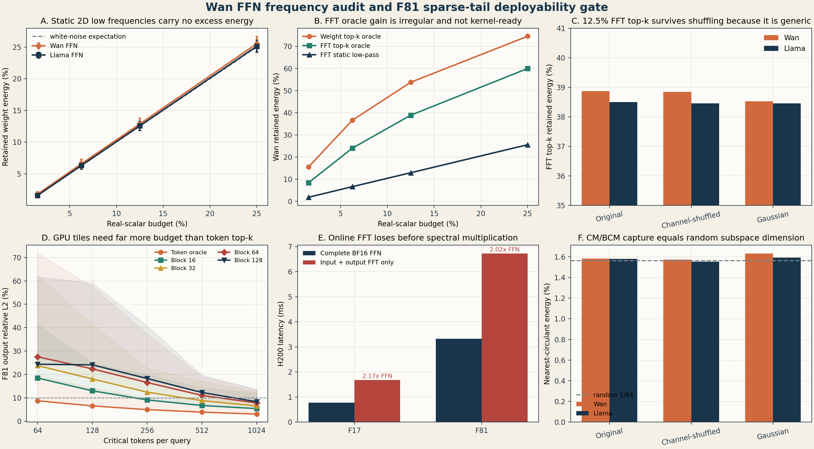

# World Foundry F81 Attention 与 FFN 频域路线审计

日期: 2026-07-26

硬件: NVIDIA H200 NVL 143 GB

模型: Wan2.1-T2V-1.3B 与 Llama-2-7B

## 1. 执行结论

1. F81 主线继续保留 `sparse high-rank critical path + low-rank marginal tail + cache-aware refresh`，但当前证据仍是 post-softmax representation oracle，不是可运行算法。下一关是 coarse tile routing、共同归一化和 fused H200 kernel。
2. F17 主线转为整段 pointwise/kernel fusion。单独在 GEMM 后追加 Triton bias+GELU 没有收益；需要把 GELU 并入 GEMM epilogue，并联合 LayerNorm/AdaLN、gated residual、cast/copy/cat 做融合。
3. FFN 原始通道顺序上的逐行 FFT、逐列 FFT、二维 FFT 稀疏压缩不成立。静态低频能量与白噪声预算相同，通道打乱后不变，在线 FFT 本身又比原 BF16 FFN 更慢。
4. CM/BCM 暂时只保留为 attention marginal branch 的候选 basis。Wan FFN 的 64x64 最近循环投影平均只捕获 `1.581%` 能量，与随机子空间的 `1/64 = 1.5625%` 一致。
5. DiT FFN 难量化不等于权重本身难量化。现有 Wan 权重 E4M3 误差约 2.65%，真正困难来自 activation 的 timestep/sample/channel 非平稳性、CFG 分支、轨迹误差传播，以及动态 scale/cast/launch 没有融合。



## 2. Wan FFN 与 LLM FFN 的关键差异

| 维度 | Wan2.1-1.3B DiT FFN | Llama-2-7B FFN | 对压缩和加速的影响 |
|---|---|---|---|
| 结构 | `1536 -> 8960 -> 1536`，GELU，2 个带 bias 的 Linear | gate/up/down 三个 Linear，SwiGLU，无 bias | Llama 每层有三次投影；Wan 的 GELU 仍阻断相邻矩阵间的线性变换吸收 |
| token 批量 | F17 为 7,800，F81 为 32,760 | autoregressive decode 常为 1 或很小；prefill 才是大 M | Wan 权重被大量 token 复用，BF16 GEMM 利用率高；LLM decode 更偏权重带宽受限 |
| 重复方式 | 20 denoising steps x CFG 两分支，共约 40 次网络调用 | 每个生成 token 调一次，但 KV cache 避免重算历史 token | DiT 的静态权重变换可摊销，但 activation 分布随 step 和 branch 改变 |
| 条件机制 | timestep/AdaLN 对每层 activation 做动态调制 | 主要由 token context 和位置决定 | 单一全局 activation scale 在 DiT 中更容易失配 |
| 误差目标 | 最终视频轨迹、运动边界和时序一致性 | next-token logits、perplexity | DiT 局部误差会经后续 denoising Jacobian 累积和放大 |
| 性能形态 | F17 碎片化 pointwise/memory 明显；F81 attention-bound | decode 常由 GEMV/小 GEMM 与权重读取主导 | LLM weight-only 压缩经验不能直接迁移到视频 DiT |

Wan 每层 FFN 约含 `2 x 1536 x 8960 = 27.5M` 个主权重；Llama 每层 SwiGLU 约含 `3 x 4096 x 11008 = 135.3M` 个主权重。这个参数差异并不是最关键因素，关键是 GEMM 的行数 `M`。在 Wan 中，单次调用有 7,800 或 32,760 行，权重读取被大量计算复用；在 LLM decode 中常见 `M=1`，减小权重位宽能直接减少 HBM 流量。Llama prefill 则更接近 DiT，不能预期同样大的 weight-only speedup。

## 3. 为什么 FFN 的逐行、逐列和二维 FFT 不成立

### 3.1 理论问题

FFT 是酉变换，因此它保持 Frobenius 范数和矩阵秩。FFT 本身不产生压缩，只有后续丢弃或量化系数才产生压缩误差。

Transformer hidden channel 没有像图像像素那样的天然邻接关系。若在相邻层同步置换通道，网络函数可以保持不变，但所谓低频会完全改变。因此，原始 channel index 上的低频不是函数不变量；除非先学到稳定的排序或分组，否则频率没有明确语义。

二维 FFT 后的权重是复数。公平预算必须把一般复系数按两个实标量计数，并保持 Hermitian 共轭对。本实验按独立实自由度计费，避免把一个复数错误地算成一个权重。

对于

```text
y = W2 GELU(W1 x),
```

即使把 `W1` 与 `W2` 变换到频域，GELU 也阻止输入 FFT 与输出逆 FFT 跨两层相互抵消。逐行变换需要在线变换每个 token 的 hidden activation；逐列或二维变换还需要在线恢复 8,960 维中间 activation。若没有极高的结构稀疏度和 fused complex sparse kernel，H200 上不会更快。

### 3.2 真实权重结果

实验覆盖:

- Wan block 0/15/29 的 FFN expand 与 contract，共 6 个真实矩阵；
- Llama layer 0/15/31 的 gate/up/down，共 9 个真实矩阵；
- 每个矩阵随机采样 40 个连续 64x64 block；
- original、row/column shuffled、matched Gaussian 与 smooth positive control；
- 实标量预算 1.5625%、6.25%、12.5%、25%。

12.5% 预算的核心结果:

| 方法 | Wan retained energy | Llama retained energy | 判断 |
|---|---:|---:|---|
| static 2D low-frequency | 12.877% | 12.574% | 基本等于 12.5% 白噪声期望 |
| 2D FFT top-k oracle | 38.864% | 38.498% | 有 oracle 增益，但不规则且需索引/复数稀疏 kernel |
| original-domain weight top-k | 53.740% | 51.458% | 比 FFT top-k 更强，仍是非结构化 oracle |

Wan 的 2D FFT top-k 在 original、channel-shuffled 和 matched Gaussian 上分别为 `38.864% / 38.845% / 38.520%`。Llama 对应为 `38.498% / 38.454% / 38.455%`。通道打乱几乎没有影响，说明该增益来自近高斯系数的 order statistics，而不是可利用的通道频谱。

正对照能在 12.5% 静态低频中保留 100% 能量，说明探针可以检测真正的频域平滑结构。Wan/Llama 的否定结果不是探针失灵。

### 3.3 H200 硬件结果

| 路径 | F17 | F81 |
|---|---:|---:|
| 完整 BF16 FFN | 0.774 ms | 3.321 ms |
| 1536 维 FP32 rFFT 往返 | 0.282 ms | 1.031 ms |
| 8960 维 FP32 rFFT 往返 | 1.399 ms | 5.693 ms |
| 两端 FFT 合计 / 原 FFN | 2.17x | 2.02x |

PyTorch/cuFFT 不支持这些形状的 BF16 rFFT，必须转 FP32。上述 FFT 时间还没有包含复数稀疏 contraction、索引读取、scale 或 inverse layout。它已经超过完整 BF16 FFN，因此当前全局 FFT 压缩路线应停止。

块级 FFT/BCM 只有在以下三个条件同时满足时才可重新进入主线:

1. held-out prompt/step 上捕获能量显著超过同维随机子空间；
2. mask/生成元布局固定且不依赖 unstructured gather；
3. fused transform-contraction-inverse kernel 实测快于同形状 BF16/FP8 dense kernel。

## 4. 为什么 DiT FFN 难量化

本项目观察与已有论文一致:

- [PTQ4DiT](https://arxiv.org/abs/2405.16005)指出 DiT 有显著 channel salience 极值，并且 salient activation 随 timestep 变化。
- [Q-DiT](https://arxiv.org/abs/2406.17343)进一步使用自动粒度分配与 sample-wise dynamic activation quantization，应对 channel、timestep 和 sample 的共同变化。
- [ViDiT-Q](https://arxiv.org/abs/2406.02540)发现 layer 与 timestep 敏感度不均匀，因此用 mixed precision，而不是全层统一位宽。
- [Hierarchical Timestep Grouping](https://arxiv.org/abs/2503.06930)把主要困难归因于 time-dependent channel-specific outliers，并把相邻 timestep 聚类后做 shift/scale 重参数化。
- [SVDQuant](https://arxiv.org/abs/2411.05007)明确指出独立低秩分支会因额外 activation traffic 抵消量化收益，因此 Nunchaku 将低秩与低比特主分支融合。

Wan 本地结果补充了硬件侧证据:

- FP8 weight-only 重建相对误差约 2.65%，并不大；
- 动态 FP8 FFN-down 在 F17 仅约 `0.226x` BF16，而预量化 static-input lower bound 可到约 `1.69x`；
- 全程 FFN FP8 的端到端速度约 `1.017x`，但 dense-relative SSIM 仅 `0.797`；
- 只近似 middle-1 step 时 SSIM 恢复到约 `0.954`，但速度约 `0.998x`；
- 加 static weight-error low rank/sparse correction 没有修复 activation quantization mismatch，反而增加额外 GEMM 与 launch。

因此困难可以分成四层:

1. distribution: timestep、CFG branch、prompt 和 motion 让 activation 非平稳；
2. numerical: 少数 channel/token outlier 决定统一 scale，低 bit 有效分辨率下降；
3. dynamical: 局部误差沿 denoising trajectory 累积，dense refresh 只能刷新当前 feature reference，不能恢复已偏离 latent；
4. systems: 动态 reduce、cast、scale、residual GEMM 和 Python launch 吞掉 Tensor Core 收益。

## 5. F81 sparse-high-rank + low-rank-tail 的理论完备性

令

```text
A = softmax(Q K^T / sqrt(d))
A = A_critical + A_marginal + A_negligible.
```

若 critical support 已知，且对 post-softmax marginal matrix 求最优 rank-r 近似，则

```text
O_hat = A_critical V + LowRank_r(A_marginal) V
```

是一个合理的表示 oracle。它不是有限预算下对任意 attention matrix 的完备表示；精确完备仍需要 critical mask 覆盖所有元素，或 tail rank 达到矩阵完整秩。

更重要的是，运行时得到的是 pre-softmax score，而不是 `A`。可执行 kernel 必须同时近似分子和归一化分母。设未归一化 critical 与 marginal 分别为 `P_c`、`P_m`，则应计算

```text
O_hat = (P_c V + P_hat_m V) / (z_c + z_hat_m).
```

误差不仅来自 tail numerator，还来自 partition function:

```text
||O - O_hat||
<= ||(P_m - P_hat_m)V|| / z_min
 + ||n_hat|| |z - z_hat| / (z_min z_hat_min).
```

当前 oracle 使用 full dense attention 选择 top-k，并对 input-specific post-softmax tail 做 SVD。因此它尚缺:

1. 不计算 full QK 的 coarse critical router；
2. 可由 Q/K 在线形成的低秩 positive feature，而不是先构造 `A` 再 SVD；
3. sparse 与 marginal branch 的共同 LSE/normalization；
4. 在一个 kernel 中复用 Q/K/V、mask、LSE 与 output accumulator；
5. 跨 layer、step、prompt、seed 的泛化和 rollout 质量。

这正是 [SLA](https://arxiv.org/abs/2509.24006)需要少量 fine-tuning 和 fused sparse-linear kernel 的原因。本项目当前结果支持 SLA 类结构的动机，但不能把 representation oracle 当作 paper-faithful SLA 实现。

## 6. F81 token oracle 到 tile kernel 的差距

本轮在真实 F81 layer-0、timestep 1000、conditional Q/K/V 上，均匀采样 512 queries，覆盖 12 heads。critical support 使用 full attention mass oracle，tail 使用 rank 8/16/32/64 randomized SVD。

在 128 critical tokens + rank-16 时:

| critical layout | mean output L2 | worst-head L2 | mean critical mass |
|---|---:|---:|---:|
| unstructured token top-k | 6.55% | 14.25% | 34.29% |
| contiguous block-16 | 13.00% | 24.74% | 26.21% |
| contiguous block-32 | 18.07% | 41.50% | 20.06% |
| contiguous block-64 | 22.37% | 57.63% | 15.93% |
| contiguous block-128 | 24.10% | 59.14% | 14.29% |

若要求 12 heads 平均误差不超过 10%，且 worst head 不超过 15%，本 oracle 中的最低配置为:

| layout | critical tokens | tail rank | full-N representation ratio | mean / worst L2 |
|---|---:|---:|---:|---:|
| token top-k | 128 | 16 | 0.488% | 6.55% / 14.25% |
| block-16 | 512 | 16 | 1.661% | 6.72% / 14.22% |
| block-32 | 1024 | 16 | 3.223% | 6.52% / 12.67% |
| block-64 | 1024 | 16 | 3.223% | 7.80% / 13.41% |
| block-128 | 1024 | 16 | 3.223% | 8.32% / 13.72% |

结论不是 block sparse 无效，而是单一连续 key block 不能覆盖离散远程 critical token。下一版 router 应先用较细 block-16/32 找 support，再把相邻 support 合并为 block-64/128 主 tiles，并为少量远程 singleton 保留 escape tiles。所有比例仍是 representation proxy，尚未包含 router、索引、LSE 和 kernel occupancy。

## 7. F17 pointwise/kernel fusion 结论

此前 20-step 增量 profile 中，F17 每个 denoising step 的 self-attention、linear GEMM 与 elementwise/memory 占比分别约 `21.81% / 23.59% / 47.76%`。主要碎片包括 add、copy/cast、mul、cat、LayerNorm、GELU 和 modulation。

本轮 pointwise 结果:

| F17 path | H200 latency |
|---|---:|
| standalone 8960 bias + GELU eager | 0.269 ms |
| standalone Triton bias + GELU | 0.106 ms |
| FFN-up no bias GEMM | 0.311 ms |
| FFN-up bias GEMM | 0.338 ms |
| real FFN-up bias GEMM + GELU | 0.455 ms |
| no-bias GEMM + Triton bias/GELU | 0.473 ms |
| complete FFN | 0.774 ms |

Standalone pointwise microbenchmark看似有 `2.53x`，但接回 GEMM 后反而慢 3.9%。原因是 Wan 原始 Linear bias 已由高效 GEMM epilogue 处理；把它拆出后再启动 Triton kernel，丢失了 epilogue 优势。当前 Triton 输出相对 eager 还有约 0.286% L2 差异，来自融合后不同的 BF16 rounding point，也不能直接作为 exact optimization。

可执行优先级:

1. 用 CUTLASS/CuTe 或等价后端把 bias+GELU 直接并入 FFN-up GEMM epilogue；
2. 融合 LayerNorm + AdaLN shift/scale，避免 float cast、临时 tensor 与独立 mul/add；
3. 融合 attention/FFN 输出 gate + residual add；
4. 审计 2,520 次 cat kernel，优先改成 packed QKV/layout view 或预分配；
5. 固定 shape 后使用 CUDA Graph，消除 Python launch 与 allocator 噪声；
6. 保持 FA3/SageAttention 为独立 attention kernel 对照，不把 F17 的全部瓶颈误归因于 attention。

只消除 profile 中约 1.8% 的 GELU，总体 Amdahl 上限约 `1.018x`。若能消除 elementwise/memory 类别的 30% 或 50%，理论 denoiser-step 上限约为 `1.17x` 或 `1.31x`。因此必须做多算子整段融合，不能继续堆单点 kernel。

## 8. 推荐的下一版系统

### F81 attention executor

1. coarse router: 对 Q/K 做 pooled/block score，输出 block-16/32 support；
2. tile coalescer: 合并为少量 block-64/128 tiles，保留有限 escape tiles；
3. exact critical branch: tiled exact exp、LSE 和 `A_critical V`；
4. marginal branch: SLA 风格可训练 positive feature 或低成本适配 basis；
5. fused normalization: 两条分支在同一个 accumulator 中合并分子与分母；
6. cache state: 缓存 mask、LSE proxy、tail basis 和 route，motion/risk/age 超阈值时刷新；
7. tri-mode outer controller: `{D dense, Q fused sparse-linear recompute, C cache/forecast}` 三态互斥。

推荐先以 `block-64 x 16 tiles + rank-16 tail` 作为 GPU-friendly 起点，以 `block-16 x 32 tiles + rank-16` 作为质量上界对照。它们都必须与 FA3 BF16、SageAttention 和 SLA paper-faithful baseline 比较。

### FFN executor

FFN 暂时保持 BF16 dense。若继续量化，优先做 layer x timestep bucket static scale、敏感层 mixed precision 与真正 fused FP8 GEMM，不再给每层统一挂静态 weight-error low-rank correction。Hadamard/DCT/FFT 只可作为 outlier smoothing rotation 候选，不作为稀疏频率压缩；必须通过端到端质量与 fused kernel gate。

### 频域路线保留范围

视频 token 的时间和空间轴具有真实几何邻接关系，hidden channel 轴没有。FFT 更合理的用途是:

- attention marginal tail 的时空平滑 basis；
- cache/forecast 中的低频状态与高频 event residual 分离；
- motion boundary 的高频触发信号；
- 固定小 block 的可融合旋转量化。

它不应继续作为 Wan FFN 全局 hidden-channel 稀疏压缩主线。

## 9. 证据边界与下一实验门槛

当前可以支持:

- Wan/Llama FFN 原始通道顺序没有可用静态低频或循环优势；
- 全局在线 FFT 在 H200 上没有性能可行性；
- F81 sparse+tail 的 token-level 表示潜力存在；
- token support 到 block/tile support 有显著退化；
- F17 需要整段融合，而不是独立 residual/pointwise kernel。

当前不能支持:

- F81 sparse-linear attention 已经能端到端加速；
- layer-0、timestep-1000 的 oracle 可泛化到全部 layer/step/prompt；
- cache mask/basis 可安全跨 step 复用；
- 免训练方案能达到 SLA 的质量和速度；
- FFT 在 spatiotemporal token axis 上同样无效。

下一轮 gate:

1. 多 layer x early/mid/late step x prompt/seed 的 block-tail oracle；
2. coarse router recall、critical mass、mask Jaccard 和 route 构建时间；
3. block-16/32/64/128 kernel latency、occupancy 与 FA3/Sage 对照；
4. sparse 与 tail 的共同 normalization 数值验证；
5. F81 多 prompt/seed rollout，SSIM 0.98 诊断、VBench 与 motion consistency；
6. 若 fused attention kernel 小于 2x，先停止 controller 开发，集中修 tile layout/kernel；
7. 若 per-sample rollout oracle 在目标质量下低于 1.2x，停止免训练高保真 turbo 路线。

## 10. 复现产物

- 频谱探针: `scripts/probe_ffn_spectral.py`
- H200 FFT/pointwise 探针: `scripts/benchmark_h200_ffn_transforms.py`
- F81 block-tail oracle: `scripts/probe_attention_block_tail_oracle.py`
- 绘图: `scripts/plot_ffn_attention_audit.py`
- 原始数据: `raw/`
- 聚合 CSV 与图: `figures/`

所有频谱预算按独立实自由度计数；所有 H200 时间用 CUDA event 且经过 warmup；所有 attention block 选择仍使用 dense oracle，报告中未把它描述为可部署速度。
