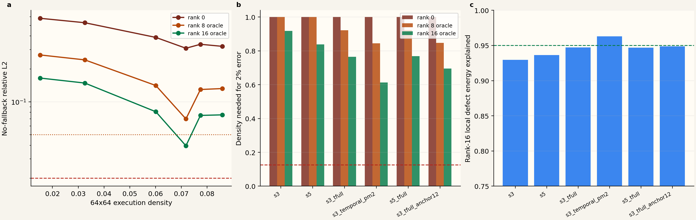

# F81 Geometry Sparse Attention 数值筛选

日期：2026-07-26

模型：Wan2.1-T2V-1.3B

单元：F81，layer 0，timestep 1000，conditional branch

## 1. 实验范围

本实验复用已经捕获的 post-RoPE Q/K/V，在 32,760 个视频 token 中按时空 tile 分层抽取 128 个 query，覆盖 12 个 attention heads。所有 mask 都由 `(t,h,w)` 几何、layer phase 和固定超参数决定，不读取 dense attention score。

本次在 CPU 上执行 PyTorch 数值算子，目的是避免 H200 被外部作业占用时阻塞算法筛选。它不报告 latency，也不替代 H200 fused-kernel benchmark。CPU/GPU 的细小归约差异不影响当前数量级结论。

候选 mask：

- `s3`：同时间的 3x3 spatial tiles；
- `s5`：同时间的 5x5 spatial tiles；
- `s3_tfull`：`s3` 加同空间 tile 的全时间 tube；
- `s5_tfull`：`s5` 加同空间 tile 的全时间 tube；
- `s3_temporal_pm2`：`s3` 加相邻 `t +/- 2`；
- `s3_tfull_anchor12`：`s3_tfull` 加 12 个固定 phased anchor tiles。

tail rank 0 是可部署的纯 geometry sparse 语义。tail rank 8/16 是对当前 replay 的 activation defect 做 SVD，属于 representation oracle，不是可部署算法。

## 2. 核心结果

| Mask | Tile execution | Rank-0 attention mass | Rank-0 no-fallback L2 | Rank-16 local energy | Rank-16 no-fallback L2 | 2% 所需 density |
|---|---:|---:|---:|---:|---:|---:|
| `s3` | 1.52% | 24.13% | 58.07% | 92.97% | 16.48% | 91.79% |
| `s5` | 3.25% | 26.59% | 52.91% | 93.64% | 14.84% | 83.88% |
| `s3_tfull` | 6.01% | 35.81% | 38.81% | 94.72% | 8.11% | 76.50% |
| `s3_temporal_pm2` | 7.18% | 44.82% | 30.89% | 96.30% | 3.96% | 61.32% |
| `s5_tfull` | 7.74% | 38.27% | 33.58% | 94.69% | 7.51% | 76.94% |
| `s3_tfull_anchor12` | 8.59% | 37.10% | 32.17% | 94.86% | 7.59% | 69.53% |

严格 2% gate：`NO-GO`。

最优候选仍是 `s3_temporal_pm2 + rank-16 oracle`，但需要 7/12 heads 回退 dense，有效 attention density 为 61.32%，远高于 12.5% 门槛。

宽松 5% gate：仅 representation oracle `GO`。

`s3_temporal_pm2 + rank-16 oracle` 在零 dense fallback 时达到 3.956% relative L2，execution density 为 7.179%。这一点说明有继续研究 low-rank marginal correction 的价值，但不能作为部署或端到端加速结论。

## 3. 为什么固定 geometry mask 失败

### 3.1 稀疏率低不等于保留关键概率质量

最优 rank-0 mask `s3_temporal_pm2` 只保留约 44.82% attention mass。其余候选只保留 24.13% 至 38.27%。因此 selected-key softmax 的分母发生大幅变化，LSE p95 最大误差达到数个自然对数单位。

这说明 Wan F81 layer-0 early-step attention 并不是单纯局部卷积。固定空间窗口、固定 temporal tube 和少量 phased anchors 都漏掉了大量 content-dependent nonlocal keys。

### 3.2 temporal neighborhood 比 full tube 更有效

在相近预算下，`s3_temporal_pm2` 明显优于 `s3_tfull`、`s5_tfull` 和固定 anchors。它以 7.18% execution density 保留 44.82% attention mass，rank-0 multi-head L2 为 30.89%。

这支持一个更精确的结构判断：当前单元中的有效冗余主要表现为局部运动邻域，而不是同一空间位置跨全部时间的静态 tube。后续 router 应优先显式建模 motion boundary 和短时邻域，再为 content-dependent 远程 token 保留动态 escape tiles。

### 3.3 固定 anchor 没有解决内容相关远程依赖

`s3_tfull_anchor12` 比 `s3_tfull` 增加约 2.58 个百分点执行密度，但 attention mass 仅从 35.81% 增到 37.10%，rank-0 L2 从 38.81% 降到 32.17%。收益存在但远不足以通过门槛。

固定 layer-phased anchors 不是合格 router。远程 support 必须随 prompt、step、head 或当前 Q/K 变化。

## 4. Low-rank 到底是否有效

本结果否定的是“固定 geometry mask 单独可用”，不是所有 low-rank。

在每个当前 replay、head 和 mask 内，rank-16 能解释 92.97% 至 96.30% activation defect energy。尤其 `s3_temporal_pm2` 达到 96.30%，把 no-fallback error 从 30.89% 降到 3.96%。因此局部、条件化的 defect 确实具有强低秩性。

但这与此前全局 runtime-defect rank-16 仅解释 11.37% 至 14.38%、跨运行 top-16 overlap 仅 0.220 至 0.356 并不矛盾：

1. 本实验按单个 layer、step、branch、head 和 replay 拟合，条件非常窄；
2. SVD 同时使用当前 holdout defect 计算 basis 与 coefficients；
3. 不同 prompt、seed、step 和 head 的低秩子空间可以各自明显，但彼此旋转和错位；
4. 把这些 defect 堆叠成全局矩阵后，谱会变平，单一静态 basis 失效。

因此应把命题改为：

> DiT attention 的 sparse activation defect 可能在局部 cell 内低秩，但是否存在可跨样本复用的 layer-step-head basis，仍需独立验证。

## 5. 对当前路线的决策

### 立即停止

- 不再为这 6 个固定 mask 直接开发 fused sparse kernel；
- 不把 rank-16 current-replay SVD 当作 low-rank tail 实现；
- 不用更大固定 spatial window 或更多固定 anchor 强行追 2% gate；
- 不把 7.18% theoretical execution density 写成预计端到端加速。

### 继续验证

1. 用 calibration sample 学习右奇异 defect basis，在 validation/test 上只投影，不重算 basis；
2. 分别报告 self-oracle energy、frozen-basis held-out energy 与 subspace overlap；
3. 以 calibration query/sparse output 预测 low-rank coefficients，正则只在 validation 选择；
4. 若 frozen basis 与 coefficient predictor 仍能在 independent test 达到 5%，再实现 fused sparse + correction kernel；
5. 2% strict gate 暂时只允许 sample-adaptive content router 或更多 dense refresh，不允许用 oracle fallback 证明可行。

## 6. 当前证据边界

- 只覆盖一个 layer、一个 early timestep、conditional branch 和一个 replay；
- 只采样 128/32,760 queries；
- 指标位于 output projection 之前；
- rank 8/16 是 current-replay coefficient oracle；
- 没有 fused kernel latency，也没有完整 denoising trajectory 和视频质量。

因此本轮给出的可靠结论是：**固定 geometry sparse 在严格保真下失败；局部 activation defect 的 rank-16 oracle 很强，值得做跨样本 basis-transfer probe，但尚不能证明 low-rank tail 可部署。**
