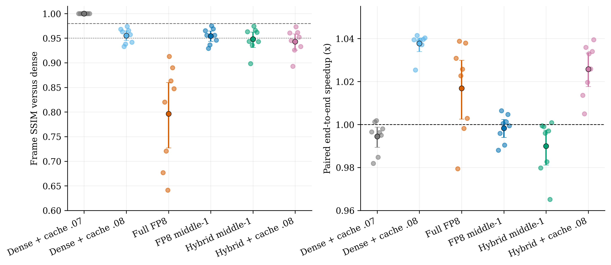
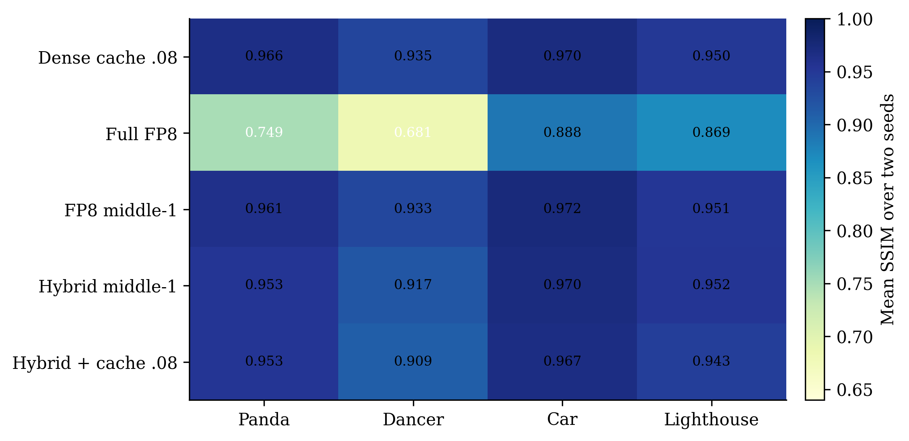
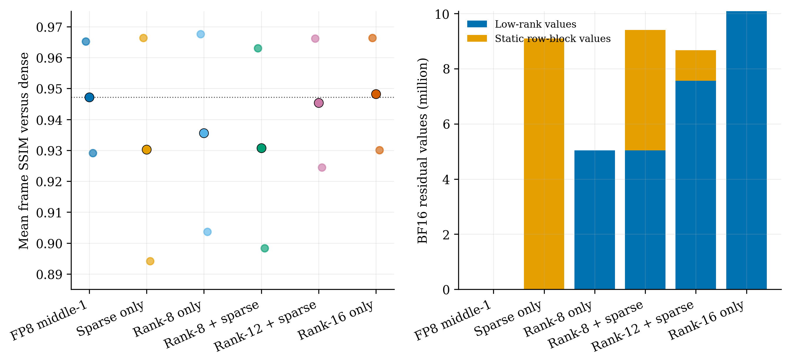
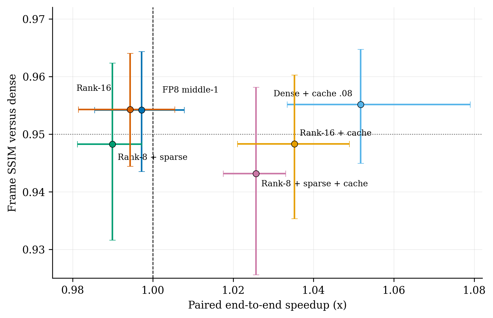

# World Foundry 混合残差 H200 端到端报告

## 1. 结论摘要

本轮已经把 `FP8 main + low-rank residual + static row-block residual + TeaCache`
真正接入 Wan2.1-T2V-1.3B 的 World Foundry 推理路径，并在 NVIDIA H200 NVL 上完成：

- 4 个 prompt × 2 个 seed × 8 个方法，共 64 个 F17 视频；
- 64/64 生成成功，56/56 个 dense-relative 候选对完成 SSIM/PSNR/时延比较；
- FFN `up/down` 覆盖 30 个 DiT block、60 个线性层；
- 额外完成 sparse-only、rank-8、rank-12+sparse、rank-16 组件消融；
- 对筛选出的 rank-16 修订版再跑 4 prompt × 2 seed × 6 方法，共 48 个视频。

严格结论如下。

1. 原始 `rank-8 + static row-block sparse` 方案不成立为当前 GPU 主方案。它比
   FP8-middle1 平均低 `0.00591` SSIM，且慢约 `0.84%`；8 对中仅 1 对质量更好。
2. rank-16-only 修复了行块分支的质量损失，但只与 FP8-middle1 持平：SSIM
   差值 `+0.000092`，95% bootstrap 区间 `[-0.00129, +0.00157]`，8 对各胜 4 对。
3. 当前 Pareto 最优是 dense FFN + TeaCache 0.08，不是混合残差。重复运行中它给出
   `1.038x` 到 `1.052x` 速度、`0.9551` 平均 SSIM；rank-16+cache 为
   `1.0352x / 0.9483`，同时更慢且质量更低。
4. 全程 FFN FP8 虽有 `1.0168x` 到 `1.0298x`，但平均 SSIM 只有 `0.7966`，
   最差 `0.6416`，不可接受。
5. 预注册 F17 质量门槛是非 cache hybrid SSIM 至少 `0.98`。原始混合和 rank-16
   均未通过，因此没有继续新一轮混合 F81，避免在已失败配置上追加昂贵实验。
6. 当前证据支持“缓存优先、量化/残差作为选择性辅助手段”，不支持把它称为
   no-distillation turbo diffusion。

## 2. 理论合理性与完备性

设 FP8 权重误差为

```text
E = W - Q_fp8(W),
W_hat = Q_fp8(W) + L_r + P_Omega S,
```

其中 `rank(L_r) <= r`，`Omega` 是固定连续输出行块集合。当前实现先求随机 SVD
低秩项，再在余项 `R = E - L_r` 上选 Frobenius 能量最大的 `k` 个行块。对固定
`L_r` 和固定块数 `k`，该选择精确最小化：

```text
||R - P_Omega R||_F^2.
```

因此它对“固定低秩项后的行块支持选择”是条件最优的，但不具有以下更强性质：

- 不是低秩与稀疏支持联合优化的全局最优解；
- 有限 rank、有限行覆盖不能精确表示任意矩阵；
- 任意矩阵的表示完备性需要 `r >= min(m,n)`，或稀疏掩码覆盖所有输出行；
- Frobenius 最优不等价于激活误差最优，更不等价于 diffusion 轨迹质量最优。

若第 `t` 步线性算子误差为 `Delta_t`，局部有：

```text
||Delta_t x_t - Delta_t x_s|| <= ||Delta_t||_2 ||x_t - x_s||.
```

沿采样器传播可写成示意上界：

```text
||delta z_0|| <= sum_t (prod_{j<t} L_j) ||delta_t||,
```

其中 `L_j` 是后续更新的局部 Lipschitz/Jacobian 放大因子。这解释了两个实测现象：

1. 单层相对 L2 改善约 3.8%，不保证最终视频 SSIM 改善；
2. 在已分叉的 latent 轨迹上插入一次 dense forward，只停止新增算子误差，并不会把
   latent 恢复到 dense 轨迹，因此 periodic refresh 不是 state reset。

TeaCache 的 embedding-distance 多项式是经验 proxy，不是上述误差的严格证书。当前
“cache-aware”含义是 cache hit 会绕过整个 DiT block 和残差支路，并由 retention
约束强制重新计算；precision middle-step 调度仍是静态的，还不是由 cache uncertainty
直接驱动的精度路由器。

## 3. 实验合同

| 项目 | 设置 |
| --- | --- |
| 模型 | Wan2.1-T2V-1.3B |
| 框架 | World Foundry + Wan runtime |
| GPU | NVIDIA H200 NVL |
| PyTorch / CUDA | 2.9.1+cu128 / 12.8 |
| 视频 | 480×832，17 帧，16 fps |
| 采样 | UniPC，20 step，CFG 5.0 |
| 测试集 | Panda、Dancer、Car、Lighthouse；2 seeds |
| 固定部分 | FA3 BF16 self-attention、dense SDPA cross-attention |
| 注入部分 | 全部 30 blocks 的 FFN up/down，共 60 linears |
| 时延 | 包含 text encoder 与 VAE；模型加载、校准和 warmup 不计入 |
| 顺序控制 | 8 个样本中每个方法恰好占据一次 0..7 的运行位置 |

原始混合配置有 `825,753,600` 个 FP8 权重值、`5,038,080` 个 BF16 低秩值、
`4,362,240` 个 BF16 行块值和 210 个连续行块。rank-16 修订版使用
`10,076,160` 个 BF16 低秩值，不保留行块。实验实现保留 dense fallback 以支持
逐样本切换，因此其峰值显存不是部署后的最小显存。

## 4. 既有证据链

### 4.1 离线矩阵与激活拟合

9 个 Wan 权重上的 held-out activation relative L2：

| 方法 | 误差 | 结论 |
| --- | ---: | --- |
| ternary main | 0.51093 | 基线 |
| low-rank r16 | 0.48305 | 最强固定预算残差 |
| BCM b128 + LR r10 | 0.48619 | 接近但不优于 LR16 |
| activation LR r8 + row sparse | 0.50093 | 未优于 LR16 |

BCM 对 Frobenius 残差能量的平均捕获仅为 b64 `1.56%`、b128 `0.78%`、
b256 `0.39%`。这已经提示任意量化误差更偏向低秩而非循环结构。

### 4.2 H200 kernel 路径

1536×1536 q projection、32760 行激活上，BF16 是 `0.2194 ms`，动态 FP8 是
`0.9311 ms`，预量化静态输入 FP8 下界是 `0.1366 ms`。因此激活量化与 kernel
fusion 是第一阶瓶颈。新 Triton 静态量化 kernel 相对 eager cast 的实测加速为：

| shape | 加速 |
| --- | ---: |
| 7800×1536 | 3.14x |
| 7800×8960 | 11.32x |
| 32760×1536 | 11.14x |

这使全 FFN FP8 从早期 eager 路径的约 `0.90x` 提高到略快于 dense，但独立
low-rank 与 sparse GEMM、`index_add_` 仍没有 fused 到 FP8 epilogue。

### 4.3 NFE、cache 与调度

- NFE 12 相对 20 step 的 SSIM 约 `0.314`，直接降步数不可接受。
- 既有 8 视频 F81 TeaCache 0.08：SSIM `0.9621`、PSNR `35.66 dB`、缓存 5%、
  约 `1.039x`。
- 本轮 F17 中 threshold 0.07 无 cache hit，threshold 0.08 固定命中 2/40 forwards。
- 相同 40% approximate forwards 下，contiguous middle-8 的 SSIM `0.9229`，
  periodic refresh-2 只有 `0.8711`。近似放置位置比 refresh 频率更重要。

## 5. 多 prompt、多 seed 主结果

以下 SSIM/PSNR 是相对同 prompt、同 seed dense 输出的偏差，不是独立语义质量分数。

| 方法 | mean SSIM | min SSIM | PSNR dB | paired speedup | cache fraction |
| --- | ---: | ---: | ---: | ---: | ---: |
| Dense + cache 0.08 | 0.95512 | 0.93286 | 33.93 | 1.0376x | 5% |
| Full FP8 | 0.79663 | 0.64155 | 23.28 | 1.0168x | 0% |
| FP8 middle-1 | 0.95418 | 0.92918 | 33.84 | 0.9983x | 0% |
| Rank-8 + row sparse middle-1 | 0.94827 | 0.89837 | 33.05 | 0.9899x | 0% |
| Rank-8 + row sparse + cache 0.08 | 0.94312 | 0.89301 | 32.27 | 1.0257x | 5% |
| Rank-16 middle-1 | 0.95428 | 0.93005 | 33.69 | 0.9943x | 0% |
| Rank-16 + cache 0.08 | 0.94830 | 0.91570 | 32.77 | 1.0352x | 5% |

原始混合的 mean SSIM 95% bootstrap 区间是 `[0.9310, 0.9622]`，speedup 区间
是 `[0.9812, 0.9974]`。rank-16 的对应区间是 `[0.9444, 0.9640]` 和
`[0.9814, 1.0055]`。两者都没有通过 `0.98` 质量门槛。



prompt 敏感性很强。Dancer 上原始混合平均 SSIM 只有 `0.917`，Car 上为
`0.970`。全程 FP8 在四类内容上都不稳定。



## 6. 组件消融与冗余空间

在 Panda 与最困难 Dancer、同一 seed 上：

| 残差配置 | mean SSIM | min SSIM | BF16 low-rank values | BF16 sparse values |
| --- | ---: | ---: | ---: | ---: |
| FP8 middle-1 | 0.94721 | 0.92918 | 0 | 0 |
| sparse only | 0.93029 | 0.89418 | 0 | 9.09M |
| rank-8 only | 0.93563 | 0.90364 | 5.04M | 0 |
| rank-8 + sparse | 0.93074 | 0.89837 | 5.04M | 4.36M |
| rank-12 + sparse | 0.94536 | 0.92453 | 7.56M | 1.11M |
| rank-16 only | 0.94821 | 0.93005 | 10.08M | 0 |

困难样本质量随 rank 增大而改善，随行块预算增大而下降。完整 8 对上，rank-16
相对 rank-8+sparse 的 SSIM 提高 `0.00601`，95% bootstrap 区间
`[0.00032, 0.01414]`，8 对中胜 7 对。这说明当前静态行块保存了大 Frobenius
能量，但不是 diffusion 质量敏感方向；它是表示冗余，而不是可直接转化的系统收益。



rank-16 相对 FP8-middle1 的增益区间跨 0，且更慢。dense+cache 位于右上方，
同时支配所有 residual+cache 配置。



## 7. 最差样本的细粒度观察

最差的原始混合样本是 Dancer、seed 20260723，SSIM `0.89837`。首帧、中帧和
末帧肉眼仍保持相同语义，但舞者轮廓、裙摆、建筑反射及后期彩纸位置发生漂移。
误差热图表明它不是均匀噪声，而是集中在高频边缘与运动边界；cache 进一步扩大
这些区域的状态偏移。


## 8. 为什么当前方案还不是 turbo diffusion

TeaCache 只跳过 5% model forwards。即使命中完全免费，Amdahl 上界也仅为：

```text
1 / (1 - 0.05) = 1.0526x.
```

实测 dense+cache 的 `1.038x` 到 `1.052x` 已接近该上限。若不提高安全 cache
比例、不降低 NFE、不减少其他模块工作量，就不可能达到显著的 turbo 级速度。
同时，threshold 从 0.08 再放宽会跨越陡峭质量边界；全 FP8 和直接减 NFE 也已被
质量实验拒绝。

因此当前瓶颈不是“还缺一个残差表示”，而是：

1. diffusion 轨迹对特定 step、prompt 和高频运动边界敏感；
2. activation FP8 误差大于可由权重残差修复的部分；
3. low-rank/sparse 分支是额外 GEMM 与 launch，没有 fused epilogue；
4. dense refresh 不恢复已偏离的 latent 状态；
5. 5% cache hit 本身限定了总加速上限。

## 9. 下一版最合理方案

当前可用工程配置应保持 `FA3 BF16 + dense FFN + TeaCache 0.08`。若继续残差研究，
建议按以下顺序，而不是继续增加静态行块数量：

1. 使用少量校准 prompt 求每层、每 step bucket 的 activation scale 与残差增益
   `beta_l,t`，先修复 activation quantization mismatch。
2. 用 Jacobian/trajectory-weighted activation error 选择层和 rank，而不是按权重
   Frobenius 行块能量；允许多数层完全不挂残差。
3. 将 rank-16 或 layer-adaptive rank residual 融入 FP8 GEMM epilogue/grouped GEMM，
   消除独立小 GEMM 与 Python/index_add launch。
4. 若保留稀疏项，只测试硬件原生 2:4、固定大 tile 或 block-sparse grouped GEMM，
   不再使用任意行索引 scatter。
5. 将 cache uncertainty 与精度策略真正耦合：在高风险 step/layer 触发 dense，
   并研究 error-feedback/state-correction，而不是仅做 periodic dense forward。
6. F17 必须先达到 mean SSIM `>=0.98` 且 speedup 置信区间下界 `>1.0`，再启动
   F81 多 prompt、多 seed 和 WorldBench/VBench 语义评价。

这一路径仍可保持免蒸馏或仅校准的定位，但当前结果不支持“静态行块稀疏 + 低秩”
作为主导加速器。最值得保留的是 World Foundry cache 接口、Triton 静态量化、
step-aware precision controller，以及可被融合的低秩残差；静态行块分支应降级为
待硬件原生 kernel 和 trajectory-aware 选择出现后再验证的可选项。

## 10. 可复现实验产物

- 原始混合主结果：`worldfoundry_ffn_hybrid_f17_multiseed_v2/`
- rank-16 复验：`worldfoundry_ffn_rank16_f17_multiseed_v1/`
- 组件消融：`worldfoundry_ffn_f17_components_{sparse,lr8,lr12sparse,lr16}_v1/`
- 图表及绑定 CSV：`figures/`
- 实现：`../../scripts/worldfoundry_hybrid_residual.py`
- 端到端 runner：`../../scripts/generate_wan_hybrid_residual.py`
- 汇总器：`../../scripts/summarize_hybrid_residual.py`

所有 `method_summary.csv`、`paired_metrics.csv`、generation manifest、bootstrap CSV、
PNG 和 PDF 已保留。当前报告中的结论只覆盖 Wan 1.3B、F17 工程保真与 H200 实测；
尚不能替代 F81、官方语义评价或不同模型规模上的外部有效性验证。
