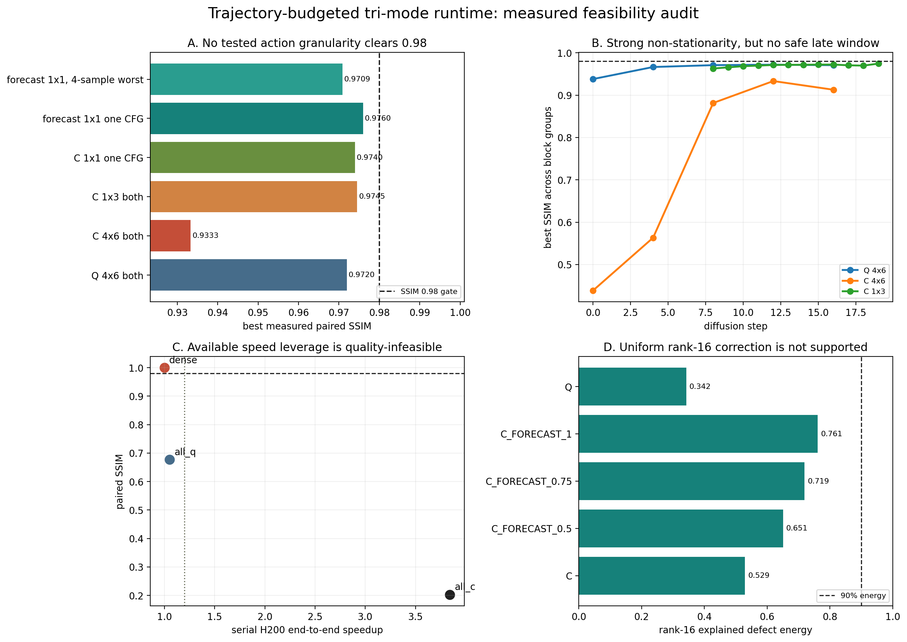

# Trajectory-Budgeted Tri-Mode Runtime：H200 可行性审计

日期：2026-07-24
模型：Wan2.1-T2V-1.3B，20-step UniPC，F17，480x832
硬件：NVIDIA H200 NVL 143 GB
质量定义：同 prompt、同 seed、同采样器的 dense-relative decoded-frame SSIM

## 结论摘要

`{D, Q, C}` 三态统一调度在理论上合理，Approximation Exclusion Principle 也应保留；但在当前 Wan、当前算子实现和 `SSIM >= 0.98` 约束下，已测试动作与样本没有显示出可用的非 dense 动作。

- 串行 H200 全局锚点：all-Q 为 `1.051x / SSIM 0.67689`，all-C 为 `3.843x / SSIM 0.20267`。
- 50 个 coarse Q/C cell、120 个细粒度 C cell、40 个单 block/单 CFG cell、72 个 forecast cell 中，`SSIM >= 0.98` 的候选数量均为 0。
- 最小的单次 C 动作仅替代 1/1200 次 block call，最佳 SSIM 仍只有 `0.97396`；一阶 forecast 的最佳结果为 `0.975997`。
- 对上述两个最佳单次动作补做 2 prompts x 2 seeds 验证后，forecast 的均值/最差 SSIM 为 `0.97351/0.97085`，pure C 为 `0.97060/0.96762`；8 个候选样本全部未过 0.98。
- dense 重复运行在同进程、跨进程、跨 GPU、跨实验间逐像素一致，`SSIM=1`、`MAE=0`，因此约 0.97 不是数值非确定性底噪。
- Q activation defect 的全局 rank-16 能量仅 `34.2%`；统一低秩修正缺乏依据。Forecast-C 的全局 rank-16 为 `76.1%`，但 block 6/12 仅 `25.0%/28.4%`，只有 block 24 达到 `91.4%`，层间异质性很强。

因此，当前严格高保真、免训练路线应触发停止条件：不应继续堆叠 FP8、cache、静态低秩和稀疏残差来强求 `1.2x`。若继续研究，重点应转向 fused kernel、NFE/solver、低成本适配或放宽为任务/感知质量约束。



## 1. 理论合理性与完备性

### 1.1 合理的部分

对 layer/block `l`、step `t`、CFG branch `b` 定义：

```text
a(l,t,b) in {D, Q, C}
D = BF16 dense
Q = static-input FP8 FFN recompute, attention remains FA3 BF16
C = block residual reuse or first-order residual forecast
```

三态互斥是必要的。Cache 已经跳过本次 block 计算，不应再叠加本次 Q 误差；Q 应刷新 cache age；D 只刷新当前 feature reference，不能宣称“重置已经偏离的 latent trajectory”。

把扩散过程写成非平稳动力系统后，一阶传播近似为：

```text
delta_z0 ~= sum_k J(k -> 0) d_k + higher-order interaction terms
```

这解释了为什么局部 feature MSE 或静态 `W-Q(W)` Frobenius error 不足以决定动作：相同局部缺陷在不同 step、block 和 CFG branch 上可能产生完全不同的最终影响。

### 1.2 当前 Oracle 的证据边界

完整动作空间有 `3^(20*30*2)` 个组合，无法穷举。本实验采用逐级 falsification：

1. 全局 D/Q/C 成本和质量锚点。
2. `4 steps x 6 blocks x 2 CFG` coarse 单 cell。
3. `1 step x 3 blocks x 2 CFG` 细粒度 C。
4. `1 step x 1 block x 1 CFG` 最小 C。
5. 最小 C 上的 residual forecast scale sweep。
6. dense-trajectory counterfactual activation-defect spectrum。

所以“最佳实测候选”是受限动作集 Oracle 的下界，不是数学意义上的全空间上界。若 universal schedule 采用逐样本 worst-case 门槛，一个失败样本已经足以否定该具体动作；若只约束分布均值，则必须做多 prompt、多 seed 验证。本报告为此追加了 2 prompts x 2 seeds gate，两个最佳候选在所有 8 个候选样本上仍未通过 0.98。

尚未穷举的风险包括：

- 未测试的全部 600 个单 block-step 位置。
- 多动作误差可能出现偶然抵消，而非简单累加。
- SSIM 不是 VBench、语义一致性或人类偏好的替代。
- F17 不是 F81；但 F17 gate 未通过时不应直接投入更昂贵 F81 sweep。

## 2. 实现与验证

### 2.1 运行时合同

- D：完整 Wan block；FA3 BF16 attention + BF16 FFN。
- Q：完整 attention；仅 FFN up/down 使用静态输入尺度 FP8。
- C：复用上一 dense anchor 的 block residual，或用前两个 dense residual 一阶外推。
- 每个 rollout 强制断言 `40 model calls` 和 `1200 block calls`。
- Cache 按 CFG branch 隔离；首访或 shape 不匹配时回退 D。
- Cache refresh 只在下一步需要 C 时发生；forecast 时保留前两个 anchor，避免无关大张量分配。

### 2.2 自动测试

远端目标环境通过以下测试：

- 冲突 Q/C override 被拒绝。
- CFG branch cache 状态隔离。
- Cache 首访 fallback 正确。
- D/Q/C 执行动作计数互斥。
- 完整 model/block call 数断言。
- Beam-search 质量预算与同分支冲突约束。
- Beam-search 会展开到真实 step-block-branch slot，部分重叠区间也会被互斥拒绝。
- 不同 CFG branch 可独立选动作。
- 全局 action-call 成本分摊满足 Amdahl 一致性。
- Activation-defect counterfactual 返回值保持 dense trajectory。
- 合成 defect covariance spectrum 与 PNG/CSV 输出 smoke 通过。

## 3. 实验规模

本轮新增 384 次视频生成或 dense audit：

| 阶段 | 数量 | 目的 |
| --- | ---: | --- |
| 三态 smoke | 5 | 验证 1200-event 调用合同 |
| Coarse Q/C，2 repeats | 108 | 5x5 step/block 敏感度图 |
| Fine C，1x3 blocks | 124 | 去除连续 cache-age 混淆 |
| 单 block、单 CFG C | 42 | 最小 C 动作可行性 |
| Forecast scale sweep | 74 | 0.25/0.5/0.75/1.0 |
| Dense activation-defect audit | 4 | 2 prompts x 2 seeds |
| 独占 H200 global anchors | 15 | dense/all-Q/all-C 各 5 次 |
| 最佳动作多样本 gate | 12 | 2 prompts x 2 seeds x 3 methods |

所有质量比较都使用真实 decoded video；局部 action 时延不用于结论，因为 1-48/1200 次跳块低于整段视频计时噪声。

## 4. H200 速度与质量

独占 H200、5 repeats、正反顺序交替：

| 方法 | 平均时间 | 中位时间 | 配对几何平均加速 | SSIM |
| --- | ---: | ---: | ---: | ---: |
| Dense | 6.249 s | 6.160 s | 1.000x | 1.00000 |
| all-Q | 5.948 s | 5.792 s | 1.051x | 0.67689 |
| all-C | 1.625 s | 1.628 s | 3.843x | 0.20267 |

all-Q 只有约 5% 端到端收益，原因不是“没有 FP8 tensor core”，而是：

- Q 只覆盖 60 个 FFN up/down linear，attention、norm、embedding、VAE、文本和调度仍保留。
- 每次激活仍需量化/cast，且不是完整 fused epilogue。
- 原 Nsight 结果显示大量 launch、memcpy、sync 和 elementwise/reduction，GEMM 并非全部时间。
- Python block mode 切换用于实验控制，不是部署 kernel。
- Amdahl 定律决定：即使 all-Q 全开也只有 `1.051x`，不可能单独达到 `1.2x`。

all-C 证明跳过 block 有真正的速度杠杆，但质量完全不可接受。按 all-C 锚点，要达到：

| 目标 | 至少需要的实际 C block-calls |
| --- | ---: |
| 1.2x | 约 257 / 1140 |
| 1.3x | 约 356 / 1140 |
| 1.5x | 约 514 / 1140 |

而当前最小测试动作只有 1 次 C，就已经低于 0.98。

## 5. 轨迹敏感度结果

| Probe | 候选数 | `SSIM >= 0.98` | 最佳 SSIM |
| --- | ---: | ---: | ---: |
| Q，4 steps x 6 blocks x both CFG | 25 | 0 | 0.97195 |
| C，4 steps x 6 blocks x both CFG | 25 | 0 | 0.93331 |
| C，1 step x 3 blocks x both CFG | 120 | 0 | 0.97451 |
| C，1 step x 1 block x one CFG | 40 | 0 | 0.97396 |
| Forecast-C，1x1xone CFG | 72 | 0 | 0.975997 |
| Best pure C，2 prompts x 2 seeds | 4 | 0 | 0.97396（均值 0.97060） |
| Best forecast-C，2 prompts x 2 seeds | 4 | 0 | 0.975997（均值 0.97351） |

主要结构：

- Early step 的 C 极度危险；coarse C 在 step 0-3 的平均 SSIM 约 0.31。
- step 12-16 最稳定，但细粒度最佳仍小于 0.98。
- step 19 的层间差异重新增大，不能用“越晚越安全”的单调规则。
- CFG branch 1 的晚期 forecast 略优于 branch 0，证明 branch 粒度有意义，但改善不足以改变可行性。
- Forecast scale 1.0 的最佳 SSIM 比 pure reuse 提高约 0.002-0.003，仍未过门槛。
- 多样本复测中，forecast 对四个 prompt/seed 对均稳定提高 `0.0020-0.0039`，说明一阶预测方向有效，但最差 SSIM 仍为 `0.97085`。
- 单次 C 的多样本几何平均加速仅约 `1.005x`；其 `0.968x-1.046x` 样本范围说明局部动作收益小于视频级计时噪声，不能作为真实 kernel speedup 证据。

## 6. Activation-Defect Subspace

Audit 在完全不改变 dense 最终视频的条件下，对 step 14/16/19、block 6/12/24、两个 CFG branch、2 prompts x 2 seeds 采集 360 份 token-row sampled defect。

全局谱：

| Operator | Rank-8 energy | Rank-16 energy | 90% energy rank |
| --- | ---: | ---: | ---: |
| Q | 0.315 | 0.342 | 758 |
| C | 0.508 | 0.529 | 556 |
| Forecast-C 0.5 | 0.632 | 0.651 | 443 |
| Forecast-C 0.75 | 0.704 | 0.719 | 356 |
| Forecast-C 1.0 | 0.749 | 0.761 | 292 |

Rank-16 的层级结果：

| Operator | Block 6 | Block 12 | Block 24 |
| --- | ---: | ---: | ---: |
| Q | 0.328 | 0.387 | 0.407 |
| C | 0.262 | 0.230 | 0.796 |
| Forecast-C 1.0 | 0.250 | 0.284 | 0.914 |

解释：

- 静态统一 rank-8/16 correction 不适合 Q，也不适合中层 C。
- Block 24 的 forecast defect 显著低秩，可作为层专用 correction 的研究对象。
- 但“存在低秩 defect basis”还不等于可修正：运行时仍需低成本预测系数，且 correction FLOPs/launch 必须显著低于被跳过 block。
- 只修少量 late block 的速度覆盖远不足以达到 1.2x；若扩大到 block 6/12，所需 rank 已接近数百，基本吞掉收益。

## 7. 为什么当前加速比低

当前低加速比是系统结构上限，不是单一代码 bug：

1. **覆盖率不足**：FP8 只作用于 FFN up/down，all-Q 上限实测约 1.05x。
2. **量化未完全融合**：activation cast/scale 和 kernel launch 仍存在。
3. **非 GEMM 开销大**：attention、cuDNN、elementwise/reduction、copy/cat、VAE 和文本构成固定地板。
4. **局部动作不可测**：少量 block skip 的理论收益小于视频级时延波动，必须用 global anchor 分摊成本。
5. **Cache 维护曾有冗余**：旧实现对未来会 C 的 block 在所有 dense step 更新 residual；已改为仅在 C 前 refresh。该修复减少维护开销，但没有解决轨迹质量。
6. **残差修正自身不免费**：eager low-rank/structured residual 增加 GEMM 和 launch；若不做 fused epilogue，常常抵消 FP8 节省。

## 8. 对“免蒸馏 Turbo Diffusion”的回答

在 Wan2.1-1.3B、20-step UniPC、严格 dense-relative `SSIM >= 0.98` 下，本轮证据不支持通过现有三态近似实现 `>=1.2x` 的免训练 turbo：

- Q 的全部速度空间不足。
- C 有速度空间但最小实测动作已越过质量门槛。
- Forecast 只能小幅改善。
- 多 prompt、多 seed gate 证明该小幅改善具有一致方向，但仍无样本过 0.98。
- 通用低秩 correction 谱不成立。

这不是说所有视频扩散都不存在冗余，而是说明当前约束下可利用冗余小于系统目标。更合理的后续路线是：

1. **严格 0.98 不变**：优先 exact optimization，例如 fused static FP8 operator、CUDA Graph、allocator 预分配、text cross-attention K/V cache、消除 CPU sync 和 `.item()`。
2. **目标 1.3x-2x**：转向 NFE/solver、蒸馏、一致性训练或低成本适配；不要仅增加 residual 结构复杂度。
3. **允许感知质量约束**：改用 VBench/LPIPS/任务指标和校准证书，再评估 late-step branch-aware forecast。
4. **保留的研究模块**：三态互斥执行器、真实 H200 成本表、trajectory risk/certificate、block 24 专用 defect basis probe。
5. **应停止的模块**：静态 row-block residual、统一 rank-8/16 correction、未融合 eager BCM/low-rank 路径。

## 9. 证据文件

- `tri_mode_evidence_dashboard.png` 与同目录 source CSV
- `global_anchor/method_summary.csv`
- `coarse_cells/`
- `cache_refine/`
- `branch_probe/`
- `forecast_probe/`
- `multisample_gate/`
- `activation_defect/`

原始 MP4、模型权重和 `activation_defect_samples.pt` 不应提交 Git；Git 只保留代码、manifest、CSV、Markdown 和 PNG/PDF。
